# 通过示例学习 React 门户- LogRocket 博客

> 原文：<https://blog.logrocket.com/learn-react-portals-example/>

***编者按:**这篇 React 门户教程最近一次更新是在 2022 年 11 月 1 日，它包括了 React 门户的信息和 React 门户使用 React 钩子的例子。有关 React 钩子的更多信息，请查看我们的 [React 钩子参考指南](https://blog.logrocket.com/react-reference-guide-hooks-api/)和[备忘单](https://blog.logrocket.com/react-hooks-cheat-sheet-unlock-solutions-to-common-problems-af4caf699e70/)。*

模态窗口非常适合吸引用户的注意力。此外，它们也有助于收集用户信息或要求用户输入。然而，在 React 世界中，它们的构建非常复杂。这是因为它涉及到编写复杂的 [CSS 代码](https://blog.logrocket.com/tag/css/)和跟踪 DOM 层次结构。在大型应用程序中，这不是一件小事。幸运的是，React 为这个用例引入了一个名为 React Portals 的[概念。](https://reactjs.org/docs/portals.html)

在本文中，我们将查看 React 门户的真实示例，并解释它如何帮助解决工具提示示例中的`overflow: a hidden`问题:

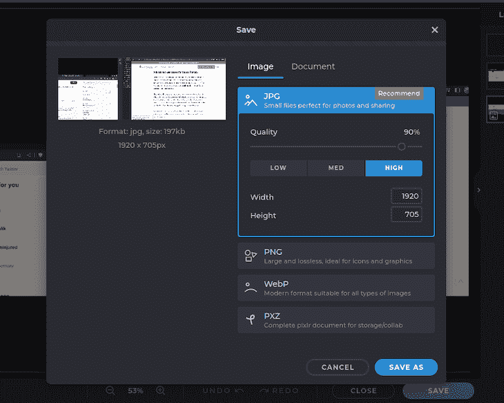

*向前跳转:*

## 什么是 React 门户？

React 门户是一个先进的概念，它允许开发人员[在 React 层次结构树之外呈现他们的元素](https://blog.logrocket.com/react-render-props-vs-custom-hooks/)，而不包含组件之间的父子关系。

通常，典型的 React 组件位于 [DOM](https://blog.logrocket.com/what-virtual-dom-react/) 中。这意味着您可能很难呈现模态或弹出窗口。

例如，看看下面的代码:

```
export default function App() {
  const [visibility, setVisibility] = useState("hidden");
  const handleClick = () => {
    if (visibility === "hidden") {
      //if the visibility state is 'hidden'
      setVisibility("visible"); //then set it to 'visible'
    } else {
      setVisibility("hidden"); //otherwise, make it 'hidden'
    }
  };
  return (
    <div className="App">
      <button onClick={() => handleClick()}>Show/Hide</button>
      {/*The visibility of the modal*/}
      <div style={{ visibility }}>
        <p>This is a modal</p>
      </div>
    </div>
  );
}

```

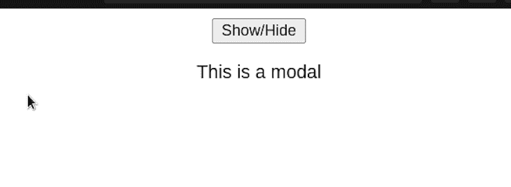

如您所见，我们的代码是有效的。然而，这看起来一点也不像模态窗口。我们希望我们的组件突出来，而不是与网页的其余部分融为一体。

这是 web 开发中经常出现的一个普遍问题:你想构建一些工具提示或下拉菜单，但它被父元素`overflow: hidden`样式所剪切:

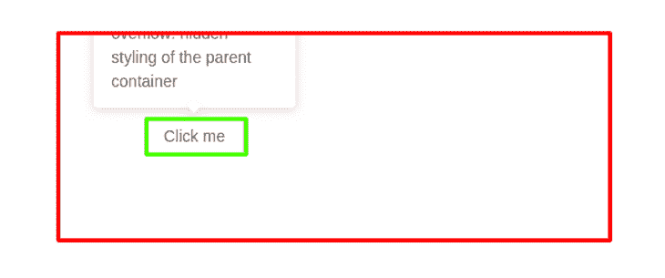

在上面的截图中，`overflow:hidden`样式的父容器用红色标记，用于定位的元素用绿色标记。由于这个样式属性，呈现模式窗口不是一件容易的事情。那么我们如何解决这个问题呢？

这就是 React 门户的用武之地。这个概念允许开发人员在元素的父 DOM 节点之外呈现元素。尽管如此，React 仍然保留了组件在组件层次结构中的位置。

换句话说，组件仍然可以保持它在[反应树](https://blog.logrocket.com/comparing-react-tree-components/)中继承的属性和行为。在本文后面的代码示例中，您将了解到更多这方面的内容。

## React 门户是用来做什么的？

门户非常适合您希望在彼此之上呈现元素的地方。我在下面列举了一些常见的例子:

*   个人资料卡片:无需点击用户页面即可快速获得用户个人资料信息:


*   加载屏幕:当一个任务在后台运行时(例如，一个获取请求)，显示一个加载屏幕是明智的。因此，这会阻止用户与应用程序进行交互
*   Cookie 提醒:为用户提供选项，让他们选择在 web 浏览器中允许哪些 cookie:

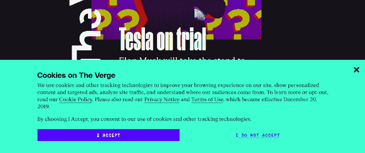

前面，我们讨论了 React 通常显示 DOM 中的元素。我们可以用下面的代码来证明这一点:

```
return (
  <div className="App">
    {/*Display within DOM node*/}
    <div className="exists">
      <p>This is within the DOM node</p>
    </div>
  </div>
);

```

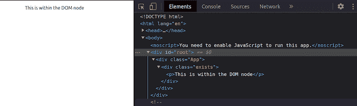

如您所见，我们的组件出现在`root` `div`元素中。然而，当涉及到模态和对话窗口时，我们希望我们的组件在`root`组件之外呈现。

我们可以通过创建一个 React 门户元素来解决这个问题:

```
function App() {
  return (
    <div className="App">
      {/*Render a modal*/}
      <MyModal />
    </div>
  );
}
//create a modal
function MyModal() {
  //to create a portal, use the createPortal function:
  return ReactDOM.createPortal(
    <div className="modal">
      <p>This is part of the modal</p>
    </div>,
    document.body
  );
}

```

这一次，注意 React 不会在 DOM 中呈现这个函数:

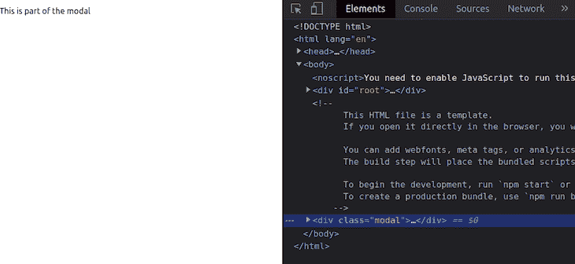

正如您所看到的，这证明了在开发人员希望呈现某些元素以吸引用户注意力的用例中，门户是至关重要的。

## 查看 CSS/HTML 解决方案

解决这个问题最简单的方法就是简单地去掉`overflow`样式:

```
div {
  /*'Hidden' hides the element*/
  overflow: hidden; /* remove this line of code */
  /*When 'overflow' is set to 'visible', CSS will render this to the UI*/
  /* Further styles.. */
} 

```

这告诉程序将我们的模态转换到屏幕上:

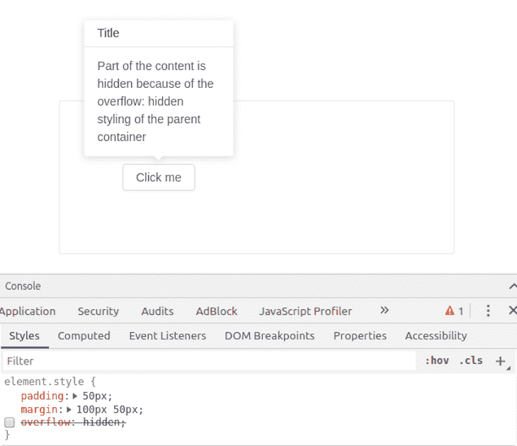

工具提示现在完全可见，一切看起来都很好，但当出现以下任何情况时，它就变成了一个非常脆弱的解决方案:

1.  有人可能会意外地将 overflow: hidden 再次添加到父节点中(并且忘记单击带有工具提示的按钮进行测试！)
2.  有人可以在它周围添加另一个父包装器，例如，在某些情况下引入一些额外的样式
3.  也有可能溢出:隐藏是有原因的，例如，裁剪图像

这里有一个禁用`overflow: hidden`的副作用的例子:

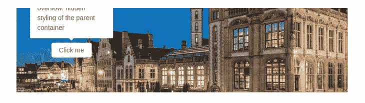

Before image is inside the bounds of the card

之后(图像已扩展到标有绿色的卡片之外):

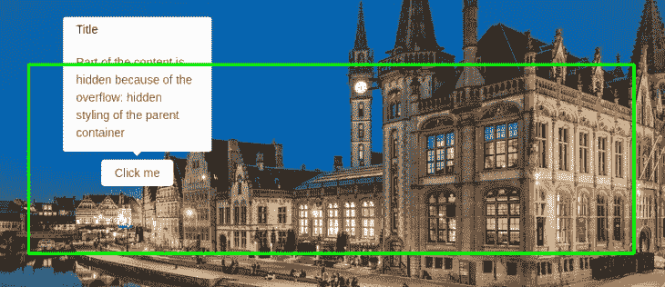

After image has expanded far outside of the card marked with green

## React 门户网站正在运行

有一种方法可以解决整个应用程序因溢出而中断`tooltip/dropdown`的所有问题，并重用代码，而不需要开发人员花费时间去尝试和测试。

解决方法是直接在文档正文中追加工具提示或下拉菜单，设置 position: fixed style，并在`tooltip/dropdown`应该出现的地方提供`screenX`和`screenY`坐标。

现在，我们需要做两件事:

1.  将`tooltip/dropdown`附加到 React 挂载根之外的文档体
2.  获取放置`tooltip/dropdown`的坐标(例如，使用`useRef`反应钩)

让我们从 React 的外部挂载开始。对于 JQuery/ [Vanilla JS](https://podrocket.logrocket.com/vanilla-javascript) 代码库来说，这是一项简单的任务。尽管如此，对于 React 开发人员来说，这可能听起来很有挑战性，因为 React 应用程序通常只有一个 DOM 挂载点。比如有些 div 带 `id = "root"` 。

幸运的是，React 团队引入了另一种挂载组件的方式:React Portal。使用 React Portal，开发人员可以方便地从 JSX 访问 tooltip/dropdown 组件:所有的 props 都传递和处理事件，但同时，Portal 被安装到 React 挂载根之外的文档正文中。

我们要使用的最终 [JSX](https://blog.logrocket.com/million-js-build-apps-jsx-faster-react-preact/) 如下:

```
<Portal>
           <TooltipPopover coords={coords}>
              Awesome content that will never be cut off again!
           </TooltipPopover>
        </Portal>

```

在上面的代码片段中，`<Portal />`包装器组件负责在 React 外部安装，`<TooltipPopover/>`根据传递给它的坐标放置。最终外观如下:

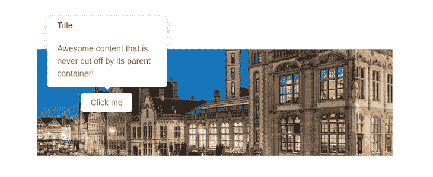

就是这样！你有一个通用的解决方案来处理任何应该在父类之外弹出而不会被切断的内容。但是`<Portal/>`包装组件对我们来说是一个“黑盒”,所以让我们改变它，看看它的内部是什么。

## 构建门户包装器

通过遵循门户网站的 [React 文档，我们可以通过几个步骤从头开始构建我们自己的定制`<Portal/>`包装器组件:](https://reactjs.org/docs/portals.html)

### 步骤 1:在`react-root`之外的`DOM`中添加一个额外的挂载点

```
<html>
    <body>
        <div id="react-root"></div> // [ 1 ]
        <div id="portal-root"></div>
    </body>
</html>

```

在这段代码中，我将 React 挂载点元素 ID 命名为`"react-root"`，所有的`tooltips/dropdowns`都应该使用`"portal-root"`中的 React 门户来挂载。

### 步骤 2:在 React 中使用`createPortal`构建一个可重用的 React 门户包装组件

下面是用 React 钩子编写的简化的`<Portal/>`包装器组件代码:

```
import { useEffect } from "react";
import { createPortal } from "react-dom";

const Portal = ({children}) => {
  const mount = document.getElementById("portal-root");
  const el = document.createElement("div");

  useEffect(() => {
    mount.appendChild(el);
    return () => mount.removeChild(el);
  }, [el, mount]);

  return createPortal(children, el)
};

export default Portal;

```

如您所见，`mount`需要一个带有`id = "portal-root"`的`DOM`元素，它来自前面的 HTML 代码片段，可以在其中追加一个元素。这个包装器组件做的核心事情是为传递到组件中的任何 React 子组件创建一个门户。

这里使用的`useEffect` React 钩子负责在正确的时间装载元素，并在组件卸载时进行清理。

### 步骤 3:使用 React 钩子将按钮坐标传递给工具提示进行定位

为了获得全功能的工具提示组件，我们需要做的最后一件事是将按钮坐标传递给工具提示进行定位。多亏了 React 钩子，这并不是一个困难的任务，它可以通过如下方式实现:

```
const App = () => {
  const [coords, setCoords] = useState({}); // takes current button coordinates
  const [isOn, setOn] = useState(false); // toggles button visibility

  return <Card style={{...styles.card, overflow: "hidden"}}> // [ 2 ]
      <Button
        onClick={e => {
          const rect = e.target.getBoundingClientRect();
          setCoords({
            left: rect.x + rect.width / 2,
            top: rect.y + window.scrollY
          });
          setOn(!isOn); // [ 3 ]
        }}
      >
        Click me
      </Button>
      {
        isOn &&
        <Portal>
          <TooltipPopover coords={coords}>
            <div>Awesome content that is never cut off by its parent container!</div>
          </TooltipPopover>
        </Portal>
      }
  </Card>
}

```

在这段代码中，按钮组件有一个`onClick`事件处理程序，它使用`DOM`元素的标准 [getBoundingClientRect()方法](https://developer.mozilla.org/en-US/docs/Web/API/Element/getBoundingClientRect)从`e.target`对象获取按钮的当前屏幕坐标。

此外，还提供了一个按钮可见性切换工具，帮助我们切换工具提示。

请注意，我有意保留了`Card`组件，以展示门户解决方案运行良好。

请随意查看 [codesandbox 上的现场演示和完整代码。](https://codesandbox.io/s/github/supromikali/react-portals-example)

### 额外好处:防止工具提示在页面内容改变时跳转

有一件事与工具提示定位比与门户网站更相关，但值得一提。如果按钮的位置取决于窗口的右边缘(例如，`display: flex; margin-left: auto`样式)，它的位置可能会受到窗口滚动的影响(例如，当新内容加载到页面底部时)。让我们来看一个例子:

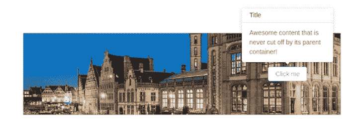

Before: The window has no scroll, and the tooltip is centered relative to the button

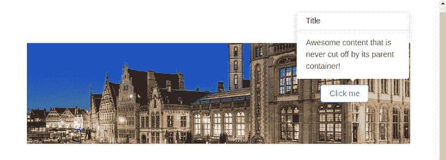

After: The window scroll has appeared, and the tooltip is a bit off-center (exactly the same amount of pixels as the scroll added)

有几种方法可以解决这个问题。您可以使用一些应用于整个页面的调整大小检测包，如`react-resize-detector`，它将在内容高度变化时触发一些事件。

然后，我们可以测量滚动宽度，并纠正工具提示的位置。

幸运的是，在我们的例子中，有一个更简单的纯 CSS 解决方案:

```
html {
    overflow-x: hidden;
    width: 100vw;
}

```

向页面添加这个小代码片段可以防止页面内容在窗口滚动`appear/hide`时发生意外跳转，因为`<html/>`宽度被设置为等于`100vw`(窗口宽度)，这是一个常数，不受窗口滚动的影响。

同时，`100% <html/>`宽度不包括滚动，所以应用程序不再关心滚动是开还是关。`Tooltip`会一直居中。

您可以在[演示](https://xshnz.csb.app/)上通过调整窗口高度大小来测试结果。使用一个名为 [react-custom-scrollbars](https://www.npmjs.com/package/react-custom-scrollbars) 的包也可以做同样的事情，但是跨浏览器滚动条看起来更好。

要让它工作，你需要安装软件包，并将整个应用程序打包成一个`Scrollbars`组件，如下所示:

```
import { Scrollbars } from 'react-custom-scrollbars';

ReactDOM.render(
  <Scrollbars style={{ width: "100vw", height: "100vh" }}>
    <App />
  </Scrollbars>, 
  document.getElementById("react-root")
);

```

以下是快速预览(注意滚动条外观):

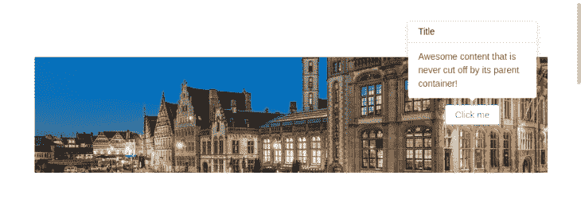

Note: The Scrollbar appearance

## 在 React 门户中使用 React 挂钩

在这一节中，我们将更深入地将 [React Hooks](https://reactjs.org/docs/hooks-intro.html) 与门户结合起来。当你想写可重用的代码时，React 钩子非常有用。这意味着我们可以[创建一个自定义钩子](https://blog.logrocket.com/create-your-own-custom-react-hooks/)，这将允许我们相对容易地渲染我们的模态。因此，这给表格带来了更干净、更可读和更健壮的代码。

### 创建我们的自定义 React 挂钩

我们甚至可以创建一个自定义的 React 挂钩来构建一个门户:

```
//file name: usePortal.js
// The complete breakdown of this code is in the comments
import { useState, useCallback, useEffect } from "react";
import ReactDOM from "react-dom";
const usePortal = (el) => {
  const [portal, setPortal] = useState({
    render: () => null,
    remove: () => null,
  });

  const createPortal = useCallback((el) => {
    //render a portal at the given DOM node:
    const Portal = ({ children }) => ReactDOM.createPortal(children, el);
    //delete the portal from memory:
    const remove = () => ReactDOM.unmountComponentAtNode(el);
    return { render: Portal, remove };
  }, []);

  useEffect(() => {
    //if there is an existing portal, remove the new instance.
    //is prevents memory leaks
    if (el) portal.remove();
    //otherwise, create a new portal and render it
    const newPortal = createPortal(el);
    setPortal(newPortal);
    //when the user exits the page, delete the portal from memory.
    return () => newPortal.remove(el);
  }, [el]);

  return portal.render;
};
export default usePortal; //link this Hook with the project

```

在这段代码中，我们定义了一个`usePortal`钩子，它允许用户在给定的 HTML 选择器中显示一个`Portal`元素。

为了查看这个钩子的运行情况，在您的`App.js`模块中编写以下代码块:

```
//import our custom Hook into the project.
import usePortal from "./usePortal";
function App() {
  //render our portal within the element which has the class of 'me'
  const Portal = usePortal(document.querySelector(".me"));
  return (
    <div className="App">
      <Portal>Hi, world</Portal>
    </div>
  );
}

```

这将是结果:


请注意，React 没有呈现我们的门户。这是因为，在我们的代码中，我们告诉编译器将组件绘制到一个名为`me`的节点中。然而，在我们的`index.html`文件中，我们还没有创建一个`me`元素。

要解决这个问题，将这行代码添加到`index.html`:

```
<!-- Create a div with a className of 'me'. Our portal will be rendered here --->
<div class="me"></div>
<!-- Further code.... -->

```


## 结论

我们已经一步一步地介绍了 React Portal 最常见的用例，解释了它如何在一个真实的例子中从头开始开发工具提示组件。此外，我们还讨论了使用 React 钩子和门户来帮助我们构建定制钩子。

当然，一般化不可能没有它的权衡。门户工具提示的复杂性比纯粹的 CSS/HTML 解决方案更大，这取决于开发人员在正确的时间选择正确的方法。

## 使用 LogRocket 消除传统反应错误报告的噪音

[LogRocket](https://lp.logrocket.com/blg/react-signup-issue-free)

是一款 React analytics 解决方案，可保护您免受数百个误报错误警报的影响，只针对少数真正重要的项目。LogRocket 告诉您 React 应用程序中实际影响用户的最具影响力的 bug 和 UX 问题。

[ ](https://lp.logrocket.com/blg/react-signup-general) [  ](https://lp.logrocket.com/blg/react-signup-general) [LogRocket](https://lp.logrocket.com/blg/react-signup-issue-free)

自动聚合客户端错误、反应错误边界、还原状态、缓慢的组件加载时间、JS 异常、前端性能指标和用户交互。然后，LogRocket 使用机器学习来通知您影响大多数用户的最具影响力的问题，并提供您修复它所需的上下文。

关注重要的 React bug—[今天就试试 LogRocket】。](https://lp.logrocket.com/blg/react-signup-issue-free)