# 学习这些键盘快捷键，成为一个 VS 代码忍者- LogRocket 博客

> 原文：<https://blog.logrocket.com/learn-these-keyboard-shortcuts-to-become-a-vs-code-ninja/>

最近，我想在用 Visual Studio 代码编程时限制鼠标的使用，因为我发现通过光标与 IDE 交互会分散注意力，而且是一个主要的干扰因素，所以我尝试只用键盘浏览 VSC。

在这里，我想介绍一些我发现的提高生产力的捷径。继续，打开 Visual Studio 代码，让我们开始吧。

## 分割和聚焦

除非你是在一个非常小的屏幕上工作，否则你可能会把你的 IDE 分成两个或三个视图，以便更平滑地在文件之间切换。

### 剧烈的

要拆分编辑器，可以使用`ctrl + \` ( `⌘ + \`)。

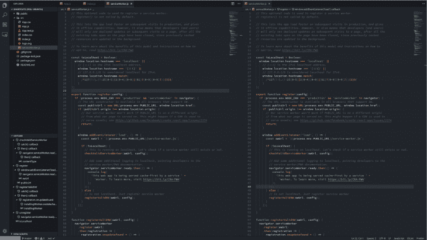

您可以拆分编辑器的次数没有限制，但是我怀疑您是否想要打开三个以上的视图；除此之外，这是不切实际的。您可以使用`ctrl + 1` ( `⌘ + 1`)、`ctrl + 2` ( `⌘ + 2`)等在视图之间切换。或者，您可以使用`ctrl + page up` / `page down` ( `⌘ + page up` / `page down`)在选项卡之间切换(通过扩展，在视图之间切换)。

### 集中

拆分编辑器后，我们最终在多个视图中打开了同一个文件。现在，我们将关注资源管理器面板。我们想在不接触鼠标的情况下改变这一点。此外，在不触摸鼠标的情况下聚焦不同的视图也是不错的。

为了聚焦浏览器面板，我们使用`ctrl + 0` ( `⌘ + 0`)。我们使用上下箭头导航面板。使用`enter`键，我们打开一个选定的文件夹或文件。

默认情况下，有两种视图:资源管理器面板和代码视图。使用`ctrl + 1` ( `⌘ + 1`)可以聚焦代码视图。如果我们通过拆分编辑器来创建更多的视图，我们使用`ctrl + 2` ( `⌘ + 2`)、`ctrl + 3` ( `⌘ + 3`)等等来表示各自的视图。我们也可以用`ctrl + page up` / `page down`在连续的标签页之间切换(默认情况下，macOS 上没有定义这个命令)。

请注意，这只适用于 VSC 可以访问整个文件夹的情况，并且只适用于处理打开的文件夹，而不是单个文件。

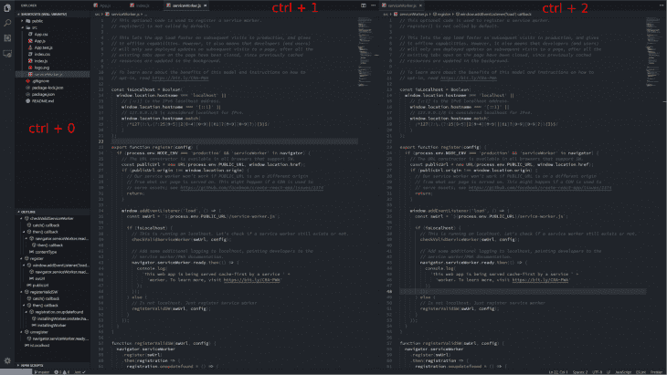

## 替代方法

还有一种略微不同的方法来选择列表中距离当前打开的文件较远的文件。我们可以使用`ctrl + p` ( `⌘ + p`)，这将打开一个搜索栏，我们可以在其中键入文件名(`http.service.ts`)或完整路径(`src/services/http.service.ts`)。

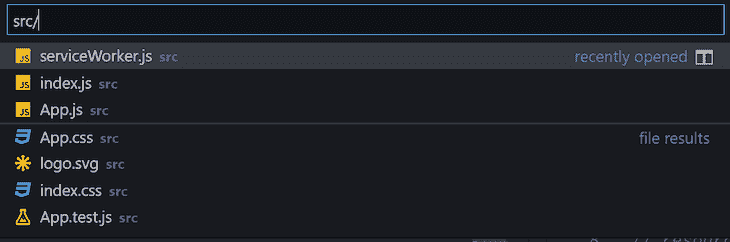

## 使用文件历史记录

我们通常不会一次处理项目中的所有文件；我们同时与两个，也许最多三个一起工作。为了缩短在它们之间切换的时间(如果我们没有足够的屏幕空间来拆分编辑器)，我们可以使用文件历史。

文件历史，顾名思义，保存我们最后使用的文件，并提供一个快速恢复它们的方法。在 VSC，我们使用`ctrl + tab`在最后打开的文件之间切换。

虽然这确实非常有效，但有人可能会说，还有一种方法甚至更快。通过使用`alt + left` / `right`箭头(`ctrl + shift + -` / `ctrl + -`，我们可以直接切换到文件历史中的上一个/下一个文件。

## 遍历代码

现在我们知道了如何浏览文件，让我们把注意力集中在如何浏览代码上。

### 利用提纲

在资源管理器面板中，您可以单击 **Outline** 部分来显示代码的大纲。虽然这个特性本身很神奇，因为它让我们看到了代码的更一般的视图，但我们也可以用它来快速移动。

通过使用`ctrl + shift + o` ( `⌘ + shift + o`，我们可以调出命令面板，在这里我们可以选择想要跳转到的大纲部分。在用向上/向下箭头选择定义之后，适当的代码段会为我们突出显示，从而更容易到达我们想要去的地方。

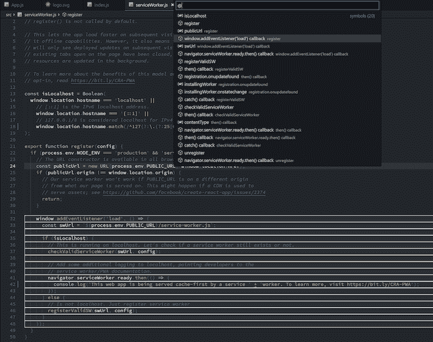

同样的特性也可以用来在整个项目中搜索给定的一段代码。通过使用`ctrl + t` ( `⌘ + t`)，我们再次调出命令面板，在这里我们可以输入变量/函数等的名称。去寻找。

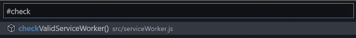

### 直接到给定的线

假设我们想直接跳到某一行——例如，当有一个错误指向它时。要跳转到指定索引的一行，我们可以使用`ctrl + g`。

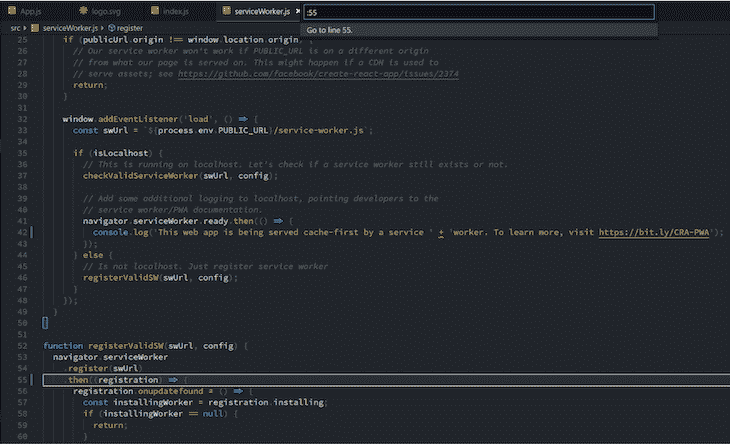

### 向后跳

我们经常想在代码的一个地方快速修复一些东西，然后直接跳回到之前的地方。我们使用`ctrl + u` ( `⌘ + u`)来实现这一点，它将光标带回到跳转之前的位置。

### 文件的开头和结尾

要跳到文件的开头或结尾，我们可以分别使用`ctrl + home` ( `⌘ + up`)和`ctrl + end` ( `⌘ + down`)。

## 定义和参考文献

你有没有用手或者用`ctrl + shift + f` ( `⌘ + shift + f`)搜索过一个定义？如果你有，那么你知道这有多烦人。VSC 有一个很好的捷径！

### 跳到定义

我们可以使用`F12`跳转到当前高亮显示的函数或变量的定义。

### 窥视实现

通常，我们只想在一个函数的实现上有一个快速的峰值。理想情况下，我们不希望仅仅为了检查几行而打开另一个文件。通过使用`alt + F12` ( `option + F12`)，我们可以看到光标旁边高亮显示的函数的实现。一旦我们完成，我们只需按下`esc`。

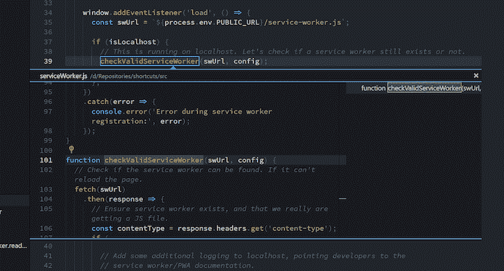

### 偷看参考文献

还有一个以类似方式查看符号引用的快捷方式——就在光标旁边。我们用`shift + F12` ( `⌘ + k`和`F12`)来做这件事。

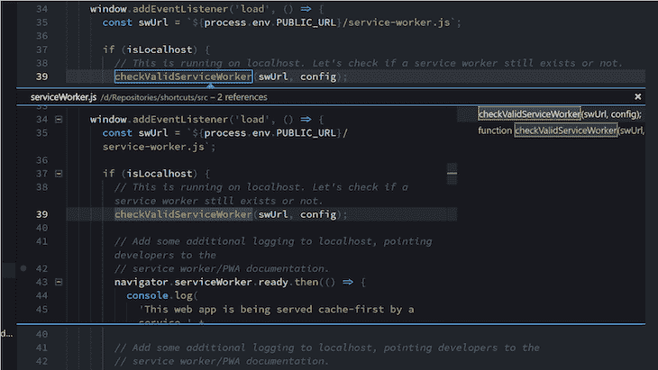

在这两种情况下，我们都可以使用上下箭头来选择我们想要查看或跳转到的定义。

### 更改符号的名称

在整个项目中改变给定符号的名称(例如，函数的名称)可能是乏味的。通常是用`ctrl + shift + f`(`⌘ + shift + f`)——我们手动替换符号的每一种用法。

使用`F2`快捷键可以更快地完成。它会提示一个窗口，我们在其中键入当前突出显示的符号的新名称，就这样—现在每个出现的符号都被新名称替换了。

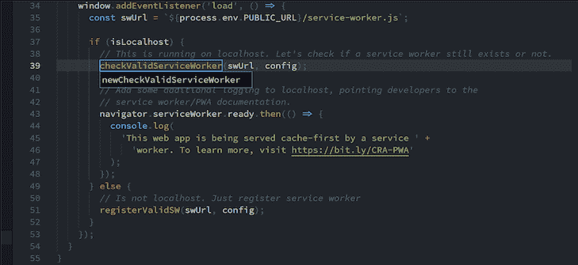

### 仔细查看错误

当我们的代码有问题时，VSC 会用红线标出。通常，我们可以将鼠标光标悬停在代码上，看看有什么问题。然而，我们可以通过使用`F8`更快地完成它。

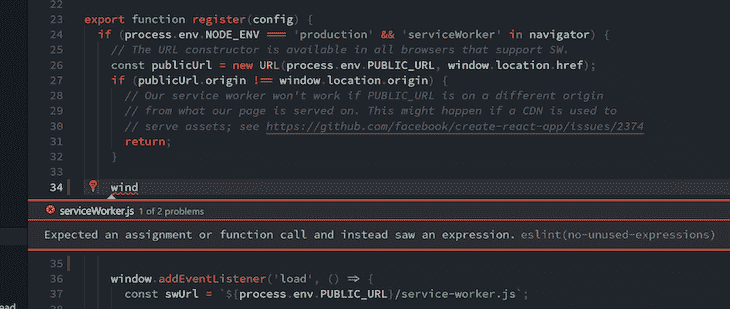

我们可以通过点击`esc`键退出“错误模式”。

## 智能感知

### 盘旋

与错误一样，当我们将鼠标悬停在某个符号上时，VSC 会向我们展示它的简化定义。为了用键盘达到同样的效果，我们必须设置自己的快捷键。

我们可以通过使用`ctrl + k` ( `⌘ + k`)和`ctrl + s` ( `⌘ + s`)来设置自己的快捷方式，这将打开快捷方式设置视图。

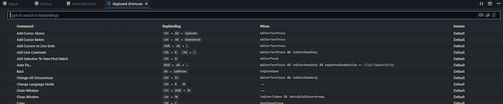

然后搜索**显示悬停**动作:

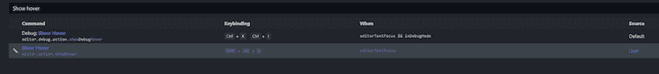

并将其设置为您喜欢的快捷方式。我选择了`alt + shift + s`。

运行中的快捷方式:

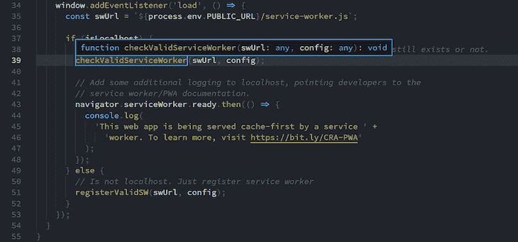

### 显示推荐的操作

有时，VSC 能够解决我们的问题，例如，导入我们忘记导入的代码或删除未使用的代码。要查看当前突出显示的代码的可用操作，我们可以使用`ctrl + .` ( `⌘ + .`)。

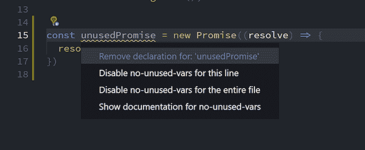

## 选择代码

代码由块组成，无论是函数体还是`if`块。有时我们想选择整个东西，比如说，删除它，而不用担心块的开始和结束。

使用`alt + shift + left` / `right` ( `⌘ + ctrl + shift + left` / `right`)快捷键可以轻松地根据范围选择代码。重复使用此快捷方式会使所选内容适当变大或变小。

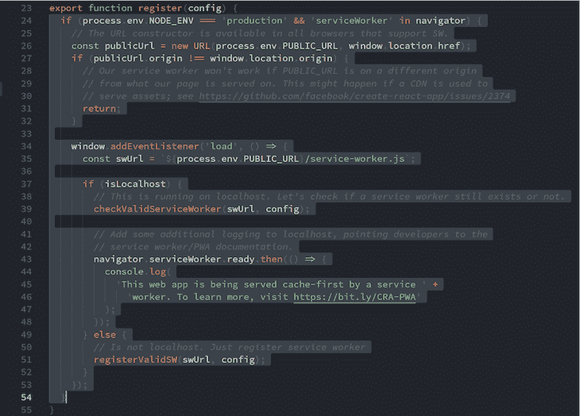

## 集成终端

当 Visual Studio 代码以全屏模式打开时，随身携带一个终端通常会很方便。在终端和代码之间切换需要一些自己的快捷方式。

### 打开终端

要打开一个终端，我们使用`ctrl + ``。

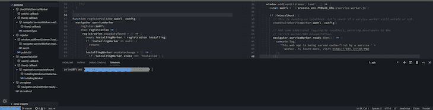

为了打开更多的终端，我们使用`ctrl + shift + ``。

### 把它分开

终端，就像编辑器一样，可以分成面板。为此我们使用`ctrl + shift + 5`。

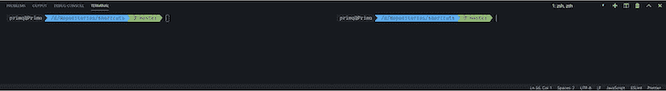

### 集中

在编辑器中，为了关注终端，我们使用`ctrl + ``。如果我们在终端被聚焦时使用`ctrl + ``，我们可以将其状态从显示切换到隐藏。

#### 聚焦分割面板

一旦我们聚焦在终端上，我们可以使用`alt + left` / `right` ( `⌘ + option + left` / `right`)在分割面板之间切换焦点。

### 奖金

以下是我发现非常有用的一些终端快捷方式。

#### 终止一个终端

杀死一个终端可以通过点击终端右上角的垃圾桶图标来实现，但是为了让它成为一个没有鼠标的体验，我们必须设置一个快捷方式。

在快捷方式设置输入中，输入“workbench.action.terminal.kill ”,然后点击它来设置快捷方式。我选择了使用`ctrl + shift + x`，但是对你有效的都可以。

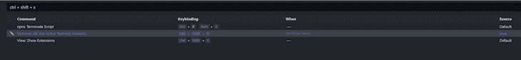

#### 最大化终端

有时，当有大量原木进入时，我们会临时将码头扩大。和以前一样，但是在设置中，输入`workbench.action.toggleMaximizedPanel`。在这里，我选择将其放在`ctrl + shift + q`下。

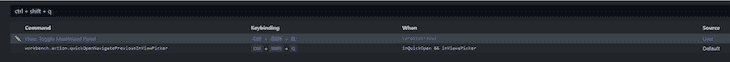

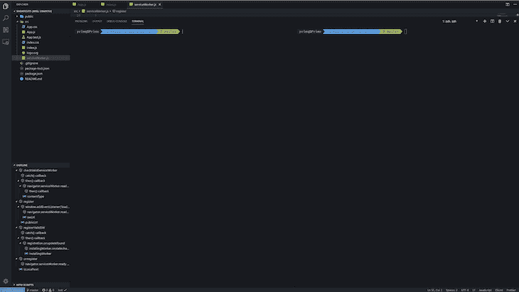

## 其他一切

如果你不知道快捷方式是什么，你可以用`ctrl + shift + p` ( `⌘ + shift + p`)打开命令面板，输入你想要快捷方式做的事情，例如，“打开终端”大多数情况下，它会通过名称旁边的快捷方式向您显示正确的操作。

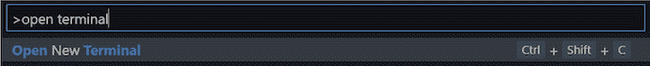

## 摘要

掌握这些捷径的关键是一致性。试着逐步实现它们，在你意识到之前，你会发现自己越来越少地依赖鼠标，这反过来会让你的编码体验更加流畅和高效。

想了解更多？这是 Visual Studio 代码的[文档](https://code.visualstudio.com/docs/getstarted/keybindings)。

有一些我忘记的杀手捷径？下面分享一下吧！

## 使用 [LogRocket](https://lp.logrocket.com/blg/signup) 消除传统错误报告的干扰

[LogRocket](https://lp.logrocket.com/blg/signup) 是一个数字体验分析解决方案，它可以保护您免受数百个假阳性错误警报的影响，只针对几个真正重要的项目。LogRocket 会告诉您应用程序中实际影响用户的最具影响力的 bug 和 UX 问题。

然后，使用具有深层技术遥测的会话重放来确切地查看用户看到了什么以及是什么导致了问题，就像你在他们身后看一样。

LogRocket 自动聚合客户端错误、JS 异常、前端性能指标和用户交互。然后 LogRocket 使用机器学习来告诉你哪些问题正在影响大多数用户，并提供你需要修复它的上下文。

关注重要的 bug—[今天就试试 LogRocket】。](https://lp.logrocket.com/blg/signup-issue-free)