# 在 Flutter - LogRocket 博客中学习如何使用 AWS Amplify

> 原文：<https://blog.logrocket.com/learning-aws-amplify-flutter/>

在本教程中，您将了解什么是 AWS Amplify，以及如何在构建 Flutter 待办事项应用程序时使用它。

如今，大多数组织使用 Amazon Web Services (AWS)过渡到基于云的模型，该模型提供 90 多种服务和产品，用于快速、高效、无服务器和安全地开发 Web 和移动应用程序。

其中一个服务是 AWS Amplify，它通过一个简化和抽象的平台来帮助 web 和移动开发者，从而获得了关注。它附带了一组工具和服务，为用户提供了配置后端、连接应用程序、部署静态 web 应用程序和管理 AWS 控制台外部上下文的选项。

在本教程中，您将学习如何执行以下操作:

*   将 Amplify 添加到颤振应用程序
*   生成数据模型
*   集成和配置放大器
*   连接到云

注意，本教程假设你对颤振有一定的了解。如果你是 Flutter 新手，请浏览官方文档了解一下。

但是，在继续之前，请确保您具有以下要求:

*   Git v2.14.1 或更高版本
*   npm v5.x 或更高版本
*   Node.js v12.x 或更高版本
*   颤振 2.0.0 版或更高版本(稳定)
*   AWS 帐户(创建 AWS 帐户)

## Amplify 入门

[从这里下载包含所有预建 UI 的入门应用](https://github.com/himanshusharma89/todorocket)，因为您目前将专注于学习 Amplify。

在编辑器中打开它，构建并运行应用程序:

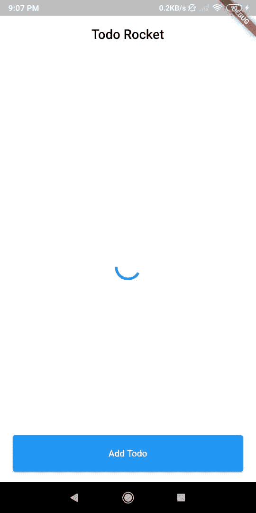

现在，您需要安装 Amplify CLI，这是一个工具链，用于配置支持后端所需的服务，如下所示:

```
npm install -g @aws-amplify/cli
```

*注意，您正在使用`-g`全局安装 Amplify CLI。*

安装后，使用以下命令配置 Amplify:

```
amplify configure
```

*注意，上述配置要求您在 AWS 控制台上登录 inv。*

接下来，Amplify CLI 将要求您创建一个 IAM 用户，如下所示:

```
Specify the AWS Region
? region:  # Your preferred region
Specify the username of the new IAM user:
? user name:  # User name for Amplify IAM user
Complete the user creation using the AWS console
```

Amazon IAM(身份和访问管理)使您能够在 AWS 中管理用户和用户权限。[你可以在这里了解更多关于亚马逊 IAM 的信息](https://aws.amazon.com/iam/)。

现在，转到控制台，创建一个具有管理员访问权限的用户来利用各种 AWS 资源。

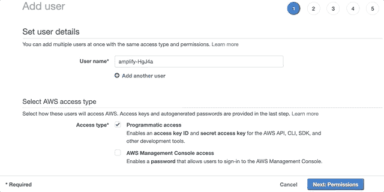

创建用户后获取`accessKeyId`和`secretAccessKey`，因为 Amplify CLI 会要求您提供这些信息，以便将 CLI 与创建的 IAM 用户连接起来:

```
Enter the access key of the newly created user:
? accessKeyId:  # YOUR_ACCESS_KEY_ID
? secretAccessKey:  # YOUR_SECRET_ACCESS_KEY
This would update/create the AWS Profile in your local machine
? Profile Name:  # (default)

Successfully set up the new user.
```

在下一步中，您将开始设置您的项目并在其中初始化 Amplify。

## 设置项目

### 将 Amplify 添加到您的 Flutter 应用程序中

在 pubspec 依赖项中添加 Amplify 插件，如下所示:

```
amplify_flutter: ^0.2.0
amplify_datastore: ^0.2.0
amplify_datastore_plugin_interface: ^0.2.4
```

要么使用您的 IDE 安装插件来保存它，要么使用下面的命令:

```
flutter pub get
```

### 更新目标 iOS 平台和 Android 版本

通过导航到 `/ios`目录并更新 Podfile，将目标 iOS 平台更新到 13.0 或更高版本:

```
platform :ios, '13.0'
```

通过导航到`android/app`目录并更新`build.gradle`，将 Android SDK 版本更新到 21 或更高版本:

```
minSdkVersion 21
```

现在，您已经准备好使用 Amplify 了。

## 创建数据模型

### 创建数据模型

现在，您需要创建一个数据模型，供您的博客应用程序使用。这些模型被创建为 GraphQL 模式。

导航至[放大管理](https://sandbox.amplifyapp.com/start)并选择**数据**功能:

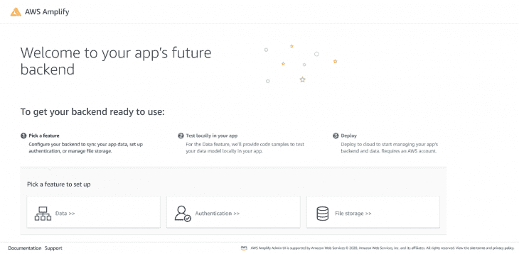

接下来，选择**待办事项列表模式**并点击**创建新模式**:

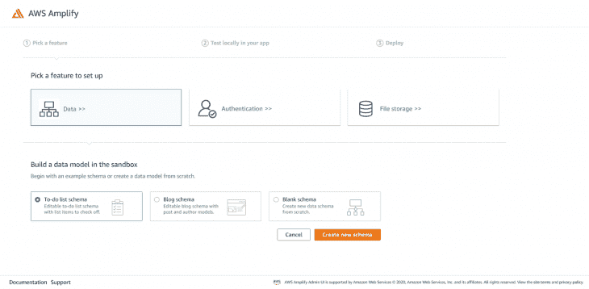

#### 添加字段和类型

*   要添加新字段，点击**待办事项**模型下的**添加字段**。
*   将该字段的**字段名**设置为 **isTaskCompleted**
*   对于该字段的**类型**，选择**布尔**
*   在检查器面板(右面板)中，选择**为必填字段**使该字段成为必填字段

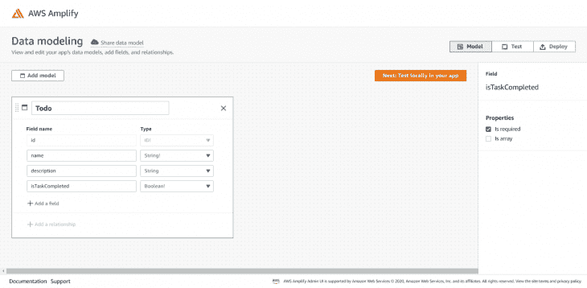

接下来，在您的应用程序中点击**本地测试。**

### 生成数据模型

现在完成部署步骤:

1.  你正在开发什么类型的应用程序？继续提供以下信息，点击**下一步**:
    *   平台:**跨平台**
    *   框架/语言:**颤动**
2.  **(可选)创建新应用:**如果已经创建了 Flutter 应用，则跳过此步骤
3.  **安装 Amplify CLI 来获取数据模型:** Amplify CLI 已经配置好了，所以继续在您的项目根目录中运行提供的命令，然后单击**下一步** :

    ```
    amplify pull --sandboxId <UUID>
    ```

    1.  集成 Amplify 和部署的其余步骤将在本教程的后面介绍，所以现在点击 **Deploy to AWS** 并点击**登录以部署 AWS** 链接

到目前为止，一些新的目录和文件已经被添加到你的应用程序的根目录。要检查生成的 GraphQL 模式，导航到`amplify\backend\api\amplifyDatasource\schema.graphql`，您应该看到以下内容:

```
type Todo @model @auth(rules: [{allow: public}]) {
  id: ID!
  name: String!
  description: String
  isTaskCompleted: Boolean!
}
```

*注意，你可以[在这里](https://docs.amplify.aws/cli/graphql-transformer/overview/)了解更多 GraphQl 模式。*

现在，您的模型已经成功生成，并且可以在`todorocket\lib\models`中找到。

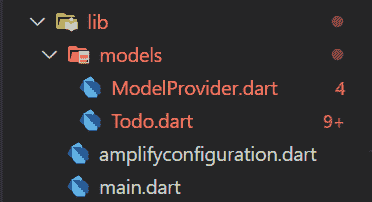

## 积分放大器

现在，您将集成 Amplify DataStore 并使用生成的模型。

更新`todo_view.dart`以初始化扩增库，如下所示:

```
// Amplify Flutter Packages
import 'package:amplify_flutter/amplify.dart';
import 'package:amplify_datastore/amplify_datastore.dart';

// Generated in the previous step
import 'models/ModelProvider.dart';
import 'amplifyconfiguration.dart';
```

如下所示更新`_TodosViewState` 类中的`_configureAmplify`方法:

```
  final AmplifyDataStore _dataStorePlugin =
      AmplifyDataStore(modelProvider: ModelProvider.instance);

Future<void> _configureAmplify() async {
    try {
      await Amplify.addPlugins([_dataStorePlugin]);

      await Amplify.configure(amplifyconfig);
    } catch (err) {
      debugPrint('Erro occured while configuring Amplify $err');
    }
  }
```

在这里，您执行了以下操作:

1.  创建了`AmplifyDataStore object`、`_dataStorePlugin`。
2.  更新了`_configureAmplify`方法，使用`_dataStorePlugin`配置 Amplify。

接下来，创建一个`Todo`的类型列表，并更新构建方法的 body 属性，如下所示:

```
List<Todo> _todos = [];

@override
  Widget build(BuildContext context) {
    ...
      // body: const Center(child: CircularProgressIndicator()),
      body: _isLoading
          ? const Center(child: CircularProgressIndicator())
          : TodosList(todos: _todos),
    ...
  }
}
```

在这里，您将检查 Amplify 是否已配置。重新启动你的应用程序，现在你会看到一条消息，而不是一个进度指示器:

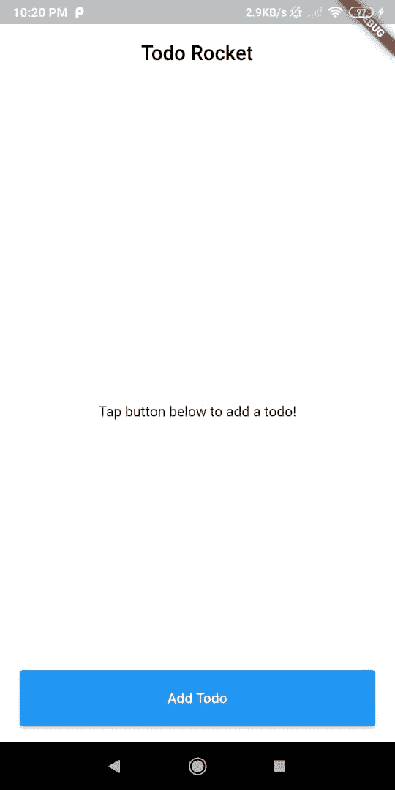

现在，您需要更新`_fetchTodos`方法，以便使用`DataStore`在本地使用 CRUD API:

```
Future<void> _fetchTodos() async {
    try {
      List<Todo> updatedTodos = await Amplify.DataStore.query(Todo.classType);

      // update the UI state to reflect fetched todos
      setState(() {
        _todos = updatedTodos;
      });
    } catch (e) {
      print('An error occurred while querying Todos: $e');
    }
  }
```

在上面的代码中，对所有的`todo`条目使用一个`DataStore.query()`，并将结果分配给`_todos`列表。如果您现在重启项目，您将看不到任何`todo`项，因为我们还没有使用**保存**查询。

### 创建待办事项

主屏幕中的**添加**按钮会将您导航到**添加待办事项表单**视图，当单击**保存**按钮时，该视图不会执行任何操作。你需要解决这个问题，这样你就可以在**主页**屏幕上看到一个`Todo`。

更新`_saveTodo`方法，如下所示:

```
Future<void> _saveTodo() async {
    String name = _nameController.text;
    String description = _descriptionController.text;

    Todo newTodo =
        Todo(name: name, description: description, isTaskCompleted: false);

    try {
      await Amplify.DataStore.save(newTodo);
      Navigator.pop(context);
    } catch (e) {
      debugPrint('Error occured while saving Todo $e');
    }
  }
```

这里，您创建了一个`newTodo`对象，并使用`DataStore`保存了它。如果你现在试图保存一个`Todo`，你将被重定向到主屏幕。但是，即使重启应用程序后，您也看不到任何新的`Todo`。因此，要解决这个问题，您需要创建一个查询来列出它们。

### 查询`Todos`

更新`_TodosViewState`类中的`_initializeApp`方法，如下所示:

```
Future<void> _initializeApp() async {

  await _configureAmplify();

  await _fetchTodos();

  setState(() {
    _isLoading = false;
  });
}
```

注意，也可以在`_configureAmplify`方法后使用`.then`。

* * *

### 更多来自 LogRocket 的精彩文章:

* * *

在上面的代码中，您调用了`_fetchTodos`方法，在 Amplify 配置之后从`DataStore`中获取所有的`Todos`。

接下来，更新`_fetchTodos`方法，如下所示:

```
Future<void> _fetchTodos() async {
    try {
      List<Todo> updatedTodos = await Amplify.DataStore.query(Todo.classType);

      setState(() {
        _todos = updatedTodos;
      });
    } catch (e) {
      print('An error occurred while querying Todos: $e');
    }
  }
```

这里，您通过将`Todo` `classType`传递给`DataStore`来查询所有的`Todo`条目，并更新 UI 状态以显示获取的数据。

如果你现在重启你的应用，你可以看到你添加的`Todos`。然而，如果你创建了一个新的`Todo`，你将不会在主屏幕上看到它们，除非你重启你的应用。现在你将解决这个问题，并进行实时`Todo`创作。

### 收听`Todo`更新

Amplify DataStore 提供了一种订阅模型数据更新的方式。

现在，在`_TodosViewState`下添加一个 StreamSubscription:

```
 late StreamSubscription _subscription;
```

这里您创建了一个对`Todo`模型更新事件的订阅，稍后将在运行时初始化。

接下来，更新`dispose`方法，如下所示:

```
@override
void dispose() {
  _subscription.cancel();
  super.dispose();
}
```

在上面的代码中，当状态从树中删除时，您取消了订阅。

接下来，更新`_initializeApp`方法，如下所示:

```
Future<void> _initializeApp() async {

  await _configureAmplify();

  _subscription = Amplify.DataStore.observe(Todo.classType).listen((event) {
    _fetchTodos();
  });

  await _fetchTodos();

  setState(() {
    _isLoading = false;
  });
}
```

在上面的代码中，您通过将`Todo` `classType`传递给`Amplify.DataStore.observe(),`来监听`Todo`更新，当更新事件到来时，您将获取待办事项列表。

如果你重启应用程序并开始添加新的`Todo`，它们会开始在你的主屏幕上弹出。

现在，在你完成你的`Todo`之后会发生什么？您需要将那个`Todo`标记为完成，如果您注意到了，您可以在一个`Todo`项目上看到一个复选框。所以现在你需要在任务完成后更新你的`Todo`。

### 更新`Todo`

在`DataStore`中，您不能直接操作记录，因为`DataStore`中的模型是不可变的。因此，要更新一条记录，您将使用 copyWith 方法。

现在，更新`TodoItem`类中的`_toggleIsComplete`方法，如下所示:

```
Future<void> _toggleIsComplete() async {
    Todo updatedTodo = todo.copyWith(isTaskCompleted: !todo.isTaskCompleted);
    try {
      await Amplify.DataStore.save(updatedTodo);
    } catch (e) {
      print('An error occurred while saving Todo: $e');
    }
  }
```

在这里，您正在创建您想要更新的`Todo`的新实例，但是更新了附加属性，然后再次将新实例传递给`Amplify.DataStore.**save**()`进行更新。

现在，重启你的应用程序，你就可以在`Todo`的完成和未完成状态之间切换了。此外，如果您愿意，您还可以删除一个`Todo`。

### 删除一个`Todo`

删除一个`Todo`比更新它容易得多，因为你不需要复制对象来删除它。所以要从现有项目中删除一个`Todo`，可以使用长按手势，也可以根据自己的喜好进行更改。

现在，更新`TodoItem`中的`_deleteTodo`方法如下:

```
void _deleteTodo(BuildContext context) async {
    try {
      await Amplify.DataStore.delete(todo);
    } catch (e) {
      print('An error occurred while deleting Todo: $e');
    }
  }
```

在上面的代码中，您将把`Todo`对象传递给`DataStore.delete()`来从`DataStore`中删除数据。

重新加载你的应用程序一次，你应该能够长按一个项目删除它。现在，您已经有了一个全功能的 CRUD 应用程序。

接下来，您将应用程序连接到 AWS。

## 连接到云

要部署您的 Amplify 沙盒后端，请返回沙盒链接并登录您的 AWS 帐户。

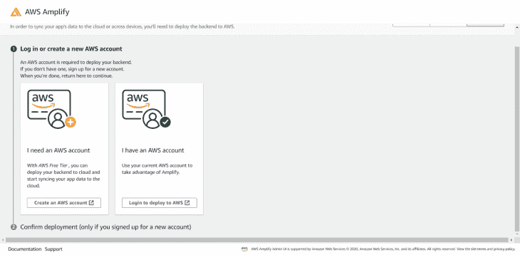

### 创建应用后端

要创建您的应用后端，请在创建表单中提供数据:

1.  给你的应用命名
2.  选择您的部署区域
3.  点击**确认部署**

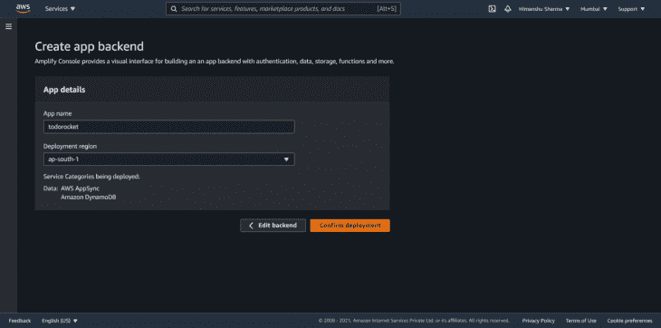

接下来，AWS 将开始部署您的后端，当状态显示为**部署** **完成，**点击**编辑后端**打开您的管理 UI。

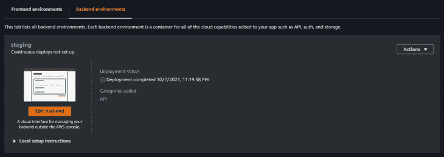

### 添加身份验证

由于您的**待办事项**模型指定了一个`@auth`指令，我们需要首先添加认证。从左侧面板中，选择**认证**。点击**部署默认值**。


### 用部署的环境更新本地项目

认证部署完成后，点击右上方的**本地设置指令**。

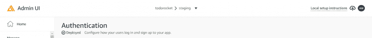

现在，复制命令，将后端拉入本地并运行它。

这将提示您使用 Amplify CLI 登录 Amplify Admin UI 点击**是**。

稍后根据您的选择进行:

```
amplify pull --appId <appId> --envName staging

? Choose your default editor:
    `<your editor of choice>`
? Choose the type of app that you're building
    `flutter`
? Where do you want to store your configuration file?
    `./lib/`
? Do you plan on modifying this backend?
    `Yes`
```

### 添加更多插件

现在，我们需要添加一些额外的插件，以确保`DataStore`能够访问与云通信所需的 API:

```
amplify_api: ^0.2.0
amplify_auth_cognito: ^0.2.0
```

在你的 `pubspec.yaml`中加入上述依赖项，做`flutter pub get`。

接下来，在配置`_TodosViewState`类中的 Amplify 之前添加这些插件，并更新`_configureAmplify`方法:

```
final AmplifyAPI _apiPlugin = AmplifyAPI();
final AmplifyAuthCognito _authPlugin = AmplifyAuthCognito();

Future<void> _configureAmplify() async {
    try {
      await Amplify.addPlugins([_dataStorePlugin, _apiPlugin, _authPlugin]);

      await Amplify.configure(amplifyconfig);
    } catch (err) {
      debugPrint('Erro occured while configuring Amplify $err');
    }
  }
```

由于 Amplify 只能配置一次，因此您需要立即完全重启(停止并重启应用程序)，而不仅仅是热重启。你完了！

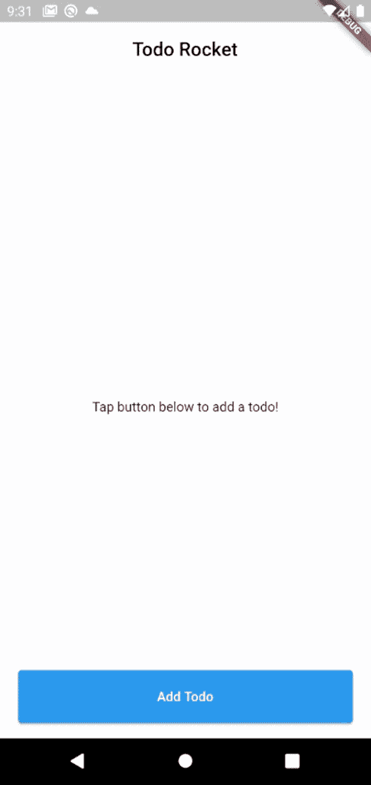

## 结论

你可以在这里找到[的开始和结束项目。在本教程中，您了解了](https://github.com/himanshusharma89/todorocket) [AWS Amplify](https://blog.logrocket.com/aws-amplify-a-review-of-advanced-features/) 以及如何轻松使用 DataStore 构建特色 CRUD 应用程序。然而，这只是开始，你可以从 AWS 文档这里了解更多关于认证、存储、函数、REST/graph QL API 和更多库[。](https://docs.amplify.aws/)

我们希望你喜欢这个教程。如果您有任何疑问，请随时联系我们。谢谢大家！