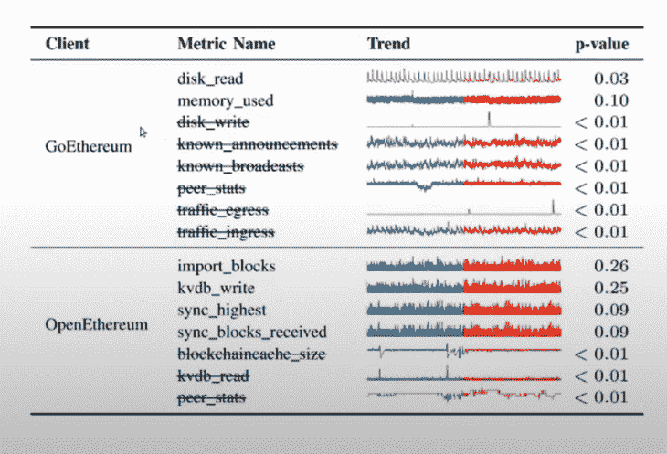

# 混沌工程和以太坊客户端测试

> 原文：<https://blog.logrocket.com/leveraging-chaos-engineering-test-ethereum-clients/>

本文提供了混沌工程原理的工作知识，讨论了它在软件开发中的应用，并探讨了如何将其应用扩展到区块链开发中。

本文的教程部分演示了如何使用 [ChaosETH](https://github.com/KTH/royal-chaos/tree/master/chaoseth) 框架利用混沌工程来测试以太坊客户端。这种策略有助于在智能合约被网络成员广泛采用之前识别该合约中的缺陷(有时称为“暗债”)。

## 内容

## 什么是混沌工程？

混沌工程是一种在分布式系统上进行实验的实践，目的是使分布式系统对生产环境中可能出现的混乱状况具有更强的弹性和容错能力。这个概念很容易追溯到网飞，在那里由 Casey Rosenthal 领导的团队负责测试软件可用性和系统弹性。

混沌工程有五个高级原则来指导混沌工程师。遵循这些原则来确保你正确地实践混沌工程:

1.  设置一个描述目标系统稳态行为的假设
2.  考虑现实世界的情况和事件
3.  在生产环境中执行实验，以建立对该环境的信心
4.  因为分布式系统很复杂，所以自动化实验可以连续运行
5.  最小化爆炸半径，防止实验影响客户

正如你所看到的，这些原则与传统的测试技术非常不同。

## 为什么混沌工程在区块链开发中有用？

区块链技术是分布式账本技术的子集，用于构建分布式去中心化应用。这种分布式状态是通过创建一个对等的节点网络来实现的，这些节点实际上是计算机。随着一个系统被越来越广泛地采用并连接到越来越多的计算机，它的复杂性也在增加。

> 如果你的电子邮件服务有问题，人们只会抱怨，没什么大不了的。但是，如果区块链有一个错误，人们可能会损失金钱。这才是严肃的。对区块链来说，安全和稳定是最重要的。它们是卡尔达诺的心脏。#卡尔达诺$阿达#阿达

由于操作系统过载、内存管理错误或网络分区，通过客户端的区块链上可能会出现故障和弱点。只有在提供重要资源的操作系统上才能部署以太坊客户端。

鉴于混沌工程非常适合分布式系统，它可以用于确保区块链(如以太网)上每个参与客户端的弹性。

以下是在设计将混沌工程原理注入区块链的实验时要记住的几点:

*   混沌工程实验应关注共识机制、网络、存储层、参与节点的识别和授权、智能契约、链上交互和治理
*   实验可以在开发和测试网上进行，但之后必须在生产中进行
*   当在生产中进行实验时，最小化爆炸半径是很重要的，因为这些应用会涉及金钱
*   了解类似的体系结构和已知的漏洞有助于在客户端应用程序上造成混乱

## 为什么选择以太坊客户端？

本文专门介绍如何将混沌工程整合到以太坊客户端应用程序中。然而，重要的是要注意，在 Web3 中注入混乱的概念适用于所有区块链的所有去中心化应用程序。

以太坊已经成为主要分散平台的运营支柱，并且:

*   比其他区块链国家采用率更高
*   非常活跃的开发者社区
*   易于访问的生产环境
*   与其他区块链相比更加简单

## 为一个完整的以太坊客户端实现混沌测试

在实时以太坊客户端上进行混沌测试的适当计划应该包括以下内容:

*   对将要测试的以太坊客户端的体系结构有全面的了解
*   规划要采用的系统模型
*   基于所采用的以太坊客户端处理以下内容:
    *   基于来自客户端的不正确回退设置的调用
    *   超时设置不正确
    *   弹性不足或不推荐使用的依赖项
    *   单点故障
    *   连锁故障

## 教程:用 Go-Ethereum 客户端进行混沌工程实验

在本教程中，我们将演示如何使用 ChaosETH，一个测量以太坊客户端在生产中的弹性的新框架，在 Go-Ethereum (Geth)客户端上执行混沌工程实验。

### 朝塞斯

ChaosETH 是由瑞典皇家理工学院的张龙和他的同事创造的。ChaosETH 旨在评估以太坊客户的弹性，从而使以太坊区块链更加可靠。通过操作，ChaosETH:

*   监控以太坊客户端以确定它们的稳态行为
*   主动在客户端注入系统调用错误
*   监控错误注入的结果行为
*   将结果行为与稳态行为进行比较
*   直接从生产中生成弹性报告

我们开始吧！

### 步骤 1:创建开发环境

选择一个你将托管虚拟机的云服务提供商，或者[安装并配置 Docker](https://blog.logrocket.com/docker-for-front-end-developers/) 。创建一个运行 Ubuntu as OS 的虚拟机实例，并打开端口号 30303。这是以太坊客户端监听的默认端口。

### 步骤 2:构建并运行目标以太坊客户端

接下来，抓取以太坊客户端的最新稳定版本。让我们从第[个客户端](https://geth.ethereum.org/docs/install-and-build/installing-geth)开始。

按照文档中提供的安装步骤构建客户端。混沌工程需要一些可观察性特性，因此你需要在 Geth 的文档度量支持中添加选项来激活监控特性。

根据您的操作系统或工具，安装 Geth 客户端的方法有很多种。在本文中，我们将使用 Docker，并在 shell 上运行该命令:

```
docker pull ethereum/client-go
# and running it with:\\
docker run -it -p 30303:30303 ethereum/client-go

```

### 步骤 3:为可观察性创建一个 Docker 容器

我们将使用 [InfluxDB](https://www.influxdata.com) 和 Geth 客户端来实现监控功能。使用以下命令:

```
docker run -p 8086:8086 -d --name influxdb -v influxdb:/var/lib/influxdb influxdb:1:8

```

现在，通过执行以下命令来配置 InfluxDB 容器:

```
docker exec -it influxdb bash

```

在容器内运行以下命令:

```
influx

```

接下来，在 InfluxDB shell 中执行这些命令:

```
CREATE DATABASE chaoseth
CREATE RETENTION POLICY "rp_chaoseth" ON "chaoseth" DURATION 999d REPLICATION 1 DEFAULT
CREATE USER geth WITH PASSWORD xxx WITH ALL PRIVILEGES

```

现在容器准备好了。您可以继续运行 Geth 客户机以及可观察性度量和其他选项。Geth 提供了超过 500 种不同的指标供我们选择。

客户端必须由 root 用户运行，即使它在之前的实验后重新启动。因此，`sudo`是 syscall 监控和错误注入器所必需的。

考虑到实例的额外磁盘空间，必须在命令中将数据目录指定为选项。如果不这样做，它将被保存到实例的操作系统驱动器中。

客户的对等点需要一致的配置，因此我们将指定对等点的目标数量；我们将使用`50`,因为这是 Geth 客户端的默认最大对等体数量。

可观察性度量包括在应用程序级监控中。

最后，您可以让 Geth 客户机在后台运行以释放终端，并且您可以将输出重定向到您喜欢的任何地方。

生成的命令将如下所示:

```
sudo nohup ./geth --datadir=/data/eth-data \\
  --maxpeers 50 \\
  --metrics --metrics.expensive \\
  --metrics.influxdb --metrics.influxdb.database DB_NAME --metrics.influxdb.username geth --metrics.influxdb.password DB_PASS \\
  >> geth.log 2>&1 &

```

### 步骤 4:同步客户端并观察指标

整个同步过程大约需要三天时间，并且可以在[https://ethernodes.org/](https://ethernodes.org/)上监控状态。

有一个`client_monitor.py`脚本，在部署时，它会在同步完成后观察客户端的稳态行为指标。以下命令将客户端监视器连接到进程，并在端口 8000 的 [Prometheus](https://prometheus.io) 中作为端点提供度量数据:

```
nohup sudo ./client_monitor.py -p CLIENT_PID -m -i 15 --data-dir=CLIENT_DATA_DIR >/dev/null 2>&1 &

```

要从 Prometheus 收集指标数据，请在您的`config`文件中包含以下脚本:

```
scrape_configs:
  - job_name: 'client_monitoring'
    static_configs:
      - targets: ['172.17.0.1:8000']

```

或者，您可以通过创建一个 [Grafana 仪表板](https://grafana.com/docs/grafana/latest/visualizations/)来可视化数据，比如:`./visualization/Grafana - Syscall Monitoring.json`文件。

原始实验中的稳态分析显示了在两个不同的监控会话期间捕获的数据的指标。



## 结论

混沌工程和区块链技术都是相对较新的技术，但它们的重要性已经被广泛采用所证明和验证。

在本文中，我们概述了混沌工程原理，介绍了 ChaosEth 框架，并展示了如何利用 ChaosETH 框架对 GETH 客户端进行弹性测试。

在以太坊客户端上实现混沌工程对于识别 DApp 或智能合约生命周期中可能发生的潜在故障至关重要。

## 加入像 Bitso 和 Coinsquare 这样的组织，他们使用 LogRocket 主动监控他们的 Web3 应用

影响用户在您的应用中激活和交易的能力的客户端问题会极大地影响您的底线。如果您对监控 UX 问题、自动显示 JavaScript 错误、跟踪缓慢的网络请求和组件加载时间感兴趣，

[try LogRocket](https://lp.logrocket.com/blg/web3-signup)

.

[](https://lp.logrocket.com/blg/web3-signup)[https://logrocket.com/signup/](https://lp.logrocket.com/blg/web3-signup)

LogRocket 就像是网络和移动应用的 DVR，记录你的网络应用或网站上发生的一切。您可以汇总和报告关键的前端性能指标，重放用户会话和应用程序状态，记录网络请求，并自动显示所有错误，而不是猜测问题发生的原因。

现代化您调试 web 和移动应用的方式— [开始免费监控](https://lp.logrocket.com/blg/web3-signup)。