# 在 React apps - LogRocket 博客中利用控制台 API

> 原文：<https://blog.logrocket.com/leveraging-the-console-api-in-react-apps-44df6d1ebeb2/>

# 在 React 应用中利用控制台 API

## 

2017 年 3 月 15 日 2 分钟阅读 740

大多数 JavaScript 开发人员都熟悉`console` API，尤其是`console.log()`。然而，有许多鲜为人知的控制台方法在开发和调试工作流中都非常有用。在这篇文章中，我将演示其中的一些方法，并展示它们在构建 React 应用程序时如何特别有用。

#### Console.time()

`time`方法允许您测量不同事件之间的时间:

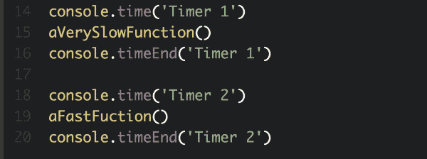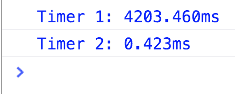

对于每个计时器，您可以指定一个名称(在本例中为“Timer 1”)，以便在控制台中查看结果。给定计时器的`console.time`和`console.timeEnd`不必在同一个闭包里——它们在你的应用程序中是全局的。如果您希望对跨不同 React 组件或 Redux 操作发生的事务进行计时，这是很有帮助的。例如，通过在 Redux 动作分派周围放置一个计时器，可以看到动作的效果在 UI 中传播需要多长时间。

在组件级别，`console.time`让您看到给定组件挂载和渲染大约需要多长时间:

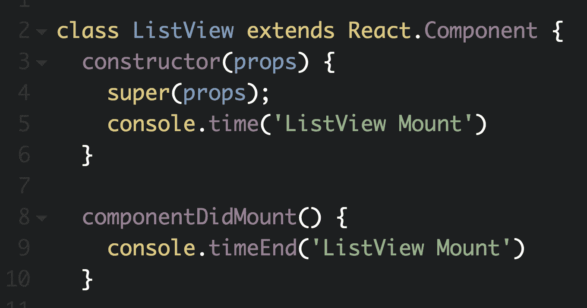

在这里，我们在组件的`constructor`中启动计时器，并在`componentDidMount`中结束它，它为第一个挂载+渲染周期计时。

#### Console.count()

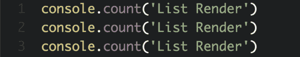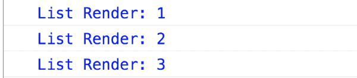

`console.count()`是一个恰当命名的计算给定值的方法。这不需要过多的解释，但是我会注意到它有助于计算组件的`render`方法被调用的次数。这在调试性能问题时非常有用，并且不需要手动计算组件的 render 方法中打印了多少次`console.log()`。

#### Console.group()

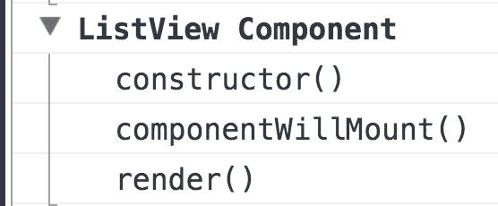

`console.group()`允许您在控制台的可扩展选项卡下将日志分组。这有助于将相关日志放在一起，而不会让控制台变得太嘈杂。

添加一个`console.group()`语句后，所有后续的日志语句都放在组标题下。要停止在组中放置日志，只需添加`console.groupEnd()`。

上面的输出对应于在 React 组件的构造函数中启动一个控制台组:`console.group('ListView Component')`。每个后续日志只是各自生命周期方法中的一个`console.log()`语句。将日志分组到单个组件中有助于保持控制台的整洁，并且更容易找到与感兴趣的组件相关联的日志。

#### 通过 LogRocket 使用控制台 API

在过去，控制台 API 主要在开发过程中使用，但是随着生产前端日志记录工具的流行，如 [LogRocket](https://logrocket.com) 捕获所有控制台输出，在前端代码中有策略地放置日志语句已经成为越来越普遍的做法。这在许多情况下是有帮助的。

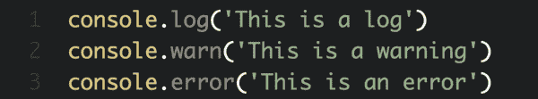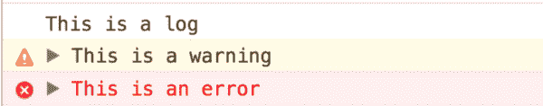

当试图理解一个 bug 报告时，知道 bug 发生前给定变量的值通常是有帮助的。在该变量周围添加一个日志语句(例如`console.log('EVENT_COUNT', eventCount)`)意味着下一次出现 bug 时，该变量的值将被捕获到日志中。

虽然错误报告工具(如 Sentry、BugSnag 等)对于捕获异常非常有用，但通常会出现一些“软”错误，不值得全面警惕。一个例子可能是应用程序的意外状态，或者是*不应该*发生但不是显式错误的边缘情况。对于这些情况，使用`console.warn`和`console.error`来表示条件会有所帮助。然后，在调查错误报告时，您可以查看会话日志，看看是否出现了任何这样的警告或错误。LogRocket 还允许您搜索所有*会话的日志，因此您可以回答诸如“这个边缘情况实际上发生了多少次”之类的问题！*

#### 额外收获:控制台风格的乐趣

如果你曾经打开过 facebook.com 的控制台，你会看到他们警告不要在控制台上粘贴可疑的 JavaScript。

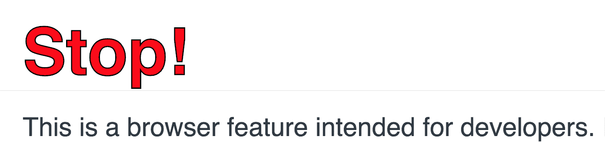

为了达到这种效果，他们使用了`%c`操作符，当它被添加到一个记录的字符串中时，应用来自下一个参数的 CSS。

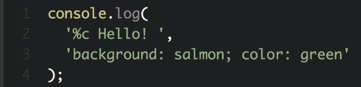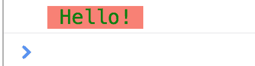

除了这种类型的警告，我不知道这个 API 有太多的用例，但是如果你已经找到了一种创造性的使用方法，请在评论中说出来🙂

#### 进一步阅读

使用 LogRocket 消除传统反应错误报告的噪音

## 是一款 React analytics 解决方案，可保护您免受数百个误报错误警报的影响，只针对少数真正重要的项目。LogRocket 告诉您 React 应用程序中实际影响用户的最具影响力的 bug 和 UX 问题。

[LogRocket](https://lp.logrocket.com/blg/react-signup-issue-free)

自动聚合客户端错误、反应错误边界、还原状态、缓慢的组件加载时间、JS 异常、前端性能指标和用户交互。然后，LogRocket 使用机器学习来通知您影响大多数用户的最具影响力的问题，并提供您修复它所需的上下文。

  [LogRocket](https://lp.logrocket.com/blg/react-signup-issue-free)

关注重要的 React bug—[今天就试试 LogRocket】。](https://lp.logrocket.com/blg/react-signup-issue-free)

Focus on the React bugs that matter — [try LogRocket today](https://lp.logrocket.com/blg/react-signup-issue-free).