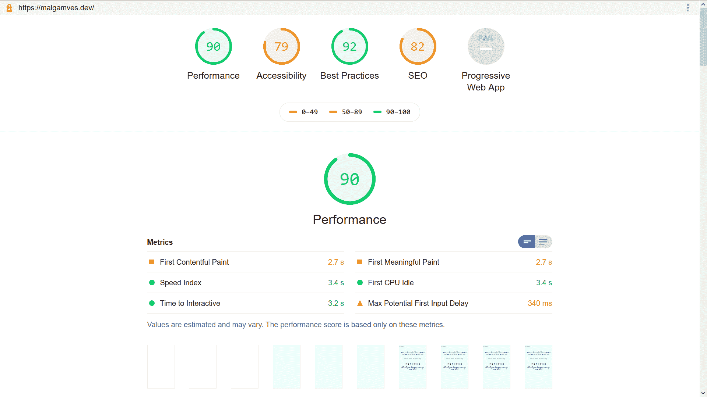

# 灯塔和如何更有效地使用它

> 原文：<https://blog.logrocket.com/lighthouse-and-how-to-use-it-more-effectively/>

性能和可用性已经慢慢成为大多数公司的头等大事，因为它们都对用户体验有着巨大的影响。可以理解的是，对两者进行测试并优化以提高它们已经成为任何基于 web 的应用程序成功的关键。

在测试端， [Lighthouse](https://developers.google.com/web/tools/lighthouse/) 因其易用性和(现在的)多功能性而成为一个受欢迎的选择。Lighthouse 是 Google 创建的一个开源工具，用于执行大量被称为审计的测试，目的是提高网站性能和可用性。

它被大多数前端 web 开发社区用作评估网页和应用程序的各种性能和可用性指标的基线。它的审计包括通过一个弱的模拟 3G 连接加载你的网络应用程序，同时在一个慢速设备上查看它。

它还模拟数据包丢失以及网络和 CPU 节流。然后，它会创建一份关于应用程序或页面运行情况的报告。审计的指标是性能、搜索引擎优化、最佳实践、渐进式网络应用和可访问性。

## 运行审计

Lighthouse 给了我们很多工作流程供我们选择。这样，我们可以选择一个最适合我们的，并用它来运行审计。

在 web.dev 上运行 Lighthouse，无需安装任何东西即可获得报告:

通过命令行运行 Lighthouse:

> 你需要在你的设备上安装谷歌浏览器

*   安装当前长期支持版本的[节点](https://nodejs.org)
*   安装 light house(`-g`标志将其安装为全局模块):
    `npm install -g lighthouse`
*   `Run an audit with `lighthouse <url>``

 `*注意:*使用`lighthouse --help`进入更多选项。

通过 Chrome DevTools 运行 Lighthouse(对需要认证的页面有用):

> 你需要在你的设备上安装谷歌浏览器

*   在谷歌浏览器中，转到你想审计的网址
*   打开 Chrome DevTools (Windows: F12 键，或者 Control+Shift+I & Mac:Command+Option+I)
*   单击审计选项卡
*   单击 Perform an audit(执行审计)(您应该会看到一个审计类别列表，勾选需要的类别)
*   单击运行审计

从浏览器扩展运行 Lighthouse:

*   下载并安装 [Firefox](https://addons.mozilla.org/en-US/firefox/addon/google-lighthouse/) 或 [Chrome](https://chrome.google.com/webstore/detail/lighthouse/blipmdconlkpinefehnmjammfjpmpbjk?hl=en) Lighthouse 扩展
*   转到要审计的页面
*   单击地址栏旁边的灯塔图标(单击后，灯塔菜单会展开)
*   单击生成报告
*   Lighthouse 针对当前聚焦的页面运行审计，然后打开一个新的选项卡，显示结果报告

使用上面提到的任何一种方法，在运行审计之后，您应该会得到如下所示的报告:

> 这是我在我的网站——malgamves . dev 上运行的一个测试(显然我还有一些工作要做。)

您会注意到，对于我在开头段落中提到的每个指标，我们都会得到几个分数。这些都在 0-100 的范围内，使得确定一个网站是否比它以前的版本“更好”变得更加容易。

这里的目标是通过对给你的反馈采取行动来提高你的分数。

机会是你可以用来提高你的网站性能的建议。让我们更深入地了解这些指标。

### 表演

Lighthouse 对性能的看法主要集中在用户对速度的感知(事物在屏幕上显示的速度)而不是实际速度。它对照以下指标进行检查:[第一个有意义的绘制](https://developers.google.com/web/tools/lighthouse/audits/first-contentful-paint?utm_source=lighthouse&utm_medium=cli)、[速度指数](https://developers.google.com/web/tools/lighthouse/audits/speed-index?utm_source=lighthouse&utm_medium=cli)、[交互时间](https://developers.google.com/web/tools/lighthouse/audits/time-to-interactive?utm_source=lighthouse&utm_medium=cli)、[第一个有意义的绘制](https://developers.google.com/web/tools/lighthouse/audits/first-meaningful-paint?utm_source=lighthouse&utm_medium=cli)、[第一个 CPU 空闲](https://developers.google.com/web/tools/lighthouse/audits/first-cpu-idle?utm_source=lighthouse&utm_medium=cli)，以及[最大潜在第一个输入延迟](https://developers.google.com/web/updates/2018/05/first-input-delay?utm_source=lighthouse&utm_medium=cli)。

这些在使事物尽可能快地出现在屏幕上起着巨大的作用，从而提高了用户对应用程序速度的感知。

### 搜索引擎优化

Lighthouse 将检查您的网页是否针对搜索引擎结果排名进行了优化。它检查一些 SEO 最佳实践，比如文档是否使用清晰的字体大小，是否有有效的 robots.txt 文件，以及是否使用页面标签和状态代码。

大多数 SEO 测试都是非常基础的，所以你不要依赖 Lighthouse 作为你的搜索引擎优化工具。值得注意的是，Lighthouse 团队正在致力于扩展和改进 SEO 审计。

### 最佳实践

为此，Lighthouse 会检查您的网页，以确保它们遵循标准的网络最佳实践。其中包括检查应用程序是否没有错误记录到控制台，是否避免了废弃的 API，是否可以通过 HTTPS 访问页面，应用程序缓存是否有效，是否请求了地理位置访问，以及图像是否以正确的纵横比显示。

### 易接近

对于这个审计，Lighthouse 检查您的 web 应用程序的可访问性。

它检查图像元素是否有`alt`属性，`<html>`元素是否有`lang`属性，文档是否有`<title>`元素，背景和前景色是否有足够的对比度，链接名称是否有效，以及 viewport 是否是可缩放的。

### 渐进式 Web 应用程序

Lighthouse 会根据一套定义渐进式网络应用的标准来检查你的网页。

这种特殊的审核不会给你的页面打分，而是根据你的页面是否符合标准来决定是通过还是失败，比如你的应用程序是否将 HTTP 重定向到 HTTPS、响应代码、3G 快速加载、闪屏、视窗等。

值得注意的是(在我写这篇文章的时候)很快 Lighthouse 给网页评分的方式将会有一个重大的改变。因此，如果你使用任何基于 Lighthouse 的第三方测试，请确保它们更新到 Lighthouse 6。

这篇[博客文章](https://calibreapp.com/blog/lighthouse-changes-scoring-algorithm)很好地总结了将要发生的变化。我还建议看看[的变更日志](https://github.com/GoogleChrome/lighthouse/blob/v6.0.0-beta.0/changelog.md#600-beta0-2020-03-11)，看看会有什么变化。

> 有一个非常酷的[网络应用](https://paulirish.github.io/lh-scorecalc/)你可以看看在主要更新前后的审计分数。

## 有效使用灯塔

现在，我们对什么是灯塔测试、我们如何进行测试以及审计报告和分数的含义有了总体的了解。值得一提的是，本文的重点是分享一些您和您的团队可以充分利用 Lighthouse 测试的方法。

### 将 Lighthouse 添加到您的项目配置项

在大多数开发场景中，您有一个团队通过某种版本控制(通常是 Git)为项目做贡献。这意味着您的应用程序有很多变化，这些变化可能会对您的 Lighthouse 审计分数产生负面影响。

* * *

### 更多来自 LogRocket 的精彩文章:

* * *

记住，目标是保持和提高。这就是为什么 Lighthouse 正慢慢成为许多前端团队 CI 的核心部分，人们在继续创建网页时选择运行 Lighthouse 驱动的开发风格。

Lighthouse CI 可以添加到您的项目报告中，这样您就可以在合并可能影响您的应用程序总体分数的各种贡献者的更改之前，跟踪过去和现在的测试分数。

### 多走一步，注意可选的提示

运行完 Lighthouse 测试后，您会得到一些有助于提高分数的建议。

在这些建议之后是一些不一定会提高你分数的可选提示，因为它们不会被自动测试。

然而，运行手动测试并修复它们肯定会带来更好的用户体验。例如，当谈到可访问性时，并不是所有的指针都能在报告中找到，但是参考指南[手动可访问性](https://developers.google.com/web/fundamentals/accessibility?utm_source=lighthouse&utm_medium=lr)测试使你的应用程序更容易访问。

类似地，对于渐进式网络应用程序，我们有一个[清单](https://developers.google.com/web/progressive-web-apps/checklist?utm_source=lighthouse&utm_medium=lr)，其中包含一些自动化测试报告中没有涵盖的项目，这将带来更好的体验。细节决定成败，所以多做一点，运行一些可选的手动测试。

### 知道它的局限性

把灯塔作为指路明灯，而不是宇宙真理的来源。值得注意的是，Lighthouse 并不是 web 标准的圣杯，但它可以接近。

这篇名为[建造一个最难接近的网站，并有一个完美的灯塔评分](https://www.matuzo.at/blog/building-the-most-inaccessible-site-possible-with-a-perfect-lighthouse-score/)的文章很好地总结了这个信息。

使用像 Lighthouse 这样的自动化工具是一个很好的方式来开始你的旅程，让你的网站表现更好，更容易访问。

但正如它的名字所暗示的，它不是目的地。当你迷失在现代 web 应用程序开发的波涛汹涌的大海中时，它只是一个帮助你的工具。它为您提供了行动指南，并帮助您朝着行业最佳实践的正确方向前进。重要的是不要迷路。

### 消除第三方干扰

我记得我运行了一个 Lighthouse 测试，得到了这个警告: **Chrome 扩展对这个页面的加载性能产生了负面影响。尝试在匿名模式下或从没有扩展的 Chrome 配置文件中审计页面。**

我运行了一个`ad-blocker`和几个其他的扩展来阻止某些网站在我上网时跟踪我的活动。有时，这意味着我无法从谷歌获得一些字体，也无法访问 CDN 上的内容。

不管是什么，如果你使用浏览器来运行你的 Lighthouse 测试，在匿名模式下运行它们，以获得更准确的结果。

### 更新！更新！更新！然后测试

大多数 Lighthouse 的更新都只是对评分做了微小的改动，只有很少一部分是非常重大的改动。保持更新并确保团队中的每个人都使用相同的版本可以帮助避免不一致和最终糟糕的 web 体验。

请记住，不同的 Lighthouse 工作流更新方式不同——默认情况下扩展是自动更新的，只有在更新 Chrome 时才会更新 DevTools 版本。

同样重要的是要记住，许多非官方或第三方测试需要一段时间才能更新到最新的标准。Lighthouse 可能在你上次报告后已经更新了，所以一定要经常查看变更日志。

### 结论

希望这能让你更好地了解如何更有效地使用 Lighthouse！请在 [Twitter](https://twitter.com/malgamves) 上与我分享你的灯塔评分。

让我们为每个人创造一个更快、更易访问、更愉快的网络体验。

测试愉快！保重，保持安全

## 灯塔，但对你所有的用户

随着 web 前端变得越来越复杂，资源贪婪的特性对浏览器的要求越来越高。如果您对监控前端性能和生产中所有用户的性能感兴趣，请尝试 LogRocket 。[https://logrocket.com/signup/](https://logrocket.com/signup/)

LogRocket 就像是网络应用的 DVR，记录你的网络应用或网站上发生的一切。您可以汇总和报告关键的前端性能指标，重放用户会话和应用程序状态，记录网络请求，并自动显示所有错误，而不是猜测问题发生的原因。

现代化您调试 web 应用的方式— [开始免费监控](https://logrocket.com/signup/)。`