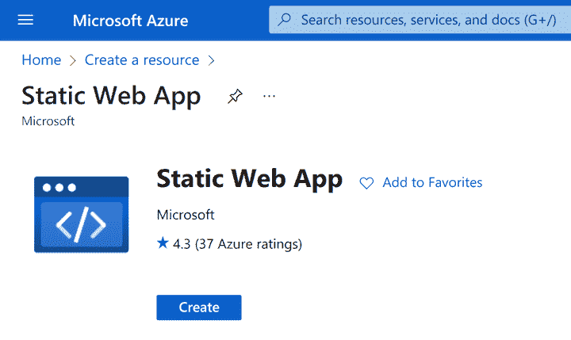
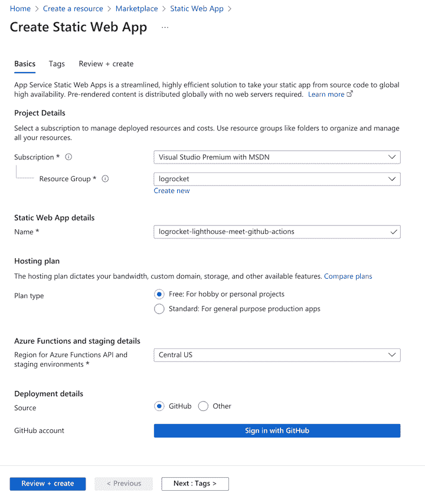
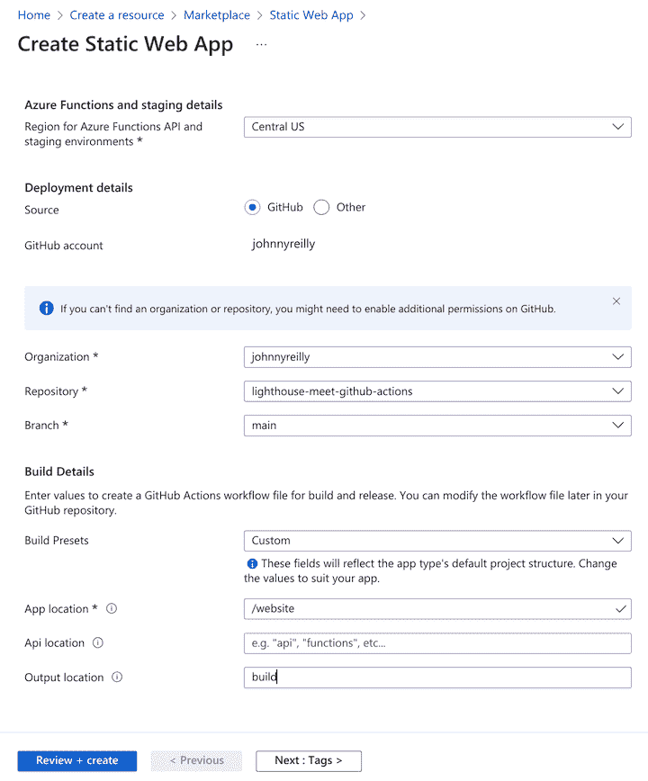
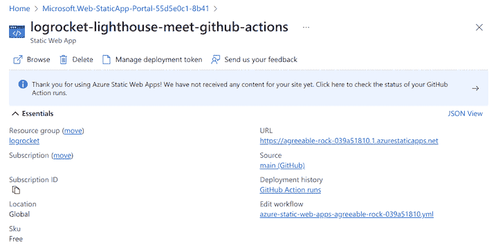
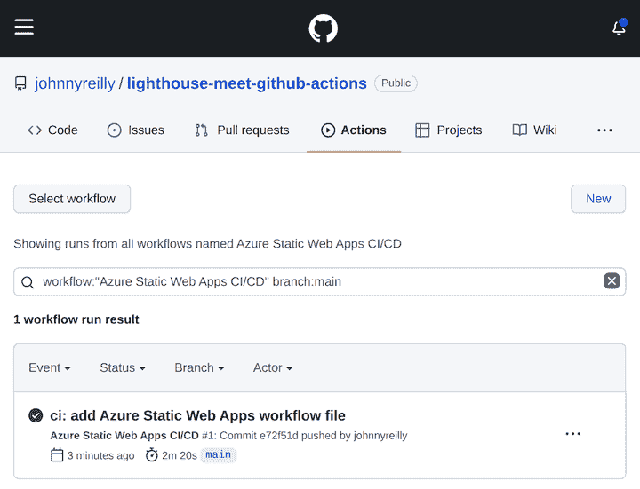
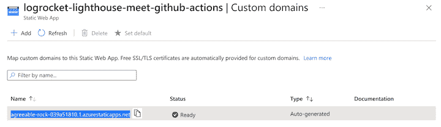
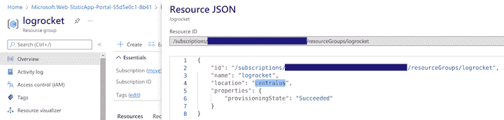
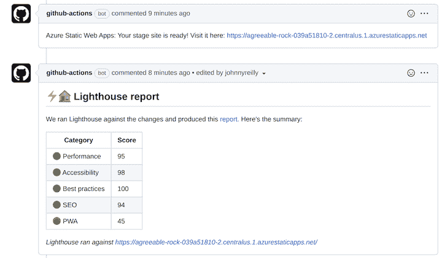
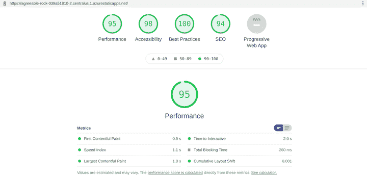

# Lighthouse 遇见 GitHub Actions:如何在 CI - LogRocket 博客中使用 Lighthouse

> 原文：<https://blog.logrocket.com/lighthouse-meets-github-actions-use-lighthouse-ci/>

Lighthouse 是一个审计网站性能和可用性的强大工具。与其手动执行这些审计，不如将它插入到您的 CI 管道中。这篇文章展示了如何将 Lighthouse 集成到 GitHub Actions 工作流中，并直接在 pull 请求中报告结果。

这篇文章不是如何有效使用 Lighthouse 的演练。关于这个话题已经有了很好的指导。

相反，我们将在 GitHub repo 的上下文中构建一个简单的 web 应用程序。我们将把它连接起来，通过 [GitHub Actions](https://github.com/actions) 部署到 [Azure Static Web Apps](https://azure.microsoft.com/en-us/services/app-service/static/) 。

静态 Web 应用程序是静态网站的免费托管选项。它带有内置的[准备环境](https://docs.microsoft.com/en-us/azure/static-web-apps/review-publish-pull-requests)或部署预览。该特性在每次提出拉请求时部署一个站点的全功能版本，构建在该拉请求中实现的更改的基础上。

登台环境是实现我们的灯塔检查的完美场所。如果拉请求影响可用性或性能，那么在拉请求的上下文中看到这些细节正是我们想要了解的。这种检查让我们有机会确保只有当我们满意这些变化不会对我们的 Lighthouse 分数产生负面影响时才进行合并。

在本教程中，我们将从一个空的 GitHub repo 开始，并在此基础上进行构建。

## 创建 Docusaurus 站点

在我们的库的根目录中，我们将创建一个 [Docusaurus 站点](https://docusaurus.io/)。Docusaurus 是静态站点的一个很好的例子，这种静态站点非常适合 Jamstack。如果你愿意，你可以用其他的，比如[雨果](https://gohugo.io/)。

在命令行中，我们将输入:

```
npx [email protected] website classic

```

Docusaurus 将在`website`目录中创建一个新站点。让我们承诺并推动此事，并将我们的注意力转向 Azure。

## 在 Azure 中创建静态 Web 应用程序

有很多方法可以在 Azure 中[创建一个静态 web 应用。有可能用像](https://blog.logrocket.com/azure-static-web-apps-netlify-alternative/) [Bicep](https://blog.johnnyreilly.com/2021/08/15/bicep-azure-static-web-apps-azure-devops#bicep-template) 这样的语言将基础设施作为代码使用。但是对于本教程，我们将使用 [Azure 门户](https://portal.azure.com)来代替。如果您还没有帐户，您可以很快免费注册一个。

登录后，点击**创建资源**并查找**静态 Web 应用**:



点击**创建**，你将进入创建对话框:



您需要为您的 SWA 创建一个资源组。给 app 起个名字，选择免费计划，指定 GitHub 作为部署源。

点击**使用 GitHub** 按钮登录，并授权 Azure 访问您的 GitHub 静态 Web 应用帐户。



此时，Azure 将代表您查询 GitHub，并查找您有权访问的组织和存储库。选择要部署到静态 web 应用程序的存储库，并选择要部署的分支。

你还需要向 Azure 提供一些构建细节，帮助它理解你的应用是如何构建的。我们将提供一个预置的**自定义**。我们将把**应用程序位置**(我们前端应用程序的根)设置为`"/website"`，以符合我们刚刚创建的应用程序。我们将把 **Api 位置**留空，并将输出位置设置为`"build"`。这是`website`下的目录，Docusaurus 将在这里创建我们的站点。

最后，点击**审核+创建**，然后点击**创建**。

Azure 现在将:

*   在 Azure 中创建 Azure 静态 Web 应用程序资源
*   更新您的存储库以添加 GitHub 操作工作流来部署您的静态 web 应用程序
*   开始 GitHub Actions 工作流的第一次运行，以部署您的 SWA

很神奇，对吧？

当您查看 Azure 中的资源时，它看起来像这样:



如果您点击 GitHub 操作运行，您将看到您的 GitHub 操作:



运行完成后，您可以通过点击 Azure 门户中的 URL 来查看您部署的静态 web 应用程序:


我们现在有:

*   包含简单 web 应用程序的 GitHub repo
*   一个 GitHub Actions 工作流，部署到 Azure 静态 Web 应用程序，并为拉请求提供一个临时环境

## 准备插入 Lighthouse

有了这些基础，我们就可以将 Lighthouse 添加到这个组合中了。

如果您在 repo 的`/.github/workflows`文件夹中查找，您会发现一个工作流文件，其中包含如下内容:

```
name: Azure Static Web Apps CI/CD

on:
  push:
    branches:
      - main
  pull_request:
    types: [opened, synchronize, reopened, closed]
    branches:
      - main

jobs:
  build_and_deploy_job:
    if: github.event_name == 'push' || (github.event_name == 'pull_request' && github.event.action != 'closed')
    runs-on: ubuntu-latest
    name: Build and Deploy Job
    steps:
      - uses: actions/[email protected]
        with:
          submodules: true
      - name: Build And Deploy
        id: builddeploy
        uses: Azure/[email protected]
        with:
          azure_static_web_apps_api_token: ${{ secrets.AZURE_STATIC_WEB_APPS_API_TOKEN_AGREEABLE_ROCK_039A51810 }}
          repo_token: ${{ secrets.GITHUB_TOKEN }} # Used for Github integrations (i.e. PR comments)
          action: 'upload'
          ###### Repository/Build Configurations - These values can be configured to match your app requirements. ######
          # For more information regarding Static Web App workflow configurations, please visit: https://aka.ms/swaworkflowconfig
          app_location: '/website' # App source code path
          api_location: '' # Api source code path - optional
          output_location: 'build' # Built app content directory - optional
          ###### End of Repository/Build Configurations ######

  close_pull_request_job:
    if: github.event_name == 'pull_request' && github.event.action == 'closed'
    runs-on: ubuntu-latest
    name: Close Pull Request Job
    steps:
      - name: Close Pull Request
        id: closepullrequest
        uses: Azure/[email protected]
        with:
          azure_static_web_apps_api_token: ${{ secrets.AZURE_STATIC_WEB_APPS_API_TOKEN_AGREEABLE_ROCK_039A51810 }}
          action: 'close'

```

这是我们在 Azure 中建立 SWA 时为我们创建的。现在我们将更新内容以添加一些 Lighthouse 作业。

在此之前，我们需要获得两样东西:

1.  我们静态 web 应用程序的自定义域
2.  SWA 所在的资源组的位置

这两条信息是必需的，这样我们才能确定我们的登台环境的 URL。

### 自定义域

我们在 Azure 门户的**自定义域**屏幕中获取静态 web 应用的自定义域:



自定义域是自动生成的自定义域(在上面的屏幕截图中突出显示)。对于我们在这里构建的 SWA，定制域是`agreeable-rock-039a51810.1.azurestaticapps.net`。

### 位置

我们通过查看 Azure 门户中的资源组来获取位置。对于我们一直在建设的西南威尔士州，位置是“美国中部”然而，我们想要的不是位置的“显示名称”变量，而是将在 URL 中使用的“代码”。你可以通过点击 Azure 门户中的 **JSON 视图**来查看这是什么:



正如上面的截图所示，我们需要的代码是`centralus`。

## 插入灯塔

我们现在有了插入 Lighthouse 所需的一切。让我们创建一个分支:

```
git checkout -b lighthouse

```

我们将向 GitHub Actions 工作流文件添加一个新的`Lighthouse report`作业:

```
lighthouse_report_job:
  name: Lighthouse report
  if: github.event_name == 'pull_request' && github.event.action != 'closed'
  runs-on: ubuntu-latest
  steps:
    - uses: actions/[email protected]

    - name: Static Web App - get preview URL
      id: static_web_app_preview_url
      uses: azure/[email protected]
      with:
        inlineScript: |
          CUSTOM_DOMAIN='agreeable-rock-039a51810.1.azurestaticapps.net'
          LOCATION='centralus'

          PREVIEW_URL="https://${CUSTOM_DOMAIN/.[1-9]./-${{github.event.pull_request.number }}.$LOCATION.1.}"

          echo "::set-output name=PREVIEW_URL::$PREVIEW_URL"

    - name: Static Web App - wait for preview
      id: static_web_app_wait_for_preview
      uses: nev7n/[email protected]
      with:
        url: '${{ steps.static_web_app_preview_url.outputs.PREVIEW_URL }}'
        responseCode: 200
        timeout: 600000
        interval: 1000

    - name: Audit URLs using Lighthouse
      id: lighthouse_audit
      uses: treosh/[email protected]
      with:
        urls: |
          ${{ steps.static_web_app_preview_url.outputs.PREVIEW_URL }}
        configPath: ./.github/workflows/lighthousesrc.json
        uploadArtifacts: true
        temporaryPublicStorage: true
        runs: 5

    - name: Format lighthouse score
      id: format_lighthouse_score
      uses: actions/[email protected]
      with:
        script: |
          const lighthouseCommentMaker = require('./.github/workflows/lighthouseCommentMaker.js');

          const lighthouseOutputs = {
            manifest: ${{ steps.lighthouse_audit.outputs.manifest }},
            links: ${{ steps.lighthouse_audit.outputs.links }}
          };

          const comment = lighthouseCommentMaker({ lighthouseOutputs });
          core.setOutput("comment", comment);

    - name: Add Lighthouse stats as comment
      id: comment_to_pr
      uses: marocchino/[email protected]
      with:
        GITHUB_TOKEN: ${{ secrets.GITHUB_TOKEN }}
        number: ${{ github.event.pull_request.number }}
        header: lighthouse
        message: ${{ steps.format_lighthouse_score.outputs.comment }}

```

在这个工作流程中发生了很多事情。让我们穿过它们。

### 静态 Web 应用程序:获取预览 URL

这里，我们使用以下代码构造静态 web 应用程序的预览 URL:

*   自定义域
*   位置
*   拉取请求编号(例如，123)

给定一个定制域`agreeable-rock-039a51810.1.azurestaticapps.net`，一个位置`centralus`，以及一个拉请求号`123`，预览 URL 将是`agreeable-rock-039a51810-123.centralus.1.azurestaticapps.net`。使用一点 Bash 魔法，我们创建一个包含该值的名为`PREVIEW_URL`的输出变量。我们稍后将在工作流中重用它。

* * *

### 更多来自 LogRocket 的精彩文章:

* * *

### 静态 Web 应用程序:等待预览

我们不想在静态 web 应用程序启动并运行之前运行我们的测试，所以我们将引入 [`wait_for_response`](https://github.com/nev7n/wait_for_response) GitHub 动作。这种轮询一直持续到网站返回一个`200`。我们要把它指向我们的 SWA。

### 使用 Lighthouse 审计 URL

重要的时刻已经到来！我们将使用 GitHub 动作 [`lighthouse-ci-action`](https://github.com/treosh/lighthouse-ci-action) 将 Lighthouse 插入到我们的工作流中。

我们提供了一个`configPath: ./.github/workflows/lighthousesrc.json`，它指向配置 Lighthouse 配置的文件。我们也将创建该文件，并用以下内容填充它:

```
{
  "ci": {
    "collect": {
      "settings": {
        "configPath": "./.github/workflows/lighthouse-config.js"
      }
    }
  }
}

```

这反过来将具体的配置交给了一个`lighthouse-config.js`文件，我们也需要创建这个文件:

```
// see https://github.com/GoogleChrome/lighthouse/blob/master/docs/configuration.md
module.exports = {
  extends: 'lighthouse:default',
  settings: {
    // audits can be found here:
    // https://github.com/GoogleChrome/lighthouse/blob/eba2a4d19c5786dc37e993858ff4b663181f81e5/lighthouse-core/config/default-config.js#L174
    skipAudits: [
      'canonical', // for staging sites this will always be incorrect
      'maskable-icon',
      'valid-source-maps',
      'unsized-images',
      'offline-start-url',
    ],
  },
};

```

上面的配置可以根据评论中的不同链接进行修改。一般来说，使用默认值是个好主意。然而，跳过`canonical`审计是明智的，因为它对于暂存站点肯定是不正确的。

除了 Lighthouse 配置，还有 GitHub 动作本身的配置:

*   `uploadArtifacts: true`–将结果保存为一个动作工件
*   `temporaryPublicStorage: true`–将灯塔报告上传到临时存储器
*   `runs: 5`–将运行 Lighthouse 5 次，以获得更可靠的性能结果

### 格式化灯塔乐谱

我们已经运行了灯塔。接下来，我们希望获得运行的结果并构建一些文本，我们可以将这些文本作为注释添加到我们的 pull 请求中。

为此，我们将使用 [`github-script`](https://github.com/actions/github-script) GitHub 动作，获取上一步的输出，并调用我们要编写的`lighthouseCommentMaker.js`文件，以生成我们要发布到 PR 的评论:

```
// @ts-check

/**
 * @typedef {Object} Summary
 * @prop {number} performance
 * @prop {number} accessibility
 * @prop {number} best-practices
 * @prop {number} seo
 * @prop {number} pwa
 */

/**
 * @typedef {Object} Manifest
 * @prop {string} url
 * @prop {boolean} isRepresentativeRun
 * @prop {string} htmlPath
 * @prop {string} jsonPath
 * @prop {Summary} summary
 */

/**
 * @typedef {Object} LighthouseOutputs
 * @prop {Record<string, string>} links
 * @prop {Manifest[]} manifest
 */

const formatScore = (/** @type { number } */ score) => Math.round(score * 100);
const emojiScore = (/** @type { number } */ score) =>
  score >= 0.9 ? '🟢' : score >= 0.5 ? '🟠' : '🔴';

const scoreRow = (
  /** @type { string } */ label,
  /** @type { number } */ score
) => `| ${emojiScore(score)} ${label} | ${formatScore(score)} |`;

/**
 * @param {LighthouseOutputs} lighthouseOutputs
 */
function makeComment(lighthouseOutputs) {
  const { summary } = lighthouseOutputs.manifest[0];
  const [[testedUrl, reportUrl]] = Object.entries(lighthouseOutputs.links);

  const comment = `## ⚡️🏠 Lighthouse report

We ran Lighthouse against the changes and produced this [report](${reportUrl}). Here's the summary:

| Category | Score |
| -------- | ----- |
${scoreRow('Performance', summary.performance)}
${scoreRow('Accessibility', summary.accessibility)}
${scoreRow('Best practices', summary['best-practices'])}
${scoreRow('SEO', summary.seo)}
${scoreRow('PWA', summary.pwa)}

*Lighthouse ran against [${testedUrl}](${testedUrl})*
`;

  return comment;
}

module.exports = ({ lighthouseOutputs }) => {
  return makeComment(lighthouseOutputs);
};

```

上面的代码获取 Lighthouse 的输出，并创建一些 Markdown 来表示结果。它还使用了一些不错的表情符号。

令人惊奇的是，我们可以完全自由地对其进行定制；只是代码而已！重要的是最后抽出一根弦。

最后，我们准备将评论添加到 PR 中。我们将使用 GitHub 的 [`sticky-pull-request-comment`](https://github.com/marocchino/sticky-pull-request-comment) 动作来实现。我们传入在上一步中刚刚做的注释，以及一些其他参数，这将把注释写入 PR。

## 把所有的放在一起

当我们提交我们的更改并提出一个 pull 请求时，我们看到我们的 GitHub 动作运行。一旦完成，我们就会看到一个灯塔报告被附加到我们的拉取请求中:



你也可以点击评论中的链接直接进入完整的报告。



现在，随着每一个 PR 的提出，任何性能上的倒退都可以在客户体验到之前观察到并解决。

## 使用 [LogRocket](https://lp.logrocket.com/blg/signup) 消除传统错误报告的干扰

[](https://lp.logrocket.com/blg/signup)

[LogRocket](https://lp.logrocket.com/blg/signup) 是一个数字体验分析解决方案，它可以保护您免受数百个假阳性错误警报的影响，只针对几个真正重要的项目。LogRocket 会告诉您应用程序中实际影响用户的最具影响力的 bug 和 UX 问题。

然后，使用具有深层技术遥测的会话重放来确切地查看用户看到了什么以及是什么导致了问题，就像你在他们身后看一样。

LogRocket 自动聚合客户端错误、JS 异常、前端性能指标和用户交互。然后 LogRocket 使用机器学习来告诉你哪些问题正在影响大多数用户，并提供你需要修复它的上下文。

关注重要的 bug—[今天就试试 LogRocket】。](https://lp.logrocket.com/blg/signup-issue-free)