# Unity 中的照明基础知识

> 原文：<https://blog.logrocket.com/lighting-basics-unity/>

在 Unity 中照明可能会令人生畏，因为根据你想要的结果，有太多的方法来照亮你的游戏。从光照贴图到点光源和聚光灯，很难决定在游戏中使用哪一种。

虽然 Unity 可以很容易地在你的游戏场景中放置动态灯光，并使你的游戏看起来很棒，但当你在 Unity 的许多灯光类型中进行选择时，会变得有点复杂，每种类型都有独特的属性和效果。

这篇文章将涵盖 Unity 中照明的基础知识，并帮助你踏上掌握 Unity 的旅程。事不宜迟，让我们直接开始吧。

在本文中:

## 先决条件

本文假设读者至少对 Unity 有一个基本的了解和经验，尽管如果你是 Unity 的新手，它仍然有价值。如果你是新手，你可以在这里下载 Unity。

## 直接照明和间接照明

要理解 Unity 中的照明，首先要理解直接光和间接光的概念。

在 Unity 中，直射光是零反射或一次反射的光。直接照明主要是在直视光源或凝视直接接收光源的物体时观察到的。

另一方面，间接照明是在到达观察者的眼睛之前有两次或更多次反弹的光。这是两种灯光类型的图片描述。

在 Unity 中，具有四次以上反弹的间接光称为全局照明(GI)。GI 是一个模拟一个表面的光如何影响另一个表面的系统，它是 Unity 照明的重要组成部分，有助于给场景一个真实的外观。

你可以通过进入**窗口** > **渲染** > **灯光** > **光照图** **设置**来设置和控制场景中的反弹次数。

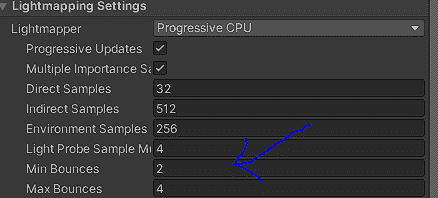

现在我们了解了 Unity 中的直接光和间接光是什么，让我们看看游戏引擎中不同的光类型。

## 统一中的光类型

统一中有四种类型的光。要访问它们，你所要做的就是右击你的层级。它看起来是这样的:

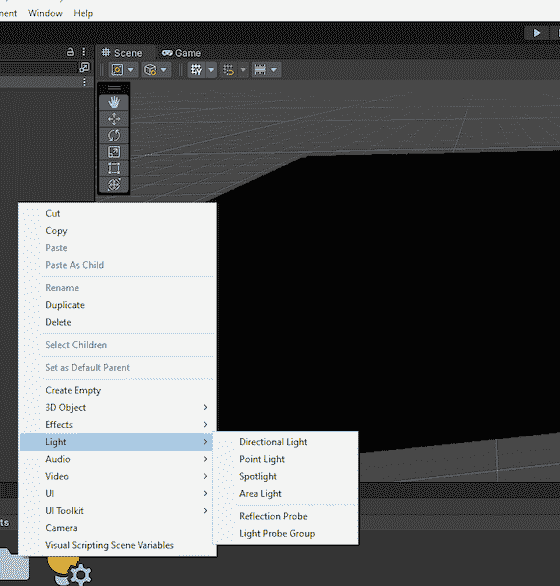

如你所见，Unity 中的四种光是:

*   方向灯
*   点光源
*   局部照明
*   区域灯

现在，我们将详细了解每一种光源类型。为了测试它们，我创建了一个示例场景。正如你在下面看到的，场景是完全黑暗的，因为所有的默认照明都被移除了。

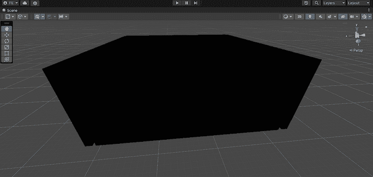

### 方向灯

[平行光](https://docs.unity3d.com/Manual/Lighting.html#:~:text=in%20the%20scene-,Directional%20Lights,-Directional%20Lights%20are)代表来自游戏世界范围之外的大型远距离光源。这种类型的灯光用于模拟场景中的阳光效果。这里有一个例子，展示了当平行光添加到之前的场景时，它是如何变化的。

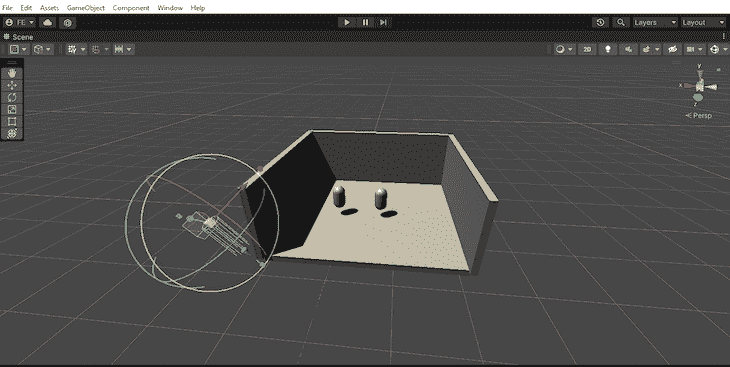

在 Unity 中，平行光的位置并不重要，因为平行光对场景中的所有游戏对象都有相同的影响，不管它们离灯光的位置有多远。

您可以在平行光上使用变换工具来改变光的角度，模拟日落或日出。

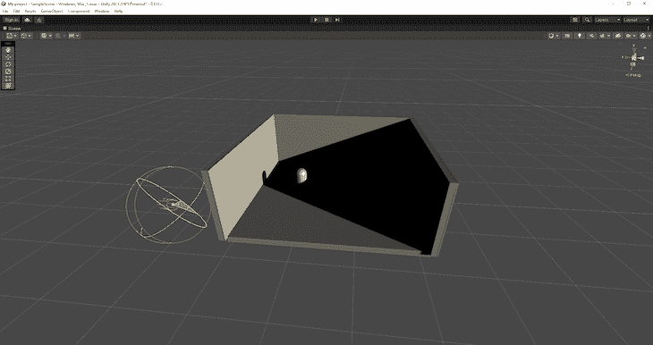

### 点光源

与平行光不同的是，[点光源](https://docs.unity3d.com/Manual/Lighting.html#:~:text=rectangle%20or%20disc-,Point%20Lights,-A%20Point%20Light)位于空间中的一个点上，向各个方向均匀地发射光线。点光源也有指定的范围，并且只影响该范围内的对象，该范围由黄色圆圈表示。

物体离点光源越远，受光源影响越小。而如果你把一个物体拿出圆圈，它根本不会受到光线的影响。

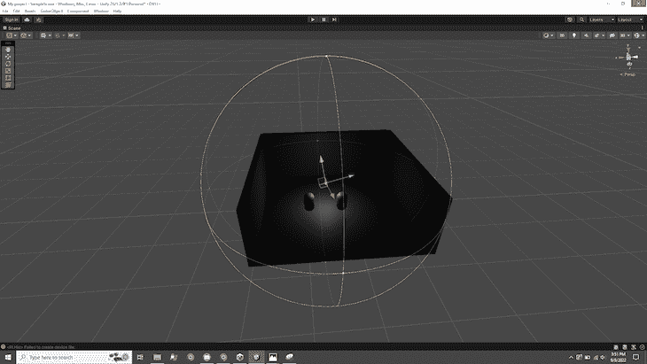

Unity 中的点光源是基于[平方反比定律](https://en.wikipedia.org/wiki/Inverse-square_law)设计的，该定律指出“辐射的强度与距离的平方成反比。”这意味着从光源到观察者的光强度与观察者到光源的距离的平方成反比。

点光源可用于创建街灯、篝火、审讯室中的灯或任何您希望光线仅影响特定区域的地方。

### 聚光灯

点光源和聚光灯是相似的，因为像点光源一样，[聚光灯](https://docs.unity3d.com/Manual/Lighting.html#:~:text=in%20the%20scene-,Spot%20Lights,-Like%20a%20Point)有一个特定的位置和范围，在此范围内光会减弱。

但是，与向所有方向均匀发射光的点光源不同，聚光灯向一个方向发射光，并被限制在特定的角度，从而产生锥形区域的光。

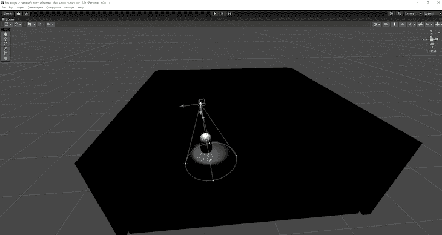

聚光灯可用于创建灯、街灯、火炬等。我喜欢用它们来制作汽车的前灯，如下图所示。

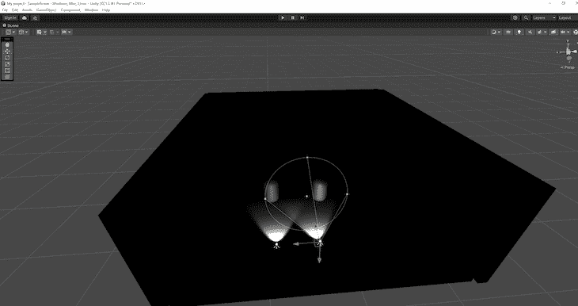

### 区域灯

像聚光灯一样，[区域光](https://docs.unity3d.com/Manual/Lighting.html#:~:text=to%20these%20colors.-,Area%20Lights,-You%20can%20define)只向一个方向投射。然而，它们是以矩形发射的。与前面提到的三种灯光不同，区域灯光需要烘焙才能生效。我们稍后会更多地讨论烘焙，但是这里有一个区域光在场景中使用的例子。

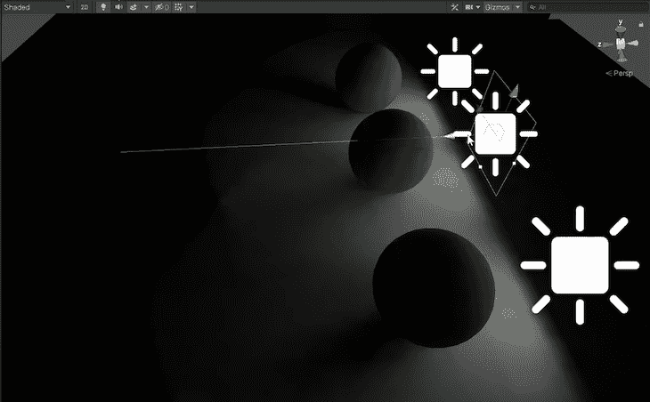

现在我们已经看完了不同的灯光类型，让我们看看 Unity 中不同的灯光模式。

## Unity 中的灯光模式

Unity 中有三种主要照明模式:

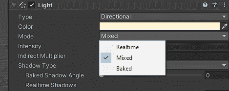

### 实时照明

在 Unity 中，对光的所有计算，即阴影、亮度、位置等。，在每一帧中进行计算和更新。使用[实时](https://docs.unity3d.com/2019.1/Documentation/Manual/LightMode-Realtime.html)灯光模式意味着场景中与灯光相关的一切都是动态的，并且会随着每一帧而更新。

简而言之，实时光照模式为场景提供直接光照，并更新每一帧，因此，当灯光和游戏对象在场景中移动时，光照会立即更新。这种灯光模式对于照亮角色或其他可移动几何体非常有用。

默认情况下，平行光，聚光灯与点光源是实时的，但它们总是可以更改为烘焙与混合。实时灯光具有很高的计算价值，并且可能是 CPU 和 GPU 密集型的。

### 烘焙照明

与实时照明不同，在[烘焙](https://docs.unity3d.com/2019.1/Documentation/Manual/LightMode-Baked.html)照明模式中，编辑器在编辑器中执行灯光的所有照明计算，并将数据(作为纹理)作为照明数据存储在系统磁盘上。然后，在运行时重新应用时，它会使用保存的纹理照亮曲面。

烘焙照明用于模拟场景的真实照明，同时降低运行游戏的 CPU(中央处理器)或 GPU(图形处理器)成本。烘焙照明是轻量级的，用于移动游戏或不需要实时照明计算开销的场景。

当您在 Unity 中将灯光设置为烘焙模式时，您告诉 Unity 灯光在运行时不会移动。因此，如果您将烘焙灯光投射到可移动或可破坏的对象上，当对象移动或被破坏时，灯光将保持不变，从而创建一个不真实的场景。为了避免这种情况，所有受烘焙灯光影响的对象都必须在检查器中标记为“静态”。

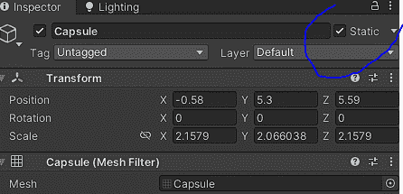

这里有一个[很棒的视频](https://www.youtube.com/watch?v=Dv2CtcvkA4Q)，进一步解释了 Unity 中的轻烘焙。

### 混合照明

顾名思义，[混合](https://docs.unity3d.com/2018.2/Documentation/Manual/LightMode-Mixed.html)光照模式结合了实时和烘焙光照。混合照明允许灯光具有烘焙灯光的所有优点，同时保持实时灯光提供的移动对象的动态阴影，所有这些都来自同一个光源。

如果这对你来说很难理解，可以这样想:混合照明允许一个光源同时提供直接光和间接光。使用混合光比烘焙光或实时光在每个场景中涉及更多的操作计算，所以不建议使用它来构建一些光，比如手机游戏。

## 结论

如果你正在读这篇文章，恭喜你！你现在知道了 Unity 中照明的基本知识。完全理解 Unity 中关于照明的一切是一个复杂的旅程，但是现在你已经知道了基础，你已经成功了一半。我希望你喜欢这篇文章。下一集再见！

## 使用 [LogRocket](https://lp.logrocket.com/blg/signup) 消除传统错误报告的干扰

[LogRocket](https://lp.logrocket.com/blg/signup) 是一个数字体验分析解决方案，它可以保护您免受数百个假阳性错误警报的影响，只针对几个真正重要的项目。LogRocket 会告诉您应用程序中实际影响用户的最具影响力的 bug 和 UX 问题。

然后，使用具有深层技术遥测的会话重放来确切地查看用户看到了什么以及是什么导致了问题，就像你在他们身后看一样。

LogRocket 自动聚合客户端错误、JS 异常、前端性能指标和用户交互。然后 LogRocket 使用机器学习来告诉你哪些问题正在影响大多数用户，并提供你需要修复它的上下文。

关注重要的 bug—[今天就试试 LogRocket】。](https://lp.logrocket.com/blg/signup-issue-free)