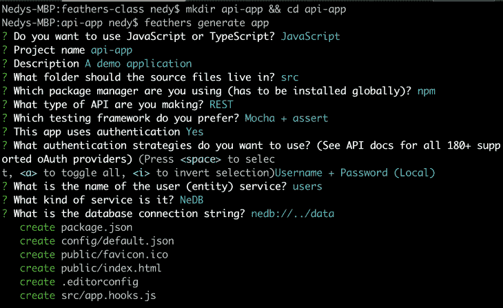
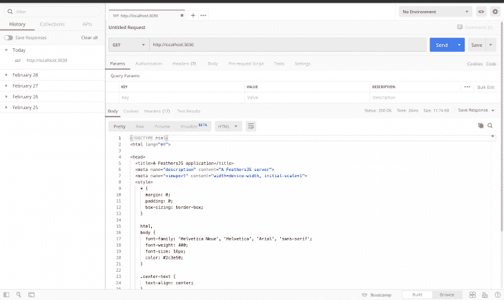
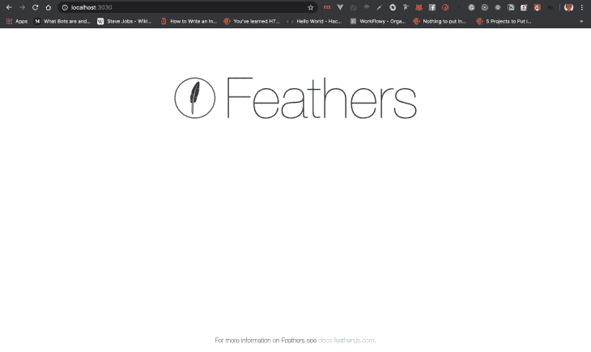
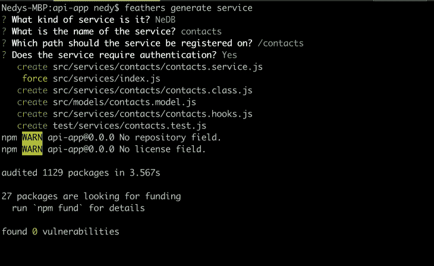
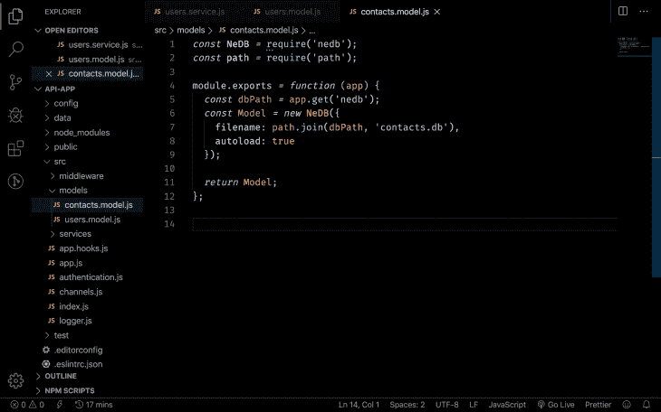
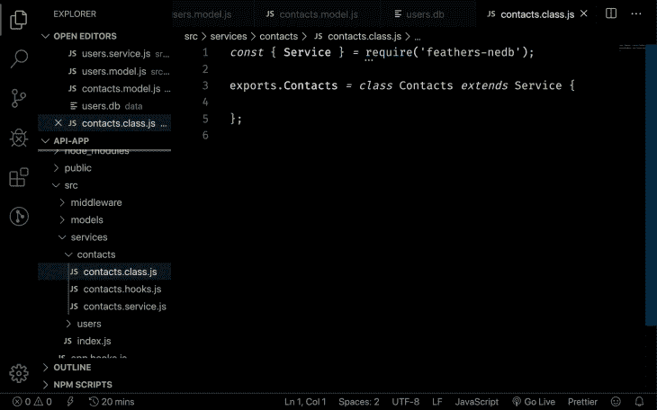
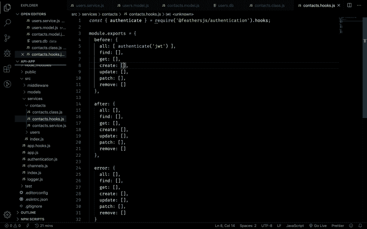
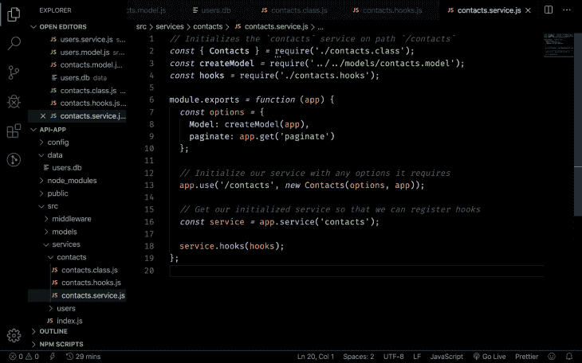
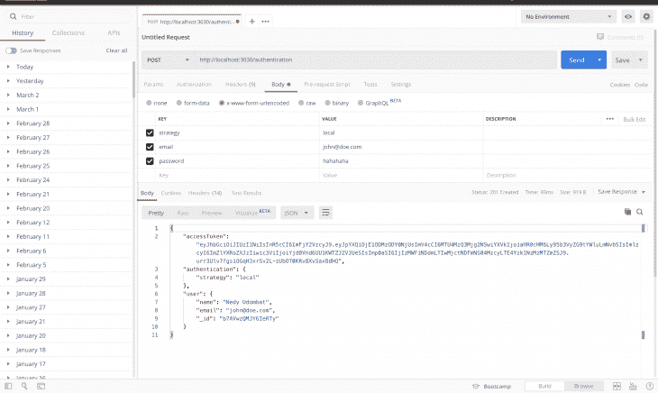

# 用 FeathersJS 构建快如闪电的 API

> 原文：<https://blog.logrocket.com/lightning-fast-apis-feathersjs/>

## 介绍

Feathers 是一个轻量级的 web 框架，构建在用于创建应用程序的 Express 之上。Feathers 可以与 JavaScript 或 TypeScript 一起使用。用户说用 [FeathersJS](http://docs.feathersjs.com/) 可以在几分钟内构建原型应用程序，而生产就绪的应用程序只需几天。

## 那么，为什么是费瑟斯？

对于那些对为什么应该考虑尝试新工具感到好奇的人，这里有几个你应该尝试 FeathersJS 的理由:

*   它很轻
*   它可以用于创建实时应用程序
*   它适用于 JavaScript 或 TypeScript
*   它可以使用几乎任何后端技术在几乎任何地方工作——它提供了对 [Socket.io](https://socket.io/) 和 [Primus](https://github.com/primus/primus) 的开箱即用支持和配置，这取决于您的偏好
*   它在带有节点的服务器上工作
*   它支持许多不同的数据库，如 Postgres、Mongo、MySql、NeDB、文件系统、LocalStorage、SQLite、MSSQL、Cassandra 等。
*   它通过 JavaScript 在浏览器上工作，这意味着它也可以与 React、Vue.js 和 Angular 一起使用
*   它在手机上也能工作——谁能想到呢？它可以与 React Native、Ionic、Android 或 iOS 一起使用
*   是的，您可以在几分钟内构建原型应用程序

## 我们将建造什么

在本文中，我们将使用 FeathersJS 和一个名为 [NeDB](https://github.com/louischatriot/nedb) 的内存数据库，在几分钟内构建一个简单的带身份验证的 API 原型版本。现在让我们继续，确保我们已经安装了所有的先决条件，这样我们就可以开始有趣的事情了:

*   JavaScript 的基础知识
*   使用 Express 创建 RESTful APIs 的知识
*   您机器上安装的最新版本 [Node.js](https://nodejs.org/en/)
*   像 [ITerm2](https://iterm2.com/) (mac OS)或者 [Git Bash](https://git-scm.com/downloads) (Windows)这样的终端
*   RestAPI 客户端如[邮递员](https://www.postman.com/)、[失眠](https://insomnia.rest/)等。

### 安装羽毛

安装和设置 FeathersJS 的唯一步骤是通过运行以下命令全局安装 CLI 应用程序:

```
npm install -g @feathersjs/cli
```

### 创建您的 API

通过这些简单的步骤，我们将启动并运行我们的身份验证 API:

```
mkdir api-app && cd api-app
```

上面的命令基本上创建了一个我们的 API 所在的文件夹，并将您的当前目录更改为该文件夹:

```
feathers generate app
```

运行该命令后，将会询问您几个问题，以确定您的 API 将如何构建以及它将使用什么技术。以下是我的选择:



瞧啊。我们的 API 准备好了。

安装完成后，您可以打开首选的 REST API 客户端并进行测试。运行以下命令启动 API 服务器:

```
npm start
```

如果您尝试在 REST API 客户机中访问基本路由`http:localhost:3030`，您应该会看到以下响应:



或者，如果您尝试使用浏览器访问该路线，您会看到以下页面:



至此，注册、身份验证和授权已经基本完成。您可以通过向`/users`路线发送包含您的详细信息的帖子请求来注册。

可以通过`/authentication`路由登录，响应中会返回一个令牌。然后，这个令牌可以用作访问其他路由的授权方法，比如向`/users`发送 GET 请求来检索所有用户。

### 生成服务

既然我们已经设置好了身份验证，那么让我们创建一个新的服务来对联系人执行 CRUD 操作(即创建、读取、更新和删除联系人)。在一个典型的 REST API CRUD 项目中，我们必须编写每个方法来处理每个 CRUD 操作。嗯，不是用羽毛。

使用 FeathersJS，一个简单的命令就可以创建一个在模型上执行所有 CRUD 操作的服务，并且代码是抽象的。让我展示给你看。

在您的终端中，运行以下命令:

```
feathers generate service
```

这里会问你几个问题。出于本文的目的，我选择了以下选项:



一旦安装了所有的包，您就可以通过`/contacts`路径在 **contacts** 服务上执行所有的 CRUD 操作。但在此之前，我们先来看看生成的文件。

#### 联系模式(`/src/models/contacts.model.js`)

在这里，我们将定义我们的模式和模型，以形成我们收集的数据以及这些数据在数据库中的存储方式。另一方面，NeDB 不支持模式，所以我们的模型文件如下所示:



在使用支持模式的数据库(比如 MongoDB 或 Postgres)的情况下，这就是要定义的模式。

#### 联系人类别(`/src/services/contact/contacts.class.js`)

这是编写 CRUD 方法的地方，但是在这种情况下，这个文件几乎是空的。这是因为 CRUD 方法是抽象的，文件只是实例化了`contact`类，它扩展了`service`类。



#### 触点挂钩(`/src/services/contact/contacts.hooks.js`):

这决定了我们 CRUD 操作的工作流程。这是一个典型的钩子文件的样子:



我们可以看到`before: {all:`有`authenticate('jwt')`。这意味着在对 contacts 服务执行任何 CRUD 操作之前，您必须提供一个令牌。换句话说，您必须登录。

钩子函数可以在 CRUD 操作过程中发生错误之前、之后或之时使用。例如，如果您希望在创建联系人时验证联系人是否包含全名、电子邮件和电话号码，这将在 before 挂钩中完成，如下所示:

```
before: {
  all: [ authenticate('jwt') ],
  find: [],
  get: [],
  create: [ function(context) {
    // perform validation 
    return context;
  }],
  update: [],
  patch: [],
  remove: []
},
```

如果您还希望在数据被创建、读取、更新或删除之后做一些事情，那么您必须在钩子之后的中编写该函数。例如，如果您想将邮件发送到联系人的邮箱，它看起来会像这样:

```
after: {
  all: [],
  find: [],
  get: [],
  create: [ function(context) {
    // send email function
    return context;
  }],
  update: [],
  patch: [],
  remove: []
},
```

如果你想处理一个以某种方式得到的错误，情况也是如此。例如，如果你想使用一个类似于 [Sentry](https://sentry.io/welcome/) 的错误记录器，那么它将被添加到错误挂钩中。

#### 联系服务(`/src/services/contact/contacts.service.js`)

这是定义单一路由服务、注册挂钩和模型以及初始化服务的地方。它看起来有点像这样:



代码非常小。这是因为 FeathersJS 通过抽象的方式在幕后处理了大量的提升工作。

注意，FeathersJS 使用不同的策略来处理认证，比如 local、JWT、OAuth、Google、GitHub 等。当试图向`/authentication`发出 POST 请求时，您必须指定策略。

例如，这里有一个对`/authentication`路由的 POST 请求来登录(生成一个访问令牌):



## 结论

FeathersJS 真的让我们在几分钟内就可以轻松地构建应用程序原型。

为了构建一个生产就绪的应用程序，你可能需要选择一个更健壮的数据库，比如 [MongoDB](https://www.mongodb.com/) 或者 [Postgres](https://www.postgresql.org/) 而不是 NeDB。

你可能还想看看他们写得很好的[文档](https://docs.feathersjs.com/)来了解更多关于羽毛的能力和他们的[令人敬畏的羽毛](https://github.com/feathersjs/awesome-feathersjs)页面。

## 您是否添加了新的 JS 库来提高性能或构建新特性？如果他们反其道而行之呢？

毫无疑问，前端变得越来越复杂。当您向应用程序添加新的 JavaScript 库和其他依赖项时，您将需要更多的可见性，以确保您的用户不会遇到未知的问题。

LogRocket 是一个前端应用程序监控解决方案，可以让您回放 JavaScript 错误，就像它们发生在您自己的浏览器中一样，这样您就可以更有效地对错误做出反应。

[](https://lp.logrocket.com/blg/javascript-signup)[https://logrocket.com/signup/](https://lp.logrocket.com/blg/javascript-signup)

[LogRocket](https://lp.logrocket.com/blg/javascript-signup) 可以与任何应用程序完美配合，不管是什么框架，并且有插件可以记录来自 Redux、Vuex 和@ngrx/store 的额外上下文。您可以汇总并报告问题发生时应用程序的状态，而不是猜测问题发生的原因。LogRocket 还可以监控应用的性能，报告客户端 CPU 负载、客户端内存使用等指标。

自信地构建— [开始免费监控](https://lp.logrocket.com/blg/javascript-signup)。