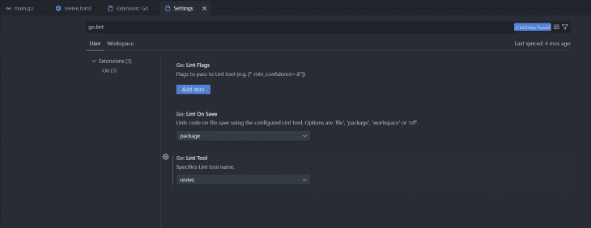

# 林挺围棋程序:提高代码质量指南

> 原文：<https://blog.logrocket.com/linting-go-programs-improving-code-quality/>

使用 linters 通过在问题执行之前突出问题来提高可读性，并且有助于代码库的标准化。一个好的 linter 有配置设置来帮助减少你不关心的规则的警告，使代码更容易理解、修改和维护。

在本文中，我们将通过以下主题了解更多关于林挺的信息:

golint 是多年来使用最广泛的棉绒。不幸的是，它现在已被官方弃用并存档。 [golint](https://github.com/golang/lint) 的问题是它不提供任何配置选项，总是应用所有规则，这导致对您不关心的规则的警告。在这篇文章中，我们将使用复活包，以及探索替代去林挺包。

相反， [revive](https://github.com/mgechev/revive) 是一个快速的、可配置的、可扩展的、适应性强的、漂亮的 linter。它是 golint 的替代产品。

以下是 revive 与 golint 的不同之处:

*   允许我们使用配置文件启用或禁用规则
*   允许我们用 TOML 文件配置林挺规则
*   运行同样的规则比 golint 快两倍
*   提供禁用特定规则或文件或一系列行的整个 linter 的功能(golint 只允许对生成的文件禁用此功能)
*   可选类型检查。golint 中的大多数规则不需要类型检查。如果在配置文件中禁用它们，revive 的运行速度将比 golint 快六倍以上
*   提供多个格式化程序，让我们定制输出
*   允许我们为整个 linter 定制返回代码，或者只基于某些规则的失败
*   每个人都可以使用自定义规则或格式化程序轻松扩展它
*   与 golint 相比，revive 提供了更多规则

## 使用“恢复”设置项目

打开终端并创建项目文件夹。导航到项目文件夹，运行以下命令启动一个新项目:

```
go mod init project

```

导航到您的 Go 项目，并运行以下命令来安装复活 linter 包:

```
go install github.com/mgechev/[email protected]

```

创建一个`main.go`文件，并将以下代码片段添加到`main.go`文件中:

```
package main
import (
    "fmt"
)
func main() {
    PrintName("Emmanuel")
    PrintAge(23)
}
func PrintName(name string) {
    fmt.Println(name)
}
func PrintAge(age int) {
    fmt.Println(age)
}

```

现在，在项目终端上运行`revive`命令，您应该会得到以下报告:

```
main.go:11:1: exported function PrintName should have comment or be unexported
main.go:15:1: exported function PrintAge should have comment or be unexported

```

在 Go 中，导出函数的首字母通常是大写的。正确记录的代码库要求对导出的函数进行注释，并简要概述该函数的用途，这样每个人都可以理解它的作用。现在我们可以看到 revive 包是如何帮助我们编写文档良好的代码的。

现在，让我们给这些函数添加一些注释:

```
...
// This function uses the fmt.Println function to print a string.
func PrintName(name string) {
    fmt.Println(name)
}
// This function uses the fmt.Println function to print a number.
func PrintAge(age int) {
    fmt.Println(age)
}

```

执行恢复命令，您应该得到以下报告:

```
main.go:12:1: comment on exported function PrintName should 
be of the form "PrintName ..."
main.go:17:1: comment on exported function PrintAge should be of the form "PrintAge ..." 

```

Revive 告诉我们，对于正确记录的代码库，我们的注释应该以导出函数的名称开始。

让我们将我们的意见修改如下:

```
...
// PrintName uses the fmt.Println function to print a string.
func PrintName(name string) {
    fmt.Println(name)
}
// PrintAge uses the fmt.Println function to print a number.
func PrintAge(age int) {
    fmt.Println(age)
}

```

这样，执行恢复命令，您应该没有报告。

## 用恢复抑制林挺错误

有时，有必要禁用文件或包中出现的特定林挺问题。配置文件中的注释和排除规则都可以用来做到这一点。让我们依次检查每个策略。

当您希望禁用某一部分代码的警告，但仍然希望将规则应用到项目的其他部分时，注释策略就很方便了。

以下是如何使用注释禁用特定的林挺问题:

```
package main
import (
    "fmt"
)
func main() {
    PrintName("Emmanuel")
}
// revive:disable:exported
func PrintName(name string) {
    fmt.Println(name)
}

```

其语法是`revive`，后跟一个冒号，然后是`disable`。如果需要，添加另一个冒号，后跟一个 linter 规则的名称。

## 为棉绒机设置配置

这是复兴棉绒包的一个惊人的特点，它解决了流行的`golint`棉绒包的主要挑战。

让我们看看如何配置复活 linter 包来禁用一些林挺规则，以减少不必要的警告。

使用默认的`[revive](https://github.com/mgechev/revive#recommended-configuration)` [配置](https://github.com/mgechev/revive#recommended-configuration)将名为`revive.toml`的文件添加到项目文件夹中:

```
ignoreGeneratedHeader = false
severity = "warning"
confidence = 0.8
errorCode = 0
warningCode = 0

[rule.blank-imports]
[rule.context-as-argument]
[rule.context-keys-type]
[rule.dot-imports]
[rule.error-return]
[rule.error-strings]
[rule.error-naming]
[rule.exported]
[rule.if-return]
[rule.increment-decrement]
[rule.var-naming]
[rule.var-declaration]
[rule.package-comments]
[rule.range]
[rule.receiver-naming]
[rule.time-naming]
[rule.unexported-return]
[rule.indent-error-flow]
[rule.errorf]
[rule.empty-block]
[rule.superfluous-else]
[rule.unused-parameter]
[rule.unreachable-code]
[rule.redefines-builtin-id]

```

现在，删除所有注释并运行以下命令，将 linter 与配置文件一起使用:

```
revive -config revive.toml

```

要禁用这些规则，您可以删除它们或在指定规则前添加`#`,如下所示:

```
#[rule.exported]

```

## 在代码编辑器中设置林挺

一些代码编辑器自动支持林挺代码；Visual Studio 代码就是其中之一。

让我们看看如何在 Visual Studio 代码中设置复活 linter。

打开 VS 代码，安装 VS 代码的`go`扩展。然后，选择**文件**选项卡> **首选项** > **设置**并将`go.lint`添加到搜索栏，并在 **Go: Lint Tool** 部分选择**revival**。



Visual Studio 代码的默认 Go linter 是`staticcheck`。

## 探索`go vet`命令

与 linters 相反，go vet 命令可以识别编译过但可能无法按预期执行的代码。

让我们考虑一下 Golang 代码中常见的自我赋值错误。按如下方式更新`main.go`文件:

```
package main
import (
    "fmt"
)
func main() {
    PrintName("Emmanuel")
}
// revive:disable:exported
func PrintName(name string) {
    name = name
    fmt.Println(name)
}

```

即使有这个 bug，上面的代码也能编译。执行复活 linter 命令不会报告任何关于这个 bug 的问题。这就是`go vet`命令派上用场的地方。

运行`go vet`命令，您应该得到以下结果:

```
$ go vet
# sample
.\main.go:10:2: self-assignment of name to name

```

## Go 中林挺的替代包

如果 revive 不是你的首选，这里有一个由社区建立和维护的 Go linters 列表。

### 戈朗契功能区

`[golangci-lint](https://golangci-lint.run/)`跑得很快。它与每一个主要的 IDE 集成，采用缓存，支持 YAML 配置，并行执行 linter，并带有大量的 linter。

### 静态检查

`[staticcheck](https://staticcheck.io/)`是一种前沿的围棋编程语言 linter。它采用静态分析来识别 bug 和性能问题，提供简化，并实施风格指南。

## 结论

Go 非常重视文档，因为开发人员越容易制作出好的文档，对每个人都越好。

在这篇文章中，我们探讨了林挺在 Golang，我的首选林挺包，以及林挺在 Go 的替代包。我希望你会喜欢和 revive 一起工作！

## 使用 [LogRocket](https://lp.logrocket.com/blg/signup) 消除传统错误报告的干扰

[](https://lp.logrocket.com/blg/signup)

[LogRocket](https://lp.logrocket.com/blg/signup) 是一个数字体验分析解决方案，它可以保护您免受数百个假阳性错误警报的影响，只针对几个真正重要的项目。LogRocket 会告诉您应用程序中实际影响用户的最具影响力的 bug 和 UX 问题。

然后，使用具有深层技术遥测的会话重放来确切地查看用户看到了什么以及是什么导致了问题，就像你在他们身后看一样。

LogRocket 自动聚合客户端错误、JS 异常、前端性能指标和用户交互。然后 LogRocket 使用机器学习来告诉你哪些问题正在影响大多数用户，并提供你需要修复它的上下文。

关注重要的 bug—[今天就试试 LogRocket】。](https://lp.logrocket.com/blg/signup-issue-free)