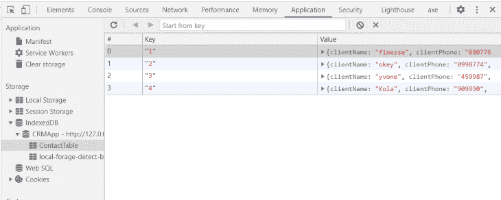

# local feed:管理离线浏览器存储

> 原文：<https://blog.logrocket.com/localforage-managing-offline-browser-storage/>

用[缓存 API](https://blog.logrocket.com/javascript-cache-api/) 缓存静态的基于文件的资源，这样那些静态的页面在没有互联网连接的情况下也是可导航的，这是大多数人认为渐进式 web 应用(PWAs)的全部意义。然而，PWAs 可以通过浏览器存储实现更多功能。借助浏览器存储，我们可以构建功能全面的交互式离线应用，这些应用可以:

*   当互联网连接不良或没有互联网连接时，将用户输入(如向日历 web 应用程序添加新任务)存储在浏览器中，然后在检测到连接时立即同步到远程数据库。这样，即使用户从不同的设备登录，也会提供最新的数据
*   存储 API 响应数据，以便更快地进行初始加载，然后在连接恢复时，如果有任何更改，则按照过时但重新验证的策略进行更新
*   在服务器端存储很少改变的 API 数据，这样应用程序就不必一直为这些数据进行服务器调用

为了满足这种需求，浏览器提供了两种主要的存储机制:localStorage 和 IndexedDB。

然而，这两个有一对夫妇的缺点。

## 使用 localStorage 作为脱机存储机制

一方面，localStorage 通过其简单的获取和设置 API 非常容易使用。但是，它只能存储字符串类型的数据。这意味着其他数据类型在存储时必须用`JSON.stringify()`转换成字符串，然后在从存储器读取时用`JSON.parse()`转换回来，这不是很安全。此外，localStorage 提供非常有限的存储大小，大约 5MB，是同步的，不能从 web 工作人员那里访问，因此不支持后台同步。

## 使用 IndexedDB 作为离线存储机制

另一方面，IndexedDB 几乎正是我们所需要的。它是异步的，因此不会阻塞主线程。它接受不同的数据类型，包括 blobs、文件和图像，具有更高的存储限制，有时高达 1GB，具体取决于用户的磁盘空间和操作系统，并且可以由 web 工作者访问。

但是，使用本机 indexedDB API 完全是一场噩梦。有时候，仅仅为了存储数据，你就不得不写超过 10 行的代码。

## 什么是 local feed？

这就是[本地饲料](https://github.com/localForage/localForage)的用武之地。(如果你不熟悉离线存储的概念，我建议你在继续之前阅读[这篇](https://developer.mozilla.org/en-US/docs/Learn/JavaScript/Client-side_web_APIs/Client-side_storage)。

用它的创造者的话说，local feed 是离线存储的改进。通过方便地在离线存储上提供一个抽象层，使得离线存储的工作变得更加容易。它结合了 indexedDB 的灵活性和一个简单的异步 localStorage 类 API。这意味着我们可以使用我们都喜欢的 async-await 语法。

local feed 设计用于将数据存储在 indexedDB 中，如果不支持 indexedDB，则返回到 localStorage。(但是，这可能会对性能和存储产生相当大的副作用，因为所有数据都将在保存时序列化，并且只有可以通过`JSON.stringify()`转换为字符串的数据才会被保存)。

因为 indexedDB 目前受到所有主流浏览器的支持，而且，如果你正在构建一个 PWA，旧的浏览器将不支持你需要使用的大多数特性，你可以明智地决定只支持现代的浏览器。

在我目前的公司，我们只支持我们 PWA 产品的 Chrome，这是一个面向小型企业的一体化 SaaS 平台。我们使用 local feed 来存储无论互联网连接如何都应该可用的数据，因为该应用程序主要由销售代理使用，他们有时可能在互联网连接不良的非常规地方。

在本文的其余部分，我将带您了解如何设置 local feed 并使用它执行基本的 CRUD 操作，就像使用任何其他数据库一样。我们将编写函数来构建一个假想的 CRM 销售应用程序的各个部分，销售代表使用该应用程序来整理潜在客户的联系信息——通常在连接可能有问题的地方。让我们开始吧。

## 1.设置一个 HTML 页面

首先，让我们建立一个简单的 HTML 页面，其中包含一个用于收集客户数据的表单和一个显示所有客户详细信息的表格:

```
<!DOCTYPE html>
<html lang="en">
<head>
    <meta charset="UTF-8">
    <meta name="viewport" content="width=device-width, initial-scale=1.0">
    <title>LocalForage Demo</title>

</head>
<body>
    <div>
       <label>Client Name:
           <input id="clientName" type="text" name='clientName' value="">
       </label>
       <label>Phone Number:
           <input id="clientPhone" type="number" name='clientPhone' value="">
       </label>
       <label>Needs:
           <input id="clientNeed" type="text" name='clientNeed' value="">
       </label>
       <button type="submit" id="submit">Save</button>
    </div>

    <div>
        <table>
            <thead>
                <tr>
                    <th>Client Name</th>
                    <th>Phone Number</th>
                    <th>Needs</th>
                    <th>Actions</th>
                    <th>Actions</th>
                    <th>Actions</th>
                </tr>
            </thead>
            <tbody>

            </tbody>
        </table>
    </div>

   <script src="https://cdnjs.cloudflare.com/ajax/libs/localforage/1.9.0/localforage.min.js"></script>
   <script src="index.js"></script>
</body>
</html>

```

为了保持本教程框架和工具的独立性，我们将通过 CDN 链接使用 local feed，但是您可以选择通过 npm 或 yarn 安装它。

接下来，让我们稍微配置一下我们的离线数据库:

```
//in index.js
const ContactTable = localforage.createInstance({
    name: "CRMApp",
    storeName: "ContactTable"
});

```

这里，我们使用 local feed[create instance](https://localforage.github.io/localForage/#multiple-instances-createinstance)方法为我们的应用程序创建一个新的数据库(`CRMApp`)和一个商店(`ContactTable`)。local feed 中的存储就像 indexedDB 中的对象存储一样，可以认为是数据库中的一个单独的表。

对于您希望存储的不同类别的数据，最好有不同的存储。如果您不这样做，local feed 将默认设置一个名为“local feed”的数据库和一个名为“keyvaluepairs”的存储，它将为您存储所有数据。

## 2.添加新客户

现在我们已经完成了基本的设置，让我们开始编写 CRUD 函数。例如，当销售代表在输入中输入新的客户详细信息并单击 save 按钮时，我们需要从所有输入中获取值并将其组织到一个对象中。

```
const getClientDetails = () => {
    const clientName = document.getElementById("clientName").value;
    const clientPhone = document.getElementById("clientPhone").value;
    const clientNeed = document.getElementById("clientNeed").value;

    return {
        clientName: clientName,
        clientPhone: clientPhone,
        clientNeed: clientNeed,
    }
}

```

然后，我们需要在浏览器存储中存储新的客户详细信息对象，并在表中显示它:

```
const addInput = async () => {
    const inputValues = getClientDetails();
    const dbLength = await ContactTable.length();
    let id = dbLength === 0 ? 1 : dbLength + 1;
    try{
        let row = `<tr id="${id}">
                        <td>${inputValues.clientName}</td>
                        <td>${inputValues.clientPhone}</td>
                        <td>${inputValues.clientNeed}</td>
                        <td><button class="edit">Edit</button></td>
                        <td><button class="delete"> Delete</button></td>
                    </tr>`
        document.querySelector('tbody').insertAdjacentHTML('afterbegin', row);
        await ContactTable.setItem(id, inputValues);
        alert('contact added successfully');
    }catch(e){
        console.log(err.message);
    }}
document.getElementById('submit').addEventListener('click', async(e) => {
    e.preventDefault();
    await addInput();
})

```

使用`addInput`函数，当单击 save 按钮时，我们调用`getClientDetails`函数来获取 customer detail 对象，然后使用 ES6 模板文本将包含这些细节的新行添加到 HTML 表的顶部。

我们还使用 local feed 的 [length](https://localforage.github.io/localForage/#data-api-length) 方法来生成一个惟一的 ID，它将用于检索单个条目。最后，我们使用 [setItem](https://localforage.github.io/localForage/#data-api-setitem) 方法将客户详细信息对象添加到`contactTable`商店。

您可以打开 chrome dev tools 的应用程序面板来查看它的运行情况:



## 3.加载所有客户数据

接下来，每当应用程序被刷新、重新加载或在另一个选项卡上打开时，我们需要能够读取所有客户详细信息数据并将其显示在表格上:

```
const loadContactsFromStorage = async () => {
    try {
        await ContactTable.iterate((value, key, iterationNumber) => {
            let newContact = `<tr id="${key}">
                                <td>${value.clientName}</td>
                                <td>${value.clientPhone}</td>
                                <td>${value.clientNeed}</td>
                                <td><button class="edit">Edit</button></td>
                                <td><button class="delete"> Delete</button></td>
                                <td><button class="view">View</button></td>
                           </tr>`
            document.querySelector('tbody').insertAdjacentHTML('afterbegin', newContact);
        })
    } catch (err) {
        console.log(err)
    }

}

window.addEventListener('load', async() => {
    await loadContactsFromStorage();
})

```

这里我们使用 local feed[iterate](https://localforage.github.io/localForage/#data-api-iterate)方法遍历离线数据库中的所有条目。`iterate`方法接受一个回调函数，它在每次迭代时调用这个函数，就像 ES6 `map`函数一样。

这个回调函数接收 iteration 和 iterationNumber 中当前数据的值和键作为参数。我们使用模板文字将每个对象键的值添加到表中。之后，我们监听 load 事件并调用`loadContactsFromStorage`。

如果用户通过新设备访问应用程序，这是使用 length 属性检查存储中是否存在数据的好地方，然后尝试从远程数据库加载数据并将其存储在浏览器存储中以供离线访问。

## 4.删除客户

下一个特性是让销售代表能够从表中删除客户的联系信息。这意味着当点击删除按钮时，我们需要从应用程序界面和离线数据库中删除联系人。

```
const deleteContact = async(e) => {
    const row = e.target.parentElement.parentElement;
    const key = row.id;
    row.remove();
    try{
        await ContactTable.removeItem(key);
        alert('Contact deleted successfully');
    }catch(err){
        console.log(err.message);
    }

}

window.addEventListener('load', async() => {
     await loadContactsFromStorage();
     document.querySelectorAll('.delete').forEach(button =>{
        button.addEventListener('click', async(e) => {
          await deleteContact(e);
        })
    });
  })

```

这里，我们使用 HTML `parentElement`属性获取包含被点击的删除按钮的行。然后，我们使用 HTML `remove`方法从 UI 中移除该行。

为了从离线存储中移除，我们使用 local feed[remove item](https://localforage.github.io/localForage/#data-api-removeitem)方法，将目标行的 ID 作为键传入。我们还将 click 事件侦听器附加到`loadContactFromStorage`函数下的 load 事件中的所有 delete 按钮上，因为在附加事件侦听器之前，必须先将行加载到 DOM 中。

## 5.更新客户

客户的电话号码或需求很可能会改变。我们希望让销售代表能够编辑和更新客户的详细信息，即使他们离线。为了实现这一点，当单击编辑按钮时，我们需要显示一个模态，该模态将具有一个包含目标个人客户详细信息的输入和一个更新按钮的表单。当单击模式中的 update 按钮时，我们需要更新离线数据库和表上的目标客户详细信息条目。

* * *

### 更多来自 LogRocket 的精彩文章:

* * *

让我们首先给 HTML 添加一个模态:

```
<div id="modal">
        <div class="backdrop">
            <div class="form">
                <label><span>Client Name:</span>
                    <input id="editName" type="text" name='editName' value="">
                </label>
                <label><span>Phone Number:</span>
                    <input id="editPhone" type="number" name='editPhone' value="">
                </label>
                <label><span>Needs:</span>
                    <input id="editNeed" type="text" name='editNeed' value="">
                </label>
                <button type="submit" id="update">Update</button>
            </div>
        </div>

    </div>

```

让我们也添加一些 CSS 样式的模态，并隐藏它在初始加载:

```
css

#modal{
  position: absolute;
  top: 0;
  left: 0;
  width: 100vw;
  height: 100vh;
  display: none;
}

#modal .backdrop{
    background-color: rgba(43, 40, 40, 0.5);
    width: 100vw;
    height: 100vh;
}

#modal .form{
    background-color: #fff;
    padding: 40px;
    border: 1px solid blue;
    position: absolute;
    top: 50%;
    left: 50%;
    transform: translate(-50%, -50%);
    z-index: 1;
}

```

现在，让我们编写一个函数来处理更新任务的第一部分，即在单击编辑按钮时检索信息:

```
let updateKey;

const viewContact = async(e) => {
    updateKey =  e.target.parentElement.parentElement.id;

    const editName = document.getElementById("editName");
    const editPhone = document.getElementById("editPhone");
    const editNeed = document.getElementById("editNeed");

    try{
        const contact = await ContactTable.getItem(updateKey);

        editName.value = contact.clientName;
        editPhone.value = contact.clientPhone;
        editNeed.value = contact.clientNeed;

        document.getElementById("modal").style.display= "block";

    }catch(err){
        console.log(err.message);
    }

}

window.addEventListener('load', async() => {
    await loadContactsFromStorage();
    ....
    document.querySelectorAll('.edit').forEach(button =>{
        button.addEventListener('click', async(e) => {
          await viewContact(e);
        })
    })
})

```

这里，我们创建一个全局变量:`updateKey`，因为我们将在多个函数中使用它。`viewContact`函数获取包含被点击按钮的表格行的 ID。

然后，它使用 local feed[getItem](https://localforage.github.io/localForage/#data-api-getitem)方法从与离线数据库中提供的键相匹配的单个键-值对条目中检索值。然后，它将返回值显示为模态输入的值，并将模态显示设置为阻塞。

出于与上一步相同的原因，我们还为 load 事件中的所有编辑按钮附加了 click 事件侦听器。

接下来，我们需要编写一个函数来处理更新任务的第二部分，这是在单击模型上的 update 按钮时发生的:

```
const updateContact = async() => {

    try{
        const updatedClient ={
            clientName: document.getElementById("editName").value,
            clientPhone: document.getElementById("editPhone").value,
            clientNeed: document.getElementById("editNeed").value,
        }

        let updatedRow = `<tr id="${updateKey}">
                        <td>${updatedClient.clientName}</td>
                        <td>${updatedClient.clientPhone}</td>
                        <td>${updatedClient.clientNeed}</td>
                        <td><button class="edit">Edit</button></td>
                        <td><button class="delete"> Delete</button></td>
                    </tr>`

        document.getElementById(`${updateKey}`).remove();
        document.querySelector('tbody').insertAdjacentHTML('afterbegin', updatedRow);

        await ContactTable.setItem(updateKey, updatedClient);

        document.getElementById("modal").style.display= "none";

        alert('Contact updated successfully');
    }catch(err){
        console.log(err.message);
    }
}

document.getElementById('update').addEventListener('click', async(e) => {
    e.preventDefault();
    await updateContact();
})

```

`updateContact`函数从模态输入中获取更新的客户详细信息，然后使用模板文字用这些详细信息形成一个 HTML 表行。然后，在从表中删除包含以前数据的行后，将创建的行追加到表的开头。

咻！给自己一个鼓励。您已经使用 local feed 成功构建了一个功能齐全的离线 CRUD 应用程序。

为了帮助理解，我们的代码中有一些重复。你可以试着把它弄干。此外，你可以看看这个 [github repo](https://github.com/Linda-Ikechukwu/Blog-Posts-Demo-Apps/tree/master/Localforage-demo) 的完整代码库，并在这里查看一个现场演示[。](https://linda-ikechukwu.github.io/Blog-Posts-Demo-Apps/Localforage-demo/)

下一步是在存储流中实现后台同步。根据您决定使用的远程数据库，您的方法模式会有所不同。别担心，我在下面添加了一些文章来帮助你开始。

如果你想看一个演示项目，把这里讨论的所有概念都付诸实践，可以看看这个[支出和收入跟踪器 PWA](https://linda-ikechukwu.github.io/MoneyPaddy/dist/index.html) ，它是我不久前用 indexedDB 构建的。它完全离线工作。

看看 [controller.js 文件](https://github.com/Linda-Ikechukwu/MoneyPaddy/blob/master/src/js/controller.js)，第 56 行和 [sw.js](https://github.com/Linda-Ikechukwu/MoneyPaddy/blob/master/src/sw.js) ，第 98 行，看看我是如何实现远程 firebase 数据库的后台同步的。

## 结论

在本文中，我向您介绍了浏览器离线存储的强大功能和令人难以置信的实用性，以及 local feed 库如何使使用和管理它们变得更加容易。我还展示了如何使用 local feed 在浏览器存储上执行基本的 CRUD 功能。现在，用这些新获得的知识去建造一些令人敬畏的东西吧！