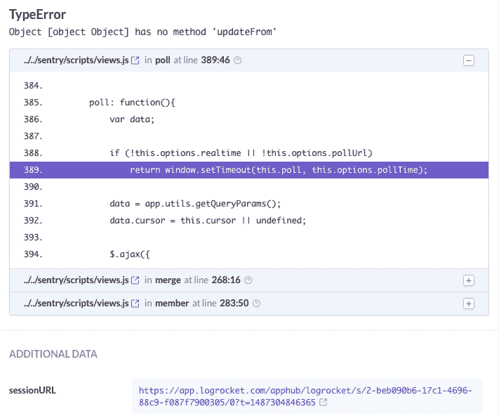
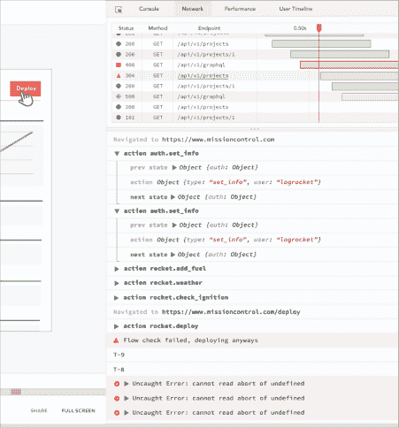
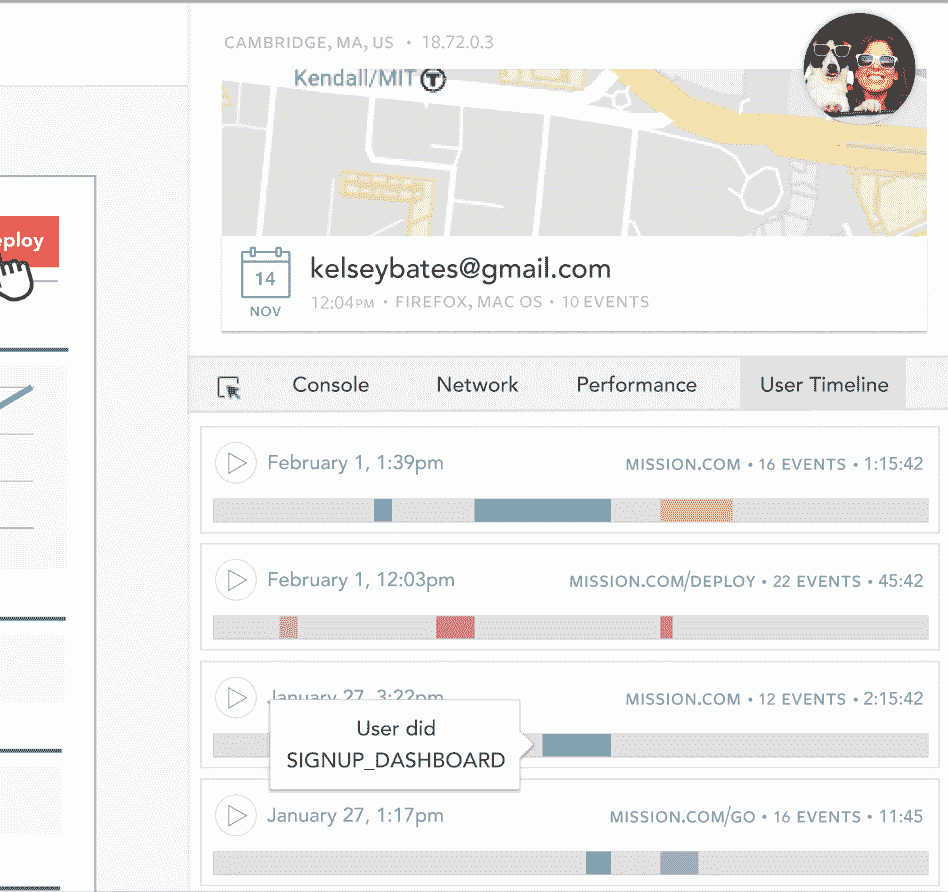
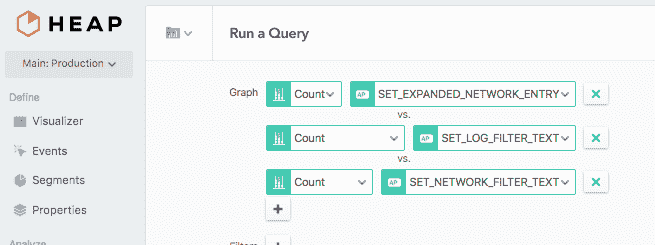

# 使用 Redux 进行日志驱动的开发

> 原文：<https://blog.logrocket.com/log-driven-development-with-redux-5a5468b7f2e/>

# 使用 Redux 的日志驱动开发

## 

2017 年 3 月 6 日 1 分钟阅读 371

有多少次你被产品经理问及“这项功能的使用频率如何？”或者你的 app 出现了神秘的崩溃，无法重现。或者用户 a 报告了一个问题，您必须向他们索要 JavaScript 控制台页面的截图。这在我身上发生过太多次了。

日志驱动开发解决了所有这些问题。这个想法是，通过日志驱动应用程序的业务逻辑，我们能够**自动**捕获信息，帮助我们重现错误，解决用户问题，并理解用户行为，而无需额外的工作。

使用 Redux 使这变得非常简单:我们可以只记录*每件事*，然后稍后搜索和调查我们的日志。以下是我们如何在 LogRocket 使用日志驱动开发的几个例子:

### 场景 1:重现 bug

我们使用崩溃报告工具，我们得到一堆类似这样的错误:

我们没有足够的信息来重现这个 bug。然而，由于我们在应用程序中使用了 Redux，我们在 LogRocket 中捕获了导致问题的一系列事件:

### 场景 2:解决用户问题

前几天，一位用户告诉我们，他们登录有困难。通常情况下，我会问一堆问题来澄清:“你用的是什么账户？”，“能给我们发个截图吗？”，“你试过隐姓埋名模式吗？”在这种情况下，我们已经捕获了日志中的所有信息，并且发现了修复方法，而没有来回切换。成功！

### 场景 3:理解用户行为

我们的产品经理非常努力地理解是什么让我们的用户成功。他设置了 Heap 来追溯分析交互，但是我们发现他仍然需要我们在应用中手动标记一些事件。我设置了一个 Redux 中间件，将我们所有的事件发送给 Segment:[https://github.com/rangle/redux-segment](https://github.com/rangle/redux-segment)，从那以后我们再也没有遇到过问题🙂

### 日志驱动开发入门

*   使用 [Redux](http://redux.js.org/)
*   将 Redux 库用于应用的业务逻辑:

> [redux-查询 REST APIs 的](https://github.com/amplitude/redux-query)

> [阿波罗客户端](https://github.com/apollostack/apollo-client)用于图形 apis

> [异步事件的 redux-saga](https://github.com/redux-saga/redux-saga)

*   使用 [LogRocket](https://logrocket.com) 在生产中捕获日志数据

伐木快乐！

## 使用 [LogRocket](https://lp.logrocket.com/blg/signup) 消除传统错误报告的干扰

[LogRocket](https://lp.logrocket.com/blg/signup) 是一个数字体验分析解决方案，它可以保护您免受数百个假阳性错误警报的影响，只针对几个真正重要的项目。LogRocket 会告诉您应用程序中实际影响用户的最具影响力的 bug 和 UX 问题。

然后，使用具有深层技术遥测的会话重放来确切地查看用户看到了什么以及是什么导致了问题，就像你在他们身后看一样。

LogRocket 自动聚合客户端错误、JS 异常、前端性能指标和用户交互。然后 LogRocket 使用机器学习来告诉你哪些问题正在影响大多数用户，并提供你需要修复它的上下文。

关注重要的 bug—[今天就试试 LogRocket】。](https://lp.logrocket.com/blg/signup-issue-free)