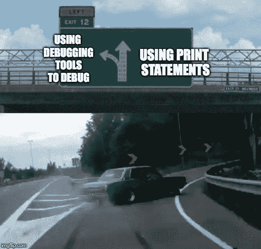
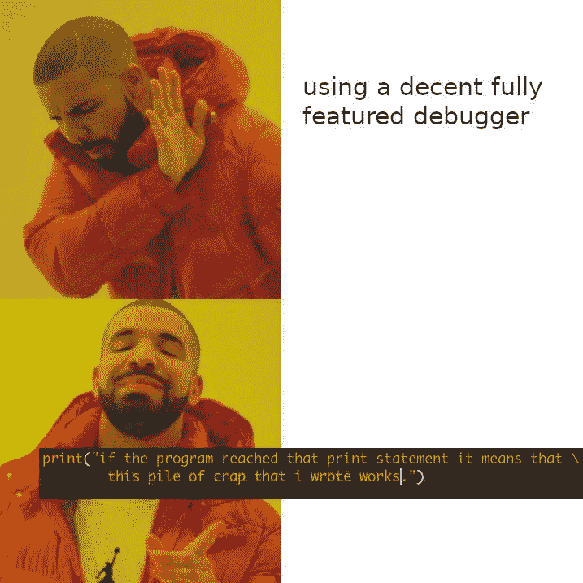

# 移动应用中的日志和远程错误报告

> 原文：<https://blog.logrocket.com/logging-and-remote-error-reporting-in-mobile-apps/>

## 介绍

日志记录以及远程崩溃和错误报告框架已经存在了一段时间。这两种框架的使用因情况而异。

在本文中，我们将讨论这两种框架的使用，包括我们的移动应用程序发布版本中的问题和一些建议的解决方案。我还包括一个集中式框架，它将帮助我们避免这些问题，并最大限度地利用日志记录和远程错误报告。

## 日志框架

首先，让我们定义日志和错误报告框架到底做什么。
使用过 Android 中的 log 语句或者 iOS 中的 print 语句吗？它们是日志框架。它们允许我们这些开发人员在 ide 的控制台窗口中打印几乎任何东西。

需要检查方法中变量的值吗？记录下来。
需要检查 API 响应？记录下来。
需要检查 API JSON 解析错误？记录下来。
需要检查 Catch 块中的错误异常？记录下来。
这样的例子不胜枚举。

日志最常见的用法是在调试时。目前，所有主要的 ide 都配备了内置调试器。它允许开发人员添加断点并浏览代码。它还允许我们在单步执行代码时访问变量值。

尽管如此，大量的开发人员仍然依赖于传统的日志记录方法！不相信我？亲自看看这些迷因:





除了 Java 和 Swift 中默认可用的日志程序之外，在它们之上还构建了各种日志框架。这些框架扩展了记录器的功能和用途。常见的例子有 [Timber (Android)](https://github.com/JakeWharton/timber) 、 [Willow (iOS)](https://github.com/Nike-Inc/Willow) 、 [CocoaLumberjack (iOS)](https://github.com/CocoaLumberjack/CocoaLumberjack) 。

现在我们对什么是日志框架有了一个合理的概念，让我们继续讨论崩溃和错误报告框架。

## 崩溃和错误报告框架

我们在开发应用程序时使用日志。开发人员使用它们来访问每个阶段的变量值，识别崩溃，并调试问题。在 IDE 的控制台中可以看到日志输出。

那么，当应用程序已经投入生产时，如何获得错误和崩溃报告呢？

让我们考虑一个场景:你已经在你的设备上彻底测试了你的应用，然后在它各自的商店发布应用。一些用户抱怨应用程序崩溃或功能无法在他们的设备上运行。

你在这里会做什么？

因为有大量的设备制造商、操作系统、定制 rom 和设备尺寸，几乎不可能在所有这些排列和组合中测试一个应用程序。这为生产环境中可能出现的错误留下了空间。但是，当您无法访问物理设备时，如何调试这样的错误呢？

谢天谢地，一些工具让我们做到了这一点。Firebase Crashlytics 是一款流行的工具。一旦集成到应用程序中，它会自动捕获应用程序崩溃报告，并将其保存在控制台上。然后，开发人员可以轻松地访问这些日志报告并调试错误。

它还允许我们从应用程序中捕获非致命错误和日志。这些可以是 API 错误响应、捕捉异常或我们希望记录的任何内容。

## 有什么区别？

如果你注意到，这两个框架有一些共同之处。你看，日志框架和崩溃与错误报告框架的主要目的都是调试错误。主要区别在于，一个在开发期间使用，另一个在生产中使用。

现在我们已经了解了这两种框架类型及其用途，让我们了解一下一旦我们开始在传统方法中使用它们，我们可能会面临什么问题。一旦我们理解了这个问题，我们就能更好地设计解决方案。

## 远程错误报告的问题和解决方案

### 问题 1:在发布版本中暴露敏感的日志消息

如果你的移动应用已经通过了漏洞评估和渗透测试(VAPT)，你可能会遇到这样一个漏洞:“日志消息泄露敏感信息。在生产版本中禁用记录器。

这在开发过程中很常见。我们记录 API 响应，捕捉错误和其他变量。我们忘记了如何在创建生产构建之前删除这些日志命令。

如果有人将其设备插入计算机并观察控制台中打印的日志，他们可能能够查看我们记录的所有内容。这可能包括敏感参数、整个 API 响应或其他私有信息。

即使我们记得删除这些日志命令，我们也必须在整个源代码中手动删除或注释掉这些日志程序。一个忙乱又重复的过程！

### 解决方案 1:调试并发布基于环境的日志记录

通过应用程序的构建类型，无论是发布构建还是调试，我们都可以控制哪些日志语句需要在控制台中打印，哪些可以忽略。使用它，我们可以不用担心在生产应用程序中记录敏感信息。

* * *

### 更多来自 LogRocket 的精彩文章:

* * *

### 问题 2: API 问题和生产中的非致命错误

我们的大多数移动应用程序都是由来自远程 API 的数据驱动的。如果预期的数据结构与应用程序中编码的 API 响应不匹配，依赖于它的功能可能会失败。

但是，当一个应用程序在生产中，API 结构发生这样的变化时，我们的应用程序的功能将无法工作。我们如何更早地知道这样的场景，以便我们可以在它影响太多用户之前发布修复？我们每天都在监控应用程序的全部功能吗？我们要等人来报告吗？

不，我们不能这么做！我们需要的是一个流程，在这个流程中，我们可以尽快报告这些问题并获得通知。

### 解决方案 2:基于日志级别的远程错误报告

Firebase Crashlytics 提供了一个解决方案:我们需要确定日志的级别。有些可能只是信息性的，有些可能是错误，有些可能是用于调试。

例如，API 错误就属于“错误”类别。我们可以设计一种逻辑，在这种逻辑中，我们将带有正确级别“错误”的日志语句共享给我们的 Firebase 远程错误报告。通过这种方式，我们可以跟踪非致命但破坏功能的问题，并尽快解决它们。

但是，这是否意味着我们必须在应用程序的任何地方编写这些代码呢？这就把我们带到了下一个问题…

### 问题 3:分散的代码和可维护性

问题一和问题二有一些可行的解决方案:添加构建标志和使用 Firebase Crashlytics 进行远程错误记录。但是围绕每个日志语句实现它们并不是一个好的解决方案。

我们的日志语句分散在整个应用程序中。在调试过程中，我们最终会在代码中发布一系列日志语句。我知道这一点，因为我犯了罪。我们不能继续围绕这些日志语句添加自定义逻辑。

让我们也从代码可维护性的角度来看它。当我们想改变记录器的逻辑时会发生什么？我们是否要在整个代码库中围绕每个日志语句不断地改变它？不会吧！我们编码是为了让用户的生活更轻松。为什么不也做我们的呢？

### 解决方案 3:基于构建类型和日志级别的集中式日志框架

现在，缺失的部分是:我们需要上述所有的解决方案协同工作。一个单独的类将控制基于构建类型和基于日志级别的日志，并且在代码库中的每个日志语句周围没有重复的 if-else 逻辑。这将避免代码分散，并有助于代码的可维护性和可伸缩性。

让我们围绕日志级别和构建类型构建一个框架，包括应该在何时何地执行哪些语句。

| 日志级别 | 日志级别–使用情况 | 构建类型 | 安慰 | 远程日志 |
| --- | --- | --- | --- | --- |
| 错误 | 出现非致命错误，导致应用程序功能中断，例如错误的 JSON 格式。该应用程序无法解析此格式，因此该应用程序的功能停止工作。 | 调试 | ✔️ |  |
|  |  | 释放；排放；发布 |  | ✔️ |
| 警告 | 应用程序中出现了原本不应该出现的意外错误，例如函数中特定于设备的异常，或者代码移动到了意外的 catch 块中。 | 调试 | ✔️ |  |
|  |  | 释放；排放；发布 |  | ✔️ |
| 信息 | 添加日志消息以观察应用程序的行为，例如屏幕打开或关闭、API 调用成功返回或数据库查询返回成功。 | 调试 | ✔️ |  |
|  |  | 释放；排放；发布 |  |  |
| 调试 | 为调试特定错误而添加的日志消息，例如变量值或 API 响应值。 | 调试 | ✔️ |  |
|  |  | 释放；排放；发布 | 现在我们已经设计好了解决方案，让我们快速前进，检查一下在 Android 和 iOS 中的实现。 | 我们将使用现有的第三方日志框架，它将帮助我们在运行时基于构建类型创建日志程序。对于远程错误报告，我们将使用 Firebase Crashlytics。你可以在这里了解更多关于使用 Crashlytics 定制崩溃报告的信息。 |

这两种实现的蓝图如下:

使用第三方日志记录框架创建特定于构建类型的记录器

在发布记录器中添加我们的日志级逻辑

1.  用我们定制的日志语句取代传统的日志语句
2.  机器人
3.  为了创建特定于构建类型的日志，我们将使用 Android 中最好的日志库之一: [Timber](https://github.com/JakeWharton/timber) 。如果你已经在用了，太好了！如果没有，我强烈建议在您的项目中使用它。我们将使用 Timber 提供的功能创建基于日志级别的错误报告框架。

### 请注意，我跳过了木材和 [Firebase Crashlytics](https://firebase.google.com/docs/crashlytics/get-started?platform=android) 的整合细节。在他们的官方网页上有最好的描述，我在这一部分有链接。

让我们开始创建我们的框架。

首先，让我们在框架初始化中实现构建类型逻辑。我们将使用两个不同的记录器:一个用于调试模式，另一个用于发布模式。发布模式记录器将是我们定制的:

现在，让我们为发布模式实现我们的定制远程记录器，我们在上面提到过。这将包含日志级逻辑:

让我们检查一下示例用法:

```
public class App extends Application {
    @Override
    public void onCreate() {
        super.onCreate();
        if (BuildConfig.DEBUG) {
            Timber.plant(new Timber.DebugTree());
        }
        else {
            Timber.plant(new LoggingController());
        }
    }
}

```

我们现在将不得不使用`Timber.d()`或`Timber.e()`，而不是使用`Log.d()`或`Log.e()`。剩下的将由我们的框架来处理！

```
public class LoggingController extends Timber.Tree
{
    @Override protected void log(int logLevel, String tag, @NonNull String message, Throwable t)
    {
        if (logLevel == Log.ERROR || logLevel == Log.WARN) {
            FirebaseCrashlytics.getInstance().recordException(t);
        }else{
            return;
        }
    }
}

```

ios

```
Timber.d("Test debug message");
Timber.i("Test info message");
Timber.w(new RuntimeException(), "Test warning message");
Timber.e(new RuntimeException(),"Test error message");

```

在 iOS 中，为了实现构建类型的特定记录器，我们将使用 [Willow](https://github.com/Nike-Inc/Willow) 。由 Nike 创建，它是自定义记录器的最佳 Swift 实现之一。

### 我们将使用 Willow 提供的功能创建基于日志级别的错误报告框架。

请注意，就像我们之前的 Android 实现一样，我跳过了 Willow 和 Firebase Crashlytics 的集成细节。最好在他们的官方页面上描述，我在本文前面已经链接过了。

让我们直接开始创建我们的框架。

首先，让我们在框架配置中实现构建类型逻辑。我们将使用两个不同的记录器:一个用于调试模式，另一个用于发布。发布模式记录器将是我们定制的:

现在，让我们为发布模式实现我们的定制远程记录器，我们在上面提到过。这将具有日志级逻辑:

我们必须在`AppDelegate`中初始化这个框架:

```
var logger: Logger!
public struct LoggingConfiguration {

func configure() {
        #if DEBUG
        logger = buildDebugLogger()
        #else
        logger = buildReleaseLogger()
        #endif
    }

    private func buildReleaseLogger() -> Logger {
        let consoleWriter = LoggingController.sharedInstance
        let queue = DispatchQueue(label: "serial.queue", qos: .utility)
        return Logger(logLevels: [.error,.warn], writers: [consoleWriter],executionMethod: .asynchronous(queue: queue))
    }

    private func buildDebugLogger() -> Logger {
        let consoleWriter = ConsoleWriter()
        return Logger(logLevels: [.all], writers: [consoleWriter], executionMethod: .synchronous(lock: NSRecursiveLock()))
    }
}

```

您可以在此处查看用法示例:

```
open class LoggingController: LogWriter{
    static public var sharedInstance = LoggingController()
    static public var attributeKey = "error"
    private init(){}

    public func writeMessage(_ message: String, logLevel: LogLevel) {
        // Since this is a release logger, we won't be using this...
    }

    public func writeMessage(_ message: LogMessage, logLevel: LogLevel) {
        if logLevel == .error || logLevel == .warn{
            if let error = message.attributes[LoggingController.attributeKey] as? Error{
                 Crashlytics.crashlytics().record(error: error)
            }
        }
    }
}
extension Error{
    func getLogMessage()->LogMessage{
        return ErrorLogMessage(name: "Error", error: self)
    }
}
struct ErrorLogMessage: LogMessage {
    var name: String
    var attributes: [String: Any]

    init(name:String,error:Error) {
        self.name = name
        self.attributes = [LoggingController.attributeKey:error]
    }
}

```

例如，我们现在不得不使用`logger.debugMessage()`或`logger.error()`来代替传统的`print()`命令。其他一切都由我们的框架来处理！

```
class AppDelegate: UIResponder, UIApplicationDelegate {
    func application(_ application: UIApplication, didFinishLaunchingWithOptions launchOptions: [UIApplication.LaunchOptionsKey: Any]?) -> Bool {
        FirebaseApp.configure()
        LoggingConfiguration().configure()
        return true
    }
}

```

结论

```
// Debug Logs
logger.debugMessage("Logging Debug message")

// Info Logs
logger.infoMessage("Logging Info message")

// Error & Warning Logs
let logMessage = getSampleErrorObj().getLogMessage()
logger.error(logMessage)

func getSampleErrorObj()->Error{
    let userInfo = [] // You can add any relevant error info here to help debug it
    return NSError.init(domain: NSCocoaErrorDomain, code: -1001, userInfo: userInfo)
}

```

我们做到了！我们构建了远程错误报告和日志框架。嗯，不完全是一个框架，但更像是一个“包装”框架，扩展了现有库的功能。

# 因为这是我们的定制实现，并且整个逻辑驻留在单个控制器中，所以我们可以随时扩展它的功能，以添加更多的过滤器并增强我们的记录器。这也应该保持我们的代码整洁，并有助于维护。

我希望你今天学到了新的有用的东西。继续学习和建设，并快乐伐木！

使用 [LogRocket](https://lp.logrocket.com/blg/signup) 消除传统错误报告的干扰

[LogRocket](https://lp.logrocket.com/blg/signup) 是一个数字体验分析解决方案，它可以保护您免受数百个假阳性错误警报的影响，只针对几个真正重要的项目。LogRocket 会告诉您应用程序中实际影响用户的最具影响力的 bug 和 UX 问题。

## 然后，使用具有深层技术遥测的会话重放来确切地查看用户看到了什么以及是什么导致了问题，就像你在他们身后看一样。

[](https://lp.logrocket.com/blg/signup)

LogRocket 自动聚合客户端错误、JS 异常、前端性能指标和用户交互。然后 LogRocket 使用机器学习来告诉你哪些问题正在影响大多数用户，并提供你需要修复它的上下文。

关注重要的 bug—[今天就试试 LogRocket】。](https://lp.logrocket.com/blg/signup-issue-free)

LogRocket automatically aggregates client side errors, JS exceptions, frontend performance metrics, and user interactions. Then LogRocket uses machine learning to tell you which problems are affecting the most users and provides the context you need to fix it.

Focus on the bugs that matter — [try LogRocket today](https://lp.logrocket.com/blg/signup-issue-free).