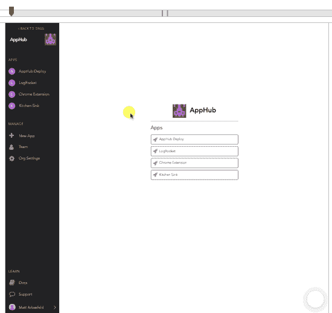
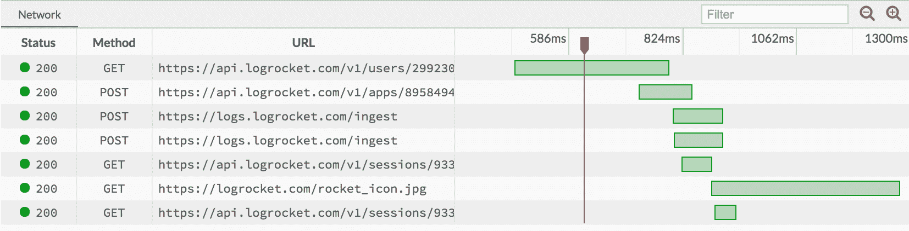
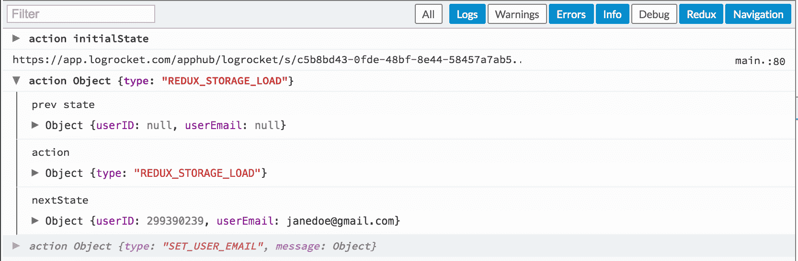

# LogRocket 预览版

> 原文：<https://blog.logrocket.com/logrocket-preview-release-e1fb9b337a80/>

# LogRocket 预览版

## 2016 年 9 月 30 日 26 秒读 125

我们很高兴地宣布 LogRocket 的预览版！

使用 LogRocket，开发人员和支持代理可以快速了解每个 bug 和问题的原因。

LogRocket 与崩溃报告工具和支持工具直接集成，不再有神秘的崩溃或用户问题！

录像

### 查看用户在你的应用中遇到问题时正在做什么:

控制台日志+网络

### 通过检查日志和网络请求/响应，了解问题的根本原因:

Redux

### 如果您使用 Redux 来管理应用程序中的状态，请深入查看并检查会话中每个时刻的状态:

你现在可以从 https://app.logrocket.com 开始。如果您有任何问题，请告诉我们！

干杯，

LogRocket 团队
[https://logrocket.com](https://logrocket.com/)

The LogRocket Team
[https://logrocket.com](https://logrocket.com/)