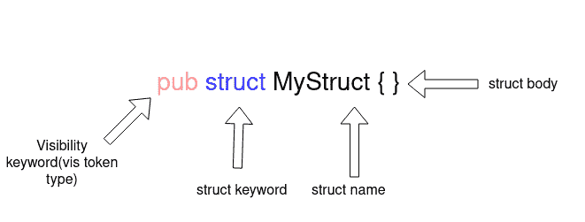
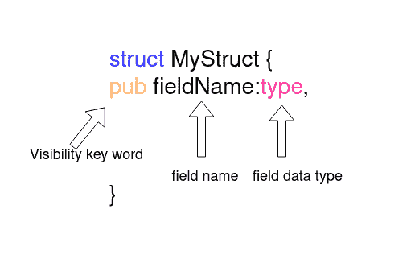

# Rust 中的宏:示例教程

> 原文：<https://blog.logrocket.com/macros-in-rust-a-tutorial-with-examples/>

在本教程中，我们将涵盖你需要知道的关于 Rust 宏的一切，包括 Rust 中宏的介绍和如何使用 Rust 宏的示例演示。

我们将讨论以下内容:

什么是 Rust 宏？

## Rust 对宏有极好的支持。宏使您能够编写编写其他代码的代码，这就是所谓的元编程。

宏提供了类似于函数的功能，但没有运行时成本。但是，由于宏是在编译时扩展的，所以编译时会有一些开销。

Rust 宏与 C 中的宏非常不同。Rust 宏应用于令牌树，而 C 宏是文本替换。

Rust 中宏的类型

## Rust 有两种类型的宏:

**声明性宏**使您能够编写类似于匹配表达式的东西，对您作为参数提供的 Rust 代码进行操作。它使用您提供的代码来生成替换宏调用的代码

1.  **程序宏**允许你对给出的 Rust 代码的抽象语法树(AST)进行操作。proc 宏是从一个`TokenStream`(或两个)到另一个`TokenStream`的函数，其中输出代替了宏调用
2.  让我们放大声明性和过程性宏，并探索一些如何在 Rust 中使用宏的例子。

Rust 中的声明性宏

## 这些宏是使用`macro_rules!`声明的。声明性宏功能稍弱，但提供了一个易于使用的界面来创建宏以删除重复的代码。常见的声明性宏之一是`println!`。声明性宏提供了一个类似于接口的`match`,在匹配时，宏被替换为匹配 arm 中的代码。

创建声明性宏

### 这段代码创建了一个将两个数相加的宏。`[[macro_rules!]](https://doc.rust-lang.org/rust-by-example/macros.html)`与宏的名称、`add`和宏的主体一起使用。

```
// use macro_rules! <name of macro>{<Body>}
macro_rules! add{
 // macth like arm for macro
    ($a:expr,$b:expr)=>{
 // macro expand to this code
        {
// $a and $b will be templated using the value/variable provided to macro
            $a+$b
        }
    }
}

fn main(){
 // call to macro, $a=1 and $b=2
    add!(1,2);
}

```

宏并不将两个数相加，它只是用代码替换自己来将两个数相加。宏的每个分支都接受函数的一个参数，并且可以为参数分配多种类型。如果`add`函数也可以接受单个参数，我们添加另一个分支。

一个宏中可以有多个分支，根据不同的参数扩展到不同的代码。每个分支可以接受多个参数，以符号`$`开头，后面跟一个标记类型:

```
macro_rules! add{
 // first arm match add!(1,2), add!(2,3) etc
    ($a:expr,$b:expr)=>{
        {
            $a+$b
        }
    };
// Second arm macth add!(1), add!(2) etc
    ($a:expr)=>{
        {
            $a
        }
    }
}

fn main(){
// call the macro
    let x=0;
    add!(1,2);
    add!(x);
}

```

`item` —一个项目，如函数、结构、模块等。

*   `block` —一个块(即一组语句和/或表达式，用大括号括起来)
*   `stmt` —一份声明
*   `pat` —一种模式
*   `expr` —一种表达方式
*   `ty` —一种类型
*   `ident` —一个标识符
*   `path` —一条路径(如`foo`、`::std::mem::replace`、`transmute::<_, int>`、…)
*   `meta` —元项；放在`#[...]`和`#![...]`属性里面的东西
*   `tt` —单个令牌树
*   `vis` —可能为空的`Visibility`限定符
*   在本例中，我们使用带有标记类型`ty`的`$typ`参数作为数据类型，如`u8`、`u16`等。该宏在将数字相加之前转换为特定的类型。

Rust 宏还支持接受不固定数量的参数。运算符与正则表达式非常相似。`*`用于零个或多个标记类型，而`+`用于零个或一个参数。

```
macro_rules! add_as{
// using a ty token type for macthing datatypes passed to maccro
    ($a:expr,$b:expr,$typ:ty)=>{
        $a as $typ + $b as $typ
    }
}

fn main(){
    println!("{}",add_as!(0,2,u8));
}

```

重复的令牌类型用`$()`括起来，后面跟一个分隔符和一个`*`或一个`+`，表示令牌将重复的次数。分隔符用于区分不同的标记。跟随有`*`或`+`的`$()`块用于指示代码的重复块。在上面的例子中，`+$a`是一个重复的代码。

```
macro_rules! add_as{
    (
  // repeated block
  $($a:expr)
 // seperator
   ,
// zero or more
   *
   )=>{
       { 
   // to handle the case without any arguments
   0
   // block to be repeated
   $(+$a)*
     }
    }
}

fn main(){
    println!("{}",add_as!(1,2,3,4)); // => println!("{}",{0+1+2+3+4})
}

```

如果仔细观察，您会注意到代码中添加了一个额外的零，以使语法有效。为了删除这个零并使`add`表达式与参数相同，我们需要创建一个名为[TT·蒙奇](https://danielkeep.github.io/tlborm/book/pat-incremental-tt-munchers.html)的新宏。

TT 咀嚼器以递归方式分别处理每个令牌。一次处理一个令牌更容易。宏有三个分支:

```
macro_rules! add{
 // first arm in case of single argument and last remaining variable/number
    ($a:expr)=>{
        $a
    };
// second arm in case of two arument are passed and stop recursion in case of odd number ofarguments
    ($a:expr,$b:expr)=>{
        {
            $a+$b
        }
    };
// add the number and the result of remaining arguments 
    ($a:expr,$($b:tt)*)=>{
       {
           $a+add!($($b)*)
       }
    }
}

fn main(){
    println!("{}",add!(1,2,3,4));
}

```

如果只传递了一个参数，则第一个分支处理该情况

1.  第二个函数处理两个参数被传递的情况
2.  第三个分支用剩余的参数再次调用`add`宏
3.  宏参数不需要用逗号分隔。多个令牌可以与不同的令牌类型一起使用。例如，括号可以与`ident`标记类型一起使用。Rust 编译器获取匹配的 arm，并从参数字符串中提取变量。

如果运算返回`Err`或运算的值返回`Ok`，则`ok_or_return`宏返回函数。它将一个函数作为参数，并在 match 语句中执行它。对于传递给函数的参数，它使用重复。

```
macro_rules! ok_or_return{
// match something(q,r,t,6,7,8) etc
// compiler extracts function name and arguments. It injects the values in respective varibles.
    ($a:ident($($b:tt)*))=>{
       {
        match $a($($b)*) {
            Ok(value)=>value,
            Err(err)=>{
                return Err(err);
            }
        }
        }
    };
}

fn some_work(i:i64,j:i64)->Result<(i64,i64),String>{
    if i+j>2 {
        Ok((i,j))
    } else {
        Err("error".to_owned())
    }
}

fn main()->Result<(),String>{
    ok_or_return!(some_work(1,4));
    ok_or_return!(some_work(1,0));
    Ok(())
}

```

通常，需要将几个宏组合成一个宏。在这些情况下，使用内部宏规则。它有助于操纵宏观输入，写出干净的 TT 咀嚼者。

要创建内部规则，请添加以`@`开头的规则名称作为参数。现在，除非被明确指定为参数，否则宏永远不会匹配内部规则。

Rust 中带有声明性宏的高级解析

```
macro_rules! ok_or_return{
 // internal rule.
    (@error $a:ident,$($b:tt)* )=>{
        {
        match $a($($b)*) {
            Ok(value)=>value,
            Err(err)=>{
                return Err(err);
            }
        }
        }
    };

// public rule can be called by the user.
    ($a:ident($($b:tt)*))=>{
        ok_or_return!(@error $a,$($b)*)
    };
}

fn some_work(i:i64,j:i64)->Result<(i64,i64),String>{
    if i+j>2 {
        Ok((i,j))
    } else {
        Err("error".to_owned())
    }
}

fn main()->Result<(),String>{
   // instead of round bracket curly brackets can also be used
    ok_or_return!{some_work(1,4)};
    ok_or_return!(some_work(1,0));
    Ok(())
}

```

### 宏有时执行需要对 Rust 语言本身进行解析的任务。

把我们到目前为止讨论过的所有概念放在一起，让我们创建一个宏，通过添加关键字`pub`的后缀来公开一个结构。

首先，我们需要解析 Rust 结构以获得结构的名称、结构的字段和字段类型。

解析结构的名称和字段

### 一个`struct`声明的开头有一个可见性关键字(比如`pub`)，接着是`struct`关键字，然后是`struct`的名称和`struct`的主体。



`$vis`将具有可见性，而`$struct_name`将具有一个结构名。要使一个结构成为公共的，我们只需要添加`pub`关键字并忽略`$vis`变量。

```
macro_rules! make_public{
    (
  // use vis type for visibility keyword and ident for struct name
     $vis:vis struct $struct_name:ident { }
    ) => {
        {
            pub struct $struct_name{ }
        }
    }
}

```



一个`struct`可能包含多个具有相同或不同数据类型和可见性的字段。`ty`标记类型用于数据类型，`vis`用于可见性，`ident`用于字段名。我们将对零个或多个字段使用`*`重复。

通常`struct`会附加一些元数据或者程序宏，比如`#[derive(Debug)]`。这些元数据需要保持完整。使用`meta`类型解析元数据。

```
 macro_rules! make_public{
    (
     $vis:vis struct $struct_name:ident {
        $(
 // vis for field visibility, ident for field name and ty for field data type
        $field_vis:vis $field_name:ident : $field_type:ty
        ),*
    }
    ) => {
        {
            pub struct $struct_name{
                $(
                pub $field_name : $field_type,
                )*
            }
        }
    }
}

```

我们的`make_public`宏现在准备好了。为了了解`make_public`是如何工作的，让我们使用 [Rust Playground](https://play.rust-lang.org/) 将宏扩展为实际编译的代码。

```
macro_rules! make_public{
    (
     // meta data about struct
     $(#[$meta:meta])* 
     $vis:vis struct $struct_name:ident {
        $(
        // meta data about field
        $(#[$field_meta:meta])*
        $field_vis:vis $field_name:ident : $field_type:ty
        ),*$(,)+
    }
    ) => {
        { 
            $(#[$meta])*
            pub struct $struct_name{
                $(
                $(#[$field_meta:meta])*
                pub $field_name : $field_type,
                )*
            }
        }
    }
}
```

扩展后的代码如下所示:

```
macro_rules! make_public{
    (
     $(#[$meta:meta])* 
     $vis:vis struct $struct_name:ident {
        $(
        $(#[$field_meta:meta])*
        $field_vis:vis $field_name:ident : $field_type:ty
        ),*$(,)+
    }
    ) => {

            $(#[$meta])*
            pub struct $struct_name{
                $(
                $(#[$field_meta:meta])*
                pub $field_name : $field_type,
                )*
            }
    }
}

fn main(){
    make_public!{
        #[derive(Debug)]
        struct Name{
            n:i64,
            t:i64,
            g:i64,
        }
    }
}

```

声明性宏的限制

```
// some imports

macro_rules! make_public {
    ($ (#[$ meta : meta]) * $ vis : vis struct $ struct_name : ident
     {
         $
         ($ (#[$ field_meta : meta]) * $ field_vis : vis $ field_name : ident
          : $ field_type : ty), * $ (,) +
     }) =>
    {

            $ (#[$ meta]) * pub struct $ struct_name
            {
                $
                ($ (#[$ field_meta : meta]) * pub $ field_name : $
                 field_type,) *
            }
    }
}

fn main() {
        pub struct name {
            pub n: i64,
            pub t: i64,
            pub g: i64,
    }
}

```

### 声明性宏有一些限制。有些与 Rust 宏本身有关，而有些则更具体地与声明性宏有关。

缺乏对宏自动完成和扩展的支持

*   调试声明性宏很困难
*   有限的修改能力
*   大型二进制文件
*   更长的编译时间(这适用于声明性和过程性宏)
*   Rust 中的程序宏

## [程序宏](https://blog.logrocket.com/procedural-macros-in-rust/)是宏的更高级版本。程序宏允许您扩展 Rust 的现有语法。它接受任意输入并返回有效的 Rust 代码。

程序宏是将一个`TokenStream`作为输入并返回另一个`Token Stream`的函数。程序宏操纵输入`TokenStream`产生输出流。

有三种类型的程序宏:

类似属性的宏

1.  派生宏
2.  类似函数的宏
3.  我们将在下面详细讨论每种程序宏类型。

类似属性的宏

### 类似属性的宏使您能够创建一个自定义属性，该属性将自身附加到某个项，并允许对该项进行操作。它也可以接受参数。

在上面的代码中，`some_attribute_macros`是一个属性宏。它操纵功能`perform_task`。

```
#[some_attribute_macro(some_argument)]
fn perform_task(){
// some code
}

```

要编写一个类似属性的宏，首先使用`cargo new macro-demo --lib`创建一个项目。一旦项目准备就绪，更新`Cargo.toml`以通知 cargo 项目将创建程序宏。

现在我们都准备好进入过程宏了。

```
# Cargo.toml
[lib]
proc-macro = true

```

程序宏是以`TokenStream`作为输入并返回另一个`TokenStream`的公共函数。要编写一个过程化的宏，我们需要编写解析器来解析`TokenStream`。Rust 社区有一个很好的解析`TokenStream`的工具`syn`。

`[syn](https://docs.rs/syn/1.0.53/syn/)`为 Rust 语法提供了现成的解析器，可以用来解析`TokenStream`。您也可以通过组合提供`syn`的低级解析器来解析您的语法。

在`Cargo.toml`中增加`syn`和`quote`:

现在我们可以使用编译器提供的用于编写过程宏的`proc_macro`箱，在`lib.rs`中编写一个类似属性的宏。程序宏机箱不能导出除程序宏之外的任何内容，并且机箱中定义的程序宏不能在机箱本身中使用。

```
# Cargo.toml
[dependencies]
syn = {version="1.0.57",features=["full","fold"]}
quote = "1.0.8"

```

为了测试我们添加的宏，通过创建一个名为`tests`的文件夹并在文件夹中添加文件`attribute_macro.rs`来创建一个迎合测试。在这个文件中，我们可以使用类似属性的宏进行测试。

```
// lib.rs
extern crate proc_macro;
use proc_macro::{TokenStream};
use quote::{quote};

// using proc_macro_attribute to declare an attribute like procedural macro
#[proc_macro_attribute]
// _metadata is argument provided to macro call and _input is code to which attribute like macro attaches
pub fn my_custom_attribute(_metadata: TokenStream, _input: TokenStream) -> TokenStream {
    // returing a simple TokenStream for Struct
    TokenStream::from(quote!{struct H{}})
}

```

使用`cargo test`命令运行上述测试。

```
// tests/attribute_macro.rs

use macro_demo::*;

// macro converts struct S to struct H
#[my_custom_attribute]
struct S{}

#[test]
fn test_macro(){
// due to macro we have struct H in scope
    let demo=H{};
}

```

现在我们已经了解了过程宏的基础，让我们使用`syn`进行一些高级的`TokenStream`操作和解析。

为了了解如何使用`syn`进行解析和操作，让我们以 [`syn` GitHub repo](https://github.com/dtolnay/syn/blob/master/examples/trace-var/trace-var/src/lib.rs) 为例。此示例创建一个 Rust 宏，该宏在值发生变化时跟踪变量。

首先，我们需要确定我们的宏将如何操作它附加的代码。

`trace_vars`宏取其需要跟踪的变量名，并在每次输入变量`a`的值改变时注入一个打印语句。它跟踪输入变量的值。

```
#[trace_vars(a)]
fn do_something(){
  let a=9;
  a=6;
  a=0;
}

```

首先，解析类似属性的宏所附加的代码。`syn`为 Rust 函数语法提供了一个内置的解析器。`ItemFn`将解析函数，如果语法无效，将抛出一个错误。

现在我们已经解析了`input`，让我们转到`metadata`。对于`metadata`，没有内置的解析器可以工作，所以我们必须使用`syn`的`parse`模块自己写一个。

```
#[proc_macro_attribute]
pub fn trace_vars(_metadata: TokenStream, input: TokenStream) -> TokenStream {
// parsing rust function to easy to use struct
    let input_fn = parse_macro_input!(input as ItemFn);
    TokenStream::from(quote!{fn dummy(){}})
}

```

为了让`syn`工作，我们需要实现由`syn`提供的`Parse`特征。`Punctuated`用于创建由`,`分隔的`Indent`的`vector`。

```
#[trace_vars(a,c,b)] // we need to parse a "," seperated list of tokens
// code

```

一旦我们实现了`Parse`特征，我们就可以使用`parse_macro_input`宏来解析`metadata`。

```
struct Args{
    vars:HashSet<Ident>
}

impl Parse for Args{
    fn parse(input: ParseStream) -> Result<Self> {
        // parses a,b,c, or a,b,c where a,b and c are Indent
        let vars = Punctuated::<Ident, Token![,]>::parse_terminated(input)?;
        Ok(Args {
            vars: vars.into_iter().collect(),
        })
    }
}

```

我们现在将修改`input_fn`以在变量改变值时添加`println!`。要添加这个，我们需要过滤有赋值的大纲，并在那一行之后插入一个 print 语句。

```
#[proc_macro_attribute]
pub fn trace_vars(metadata: TokenStream, input: TokenStream) -> TokenStream {
    let input_fn = parse_macro_input!(input as ItemFn);
// using newly created struct Args
    let args= parse_macro_input!(metadata as Args);
    TokenStream::from(quote!{fn dummy(){}})
}

```

在上面的例子中，`quote`宏用于模板化和编写 Rust。`#`用于注入变量的值。

```
impl Args {
    fn should_print_expr(&self, e: &Expr) -> bool {
        match *e {
            Expr::Path(ref e) => {
 // variable shouldn't start wiht ::
                if e.path.leading_colon.is_some() {
                    false
// should be a single variable like `x=8` not n::x=0 
                } else if e.path.segments.len() != 1 {
                    false
                } else {
// get the first part
                    let first = e.path.segments.first().unwrap();
// check if the variable name is in the Args.vars hashset
                    self.vars.contains(&first.ident) && first.arguments.is_empty()
                }
            }
            _ => false,
        }
    }

// used for checking if to print let i=0 etc or not
    fn should_print_pat(&self, p: &Pat) -> bool {
        match p {
// check if variable name is present in set
            Pat::Ident(ref p) => self.vars.contains(&p.ident),
            _ => false,
        }
    }

// manipulate tree to insert print statement
    fn assign_and_print(&mut self, left: Expr, op: &dyn ToTokens, right: Expr) -> Expr {
 // recurive call on right of the assigment statement
        let right = fold::fold_expr(self, right);
// returning manipulated sub-tree
        parse_quote!({
            #left #op #right;
            println!(concat!(stringify!(#left), " = {:?}"), #left);
        })
    }

// manipulating let statement
    fn let_and_print(&mut self, local: Local) -> Stmt {
        let Local { pat, init, .. } = local;
        let init = self.fold_expr(*init.unwrap().1);
// get the variable name of assigned variable
        let ident = match pat {
            Pat::Ident(ref p) => &p.ident,
            _ => unreachable!(),
        };
// new sub tree
        parse_quote! {
            let #pat = {
                #[allow(unused_mut)]
                let #pat = #init;
                println!(concat!(stringify!(#ident), " = {:?}"), #ident);
                #ident
            };
        }
    }
}

```

现在我们将对`input_fn`执行 DFS 并插入 print 语句。`syn`提供了一个`Fold`特征，可以在任何`Item`上为 DFS 实现。我们只需要修改与我们想要操作的令牌类型相对应的特征方法。

`Fold`特征用于进行`Item`的 DFS。它使您能够对各种令牌类型使用不同的行为。

```
impl Fold for Args {
    fn fold_expr(&mut self, e: Expr) -> Expr {
        match e {
// for changing assignment like a=5
            Expr::Assign(e) => {
// check should print
                if self.should_print_expr(&e.left) {
                    self.assign_and_print(*e.left, &e.eq_token, *e.right)
                } else {
// continue with default travesal using default methods
                    Expr::Assign(fold::fold_expr_assign(self, e))
                }
            }
// for changing assigment and operation like a+=1
            Expr::AssignOp(e) => {
// check should print
                if self.should_print_expr(&e.left) {
                    self.assign_and_print(*e.left, &e.op, *e.right)
                } else {
// continue with default behaviour
                    Expr::AssignOp(fold::fold_expr_assign_op(self, e))
                }
            }
// continue with default behaviour for rest of expressions
            _ => fold::fold_expr(self, e),
        }
    }

// for let statements like let d=9
    fn fold_stmt(&mut self, s: Stmt) -> Stmt {
        match s {
            Stmt::Local(s) => {
                if s.init.is_some() && self.should_print_pat(&s.pat) {
                    self.let_and_print(s)
                } else {
                    Stmt::Local(fold::fold_local(self, s))
                }
            }
            _ => fold::fold_stmt(self, s),
        }
    }
}

```

现在，我们可以使用`fold_item_fn`在解析后的代码中插入打印语句。

这个代码示例来自 [`syn`示例报告](https://github.com/dtolnay/syn/blob/master/examples/trace-var/trace-var/src/lib.rs)，这是学习过程宏的一个极好的资源。

```
#[proc_macro_attribute]
pub fn trace_var(args: TokenStream, input: TokenStream) -> TokenStream {
// parse the input
    let input = parse_macro_input!(input as ItemFn);
// parse the arguments
    let mut args = parse_macro_input!(args as Args);
// create the ouput
    let output = args.fold_item_fn(input);
// return the TokenStream
    TokenStream::from(quote!(#output))
}

```

自定义派生宏

### Rust 中自定义派生宏允许自动实现特征。这些宏使您能够使用`#[derive(Trait)]`实现特征。

`syn`对`derive`宏有很好的支持。

要在 Rust 中编写一个定制的派生宏，我们可以使用`DeriveInput`解析输入来派生宏。我们还将使用`proc_macro_derive`宏来定义一个定制的派生宏。

```
#[derive(Trait)]
struct MyStruct{}

```

使用`syn`可以编写更高级的程序宏。从`syn`的回购中查看[这个例子](https://github.com/dtolnay/syn/blob/master/examples/heapsize/heapsize_derive/src/lib.rs)。

```
#[proc_macro_derive(Trait)]
pub fn derive_trait(input: proc_macro::TokenStream) -> proc_macro::TokenStream {
    let input = parse_macro_input!(input as DeriveInput);

    let name = input.ident;

    let expanded = quote! {
        impl Trait for #name {
            fn print(&self) -> usize {
                println!("{}","hello from #name")
           }
        }
    };

    proc_macro::TokenStream::from(expanded)
}

```

类似函数的宏

### 类似函数的宏类似于声明性宏，因为它们是用宏调用操作符`!`调用的，看起来像函数调用。它们对括号内的代码进行操作。

以下是如何在 Rust 中编写类似函数的宏:

类似函数的宏不是在运行时执行，而是在编译时执行。它们可以在 Rust 代码中的任何地方使用。类似函数的宏也接受一个`TokenStream`并返回一个`TokenStream`。

```
#[proc_macro]
pub fn a_proc_macro(_input: TokenStream) -> TokenStream {
    TokenStream::from(quote!(
            fn anwser()->i32{
                5
            }
))
}

```

使用程序宏的优点包括:

使用`span`更好地处理错误

*   更好地控制产量
*   社区建造的板条箱`syn`和`quote`
*   比声明性宏更强大
*   结论

## 在这个 Rust 宏教程中，我们介绍了 Rust 中宏的基础知识，定义了声明性和过程性宏，并介绍了如何使用各种语法和社区构建的框架编写这两种类型的宏。我们还概述了使用每种 Rust 宏的优点。

[log rocket](https://lp.logrocket.com/blg/rust-signup):Rust 应用的 web 前端的全面可见性

## 调试 Rust 应用程序可能很困难，尤其是当用户遇到难以重现的问题时。如果您对监控和跟踪 Rust 应用程序的性能、自动显示错误、跟踪缓慢的网络请求和加载时间感兴趣，

.

[try LogRocket](https://lp.logrocket.com/blg/rust-signup)

LogRocket 就像是网络和移动应用程序的 DVR，记录你的 Rust 应用程序上发生的一切。您可以汇总并报告问题发生时应用程序的状态，而不是猜测问题发生的原因。LogRocket 还可以监控应用的性能，报告客户端 CPU 负载、客户端内存使用等指标。

[](https://lp.logrocket.com/blg/rust-signup)

现代化调试 Rust 应用的方式— [开始免费监控](https://lp.logrocket.com/blg/rust-signup)。

Modernize how you debug your Rust apps — [start monitoring for free](https://lp.logrocket.com/blg/rust-signup).