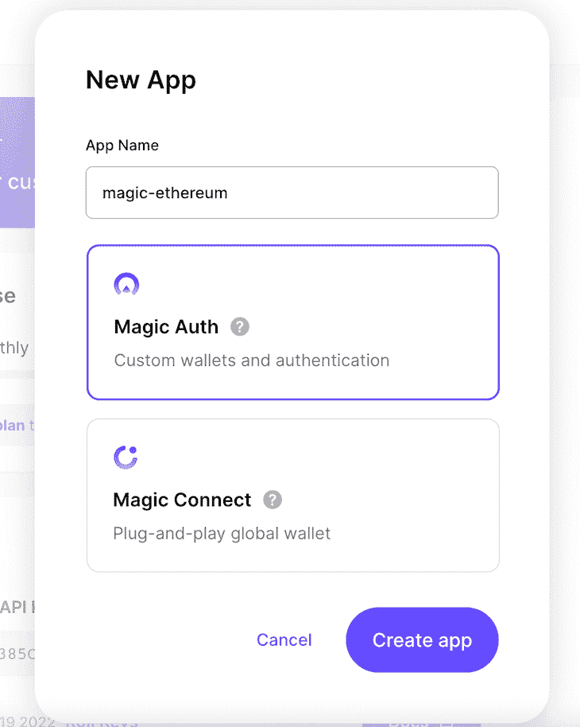
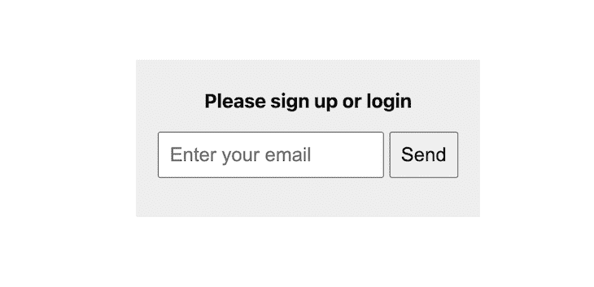
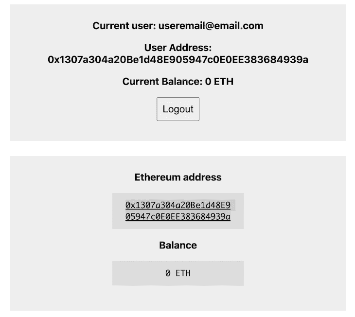
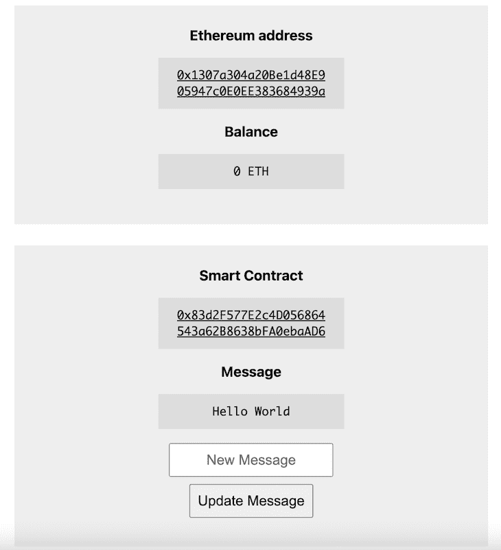
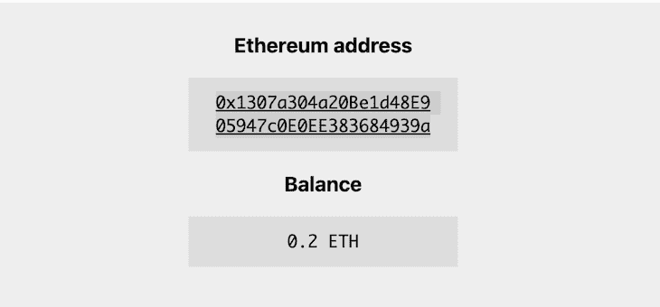
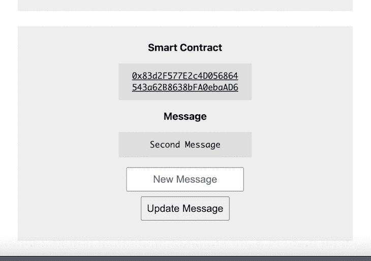
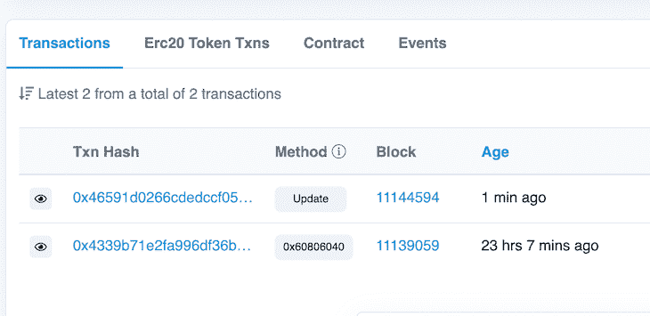
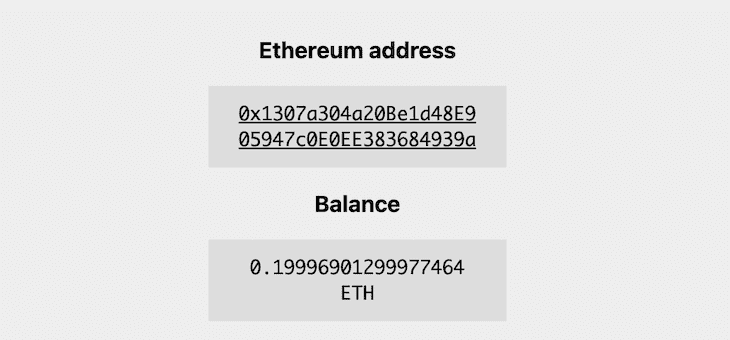

# 在以太坊区块链博客上使用魔法

> 原文：<https://blog.logrocket.com/magic-ethereum-blockchain/>

在构建 web 应用程序时，身份验证可能是一个令人头疼的问题。开发人员需要决定他们想要实现什么样的安全模式，并以正确的方式来实现。

Magic ，前身为 [Fortmatic](https://fortmatic.com/) ，以其快速、无缝、单向的网络认证集成而闻名，现在由于其 [Magic Auth 产品](https://magic.link/docs/auth/overview)而成为区块链生态系统的主要参与者。

在本教程中，我们将演示如何在以太坊上使用魔法，讨论如何设置智能合约，并学习如何在以太坊区块链上使用魔法来认证用户。

您可以找到一个到公共 repo 的[链接，其中包含我们在本文中创建的项目。我们将讨论以下内容:](https://github.com/chyke007/magic-ethereum)

我们开始吧！

## 什么是区块链？

区块链是一个在过去五年中搅动了互联网的时髦词，但简单地说，它是一个在计算机网络的节点之间共享的分布式数据库，以数字格式电子存储信息。区块链已经被广泛采用，因为它保证了数据记录的真实性和安全性。

区块链因其在加密货币系统中的关键作用而闻名，在加密货币系统中，他们维护着安全和分散的交易记录。

以太坊是一个流行的、去中心化的开源区块链，具有智能合约功能。在本文中，我们将使用以太坊作为我们交互的区块链。

## 什么是魔法和魔法认证？

Magic 最初名为 [Fortmatic](https://fortmatic.com/) ，因提供无缝方式将身份验证集成到 web 应用程序中而广为人知。Magic 是一个支持无密码身份验证的 SDK，只需几行代码就可以集成到您的应用程序中。

[Magic Auth](https://magic.link/auth) ，我们将在本文中使用，是一个 SDK，当它集成到您的应用程序中时，可以使用 magic links 实现无密码的 Web2 和 Web3 登录和身份验证。在撰写本文时，Magic Auth 支持超过 20 个区块链，只需几行代码就可以实现。

## web3.js 是什么？

web3.js 是一个库的集合，允许你使用 HTTP、IPC 或 WebSocket 与本地或远程以太坊节点进行交互。总之，Web3.js 是一个库，它使我们能够使用 JavaScript 与以太坊区块链进行交互。

## 设置 Magic 和 Web3.js

要开始在以太坊区块链使用魔法，我们需要添加一些配置和设置。

首先，创建一个新目录来存放我们的项目:

```
 mkdir magic-blockchain && cd magic-blockchain

```

接下来，初始化 Node.js 项目:

```
npm init -y

```

现在，我们将安装 web3.js 库和 Magic SDK:

```
npm install --save web3 [email protected] 

```

## 撰写我们的智能合同

我们需要创建一个智能合同，我们可以稍后部署到以太坊区块链。智能合约是存储在区块链上的程序，在满足预定条件时运行。

我们将创建一个基本的“你好，世界！”聪明的合同。用以下代码创建一个名为`helloworld.sol`的新文件:

```
// SPDX-License-Identifier: MIT

pragma solidity ^0.8.9;

contract helloworld {

  string public message = "Hello World";

  function update(string memory newMessage) public {
    message = newMessage;
  }

}

```

## 编译智能合同

如前所述，我们需要将我们的智能合约部署到以太坊区块链。为此，我们需要将它编译成一种可以在区块链中执行的形式。

我们将使用下面的代码，通过获取我们需要的 Abi 和字节码来帮助我们编译智能合约:

```
npm i [email protected]

```

创建一个名为`compile.js`的文件，并将下面的代码添加到其中:

```
const path  = require('path');
const fs = require('fs');
const  solc = require('solc')
const helloWorldPath = path.resolve(__dirname, '' , 'helloworld.sol');
const file = fs.readFileSync(helloWorldPath).toString();
// Input structure for solidity compiler
var input = {
    language: "Solidity",
    sources: {
      "helloworld.sol": {
        content: file,
      },
    },

    settings: {
      outputSelection: {
        "*": {
          "*": ["*"],
        },
      },
    },
  };
  const output = JSON.parse(solc.compile(JSON.stringify(input)));
  if(output.errors) {
      output.errors.forEach(err => {
          console.log(err.formattedMessage);
      });
  } else {
      const bytecode = output.contracts['helloworld.sol'].helloworld.evm.bytecode.object;
      const abi = output.contracts['helloworld.sol'].helloworld.abi;
      console.log(`bytecode: ${bytecode}`);
      console.log(`abi: ${JSON.stringify(abi, null, 2)}`);
  }

```

接下来，我们编译契约以获得我们需要的`abi`和`bytecode`。运行`node compile.js`并复制输出`bytecode`和`abi`到安全的地方存储它们。

对于契约部署，我将使用我已经部署的契约的地址。

## 使用 Magic Auth 认证用户

如前所述，Magic Auth 为所有经过身份验证的用户创建了一个以太坊公共地址，我们可以用它来对用户进行身份验证。

让我们创建一个`index.html`文件，作为我们将要开发的应用程序的 GUI。

为了验证用户进入我们的应用程序，我们将与 Magic 集成。一旦用户通过认证，我们将能够在以太坊区块链上看到由 Magic 为该用户自动创建的帐户和公共地址。

在实现这一点之前，我们首先需要创建一个神奇的 Auth 应用程序来获取我们在应用程序中需要的密钥。

前往你的神奇仪表盘，点击**新应用**按钮，输入应用名称。然后，复制`PUBLISHABLE API KEY`的内容:



`index.html`文件的内容支持登录和注销功能，以及与以太坊区块链的初始交互:

```
<!DOCTYPE html>
<html>
  <head>
    <title>Magic and Ethereum</title>
    <meta charset="UTF-8" />
    <meta name="viewport" content="width=device-width, initial-scale=1" />
    <link rel="stylesheet" type="text/css" href="styles.css" />
    <script src="https://auth.magic.link/sdk"></script>
    <script src="https://cdn.jsdelivr.net/npm/[email protected]/dist/web3.min.js"></script>
    <script>
      /* Configure Ethereum provider */
      const magic = new Magic("pk_live_your_own_here", {
        network: "rinkeby"
      });
      const web3 = new Web3(magic.rpcProvider);
      const render = async () => {
        const isLoggedIn = await magic.user.isLoggedIn();

        let authHtml = `
          <div class="container">
            <h1>Please sign up or login</h1>
            <form onsubmit="login(event)">
              <input type="email" name="email" required="required" placeholder="Enter your email" />
              <button type="submit">Send</button>
            </form>
          </div>
        `;
        let userHtml = "";
        const target = document.querySelector("#app");
        if (isLoggedIn) {
          const userMetadata = await magic.user.getMetadata();
          const userAddress = (await web3.eth.getAccounts())[0];
          const userBalance = web3.utils.fromWei(
            await web3.eth.getBalance(userAddress)
          );
          authHtml = `
             <div class="container">
              <h1>Current user: ${userMetadata.email}</h1>
              <h1>User Address: ${userAddress}</h1>
              <h1>Current Balance: ${userBalance} ETH</h1>
              <button onclick="logout()">Logout</button>
            </div>
         `;

          userHtml = `
            <div class="container">
              <h1>Ethereum address</h1>
              <div class="info">
                <a href="https://rinkeby.etherscan.io/address/${userAddres                    s}" target="_blank">${userAddress}</a>
              </div>
              <h1>Balance</h1>
              <div class="info">${userBalance} ETH</div>
            </div>
          `;
        }
        target.innerHTML = authHtml + userHtml
      };
      const login = async e => {
        e.preventDefault();
        const email = new FormData(e.target).get("email");
        if (email) {
          await magic.auth.loginWithMagicLink({ email });
          render();
        }
      };

      const logout = async () => {
        await magic.user.logout();
        render();
      };
</script>
  </head>
  <body onload="render()">
    <div id="app">
      <div class="container">Loading...</div>
    </div>
  </body>
</html>

```



用户通过身份验证后，我们向他们展示一些细节以确保一切正常:



## 给区块链写信

用户登录后，他们可以通过魔术与区块链互动。为了测试这一点，我们将通过写入区块链来更新契约中的消息属性。

我们将简单地调用契约中的`update`方法，并传入新消息。让我们更新一下`index.html`文件:

```
const contractABI = 'theabi';
let contractAddress = "0x83d2F577E2c4D056864543a62B8638bFA0ebaAD6";

let userHtml = "";
let contractHtml = "";
if (isLoggedIn) {
let contract = new web3.eth.Contract(
            JSON.parse(contractABI),
            contractAddress
          );
          const currentMessage = await contract.methods.message().call();
          contractHtml = `
            <div class="container">
              <h1>Smart Contract</h1>
              <div class="info">
                <a href="https://rinkeby.etherscan.io/address/${contractAddress}" target="_blank">${contractAddress}</a>
              </div>
              <h1>Message</h1>
              <div class="info">${currentMessage}</div>
              <form onsubmit="update(event)">
                <input type="text" name="new-message" class="full-width" required="required" placeholder="New Message" />
                <button id="btn-update-msg" type="submit">Update Message</button>
              </form>
            </div>
          `;
        }

target.innerHTML = authHtml + userHtml + contractHtml

```

接下来，我们添加`update`方法，它简单地使用 Magic 提供的第一个公共以太坊帐户来发送对契约的`update`方法的调用:

```
const update = async e => {
        e.preventDefault();
        const newMessage = new FormData(e.target).get("new-message");
        if (newMessage) {
          const btnUpdateMsg = document.getElementById("btn-update-msg");
          btnUpdateMsg.disabled = true;
          btnUpdateMsg.innerText = "Updating...";
          const fromAddress = (await web3.eth.getAccounts())[0];
          const contract = new web3.eth.Contract(
            JSON.parse(contractABI),
            contractAddress
          );
          const receipt = await contract.methods
            .update(newMessage)
            .send({ from: fromAddress });
          console.log("Completed:", receipt);
          render();
        }
      };

```

我们现在有了一个新的界面，如下图所示:



一旦用户输入新消息，将启动一个新事务来更新消息属性。

请记住，我们需要将测试醚添加到用于与区块链交互的帐户中。为此，请前往 [Rinkeby 乙醚龙头](https://rinkeby-faucet.com/)。在您的帐户中获得一些乙醚后，请刷新页面以反映所做的更改:



接下来，用户通过插入新消息来更新消息。这将需要一些时间，因为它需要与运行在 Rinkeby 网络上的以太坊区块链进行交互。一旦完成，它应该重新呈现页面，并显示新的合同消息。



通过[点击链接](https://rinkeby.etherscan.io/address/0x83d2F577E2c4D056864543a62B8638bFA0ebaAD6)到已部署的智能合同，转到 Rinkeby，验证我们可以看到部署合同和更新消息的事务:



本次更新从我们用于更新的帐户中扣除了一些油费。如果我们检查当前余额，我们会看到所需的乙醚被扣除:



## 结论

在本文中，我们了解了 Magic 以及它如何使用 web3.js JavaScript 库与以太坊区块链集成。

希望您喜欢这篇文章，并对 Magic 给区块链开发人员创造安全、分散的应用程序的机会感到兴奋。感谢阅读！

## 加入像 Bitso 和 Coinsquare 这样的组织，他们使用 LogRocket 主动监控他们的 Web3 应用

影响用户在您的应用中激活和交易的能力的客户端问题会极大地影响您的底线。如果您对监控 UX 问题、自动显示 JavaScript 错误、跟踪缓慢的网络请求和组件加载时间感兴趣，

[try LogRocket](https://lp.logrocket.com/blg/web3-signup)

.

[](https://lp.logrocket.com/blg/web3-signup)[https://logrocket.com/signup/](https://lp.logrocket.com/blg/web3-signup)

LogRocket 就像是网络和移动应用的 DVR，记录你的网络应用或网站上发生的一切。您可以汇总和报告关键的前端性能指标，重放用户会话和应用程序状态，记录网络请求，并自动显示所有错误，而不是猜测问题发生的原因。

现代化您调试 web 和移动应用的方式— [开始免费监控](https://lp.logrocket.com/blg/web3-signup)。