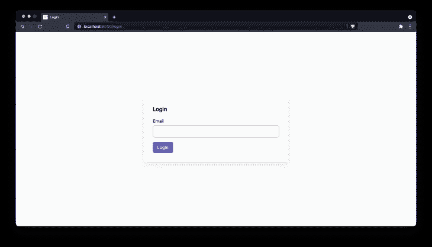
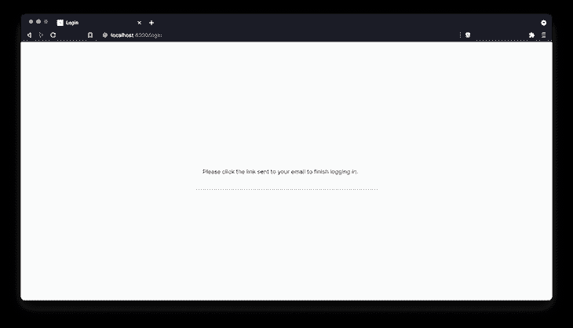
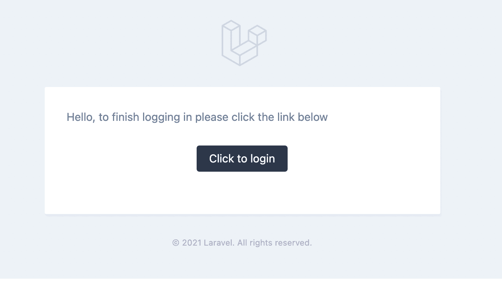
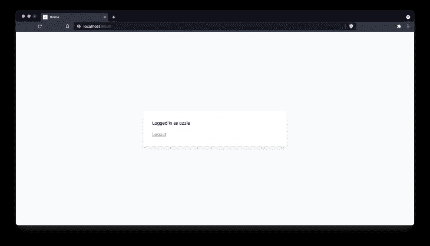

# 与 Laravel - LogRocket 博客的神奇登录链接

> 原文：<https://blog.logrocket.com/magic-login-links-with-laravel/>

如果你曾经使用过像 Vercel 或 Medium 这样的网站，你可能曾经经历过无密码登录。

流程通常是这样的:输入你的电子邮件->提交表格->电子邮件发送给你->你点击里面的链接->你登录。

这对每个人来说都很方便。用户不必记住网站任意规则集的密码，网站管理员(人们还在使用这个术语吗？)不用担心密码泄露或者他们的加密是否足够好。

在本文中，我们将探索如何使用标准的 Laravel 安装来实现这个流程。

我们将假设您对 Laravel 的 MVC 结构有一个工作理解，并且您的环境已经设置了`composer`和`php`。

> 请注意，为了简洁起见，本文中的代码块可能不包括整个文件。

## 环境设置

让我们从创建一个新的 Laravel 8 应用程序开始:

```
$ composer create-project laravel/laravel magic-links

```

然后，我们需要`cd`进入我们的项目，并确保我们输入了我们的数据库凭证。确保事先也创建了数据库。

在我的例子中，我使用 PostgreSQL，我通过 [TablePlus](https://tableplus.com/) 完成所有的配置。打开`.env`文件:

```
# .env
DB_CONNECTION=pgsql
DB_HOST=127.0.0.1
DB_PORT=5432
DB_DATABASE=magic_link
DB_USERNAME=postgres
DB_PASSWORD=postgres

```

现在我们的数据库已经配置好了，但是还不要运行迁移！让我们看看 Laravel 在`database/migrations/2014_10_12_000000_create_users_table.php`中为我们创建的默认用户迁移。

您将看到默认用户表包含一个密码列。既然我们在做无密码认证，我们可以摆脱它:

```
public function up()
{
  Schema::create('users', function (Blueprint $table) {
    $table->id();
    $table->string('name');
    $table->string('email')->unique();
    $table->timestamp('email_verified_at')->nullable();
    $table->rememberToken();
    $table->timestamps();
  });
}

```

删除那一行后，继续保存文件。在我们进行清理的同时，让我们继续删除密码重置表的迁移，因为它对我们没有任何用处:

```
$ rm database/migrations/2014_10_12_100000_create_password_resets_table.php

```

我们的初始数据库模式已经准备好了，现在让我们开始迁移:

```
$ php artisan migrate

```

让我们也从`app/Models/User.php`中的用户模型的`$fillable`数组中删除`password`属性，因为它不再存在:

```
protected $fillable = [
  'name',
  'email',
];

```

我们还想配置我们的邮件驱动程序，以便我们可以预览我们的登录电子邮件。我喜欢使用免费的 SMTP 捕捉器(你可以发送电子邮件到任何地址，它们只会出现在 Mailtrap 中，而不会被发送到实际的用户)，但是你可以使用任何你喜欢的。

如果你不想设置任何东西，你可以使用`log`邮件程序，邮件会以原始文本的形式出现在`storage/logs/laravel.log`中。

回到之前同一个`.env`文件:

```
# .env
MAIL_MAILER=smtp
MAIL_HOST=smtp.mailtrap.io
MAIL_PORT=2525
MAIL_USERNAME=redacted
MAIL_PASSWORD=redacted
MAIL_ENCRYPTION=tls
[email protected]

```

我们现在准备开始建造了！

## 我们的方法

我们在本文的开头讨论了从用户的角度来看流程是什么样子，但是从技术的角度来看这是如何工作的呢？

嗯，给定一个用户，我们需要能够发送给他们一个独特的链接，当他们点击它，登录到自己的帐户。

这告诉我们，我们可能需要生成某种唯一的令牌，将它与试图登录的用户相关联，构建一个路由来查看该令牌并确定它是否有效，然后让用户登录。我们还希望只允许这些令牌使用一次，并且只在生成后的一定时间内有效。

因为我们需要跟踪令牌是否已经被使用，所以我们将它们存储在数据库中。跟踪哪个令牌属于哪个用户，以及该令牌是否被使用过，以及它是否已经过期，也将非常方便。

## 创建测试用户

在本文中，我们将只关注登录流程。这将由您来创建一个注册页面，虽然它将遵循所有相同的步骤。

因此，我们需要数据库中的一个用户来测试登录。让我们使用 tinker 创建一个:

```
$ php artisan tinker
> User::create(['name' => 'Jane Doe', 'email' => '[email protected]'])

```

## 登录路径

我们将首先创建一个控制器`AuthController`，我们将使用它来处理登录、验证和注销功能:

```
$ php artisan make:controller AuthController

```

现在让我们在应用程序的`routes/web.php`文件中注册登录路径。在欢迎路由下面，让我们定义一个路由组，它将使用`guest`中间件保护我们的认证路由，阻止已经登录的人查看它们。

在该组中，我们将创建两条路线。一个用于显示登录页面，另一个用于处理表单的提交。我们还将为它们命名，以便以后可以方便地引用它们:

```
Route::group(['middleware' => ['guest']], function() {
  Route::get('login', [AuthController::class, 'showLogin'])->name('login.show');
  Route::post('login', [AuthController::class, 'login'])->name('login');
});

```

现在路由已经注册了，但是我们需要创建响应这些路由的操作。让我们在我们创建的控制器`app/Http/Controllers/AuthController.php`中创建那些方法。

现在，我们将让登录页面返回位于`auth.login`的视图(接下来我们将创建它)，并创建一个占位符`login`方法，我们将在构建表单后返回:

```
<?php
namespace App\Http\Controllers;

use Illuminate\Http\Request;

class AuthController extends Controller
{
  public function showLogin()
  {
    return view('auth.login');
  }

  public function login(Request $request)
  {
    // TODO
  }
}

```

我们将使用 Laravel 的模板系统 Blade 和 [TailwindCSS](https://tailwindcss.com/) 作为我们的视图。

因为本文的主要焦点是后端逻辑，所以我们不打算详细讨论样式。我不想花时间设置一个合适的 CSS 配置，所以我们将使用这个 [TailwindCSS JIT CDN](https://beyondco.de/blog/tailwind-jit-compiler-via-cdn) ，我们可以将它放入我们的布局中，以处理正确的样式。

第一次加载页面时，您可能会注意到一系列样式。这是因为样式直到页面加载后才存在。在生产环境中，您可能不希望这样，但是对于本教程来说，这样做很好。

让我们首先创建一个可以用于所有页面的总体布局。该文件将保存在`resources/views/layouts/app.blade.php`:

```
<!DOCTYPE html>
<html lang="en">
<head>
  <meta charset="UTF-8">
  <meta http-equiv="X-UA-Compatible" content="IE=edge">
  <meta name="viewport" content="width=device-width, initial-scale=1.0">
  <title>{{ $title }}</title>
</head>
<body>
  @yield('content')
  <script src="https://unpkg.com/tailwindcss-jit-cdn"></script>
</body>
</html>

```

这里我要指出几件事

*   页面标题将由一个`$title`变量设置，当我们从它扩展时，我们将把它传递到布局中
*   刀片指令——当我们从这个布局扩展时，我们将使用一个名为“内容”的命名部分来放置特定于页面的内容
*   我们用来处理样式的 TailwindCSS JIT CDN 脚本

现在我们有了布局，我们可以在`resources/views/auth/login.blade.php`中创建注册页面:

```
@extends('layouts.app', ['title' => 'Login'])
@section('content')
  <div class="h-screen bg-gray-50 flex items-center justify-center">
    <div class="w-full max-w-lg bg-white shadow-lg rounded-md p-8 space-y-4">
      <h1 class="text-xl font-semibold">Login</h1>
      <form action="{{ route('login') }}" method="post" class="space-y-4">
        @csrf
        <div class="space-y-1">
          <label for="email" class="block">Email</label>
          <input type="email" name="email" id="email" class="block w-full border-gray-400 rounded-md px-4 py-2" />
          @error('email')
            <p class="text-sm text-red-600">{{ $message }}</p>
          @enderror
        </div>
        <button class="rounded-md px-4 py-2 bg-indigo-600 text-white">Login</button>
      </form>
    </div>
  </div>
@endsection

```

这里发生了一些事情，让我们指出一些事情:

*   我们首先扩展前面创建的布局，并给它传递一个标题“Login ”,这将是我们的文档选项卡标题
*   我们声明一个名为`content`的部分(还记得前面的`@yield`吗？)并将我们的页面内容放入其中，这些内容将被呈现到布局中
*   一些基本的容器和样式被应用于在屏幕中间居中显示表单
*   表单的动作指向一个已命名的路由`route('login')`，如果我们还记得`routes/web.php`文件，这就是我们在控制器中给登录`POST`请求的名称
*   我们使用`@csrf`指令包含了隐藏的 CSRF 字段([点击这里了解更多信息](https://laravel.com/docs/8.x/csrf)
*   我们使用`@error`指令有条件地显示 Laravel 提供的任何验证错误

如果您加载页面，它应该看起来像这样:



非常简单，我们只需要用户的电子邮件。如果我们现在提交表单，你只会看到一个空白的白屏，因为我们之前定义的`login`方法是空的。让我们在我们的`AuthController`中实现`login`方法，给他们发送一个完成登录的链接。

该流程将类似于这样:验证表单数据->发送登录链接->在页面上向用户显示一条消息，告诉他们检查电子邮件。

```
// app/Http/Controllers/AuthController.php
// near other use statements
use App\Models\User;

// inside class
public function login(Request $request)
{
  $data = $request->validate([
    'email' => ['required', 'email', 'exists:users,email'],
  ]);
  User::whereEmail($data['email'])->first()->sendLoginLink();
  session()->flash('success', true);
  return redirect()->back();
}

```

我们正在做几件事:

*   验证表单数据–说明该电子邮件是必需的，应该是有效的电子邮件，并且存在于我们的数据库中
*   我们通过提供的电子邮件找到用户，并调用我们需要实现的函数`sendLoginLink`
*   我们向会话闪存一个值，指示请求成功，然后将用户返回到登录页面

上述步骤中有几个未完成的任务，因此我们现在需要实现它们。

我们将首先更新我们的登录视图来检查成功布尔值，隐藏我们的表单，并向用户显示一条消息(如果存在的话)。回到`resources/views/auth/login.blade.php`:

```
@extends('layouts.app', ['title' => 'Login'])
@section('content')
  <div class="h-screen bg-gray-50 flex items-center justify-center">
    <div class="w-full max-w-lg bg-white shadow-lg rounded-md p-8 space-y-4">
      @if(!session()->has('success'))
        <h1 class="text-xl font-semibold">Login</h1>
        <form action="{{ route('login') }}" method="post" class="space-y-4">
          @csrf
          <div class="space-y-1">
            <label for="email" class="block">Email</label>
            <input type="email" name="email" id="email" class="block w-full border-gray-400 rounded-md px-4 py-2" />
            @error('email')
              <p class="text-sm text-red-600">{{ $message }}</p>
            @enderror
          </div>
          <button class="rounded-md px-4 py-2 bg-indigo-600 text-white">Login</button>
        </form>
      @else
        <p>Please click the link sent to your email to finish logging in.</p>
      @endif
    </div>
  </div>
@endsection

```

这里我们简单地将表单包装在一个条件中。

它在说:

*   我们刚刚成功提交了一个表单吗？
    *   否-显示注册表格
    *   是–让用户知道他们的帐户已创建，并检查他们的电子邮件中的链接

现在，如果您再次提交该表单，您将看到一个错误，指出我们需要在`User`模型上实现`sendLoginLink`函数。我喜欢将这样的逻辑存储在模型本身上，以便我们以后可以在应用程序中重用它。

打开`app/Models/User.php`并创建一个空方法来填充它的位置:

```
public function sendLoginLink()
{
  // TODO
}

```

现在再次提交表单，并确保您看到如下所示的成功消息:



当然，您还没有收到电子邮件，但是现在我们可以继续这一步了。

## 实现`sendLoginLink`功能

思考一下我们上面讨论的令牌方法，我们现在需要做的是:

1.  生成唯一的令牌并将其附加到用户
2.  向用户发送一封电子邮件，其中包含验证该令牌的页面链接

我们将把这些保存在一个名为`login_tokens`的表中。让我们创建模型和迁移(`-m`):

```
$ php artisan make:model -m LoginToken

```

对于迁移，我们需要:

*   我们正在生成的 url 的唯一令牌
*   将它与请求用户联系起来的关联
*   表示令牌何时过期的日期
*   一个标志，告诉我们令牌是否已经被使用。我们将为此使用一个时间戳字段，因为该列中缺少值会告诉我们它是否被使用过，并且时间戳还会让我们知道它是何时被使用的——这是双赢！

打开生成的迁移并添加必要的列:

```
Schema::create('login_tokens', function (Blueprint $table) {
  $table->id();
  $table->unsignedBigInteger('user_id');
  $table->foreign('user_id')->references('id')->on('users')->cascadeOnDelete();
  $table->string('token')->unique();
  $table->timestamp('consumed_at')->nullable();
  $table->timestamp('expires_at');
  $table->timestamps();
});

```

确保之后运行迁移:

```
$ php artisan migrate

```

接下来更新我们的新`app/Models/LoginToken`模型，以说明一些事情:

*   将我们的`$guarded`属性设置为空数组，这意味着我们不限制可以填充哪些列
*   创建一个`$dates`属性，当我们稍后在 php 代码中引用它们时，该属性将把我们的`expires_at`和`consumed_at`字段转换为`Carbon\Carbon`实例
*   我们的`user()`方法让我们引用与令牌相关联的用户

```
class LoginToken extends Model
{
  use HasFactory;

  protected $guarded = [];
  protected $dates = [
    'expires_at', 'consumed_at',
  ];

  public function user()
  {
    return $this->belongsTo(User::class);
  }
}

```

将反向关联放在`User`模型上也是一个好主意:

```
// inside app/Models/User.php
public function loginTokens()
{
  return $this->hasMany(LoginToken::class);
}

```

既然我们已经建立了模型，我们可以执行我们的`sendLoginLink()`函数的第一步，即创建令牌。

回到`app/Models/User.php`中，我们将使用我们刚刚创建的新的`loginTokens()`关联为用户创建令牌，并使用来自 Laravel 的`Str`助手给它一个随机字符串，从现在起 15 分钟后到期。

因为我们在`LoginToken`模型上将`expires_at`和`consumed_at`设置为日期，所以我们可以简单地传递一个流畅的日期，它将被适当地转换。我们还将在将令牌插入数据库之前对其进行哈希运算，这样，如果该表遭到破坏，没有人能够看到原始令牌值。

我们使用了一个可重复的散列，以便以后需要时可以再次查找:

```
use Illuminate\Support\Str;

public function sendLoginLink()
{
    $plaintext = Str::random(32);
    $token = $this->loginTokens()->create([
      'token' => hash('sha256', $plaintext),
      'expires_at' => now()->addMinutes(15),
    ]);
    // todo send email
}

```

现在我们有了一个令牌，我们可以向用户发送一封电子邮件，在 url 中包含一个带有(明文)令牌的链接，它将验证他们的会话。令牌需要在 URL 中，这样我们就可以查找它是给哪个用户的。

我们不只是想使用`LoginToken`的 ID，因为这样用户可能会一个接一个地寻找有效的 URL。稍后我们将讨论另一种防止这种情况的方法。

首先创建代表电子邮件的 mailer 类:

```
$ php artisan make:mail MagicLoginLink

```

打开在`app/Mail/MagicLoginLink.php`生成的邮件，输入以下内容:

```
<?php
namespace App\Mail;

use Illuminate\Bus\Queueable;
use Illuminate\Mail\Mailable;
use Illuminate\Queue\SerializesModels;
use Illuminate\Support\Facades\URL;

class MagicLoginLink extends Mailable
{
  use Queueable, SerializesModels;

  public $plaintextToken;
  public $expiresAt;

  public function __construct($plaintextToken, $expiresAt)
  {
    $this->plaintextToken = $plaintextToken;
    $this->expiresAt = $expiresAt;
  }

  public function build()
  {
    return $this->subject(
      config('app.name') . ' Login Verification'
    )->markdown('emails.magic-login-link', [
      'url' => URL::temporarySignedRoute('verify-login', $this->expiresAt, [
        'token' => $this->plaintextToken,
      ]),
    ]);
  }
}

```

事情是这样的——邮件程序将接收明文令牌和到期日期，并将其存储在公共属性中。这将允许我们稍后在组合时在`build()`方法中使用它。

在`build()`方法中，我们设置了电子邮件的主题，并告诉它在`resources/views/emails/magic-login-link.blade.php`中寻找一个 markdown 格式的视图。Laravel 为降价邮件提供了一些默认样式，我们稍后会加以利用。

我们还向视图传递一个`url`变量，该变量将成为用户点击的链接。

那个`url`属性是一个[临时签名的 url](https://laravel.com/docs/8.x/urls#signed-urls) 。它接受一个命名的路由、一个截止日期(我们希望它是我们的令牌截止日期)和任何参数(在本例中`token`是我们生成的未散列的随机字符串)。已签名的 URL 通过使用只有 Laravel 知道的秘密散列 URL 来确保 URL 根本没有被修改。

尽管我们将在我们的`verify-login`路由中添加检查以确保我们的令牌仍然有效(基于`expires_at`和`consumed_at`属性)，但是对 URL 进行签名在框架级别上给了我们额外的安全性，因为没有人能够用随机令牌暴力破解`verify-login`路由，以查看他们是否能找到一个让他们登录的令牌。

现在我们需要在`resources/views/emails/magic-login-link.blade.php`实现 markdown 视图。你可能想知道为什么扩展名是`.blade.php`。这是因为即使我们在这个文件中写 markdown，我们也可以在里面使用 Blade 指令来构建可以在电子邮件中使用的可重用组件。

Laravel 为我们提供了现成的预样式组件，让我们可以立即开始使用。我们使用`mail::message`，它通过`mail::button`为我们提供布局和行动号召:

```
@component('mail::message')
  Hello, to finish logging in please click the link below
  @component('mail::button', ['url' => $url])
    Click to login
  @endcomponent
@endcomponent

```

现在我们已经构建了电子邮件内容，我们可以通过实际发送电子邮件来完成`sendLoginLink()`方法。我们将使用 Laravel 提供的`Mail`外观来指定我们要发送给用户的电子邮件，并且电子邮件的内容应该由我们刚刚完成设置的`MagicLoginLink`类构建。

我们还使用了`queue()`而不是`send()`，这样电子邮件就可以在后台发送，而不是在当前请求期间发送。如果你想让它立即发生，确保你已经正确地设置了你的队列驱动或者你正在使用`sync`驱动(这是默认的)。

回到`app/Models/User.php`:

```
use Illuminate\Support\Facades\Mail;
use App\Mail\MagicLoginLink;

public function sendLoginLink()
{
  $plaintext = Str::random(32);
  $token = $this->loginTokens()->create([
    'token' => hash('sha256', $plaintext),
    'expires_at' => now()->addMinutes(15),
  ]);
  Mail::to($this->email)->queue(new MagicLoginLink($plaintext, $token->expires_at));
}

```

如果您要提交我们的登录表单，您将会看到一封类似如下的电子邮件:



## 验证路线

如果您尝试单击该链接，您可能会收到 404 错误。这是因为在我们的电子邮件中，我们给用户发送了一个指向`verify-login`命名路线的链接，但是我们还没有创建它！

在`routes/web.php`内的路线组中登记路线:

```
Route::group(['middleware' => ['guest']], function() {
  Route::get('login', [AuthController::class, 'showLogin'])->name('login.show');
  Route::post('login', [AuthController::class, 'login'])->name('login');
  Route::get('verify-login/{token}', [AuthController::class, 'verifyLogin'])->name('verify-login');
});

```

然后我们将通过一个`verifyLogin`方法在我们的`AuthController`类中创建实现:

```
public function verifyLogin(Request $request, $token)
{
  $token = \App\Models\LoginToken::whereToken(hash('sha256', $token))->firstOrFail();
  abort_unless($request->hasValidSignature() && $token->isValid(), 401);
  $token->consume();
  Auth::login($token->user);
  return redirect('/');
}

```

我们正在做以下工作:

*   *   *   通过散列明文值并将其与数据库中的散列版本进行比较来找到令牌(如果没有找到，将抛出 404——通过`firstOrFail()`)
        *   如果令牌无效，或者签名的 URL 无效，则使用 401 状态代码中止请求(如果您想显示一个视图或让用户了解更多信息的内容，您可以在这里进行想象，但是出于本教程的考虑，我们将取消请求)
        *   将令牌标记为已使用，以便它不能再次使用
        *   登录与令牌关联的用户
        *   将它们重定向到主页

我们在令牌上调用了一些实际上还不存在的方法，所以让我们来创建它们:

*   *   *   如果令牌还没有被消费(`consumed_at === null`)并且还没有过期(`expires_at <= now`)，则`isValid()`将为真
        *   我们将提取过期的和消费的，检查它们自己的函数，使其更具可读性
        *   `consume()`将把`consumed_at`属性设置为当前时间戳

我喜欢将这种逻辑直接封装在模型中，以便于阅读和重用。打开`app/Models/LoginToken.php`:

```
public function isValid()
{
  return !$this->isExpired() && !$this->isConsumed();
}

public function isExpired()
{
  return $this->expires_at->isBefore(now());
}

public function isConsumed()
{
  return $this->consumed_at !== null;
}

public function consume()
{
  $this->consumed_at = now();
  $this->save();
}

```

如果您现在点击电子邮件中的登录链接，您应该会被重定向到`/`路线！

您还会注意到，如果您再次单击该链接，将会显示错误屏幕，因为它现在无效了。

## 最后润色

现在，我们的身份验证流程正在工作，让我们保护我们的根路由，只有那些登录的人才能看到，并添加一个注销的方法，以便我们可以再次执行该流程。

首先，编辑`app/web.php`中的默认根路由，以添加`auth`中间件:

```
Route::get('/', function () {
    return view('welcome');
})->middleware('auth');

```

我们还可以调整默认欢迎视图，显示一些关于登录用户的信息，并提供一个注销链接。用以下内容替换`resources/views/welcome.blade.php`的内容:

```
@extends('layouts.app', ['title' => 'Home'])
@section('content')
  <div class="h-screen bg-gray-50 flex items-center justify-center">
    <div class="w-full max-w-lg bg-white shadow-lg rounded-md p-8 space-y-4">
      <h1>Logged in as {{ Auth::user()->name }}</h1>
      <a href="{{ route('logout') }}" class="text-indigo-600 inline-block underline mt-4">Logout</a>
    </div>
  </div>
@endsection

```

最后是注销路径，它会忘记我们的会话并返回到登录屏幕。再次打开`routes/web.php`,将该路线添加到文件底部:

```
Route::get('logout', [AuthController::class, 'logout'])->name('logout');

```

最后，我们需要在我们的`AuthController`中实现注销操作:

```
public function logout()
{
  Auth::logout();
  return redirect(route('login'));
}

```

现在，您的主页应该看起来像这样，并且只有那些登录的人才能看到:



## 结论

这是一个总结！我们覆盖了很多领域，但是您会注意到，对于这样的功能，我们编写的整体代码非常少。我希望你在这个过程中学到了一两个技巧。

[完整源代码可以在这里查看](https://github.com/ozziexsh/logrocket-laravel-passwordless-auth)。

## 使用 [LogRocket](https://lp.logrocket.com/blg/signup) 消除传统错误报告的干扰

[](https://lp.logrocket.com/blg/signup)

[LogRocket](https://lp.logrocket.com/blg/signup) 是一个数字体验分析解决方案，它可以保护您免受数百个假阳性错误警报的影响，只针对几个真正重要的项目。LogRocket 会告诉您应用程序中实际影响用户的最具影响力的 bug 和 UX 问题。

然后，使用具有深层技术遥测的会话重放来确切地查看用户看到了什么以及是什么导致了问题，就像你在他们身后看一样。

LogRocket 自动聚合客户端错误、JS 异常、前端性能指标和用户交互。然后 LogRocket 使用机器学习来告诉你哪些问题正在影响大多数用户，并提供你需要修复它的上下文。

关注重要的 bug—[今天就试试 LogRocket】。](https://lp.logrocket.com/blg/signup-issue-free)