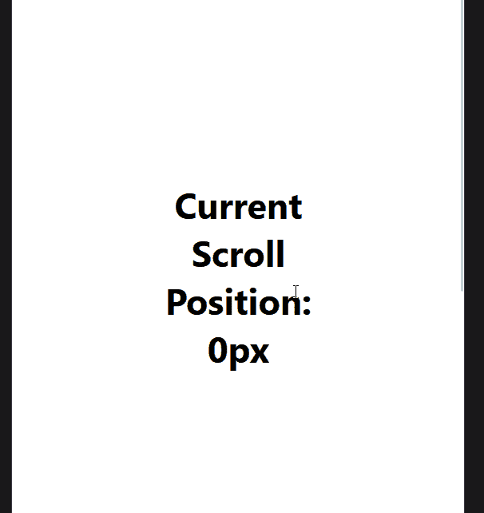
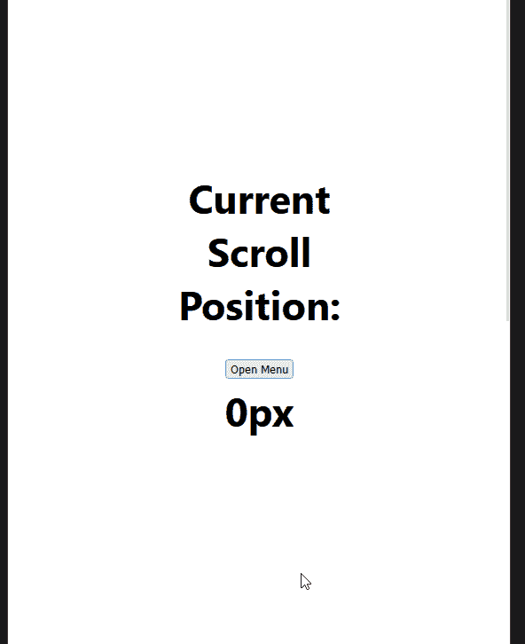

# 维护和恢复 React 移动应用中的滚动位置

> 原文：<https://blog.logrocket.com/maintain-restore-scroll-position-react-mobile-apps/>

向移动网站添加导航菜单时，一种常见的方法是移动菜单占据整个页面并隐藏其下的原始页面。

但是，我们经常面临的一个问题是，当导航菜单打开并覆盖它时，下面的页面必须仍然是可滚动的。这个问题产生了糟糕的用户体验，这是我们想要不惜一切代价避免的。

解决这个问题的一个方法是将`position: fixed`添加到我们打开菜单的原始页面。虽然这可以工作，但页面将不再可滚动，通过解决这个问题，我们引入了另一个问题。

通过在打开菜单时将`position: fixed`添加到页面，然后在关闭菜单时将它改回`position: relative`，我们失去了页面的当前滚动位置，用户返回到页面的顶部，这又是一个糟糕的 UX。

因此，为了解决这两个问题，我们将学习如何在 React 应用程序中实现一个自定义挂钩，允许我们在整页移动菜单打开时停止页面滚动。

但是，最重要的是，当我们关闭整页移动菜单时，我们保持滚动位置，这样用户可以从他们离开的地方继续滚动。

## 模板化前端

为了开始本教程，我们需要使用`create-react-app`创建一个 React 应用程序(如果你以前没有使用过，你可以[在这里](https://blog.logrocket.com/getting-started-with-create-react-app-d93147444a27/)找到更多关于它的信息)。

一旦我们创建了新的 React 应用程序并安装了所有的依赖项，我们就可以运行`npm run start`来启动 React 应用程序。

随着我们的应用程序的启动，让我们构建一个快速的前端，它允许我们展示我们稍后将构建的自定义钩子。以下是您需要放入`./src/App.js`文件的代码:

```
import { useEffect, useState } from 'react';
import Nav from './components/Nav';
import './App.css';

function App() {
  const [scrollValue, setScrollValue] = useState(0);

  useEffect(() => {

    const onScroll = (e) => {
      setScrollValue(e.target.documentElement.scrollTop);
    };

    window.addEventListener('scroll', onScroll);

    return () => window.removeEventListener('scroll', onScroll);
  }, [scrollValue]);

  return (
    <div className="App">
      <p className="filler" />
      <div className="fixed">
        <p>Current Scroll Position:</p>
        <p>{scrollValue}px</p>
      </div>
    </div>
  );
}
export default App;

```

如果你以前见过 React 应用程序，这应该是相当熟悉的，所以我们不会覆盖整个文件的代码。

然而，我想介绍的一部分是`useEffect()`块中的代码。这段代码允许我们将当前的滚动位置设置为 state，然后将它显示在页面上。虽然这不是定制钩子工作所必需的，但是它显示了定制钩子在我们的应用程序中的工作。

下面是我们的`App.js`文件的样式，它存储在同一目录的`App.css`中:

```
.App {
  padding: 0 5rem;
}
.filler {
  height: 300vw;
}
.fixed {
  text-align: center;
  position: fixed;
  left: 50%;
  top: 50%;
  transform: translate(-50%, -50%);
  font-weight: 700;
  font-size: 45px;
}
.fixed > * {
  margin: 0;
}

```

您现在应该有一个页面，允许您上下滚动并显示页面上的当前滚动位置，如下所示:



完成后，我们只需要[创建我们的移动导航菜单](https://blog.logrocket.com/react-navigation-vs-react-native-navigation/)。现在让我们通过将`./src/components/Nav.js`添加到我们的应用程序来创建它。下面是新组件的代码:

```
import './Nav.css';

export default function Nav() {

  return (
    <nav>
      {/* We will replace this true boolean when we create the hook as this will contain the open/closed state for the nav menu.*/}
      {true ? (
        {/* We will add a onClick handler after we have defined the hook */}
        <button type="button">
          Open Menu
        </button>
      ) : (
        <div>
          <p>Nav Item 1</p>
          <p>Nav Item 2</p>
          <p>Nav Item 3</p>

          {/* We will add a onClick handler after we have defined the hook */}
          <button type="button">
            Close Menu
          </button>
        </div>
      )}
    </nav>
  );
}

```

添加了这段代码后，我们现在应该有一个打开菜单按钮添加到我们页面的标题和当前滚动位置之间。此时，如果我们单击按钮，什么都不会发生，因为我们还没有添加一个`onClick`处理程序。

我们还没有添加处理程序的原因是因为菜单打开或关闭的状态将包含在我们将在下一节创建的自定义钩子中。

一旦我们创建了自定义钩子，我们将返回到这个组件，并添加相关的代码和样式，以允许移动导航菜单打开和关闭。

现在我们来看这篇文章的主要部分:创建一个定制的钩子来控制整页移动菜单的打开和关闭，以及保持它下面页面的滚动位置。

下面是`useMenuControl`定制钩子的代码；要将它添加到应用程序中，我们必须在`./src/hooks/useMenuControl.js`为钩子创建一个新文件:

```
import { useEffect, useState } from 'react';

export default function useMenuControl() {
  // State to record if the menu is open
  const [isMenuOpen, setMenuOpen] = useState(false);

  // Click handler for opening and closing the menu
  const clickHandler = () => setMenuOpen(!isMenuOpen);

  useEffect(() => {
    // Get original body overflow style so we can revert to it later on
    const originalStyle = window.getComputedStyle(document.body).overflow;

    // If the menu is open then set the overflow to hidden to prevent scrolling the page further
    if (isMenuOpen) {
      document.body.style.overflow = 'hidden';
    }

    // Re-enable scrolling when component unmounts by reverting to the original body overflow style value
    return () => {
      document.body.style.overflow = originalStyle;
    };
  }, [isMenuOpen]);

  // Returning 3 vales :
  // 1\. isMenuOpen: boolean - Is the menu open or not.
  // 2\. clickHandler: function - Function used to open and close the menu
  return { isMenuOpen, clickHandler };
}

```

代码中注释了整个钩子中发生的事情，所以我不会覆盖整个代码，但重点关注文件顶部的状态，我们用它来控制菜单是打开还是关闭。

接下来是我们的`clickHandler`函数，我们将把它传递给之前的`Nav`组件中的`onClick`属性。

但是，最重要的是`[useEffect()](https://blog.logrocket.com/guide-to-react-useeffect-hook/)` [块](https://blog.logrocket.com/guide-to-react-useeffect-hook/)内部的代码。在我们打开菜单之前，这段代码获取文档主体的当前`overflow`样式(默认为`visible`)。然后，如果`isMenuOpen`状态是`true`，我们将主体的`overflow`设置为`hidden`。

这是很重要的一部分，因为通过将`overflow`更改为 hidden，我们可以防止页面滚动，当我们将`overflow`恢复为初始值(`visible`)时，滚动位置仍然是我们打开页面时的位置。

当整页移动菜单打开时，通过避免使用`position: fixed`来防止滚动，我们不会失去我们的滚动位置。

现在，让我们来看看如何在之前的`Nav`组件中实现新的`useMenuControl`钩子。

现在让我们重温一下前面的`Nav`组件，并添加上一节中的`useMenuControl`定制钩子。下面是添加了挂钩的更新代码:

```
import useMenuControl from '../hooks/useMenuControl';
import './Nav.css';

export default function Nav() {
  const { isMenuOpen, clickHandler } = useMenuControl();

  return (
    <nav className={`${isMenuOpen ? 'menuOpen' : ''}`}>
      {!isMenuOpen ? (
        <button type="button" onClick={clickHandler}>
          Open Menu
        </button>
      ) : (
        <div>
          <p>Nav Item 1</p>
          <p>Nav Item 2</p>
          <p>Nav Item 3</p>
          <button type="button" onClick={clickHandler}>
            Close Menu
          </button>
        </div>
      )}
    </nav>
  );
}

```

这里添加的关键代码是我们用来控制菜单是否显示以及是否将`.menuOpen`类应用到`nav`元素的`isMenuOpen`状态。

这很重要，因为一会儿，我们将向这个类名添加样式，使菜单成为真正的整页菜单。

其次，我们从自定义钩子引入`clickHandler`并将其传递给按钮上的两个`onClick`处理程序，以控制页面上菜单的打开和关闭。

排序后，我们只需要通过添加一个`./src/components/Nav.css`文件来为`.menuOpen`类添加一些样式。下面是我们需要添加的样式，以创建完整的页面菜单:

```
.menuOpen {
  position: fixed;
  left: 50%;
  top: 50%;
  transform: translate(-50%, -50%);
  z-index: 10;
  display: flex;
  flex-direction: column;
  align-items: center;
  justify-content: center;
  gap: 2.5rem;
  background-color: white;
  opacity: 1;
  height: 100vh;
  width: 100vw;
}

```

## 结论

将这最后一段代码添加到我们的应用程序后，我们现在有了一个 React 应用程序，它允许我们打开一个整页的移动菜单，该菜单在菜单下保持页面上的滚动位置，同时还防止在菜单打开时滚动页面。

这里是这个应用程序最终版本的一瞥；如果你有兴趣查看这个项目的代码，你可以在我的 GitHub 上看到。



我希望这篇关于创建一个自定义的 React 钩子来维护整页移动菜单的滚动位置的文章对你有所帮助。

如果你这样做了，[请考虑在 Twitter](https://twitter.com/MrConerMurphy) 上关注我，在那里我发布了关于 JavaScript 生态系统和整个 web 开发的有用且可行的技巧和内容。或者，如果 Twitter 不是你的菜，[访问我的博客](https://conermurphy.com/blog)获取更多我的内容。

## [LogRocket](https://lp.logrocket.com/blg/react-signup-general) :全面了解您的生产 React 应用

调试反作用应用程序可能很困难，尤其是当用户遇到难以重现的问题时。如果您对监视和跟踪 Redux 状态、自动显示 JavaScript 错误以及跟踪缓慢的网络请求和组件加载时间感兴趣，

[try LogRocket](https://lp.logrocket.com/blg/react-signup-general)

.

[ ](https://lp.logrocket.com/blg/react-signup-general) [](https://lp.logrocket.com/blg/react-signup-general) 

LogRocket 结合了会话回放、产品分析和错误跟踪，使软件团队能够创建理想的 web 和移动产品体验。这对你来说意味着什么？

LogRocket 不是猜测错误发生的原因，也不是要求用户提供截图和日志转储，而是让您回放问题，就像它们发生在您自己的浏览器中一样，以快速了解哪里出错了。

不再有嘈杂的警报。智能错误跟踪允许您对问题进行分类，然后从中学习。获得有影响的用户问题的通知，而不是误报。警报越少，有用的信号越多。

LogRocket Redux 中间件包为您的用户会话增加了一层额外的可见性。LogRocket 记录 Redux 存储中的所有操作和状态。

现代化您调试 React 应用的方式— [开始免费监控](https://lp.logrocket.com/blg/react-signup-general)。