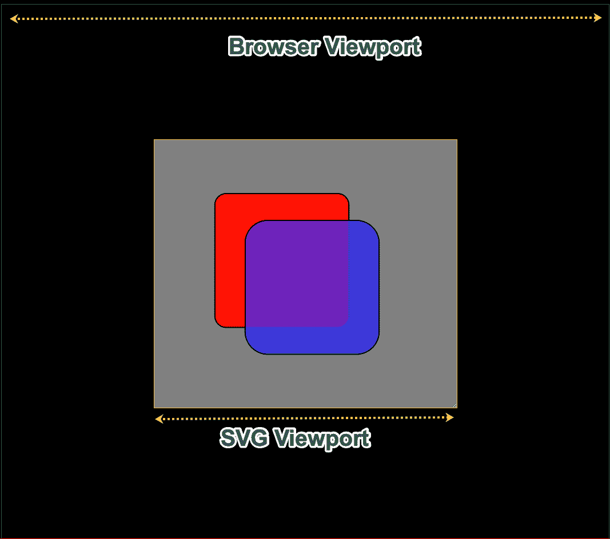
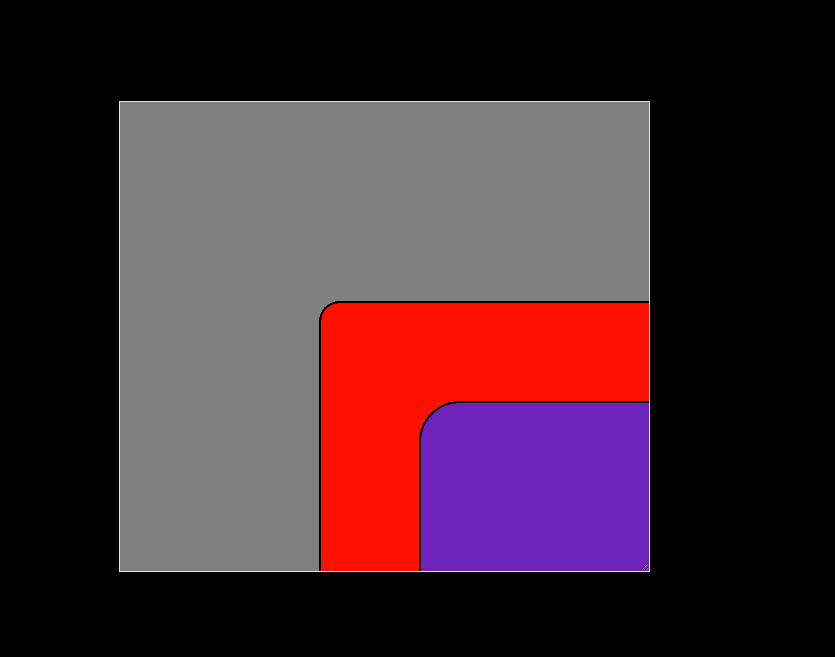
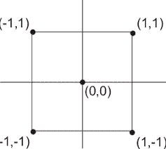
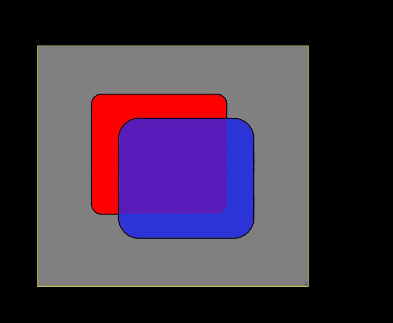
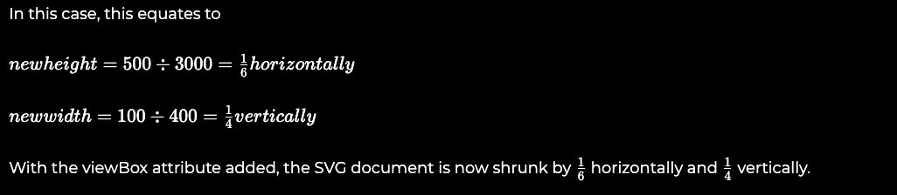
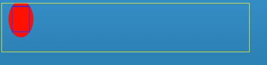
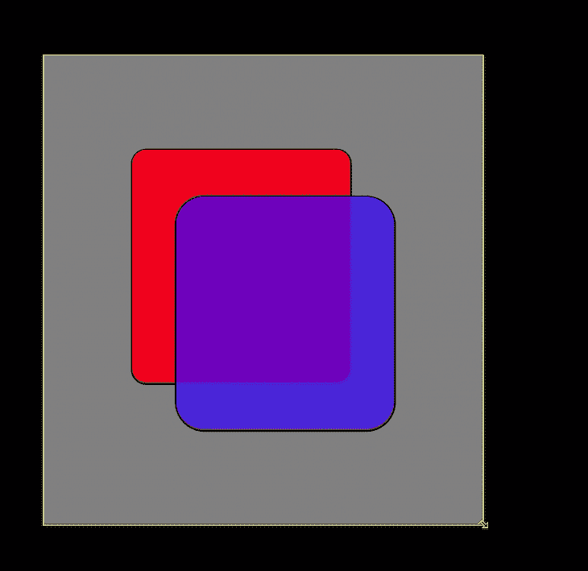

# 用这个 React 组件让任何 SVG 都响应起来

> 原文：<https://blog.logrocket.com/make-any-svg-responsive-with-this-react-component/>

如果你在万维网上发布数字内容来宣传你的作品，那么你的观众很有可能会在移动设备上看到它。对于文本和图像，这不是现代 CSS 的一个大问题。但是如果内容是使用 SVG 元素的数据可视化，这可能是一个问题。

我最初在移动设备上制作一些图形时遇到了问题。经过多次摸索，我制作了一些可重复使用的组件，可以保护我免受这种痛苦。

## SVG 还有多大的发展空间？

在计算有多少空间可用于缩放 SVG 文档时，需要考虑一些抽象问题。



### Browser viewport

浏览器视窗是网页的可视区域。

### SVG 视口

SVG 视区类似于浏览器的视区，只是它是 SVG 文档的可见区域。SVG 文档的高度和宽度可以是您想要的，但是一次只能看到文档的一部分。

我们希望避免硬编码的宽度和高度属性，如下例所示，因为它们无法适应可能正在查看此文档的众多设备:

```
export const App: React.FC = () => (
  <svg width="1000" height="1000">
    <rect
      x="20%"
      y="20%"
      width="1000"
      height="1000"
      rx="20"
      style={{ fill: '#ff0000', stroke: '#000000', strokeWidth: '2px' }}
    />

    <rect
      x="30%"
      y="30%"
      width="1000"
      height="1000"
      rx="40"
      style={{ fill: '#0000ff', stroke: '#000000', strokeWidth: '2px', fillOpacity: 0.7 }}
    />
  </svg>
);
```

上述组件呈现该文档:



上面 2 个<rect>元素的 SVG 文档比 SVG 视口大，正因为如此，只有一部分是可见的。</rect>

一个叫做[视图框](https://developer.mozilla.org/en-US/docs/Web/SVG/Attribute/viewBox)的神奇属性可以满足我们的很多 SVG 响应需求。

## 视框和坐标系

[mdn](https://developer.mozilla.org) 对`viewBox`属性的定义是:

> viewBox 属性定义 SVG 视口在用户空间中的位置和尺寸。

我不知道你是怎么想的，但是当我第一次读到它的时候，我的疑问多于答案。用户空间到底是什么？

如果你对数学有所了解，那么你会发现欧几里得空间有经典的`x`和`y`轴:



SVG 坐标空间是不同的，因为点(0，0)在左上角，而不是中心。

如果我们向之前创建的 SVG 添加一个`viewBox`属性，那么我们可以重新控制 SVG 视口的大小:

```
export const App: React.FC = () => (
  <svg preserveAspectRatio="xMaxYMid meet" viewBox="0 0 529 470">
    <rect
      x="20%"
      y="20%"
      width="1000"
      height="1000"
      rx="20"
      style={{ fill: '#ff0000', stroke: '#000000', strokeWidth: '2px' }}
    />

    <rect
      x="30%"
      y="30%"
      width="1000"
      height="1000"
      rx="40"
      style={{ fill: '#0000ff', stroke: '#000000', strokeWidth: '2px', fillOpacity: 0.7 }}
    />
  </svg>
);
```

由于这个神奇的属性，两个<rect>元素现在比 SVG 视口小。</rect>



## 视图框数学

下面是一个`viewBox`属性的例子:

```
viewBox="-200 -100 3000 400"
```

属性中神奇的四个数字可以缩小或扩大元素，变换它们的位置。但是怎么做呢？

viewBox 可以用很少的资源做很多事情，例如:

*   它定义了图像的纵横比
*   它定义了 SVG 中使用的所有长度和坐标应该如何缩放以适应可用的空间
*   它定义了新坐标系的原点

我喜欢像这样记住最初的四个值:

```
viewBox="minX minY width height"
```

添加了视图框后，将从现有的 SVG 视口坐标中复制一组新的坐标。这组新的坐标被称为`user space`。mdn 神秘的解释提到了这一点:

> viewBox 属性定义了 SVG 视口在用户空间中的位置和尺寸*。*

视图框的前两个值是-200 和-100，这些值将使图像从左上原点向右下方移动:

```
<svg
  width="500px"
  height="100px"
  viewBox="-200 -100 3000 400"
>
```

最后两个值 3000 和 400 允许我们放大或缩小我们的 SVG 图像。

SVG 元素的宽度为 500 像素，高度为 100 像素。添加了 viewBox 属性后，一个由 3000 个单位和 4000 个垂直单位组成的新用户坐标系就由我们支配了。

新用户空间映射到视口坐标系，新空间的 1 个单位等于以下计算:

```
height = SVG viewport height ÷ viewBox height vertically
width = SVG viewport width ÷ viewBox width horizontally

```



The viewBox on its own will not cure all our responsive needs. We cannot use hardcoded values in the real world. We need to get new values when the component is mounted, or it resizes.

## 支持 SVG

下面是我自己的 [@cutting/svg](https://github.com/dagda1/cuttingedge/tree/master/packages/svg) 包中的`ResponsiveSVG`组件:

```
export function ResponsiveSVG<E extends HTMLElement = HTMLElement>({
  elementRef,
  children,
  preserveAspectRatio = 'xMinYMin slice',
  innerRef,
  className,
  options = {},
}: PropsWithChildren<ParentsizeSVGProps<E>>): JSX.Element | null {
  const { width, height } = useParentSize(elementRef, options);

  const aspect = width / height;

  const adjustedHeight = Math.ceil(width / aspect);

  return (
    <div
      data-selector="cutting-svg-container"
      style={{
        position: 'relative',
        overflow: 'visible',
        height: '1px',
      }}
    >
      <svg
        style={{ overflow: 'visible' }}
        className={className}
        preserveAspectRatio={preserveAspectRatio}
        viewBox={`0 0 ${width} ${adjustedHeight}`}
        ref={innerRef}
      >
        {children}
      </svg>
    </div>
  );
}
```

上面的组件使用了我的 [useParentSize](https://github.com/dagda1/cuttingedge/blob/master/packages/hooks/src/useParentSize/useParentSize.ts) 钩子，该钩子使用一个 [ResizeObserve](https://developer.mozilla.org/en-US/docs/Web/API/ResizeObserver) r 来观察容器`<div/>`元素的变化。每当目标`<div />`中发生尺寸变化时，resize 事件就会产生新的宽度和高度值，组件将根据这些新值重新呈现。

为了确保我们的 SVG 元素在不同的尺寸下保持其形状，我们需要根据其宽度来计算其高度。这种比例关系被称为长宽比。

## 纵横比

纵横比是屏幕上图像的宽高比。

正方形图像的纵横比为`1:1`。高度是宽度两倍的图像的长宽比为`1:2`。

调整后高度的计算方法是:

```
const aspect = width / height;
const adjustedHeight = Math.ceil(width / aspect);
```

这些值帮助我们完成`viewBox`:

```
<svg
  style={{ overflow: 'visible' }}
  className={className}
  preserveAspectRatio={preserveAspectRatio}
  viewBox={`0 0 ${width} ${adjustedHeight}`}
  ref={innerRef}
>
```

## `preserveAspectRatio`属性

属性`viewBox`有一个助手`preserveAspectRatio`。除非视图框存在，否则它没有任何作用。`preserveAspectRatio`描述了如果`viewBox`的纵横比与视窗的纵横比不匹配，SVG 文档应该如何缩放。大多数情况下，默认行为是有效的，即:

```
preserveAspectRatio="xMidYMid meet"
```

`xMidYMid meet`有点像 CSS 规则`background-size: contain;`。一个`slice`值将缩放图像以适应更大的尺寸，并切掉多余的部分。

```
preserveAspectRatio="xMidYMid slice"
```

`slice`值类似于`overflow: hidden` CSS 规则。



## 收场白

有了我的`ResponsiveSVG`组件，我已经准备好迎接用户可以扔给我的任何设备，下面是我将浏览器调整到最小时的样子:



## 使用 LogRocket 消除传统反应错误报告的噪音

[LogRocket](https://lp.logrocket.com/blg/react-signup-issue-free)

是一款 React analytics 解决方案，可保护您免受数百个误报错误警报的影响，只针对少数真正重要的项目。LogRocket 告诉您 React 应用程序中实际影响用户的最具影响力的 bug 和 UX 问题。

[ ](https://lp.logrocket.com/blg/react-signup-general) [  ](https://lp.logrocket.com/blg/react-signup-general) [LogRocket](https://lp.logrocket.com/blg/react-signup-issue-free)

自动聚合客户端错误、反应错误边界、还原状态、缓慢的组件加载时间、JS 异常、前端性能指标和用户交互。然后，LogRocket 使用机器学习来通知您影响大多数用户的最具影响力的问题，并提供您修复它所需的上下文。

关注重要的 React bug—[今天就试试 LogRocket】。](https://lp.logrocket.com/blg/react-signup-issue-free)