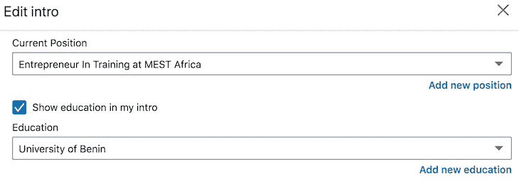
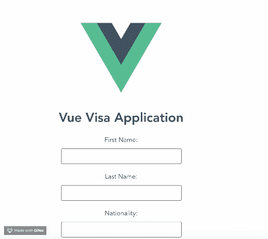
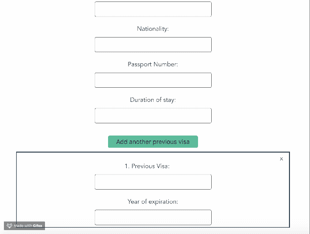

# 如何在 Vue.js 中使表单元素动态化

> 原文：<https://blog.logrocket.com/make-form-elements-dynamic-vue-js/>

***编者按:**本文最后一次更新于 2022 年 7 月 19 日，包含了更详细的代码描述和 Vue.js 中动态表单的故障排除信息*

在 web 应用程序中，表单是获取用户输入的基础，但有时我们不知道我们需要多少输入。例如，用户可能需要输入以前的工作，或者注册几个项目，但是确切的数量是未知的，我们需要用正确的输入数量填充页面。这就是动态表单拯救世界的地方。通过一些巧妙的逻辑和使用 Vue 的一些强大的指令，我们可以让用户创建尽可能多的输入集来详细描述每个工作或项目。

Vue 使开发人员能够在他们的应用程序中创建表单，就像在普通的 HTML5 中一样。这意味着创建表单几乎不需要额外的技能。Vue 支持 HTML5 支持的所有元素，比如`input`、`text area`、`label`等等。

在本教程中，您将学习如何使 Vue 表单动态化。动态表单使你能够给你的用户足够的控制权来决定结果。

### 内容

## 入门指南

首先，安装 Node.js v10 或更高版本(您可以通过运行以下命令来验证您是否已经拥有它):

```
node -v

```

接下来，在您的计算机上全局安装最新版本的 Vue，然后安装 Vue CLI v3.0(您必须首先使用以下命令卸载旧版本的 CLI):

```
npm uninstall -g vue-cli

```

然后，安装新的:

```
npm install -g @vue/cli

```

运行`npx degit` `viclotana/vue-canvas` `vue-canvas`创建项目的副本，并导航到`vue-canvas`文件夹运行以下命令并安装依赖项:

```
npm install

```

## 形成结果

当[构建 Vue 表单](https://blog.logrocket.com/using-v-model-vue-3-build-complex-forms/)时，可能很难确定与给定字段相关的结果数量。解决这个问题的一个好方法是通过给用户控制权来个性化用户体验。

以 LinkedIn 为例:当你填写你的就业细节时，有一个标记为“当前职位”的字段和一个添加新职位的链接。在这里，您应该输入您当前的角色以及您想要列出的任何以前的工作。



显然，LinkedIn 不会马上知道你的整个就业历史，但它个性化了它的表格，所以你可以根据你现在或过去担任的职位的数量和类型定制你的简历。

## 动态表单元素

在动态表单出现之前，表单域通常只是静态的。回到 LinkedIn 的例子，页面必须显示几个独立的字段，只需要第一个字段。

不用说，这是一种低效的方法，需要大量的表单元素和重复的代码，这违反了 [DRY 原则](https://en.wikipedia.org/wiki/Don%27t_repeat_yourself)。

现在让我们看看动态表单是如何在 Vue 中构建的。

## 我们将建造什么

为了演示，我们将构建一个签证申请表，并在其中添加一个“以前的签证”字段—许多政府在签发签证之前都会检查类似的信息。然后，我们将使应用程序动态化，因为就像 LinkedIn 用户有不同的工作经历一样，不同的旅行者在他们的护照上有不同的签证，导致每个用户有无限多种可能的结果。

## 在 Vue.js 中创建动态表单

如果您从一开始就关注了这篇文章，那么您应该有一份来自 GitHub 的 Vue canvas 项目的副本。您将看到根 Vue 组件`app.vue`，以及一个已经在 components 文件夹中创建的测试组件文件。

在您的集成开发环境中打开项目(我使用 VS 代码)。您的`app.vue`文件应该如下所示:

```
<template>
  <div id="app">
    
    <Test/>
  </div>
</template>
<script>
import Test from './components/Test.vue'
export default {
  name: 'app',
  components: {
    Test
  }
}
</script>
<style>
#app {
  font-family: 'Avenir', Helvetica, Arial, sans-serif;
  -webkit-font-smoothing: antialiased;
  -moz-osx-font-smoothing: grayscale;
  text-align: center;
  color: #2c3e50;
  margin-top: 60px;
}
</style>

```

现在进入组件文件夹，打开测试组件文件，并将下面的代码块复制到模板部分中:

```
<template>
  <div id="visa">
    <h1>Vue Visa Application</h1>
    <form>
      <label for="first name">First Name:</label>
      <input type="text" required>
      <br>
      <label for="last name">Last Name:</label>
      <input type="text" required>
      <br>
      <label for="country">Nationality:</label>
      <input type="text"  required>
      <br>
      <label for="passport number">Passport Number:</label>
      <input type="text"  required>

      <label for="duration">Duration of stay:</label>
      <input type="text"  required>
     <br><br>
      <button>Add another previous visa</button>
      <br>
      <div class="previous">
        <span>x</span>
        <label for="duration">Previous Visa:</label>
        <input type="text" required>
        <label for="duration">Year of expiration:</label>
        <input type="text" required> 
      </div>
    </form>
</div>
</template>

```

这是一个虚构的 Vue 签证申请表的模板，带有一个标记为“添加另一个以前的签证”的按钮，用户可以在护照上输入所有有效的签证。

在同一个组件中，向下滚动到作用域样式部分，并添加以下规则:

```
<!-- Add "scoped" attribute to limit CSS to this component only -->
<style scoped>
#visa {
  margin: 20px auto;
  max-width: 700px;
}
label{
  display: block;
  margin: 20px 0 10px;
}
input {
  font-size: 30px;
  border: 1px double rgb(102, 97, 96) ;
  border-radius: 4px;
}
button {
  font-size: 16px;
 background: rgb(64, 179, 140);
  padding: 0.4rem 1.3rem;
  text-align: center;
  border: none;
  cursor: pointer;
  border-radius: 4px;
 margin: 10px;
}
span{
  width: 30px;
  float: right;
  cursor: pointer;
}
span:hover{
  color: brown;
}
.previous{
  border: 1.5px solid;
  padding:5px;
  margin-bottom: 10px;
}
</style>

```

使用下面的命令在 dev 服务器中运行您的应用程序。

```
npm run serve

```

如果您正在运行节点 17 或 18，您可能会得到以下错误:`code: 'ERR_OSSL_EVP_UNSUPPORTED'`。要解决这个问题，您可以使用节点版本管理器降级到节点 16，或者向`package.json`中的 serve 脚本`--openssl-legacy-provider`添加以下标志，使其显示为`"serve": "export NODE_OPTIONS=--openssl-legacy-provider && vue-cli-service serve"`。

这应该可以在 Mac 和 Linux 上工作，在 Windows 上设置环境变量应该是这样的:`"serve": "SET NODE_OPTIONS=--openssl-legacy-provider && vue-cli-service serve"`。

您的应用程序在您的浏览器中应该是这样的:



在现实生活中，签证申请人的护照上可能有不止一个签证，这就是为什么我们为每个申请人提供了“添加另一个以前的签证”选项，以添加他们拥有的签证。如果他们是第一次旅行，也可以不加。

给予用户选择的权力是解决这种用例的最佳方案。Vue 允许你通过几个指令轻松做到这一点:`v-for`和`v-bind`用于`v-for`键。使用`v-for`指令，您可以使模板中以前的 visa 块可重用。这意味着您可以复制一个给定的代码块，然后点击一个按钮，将它推送到 DOM，而不是一遍又一遍地重写这些代码行。

为此，我们必须创建两个函数:一个在单击“add”按钮时添加一个新部分，另一个在单击“x”按钮时删除一个部分。

在测试组件中，将下面的代码块复制到脚本部分中:

```
<script>
export default {
  name: 'Test',
  props: {
    msg: String
  },
  data(){
    return {
       applicants:[
       {
      previous: '',
      expiration:''
       }
     ]
    }
  },
  methods : {
    addVisa(){
      this.applicants.push({
        previous:'',
        expiration: ''
      })
    },
    deleteVisa(counter){
      this.applicants.splice(counter,1);
}
  }
}
</script>

```

这些方法的描述:

*   `addVisa()`向"申请人"数组中添加一个新对象，数组中的每个对象将被绑定到每组输入中的表单元素上
*   `deleteVisa()`被传递给要删除的输入的索引，然后该对象被从数组中删除

我们还创建了一个 applicants 数组，因为我们想要遍历各个部分。要使用这些函数，我们必须将它们添加到模板部分的点击事件中:

```
<template>
  <div id="visa">
    <h1>Vue Visa Application</h1>
    <form>
      <label for="first name">First Name:</label>
      <input type="text" required>
      <br>
      <label for="last name">Last Name:</label>
      <input type="text" required>
      <br>
      <label for="country">Nationality:</label>
      <input type="text"  required>
      <br>
      <label for="passport number">Passport Number:</label>
      <input type="text"  required>

      <label for="duration">Duration of stay:</label>
      <input type="text"  required>
     <br><br>
      <button @click="addVisa">Add another previous visa</button>
      <br>
      <div class="previous"
      v-for="(applicant, counter) in applicants"
      v-bind:key="counter">
        <span @click="deleteVisa(counter)">x</span>
        <label for="duration">{{counter+1}}. Previous Visa:</label>
        <input type="text" v-model="applicant.previous" required>
        <label for="duration">Year of expiration:</label>
        <input type="text" v-model="applicant.expiration" required> 
      </div>
    </form>
</div>
</template>

```

注意事项:

`v-for`指令用于遍历 applicant 数组，这是我们确保输入数量正确的方法，因为数组中的每个对象都创建了一个集合。变量`counter`将代表当前对象的索引，`applicant`保存当前对象。

每个 div 都有一个触发`deleteVisa`函数的点击事件`x`，并通过由`v-for`指令创建的计数器变量传递到索引中。

最后，使用`v-model`指令将每个输入绑定到`applicant`对象的 right 属性。

如果您运行该应用程序，它应该根据用户的操作添加或删除该部分。



如您所见，申请人拥有完全控制权，如果是第一次出差，可以删除第一部分。这将很容易带来良好的客户体验。

本教程的完整代码可以在 GitHub 上找到。

## 动态窗体的常见问题及其解决方法

动态表单面临的一些挑战以及如何解决这些挑战:

首先，创建可变数量的输入可能会使其难以与任何将接收其数据的后端路由相匹配。最简单的解决方案是，来自动态表单表示的每个附加项的数据被添加到一个数组中，该数组被发送到后端。

接下来，如果对用户能够添加的条目数量有限制，您可能希望包含另一个数据变量来保存当前存在的数量，并将其用于条件，这样当用户达到最大数量时就不能再添加更多的条目。

最后，验证可变数量的输入也很棘手。如果您使用一个数组来存放每个附加输入集中的数据，那么您可以在任何验证过程中迭代该数组。

## 结论

现在，您应该有一些创造性的技巧来使用指令和一些函数使 Vue 表单元素动态化。无论你想做什么，你都应该首先考虑客户。这将帮助你理解并构建有价值的产品，同时最大化效率，重用代码，并保持代码干燥。

## 像用户一样体验您的 Vue 应用

调试 Vue.js 应用程序可能会很困难，尤其是当用户会话期间有几十个(如果不是几百个)突变时。如果您对监视和跟踪生产中所有用户的 Vue 突变感兴趣，

[try LogRocket](https://lp.logrocket.com/blg/vue-signup)

.

[](https://lp.logrocket.com/blg/vue-signup)[https://logrocket.com/signup/](https://lp.logrocket.com/blg/vue-signup)

LogRocket 就像是网络和移动应用程序的 DVR，记录你的 Vue 应用程序中发生的一切，包括网络请求、JavaScript 错误、性能问题等等。您可以汇总并报告问题发生时应用程序的状态，而不是猜测问题发生的原因。

LogRocket Vuex 插件将 Vuex 突变记录到 LogRocket 控制台，为您提供导致错误的环境，以及出现问题时应用程序的状态。

现代化您调试 Vue 应用的方式- [开始免费监控](https://lp.logrocket.com/blg/vue-signup)。