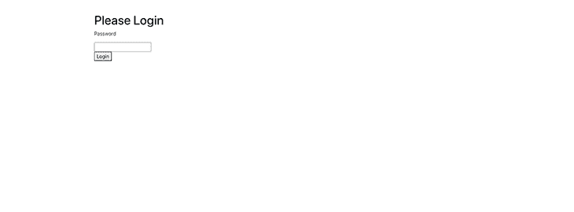
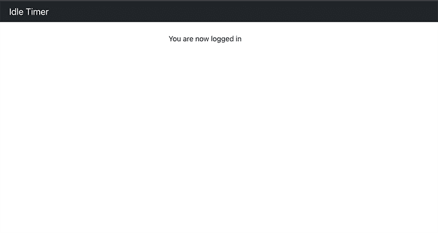

# 如何为你的 React 应用设置一个空闲计时器

> 原文：<https://blog.logrocket.com/make-idle-timer-react-app/>

空闲计时器是为 web 应用程序增加额外安全层的一种方式。空闲计时器用于在检查用户是否在指定的时间内处于非活动状态后注销用户。

当构建包含高度机密用户信息的网站时，平台的安全性是一个主要问题。作为开发人员，您需要保护最终用户免受入侵。实现空闲会话超时来让用户退出当前会话是增强平台安全性的一种方式。

例如，对于每 30 秒进行一次 API 调用的应用程序，有必要实现一个空闲超时来提高应用程序的性能。这可以让用户在空闲时注销，并防止不必要的后端请求。

在本文中，我们将学习如何在 React 应用程序中实现空闲超时。我们将使用`react-idle-timer`包来检测和响应用户的空闲。

*向前跳转:*

## `react-idle-timer`中的空闲检测事件

DOM API 提供了可用于空闲检测的鼠标和键盘事件。 [`react-idle-timer`包](https://www.npmjs.com/package/react-idle-timer)利用以下事件来检测用户活动:

*   `mousemove`–移动指点设备时触发
*   `keydown`–按键时触发
*   `wheel`–当指点设备的滚轮旋转时触发
*   `mousedown`–按下定点设备上的按钮时触发元素
*   `touchstart`–当一个或多个触摸点位于触摸表面时触发
*   `touchmove`–当一个或多个触摸点沿触摸表面移动时触发
*   `visibilitychange`–当文档选项卡的内容变得可见或隐藏时，向文档开火
*   `MSPointerDown`–指针激活时触发
*   `MSPointerMove`–当指针改变坐标时触发

还有两个不推荐使用的事件，`DOMMouseScroll`和`mousewheel`，在本文中我们不会重点讨论。

`react-idle-timer`包通过为每个事件添加一个事件监听器，将所有这些事件绑定到一个 DOM 元素。然后，根据最后一次触发绑定事件的时间来切换用户空闲状态。

## 入门指南

在您的终端中，创建一个新的 React 应用程序，并使用以下命令启动开发服务器:

```
npx create-react-app idle-timer-react
cd idle-timer-react
yarn start

```

然后，在您喜欢的代码编辑器中打开 React 应用程序。您将创建一个带有一个`HomePage`和一个`Login`页面的简单 web 应用程序，如下所示。



Our login page



Our homepage when we’re logged in

`App.js`文件根据认证状态显示主页和登录页面。

```
import Login from "./components/Login";
import 'bootstrap/dist/css/bootstrap.min.css';
import { useState } from "react"
import AuthContext from "./context/AuthContext"
import NavigationBar from './components/NavigationBar'
import HomePage from './components/Homepage'

const App = () => {
  const [authstatus, setauthstatus] = useState(false);
  const login = () => {
    setauthstatus(true);
  };
  const logout = () => {
    setauthstatus(false);
  };
  return (
    <AuthContext.Provider value={{ status: authstatus, login: login, logout: logout }}>
      {authstatus ? <>
        <NavigationBar />
        <HomePage />
      </> : <Login />}
    </AuthContext.Provider>
  )
}
export default App;

```

`HomePage`将包含一个显示文本和一个仅在用户空闲时显示的模态。

```
const HomePage = () => {
    const [openModal, setOpenModal] = useState(false)
    const { logout } = useContext(AuthContext);
    const handleIdle = () => {
        setOpenModal(true);
    }
    const stay = () => {
        setOpenModal(false)
    }
    const handleLogout = () => {
        logout()
        setOpenModal(false)
    }
    return <Container className="mt-4">
        <Row>
            <Col></Col>
            <Col>You are now logged in </Col>
            <Col></Col>
        </Row>
        <Modal show={openModal} onHide={stay}>
            <Modal.Header closeButton>
                <Modal.Title>Your session is about to expire</Modal.Title>
            </Modal.Header>
            <Modal.Body>
                <p>
                    Your session is about to expire. You'll be automatically signed out.
                </p>
                <p>
                    Do you want to stay signed in?
                </p>
            </Modal.Body>
            <Modal.Footer>
                <Button variant="secondary" onClick={handleLogout}>
                    Sign out now
                </Button>
                <Button variant="primary" onClick={stay}>
                    Stay signed in
                </Button>
            </Modal.Footer>
        </Modal>
    </Container>
}
export default HomePage;

```

当提交登录表单时，`Login`将用户登录到应用程序中。

```
const Login = () => {
    const { login } = useContext(AuthContext);
    const handleLogin = async e => {
        e.preventDefault()
        login();
    };
    return <Container className="mt-5">
        <h1> Please Login</h1>
        <form onSubmit={handleLogin}>
            <p>Password</p>
            <input type="password" />
            <div>
                <button type="submit">
                    Login
                </button>
            </div>
        </form>
    </Container>
}

```

## 创建自定义空闲检测挂钩

我们可以在应用程序中创建一个自定义钩子来实现`react-idle-timer`包，以检测用户的不活动状态。首先，使用以下命令安装软件包:

```
yarn add react-idle-timer

```

然后，创建一个`useIdleTimeout.js`文件，我们将使用它来包含用于空闲检测的定制钩子。你可以在这篇文章中了解更多关于[创建定制钩子的信息。](https://blog.logrocket.com/create-your-own-custom-react-hooks/)

将下面的代码片段添加到新文件中:

```
import { useContext, useState } from "react"
import { useIdleTimer } from "react-idle-timer"
import AuthContext from "../context/AuthContext";
/**
 * @param onIdle - function to notify user when idle timeout is close
 * @param idleTime - number of seconds to wait before user is logged out
 */
const useIdleTimeout = ({ onIdle, idleTime = 1 }) => {
    const idleTimeout = 1000 * idleTime;
    const [isIdle, setIdle] = useState(false)
    const { logout } = useContext(AuthContext);
    const handleIdle = () => {
        setIdle(true)
        logout()
    }
    const idleTimer = useIdleTimer({
        timeout: idleTimeout,
        promptTimeout: idleTimeout / 2,
        onPrompt: onIdle,
        onIdle: handleIdle,
        debounce: 500
    })
    return {
        isIdle,
        setIdle,
        idleTimer
    }
}
export default useIdleTimeout;

```

这段代码包含了来自`react-idle-timer`包的`useIdleTimer`函数的实现。`useIdleTimeout`钩子期望在用户空闲时调用一个`onIdle`函数，以及`idleTime`，它指示在用户被标记为空闲之前等待的秒数。

我们将用户的空闲状态存储在`isIdle`状态变量中。用以下属性调用包中的`useIdleTimer`钩子:

然后我们导出`isIdle`状态变量、`setIdle`状态动作和`idleTimer`对象。

## 使用空闲检测自定义挂钩

现在，我们可以在应用程序中使用自定义空闲计时器挂钩了。如图所示更新`HomePage`文件:

```
const HomePage = () => {
    const [openModal, setOpenModal] = useState(false)
    const { logout } = useContext(AuthContext);
    const handleIdle = () => {
        setOpenModal(true);
    }
    const {idleTimer} = useIdle({ onIdle: handleIdle, idleTime: 5 })
    const stay = () => {
        setOpenModal(false)
        idleTimer.reset()
    }
    const handleLogout = () => {
        logout()
        setOpenModal(false)
    }
    return ...
}

```

在这段代码中，我们创建了一个`useIdle`钩子的实例，它会自动为我们启动空闲计时器。当点击**保持登录**按钮时，空闲计时器重置。

当用户空闲时间达到指定时间的一半时，我们会显示一个提示。如果用户没有与提示交互，那么他们将被自动注销。但是，当它们与模态交互时，它们的交互会产生以下结果:

*   当用户点击 **C ***** lose*按钮时，空闲计时器复位，用户保持登录状态
*   当用户点击**保持登录**时，空闲计时器复位，用户保持登录
*   当用户点击**立即注销**时，用户被注销，空闲计时器被销毁

下面的视频演示了实现了空闲计时器的应用程序行为。

[https://www.youtube.com/embed/_CB4nrXcuJY](https://www.youtube.com/embed/_CB4nrXcuJY)

视频

## 结论

实现空闲计时器可以提高 web 应用程序的安全性。添加空闲计时器时，根据用户信息的风险级别仔细考虑超时的持续时间非常重要。同样重要的是，向用户提供适当的超时通知，以避免中断他们的工作流。

在本教程中，我们使用 [`react-idle-timer`包](https://www.npmjs.com/package/react-idle-timer)实现了一个空闲计时器，它为我们处理键盘和鼠标事件的绑定和解除绑定。我们利用公开的属性和方法向 React 应用程序添加了一个空闲计时器。

本文中的所有代码都可以在 [GitHub](https://github.com/Ivy-Walobwa/react-idle-timer) 上获得。我希望你喜欢这个教程！

## 使用 LogRocket 消除传统反应错误报告的噪音

[LogRocket](https://lp.logrocket.com/blg/react-signup-issue-free)

是一款 React analytics 解决方案，可保护您免受数百个误报错误警报的影响，只针对少数真正重要的项目。LogRocket 告诉您 React 应用程序中实际影响用户的最具影响力的 bug 和 UX 问题。

[ ](https://lp.logrocket.com/blg/react-signup-general) [  ](https://lp.logrocket.com/blg/react-signup-general) [LogRocket](https://lp.logrocket.com/blg/react-signup-issue-free)

自动聚合客户端错误、反应错误边界、还原状态、缓慢的组件加载时间、JS 异常、前端性能指标和用户交互。然后，LogRocket 使用机器学习来通知您影响大多数用户的最具影响力的问题，并提供您修复它所需的上下文。

关注重要的 React bug—[今天就试试 LogRocket】。](https://lp.logrocket.com/blg/react-signup-issue-free)