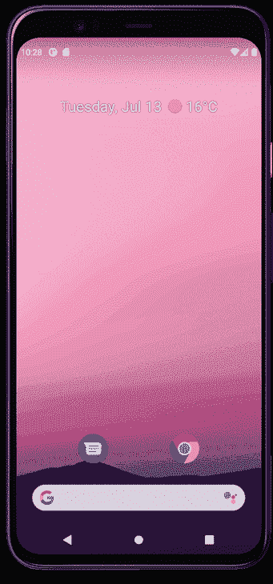
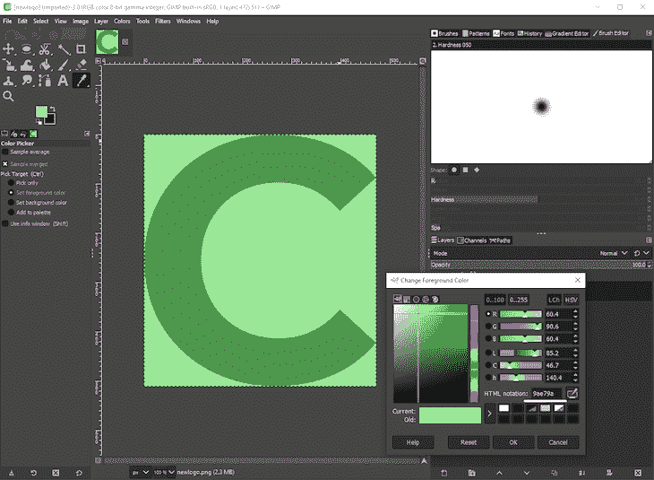

# 如何在 Flutter 中制作闪屏

> 原文：<https://blog.logrocket.com/make-splash-screen-flutter/>

在创建应用程序时，美学、字体选择和应用程序的整体外观决定了用户是否认为它是高质量的。

打开动画也可以通过为应用程序设置场景来给人留下很好的第一印象。在许多当前的应用程序中流行，一个简短，尖锐的开场动画可以吸引用户，有时甚至没有注意到。

虽然已经有了在 Flutter 中创建动画的官方流程来为应用程序引入动态打开闪屏，但官方流程确实有一些缺点要考虑:

*   在为 iOS 创建时，您必须创建一个 iOS 故事板来制作应用程序打开的动画
*   在为 Android 创建时，您必须为 Android 编写特定于平台的代码
*   目前还不支持 web 开发

对我们来说幸运的是，Flutter 有一套强大的动画选项，所以我们可以用代码创建一个相当引人注目的开场动画，我们可以在多个平台上重用，并且是 web 支持的。

为了演示这一点，我们将为一个名为“Chowtime”的点餐应用程序创建一个动态打开屏幕。当用户打开应用程序时，他们首先看到的是原生的 Flutter opener，它看起来像这样:



您也可以在浏览器中看到[演示。所以，让我们开始吧！](https://dynamic-flutter-intro.web.app/)

## 规划揭幕战

设计开瓶器时，我们必须考虑以下几个方面:

1.  添加一个匹配应用程序图标的大元素，我们可以在启动时立即显示
2.  如何将大元素与我们的打开屏幕的其余部分联系起来，包括应用程序名称
3.  在导航到应用程序的主屏幕之前显示一个快速动画
4.  在之前的每个元素之间添加动画以创建高质量的感觉

让我们看看如何创建这些元素。

## 在 Flutter 中创建开始闪屏

为了创建一个在打开应用程序后立即显示的图像，我们可以使用 GIMP 这样的[图形编辑器工具为我们的打开程序创建一个 512×512 的图像。在我们的例子中，我们只使用绿色背景的字母“C”。](https://www.gimp.org/)


如果你在你的应用中追求类似的概念，你可以(也应该)[使用谷歌字体为你的应用](https://fonts.google.com/?preview.text=CHOWTIME&preview.text_type=custom)找到最好的字体，因为有一个用于 Flutter 的`google_fonts`包，所以你可以很容易地在 Flutter 应用中使用他们的字体。

选择一种字体后，将其加载到图像编辑器中，并尝试各种颜色，直到获得所需的字体和背景色。

您也可以使用吸管工具来选择特定的颜色。注意颜色的十六进制代码；通过使用十六进制代码，您可以通过在代码前面加上`0xFF`来在 Flutter 中添加这种精确的颜色。所以，如果颜色是`9ae79a`，那么颤动当量就是`Color(0xFF9ae79a)`。



### 将图像添加到闪屏

首先，将 [`flutter_native_splash` 包](https://pub.dev/packages/flutter_native_splash)添加到项目中，这让我们可以为 Android、iOS 和 web 创建本地启动屏幕。

在`assets/newlogo.png.`保存开场图像，然后，我们必须告诉`flutter_native_splash`在剩余的可用空间中使用什么图像和背景颜色。为此，打开`pubspec.yaml`,添加以下几行:

```
flutter_native_splash:
  color: "#9ae79a"
  image: assets/newlogo.png

```

这里的颜色和我们从 GIMP 中的颜色选择器工具得到的颜色完全一样，意味着没有`0xFF`前缀。这是因为启动屏幕颜色不包含 alpha 通道，也没有透明度，前导的`0xFF`定义了颜色的透明度。

现在，让我们通过在项目的根目录下运行以下命令来生成基于该图像的所有跨平台启动屏幕:

```
flutter pub get
flutter pub run flutter_native_splash:create

```

代码实现后，应用程序应该会打开我们创建的图像。但是，它会突然切换到应用程序的开始屏幕。那么，我们如何将新创建的启动屏幕与启动屏幕的其余部分联系起来呢？

## 将启动屏幕绑定到我们的闪屏

查看本文开头完成的动画，我们可以看到字母“C”变小了，紧接着是一个食物落入碗中的简短动画，揭开了标志的其余部分。

正常情况下，这些类型的动画会变得非常复杂，那么我们如何高效、轻松地实现这一点呢？在这种情况下，我们将使用一个[隐式动画](https://blog.logrocket.com/adding-animations-to-your-flutter-app/#implicitanimation)。

首先，我们必须指定要制作动画的对象；在这种情况下，动画从字母“C”到扩展的“CHOWTIME”徽标，并调整文本大小。在调整文本大小时，我们还必须增加小部件的中间对象边界，以包含徽标文本的剩余部分。

这样做可以给显示的徽标一种擦除效果。为了实现这些动画变化，我们将使用两个小部件:`AnimatedDefaultTextStyle`和`AnimatedCrossFade`。

### `AnimatedDefaultTextStyle`小部件

为了随时调整文本大小，我们使用了`AnimatedDefaultTextStyle`小部件。与大多数带有`Animated`前缀的小部件一样，我们必须指定一个目标大小。当小部件的大小改变时，Flutter 会在一段定义的时间内自动调整文本的大小。在这种情况下，它看起来像这样:

```
AnimatedDefaultTextStyle(
  duration: transitionDuration, //a duration, set to one second
  curve: Curves.fastOutSlowIn,
  style: TextStyle(
    color: Color(0xFF4e954e), // our color from above, prefixed with 0xFF
    fontSize: !expanded ? _bigFontSize : 50, // change font size depending on expanded state
    fontFamily: 'Montserrat', // the font from Google Fonts
    fontWeight: FontWeight.w600, // 
  ),
  child: Text(
    "C",
  ),
)

```

当`expanded` boolean 切换并调用`setState`时，小部件自由地将尺寸从大变小。很好。

### `AnimatedCrossFade`小部件

现在“C”的动画是正确的，我们想显示我们的标志的其余部分，而文本大小调整。为此，我们希望在一个空的`Container`和一个包含我们的徽标文本和动画的`Row`之间淡入淡出:

```
AnimatedCrossFade(
  firstCurve: Curves.fastOutSlowIn, // the same curve as above
  crossFadeState: !expanded ? CrossFadeState.showFirst : CrossFadeState.showSecond,
  duration: transitionDuration, // the same duration as above
  firstChild: Container(), // an empty container
  secondChild: _logoRemainder(), // a Row containing rest of our logo
  alignment: Alignment.centerLeft, // "reveal" the logo from the center left
  sizeCurve: Curves.easeInOut,
),

```

同样，当`expanded` boolean 切换时，这个小部件在一个空框和 logo 的剩余部分之间显示动画，根据需要调整容器的大小。

## 在 Flutter 中添加食物动画

现在，我们的徽标已经适当地调整了大小，我们可以找到一个最能代表我们的应用程序所提供的服务的动画。添加动画时，我们可以创建自己的动画，也可以从 lottiefiles.com 下载预制的动画。为了提高效率，我们将使用预先制作的动画。

找动画的时候，最好选择一个最多持续两到三秒，从空白画布开始，背景透明的。

[这个美食动画](https://lottiefiles.com/24703-food-animation)符合我们的标准，符合应用程序的服务，所以，下载`.json`格式的洛蒂动画文件，并将其弹出到我们的`assets`文件夹`pubspec.yaml`。

同样，在应用程序的根文件夹中，运行以下命令将`lottie`安装到
我们的项目中:

```
flutter pub add lottie

```

将动画添加到我们的开场画面时，我们需要注意以下几点:

1.  设置宽度和高度，否则动画会太大
2.  设置一个`AnimationController`在动画结束时重定向到应用程序的主页

我们的`LottieBuilder.asset`小部件看起来像这样:

```
LottieBuilder.asset(
  'assets/food.json',
  onLoaded: (composition) {
    _lottieAnimation..duration = composition.duration; // set the duration of our AnimationController to the length of the lottie animation
  },
  frameRate: FrameRate.max, // makes the animation smoother
  repeat: false,
  animate: false, // don't start the animation immediately
  height: 100,
  width: 100,
  controller: _lottieAnimation,
)

```

## 设置动画计时

现在唯一要做的就是通过实现以下持续时间为动画添加适当的时间:

*   显示一秒钟的初始飞溅
*   将`expanded`改为 true 并调用`setState`同时运行隐式动画和交叉渐变
*   等待文本调整大小和交叉渐变完成
*   启动食物碗动画
*   将用户重定向到主屏幕

从程序上来说，它看起来像这样:

```
Future.delayed(Duration(seconds: 1))
    .then((value) => setState(() => expanded = true))
    .then((value) => Duration(seconds: 1))
    .then(
      (value) => Future.delayed(Duration(seconds: 1)).then(
        (value) => _lottieAnimation.forward().then(
              (value) => Navigator.of(context)
                  .pushAndRemoveUntil(MaterialPageRoute(builder: (context) => HomePage()), (route) => false),
            ),
      ),
    );

```

就是这样！我们的应用程序现在有了一个完全动画化的闪屏，可以在 iOS、Android 和网络上运行，并且在我们打开它的任何时候都会有动画。

## 包扎

使用 Flutter 的内置动画工具为用户创建一个视觉上吸引人的启动屏幕是相当容易的。有了 Flutter 的`flutter_native_splash`支持，我们不需要为我们使用应用的每个平台编写动画。

你可以[在这里](https://github.com/flutterfromscratch/dynamic_flutter_intro)找到示例应用程序的完整源代码，你可以随心所欲地使用它。黑客快乐！

## 使用 [LogRocket](https://lp.logrocket.com/blg/signup) 消除传统错误报告的干扰

[](https://lp.logrocket.com/blg/signup)

[LogRocket](https://lp.logrocket.com/blg/signup) 是一个数字体验分析解决方案，它可以保护您免受数百个假阳性错误警报的影响，只针对几个真正重要的项目。LogRocket 会告诉您应用程序中实际影响用户的最具影响力的 bug 和 UX 问题。

然后，使用具有深层技术遥测的会话重放来确切地查看用户看到了什么以及是什么导致了问题，就像你在他们身后看一样。

LogRocket 自动聚合客户端错误、JS 异常、前端性能指标和用户交互。然后 LogRocket 使用机器学习来告诉你哪些问题正在影响大多数用户，并提供你需要修复它的上下文。

关注重要的 bug—[今天就试试 LogRocket】。](https://lp.logrocket.com/blg/signup-issue-free)