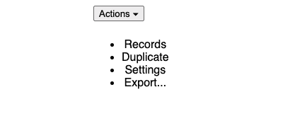

# 如何用 Zag 让你的设计系统干巴巴

> 原文：<https://blog.logrocket.com/make-your-design-system-dry-with-zag/>

在这篇文章中，我们将看看 [Zag](https://zagjs.com/) ，这是一个 JavaScript 库，它采用状态机方法来表示常见的组件状态模式。

使用 Zag，通过将大部分复杂性外包给库，您可以创建一个具有声明性的、干燥的、简单的状态管理逻辑的设计系统。

## Zag 简介

有大量现成的用户界面库。然而我们经常不能使用它们，因为我们必须遵循独特的设计要求。

虽然我们的组件设计可能是独一无二的，但功能通常不是。当从头开始创建组件时，您必须编写您的状态逻辑，在这个过程中重新发明轮子。

进入 Zag，它是一个为您处理组件状态逻辑的库，因此您可以专注于使您的组件看起来更好，而将它们状态的内部工作留给状态机。

Zag 为最常见的 UI 组件提供了状态机，比如菜单、折叠、对话框等。您可以在他们的文档中找到所有可用状态机的完整列表。

如果您正在从头开始构建您的设计系统，或者有一个项目，其中有许多组件包含重叠的、但逻辑略有不同的部分，那么使用 Zag 可以节省您的时间并减少您的麻烦。

例如，相同的状态机可以用于垂直和水平菜单。这样做允许您在组件之间共享公共状态逻辑，保持您的设计系统干燥。

## 为什么要用 Zag？

现在让我们解释一下为什么 Zag 可能是您的状态机解决方案:

*   首先，Zag 是框架不可知的，所以它可以与 React、Angular、Vue 甚至是普通的 JavaScript 一起工作。尽管如此，它确实为 React、Solid 和 Vue 提供了适配器，如果您碰巧正在使用这些框架，那么采用起来会更容易
*   Zag 对你如何设计你的组件完全没有偏见。您可以遵循您习惯的任何流程和工作流程。这与许多其他 UI 库形成了鲜明的对比，它们都有自己的样式解决方案，您必须学习和采用
*   您可以在项目中逐步引入 Zag，在需要时添加状态机。这是可能的，因为每个状态机都是作为一个单独的 NPM 包提供的
*   该库在构建时考虑了可访问性，并为您处理诸如键盘交互、焦点管理和 aria 角色之类的可访问性问题

## 什么是状态机？

为了更好地理解 Zag 的好处并正确使用这个库，我们需要理解状态机的概念。

状态机，也称为[有限状态机](https://en.wikipedia.org/wiki/Finite-state_machine)，是计算的数学模型。这是一个抽象的机器，它可以处于有限的几种状态中的一种。机器一次只能处于一种状态，当被输入(称为事件)触发时，可以从一种状态变为另一种状态。

在 React 社区，状态机已经被 [XState](https://xstate.js.org/docs/) 普及。它们通常用于表示具有复杂行为的公共组件的逻辑。

状态机非常适合 UI 组件，因为它们允许您对组件可能处于的不同状态以及触发状态变化的事件进行建模。

## 使用现成的 Zag 状态机

现在我们已经介绍了 Zag 和状态机，让我们看看如何在我们的项目中使用它们。

### 使用示例

让我们尝试对菜单使用状态机，这是最常见的 UI 组件之一。

下面是向 React 组件添加状态机的代码:

```
import * as menu from "@zag-js/menu";
import { useMachine, useSetup } from "@zag-js/react";

export default function Menu({ onSelect }: { onSelect: (id: string) => void }) {
  const [state, send] = useMachine(
    menu.machine({ onSelect: (id) => onSelect(id) })
  );

  const ref = useSetup({ send, id: "1" });

  const api = menu.connect(state, send);

  return (
    <div ref={ref}>
      <button {...api.triggerProps}>
        Actions <span aria-hidden>▾</span>
      </button>
      <div {...api.positionerProps}>
        <ul {...api.contentProps}>
          <li {...api.getItemProps({ id: "records" })}>Records</li>
          <li {...api.getItemProps({ id: "duplicate" })}>Duplicate</li>
          <li {...api.getItemProps({ id: "settins" })}>Settings</li>
          <li {...api.getItemProps({ id: "export" })}>Export...</li>
        </ul>
      </div>
    </div>
  );
}
```

在上面的代码中，我们使用了`useMachine`钩子来创建状态机的一个新实例。我们传递的`onSelect`回调将在一个项目被选中时被触发，并将接收它的`id`。

然后，我们用一个对象调用`useSetup`钩子，该对象包含菜单的`id`和状态机的 send 函数。`useSetup`确保组件在不同的环境下工作(iframes，electronic 等。).该函数返回一个`ref`，我们将它添加到组件的根元素中。

注意:`id`需要是唯一的标识符。

最后，我们用我们的状态机的状态和`send`函数调用`menu.connect`函数。`connect`将机器的状态转换成 JSX 属性和事件处理程序。

此时，我们的状态机已经可以使用了，现在我们需要应用存储在`api`变量中的 JSX 数据。

`api`包含构成菜单的所有内部组件的状态逻辑:触发器、定位器、内容和菜单项。为了将状态机逻辑应用于我们的 HTML 元素，我们使用了 [spread 操作符语法。](https://developer.mozilla.org/en-US/docs/Web/JavaScript/Reference/Operators/Spread_syntax)

仅此而已。现在我们有了一个功能菜单(虽然不是最好看的)。



### 式样

Zag 对样式没有偏见，您可以更好地控制您想要如何样式化您的组件。你可以使用任何你想要的 CSS 库或者编写你自己的风格。

每个组件通常都有多个可以单独设置样式的部分。正如我们之前所讨论的，菜单组件有以下几个可以定制的部分:触发器、定位器、内容和菜单项。

Zag 自动将`data-part`属性插入到组件的部件中，您可以使用该属性来确定它们的样式。

例如，下面是我们的菜单组件的简化 HTML 输出:

```
<!--HTML-->
<div>
  <button data-part="trigger" id="menu:1:trigger">
    Actions <span aria-hidden="true">▾</span>
  </button>
  <div data-part="positioner" id="menu:1:popper">
    <ul data-part="content" id="menu:1:content">
      <li data-part="item" id="records">
        Records
      </li>
      <li data-part="item" id="duplicate">
        Duplicate
      </li>
      <li data-part="item" id="settins">
        Settings
      </li>
      <li data-part="item" id="export">
        Export...
      </li>
    </ul>
  </div>
</div>
```

如您所见，每个部分都有可以在 CSS 选择器中使用的`data-part`属性。

* * *

### 更多来自 LogRocket 的精彩文章:

* * *

例如，如果我们想改变菜单项的颜色，我们可以编写下面的 CSS:

```
[data-part="item"] {
  color: blue;
}
```

当一个组件进入某个状态时，Zag 会自动添加一个`HTML`属性，用`data-ATTRIBUTE_NAME`来表示组件的当前状态，其中`ATTRIBUTE_NAME`是表示状态机中当前状态的属性。

例如，如果菜单项处于禁用状态，您可以在 CSS 样式中使用:

```
[data-part="item"][data-disabled] {
  /* styles go here */
}
```

这涵盖了样式 Zag 组件的基础知识。

### 添加自定义事件处理程序

通常，每当创建您的计算机的实例时，您都会添加您的事件处理程序，正如我们在前面的菜单示例中看到的:

```
const [state, send] = useMachine(
  menu.machine({ onSelect: (id) => onSelect(id) })
);
```

但是，如果您想要向组件的特定部分添加定制事件处理程序，您也可以使用 Zag 提供的`mergeProps`实用函数来完成:

```
const handleClick = () => {
    // do something here
}

const buttonProps = mergeProps(api.buttonProps, {
    onClick: handleClick,
})
```

## 构建您自己的状态机

有时，您可能会遇到 Zag 提供的状态机没有涵盖的情况。在这种情况下，您可以使用 Zag 的`createMachine`函数从头开始构建自己的状态机。

### 定义您的状态机模型

创建状态机包括为组件定义所有可能的状态和转换。例如，假设我们想要创建一个代表简单开/关切换按钮的机器:

```
const machine = createMachine({
  // initial state
  initial: "active",
  // the finite states
  states: {
    active: {
      on: {
        CLICK: {
          // go to inactive
          target: "inactive"
        }
      }
    },
    inactive: {
      on: {
        CLICK: {
          // go to active
          target: "active"
        }
      }
    }
  }
});
```

如你所见，我们首先定义了机器的初始状态。然后，对于每个状态，我们指定哪些事件应该触发到另一个状态的转换。

在这种情况下，我们只有一个事件(`CLICK`)可以在两个状态下发生，并且它将转移到另一个状态。

### 创建连接器功能

一旦我们有了自己的机器，我们需要创建一个连接器函数，负责将机器的状态映射到 JSX 道具。

连接器函数需要`state`和`send`参数，这样它就可以访问机器的当前状态并向机器发送事件。

下面是开/关切换按钮的连接器功能:

```
function connect(state, send) {
  const active = state.matches("active");
  return {
    active,
    buttonProps: {
      type: "button",
      role: "switch",
      "aria-checked": active,
      onClick() {
        send("CLICK");
      }
    }
  };
}
```

不幸的是，没有办法编写一个适用于所有机器的连接函数。您必须创建一个特定于每台机器的连接器函数，因为每台机器状态下的数据形状是不同的。

### 将组件连接到状态机

最后，我们需要实例化我们的机器，并使用我们的连接器将机器的状态应用到我们的组件:

```
import { useMachine } from "@zag-js/react";
import { machine, connect } from "./toggle";

function Toggle() {
  const [state, send] = useMachine(machine);
  const api = connect(state, send);

  return <button {...api.buttonProps}>{api.active ? "ON" : "OFF"}</button>;
}
```

这就是全部了。

## 结论

总之，使用状态机和 Zag 来构建你的设计系统有很多好处。状态机使您的代码更具声明性和可预测性。

Zag 为常见用例提供了开箱即用的状态机解决方案，允许您在将状态管理外包给库的同时专注于组件的设计。

## 通过理解上下文，更容易地调试 JavaScript 错误

调试代码总是一项单调乏味的任务。但是你越了解自己的错误，就越容易改正。

LogRocket 让你以新的独特的方式理解这些错误。我们的前端监控解决方案跟踪用户与您的 JavaScript 前端的互动，让您能够准确找出导致错误的用户行为。

[](https://lp.logrocket.com/blg/javascript-signup)

LogRocket 记录控制台日志、页面加载时间、堆栈跟踪、慢速网络请求/响应(带有标题+正文)、浏览器元数据和自定义日志。理解您的 JavaScript 代码的影响从来没有这么简单过！

[Try it for free](https://lp.logrocket.com/blg/javascript-signup)

.