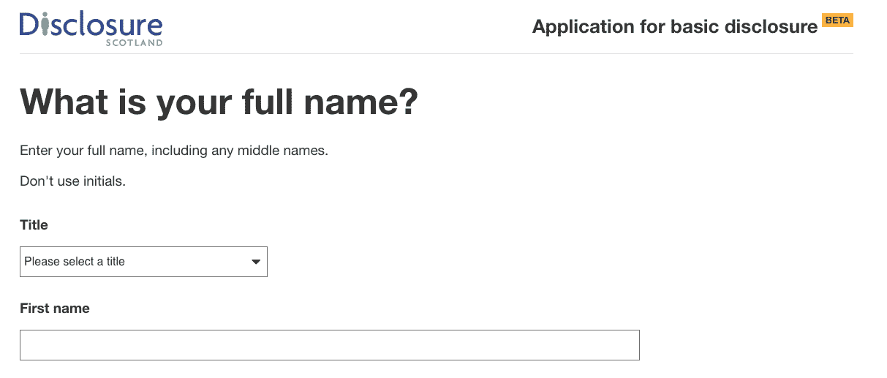
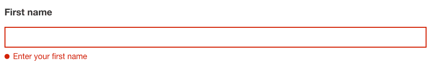
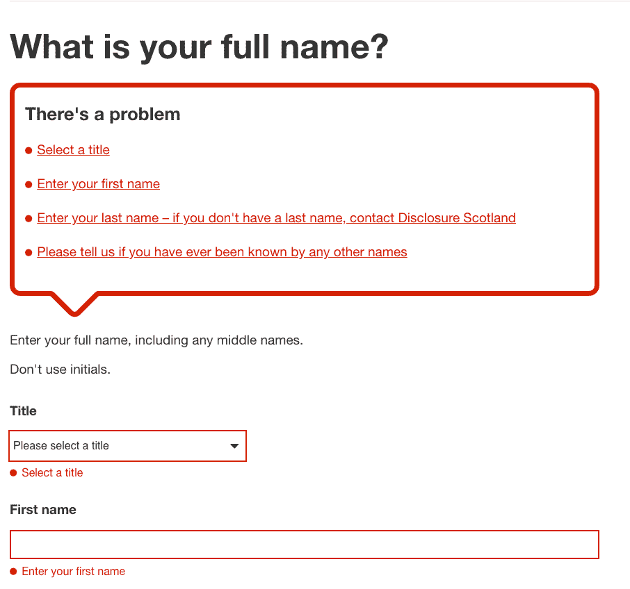
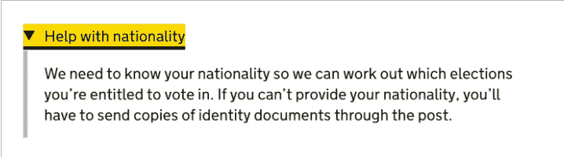
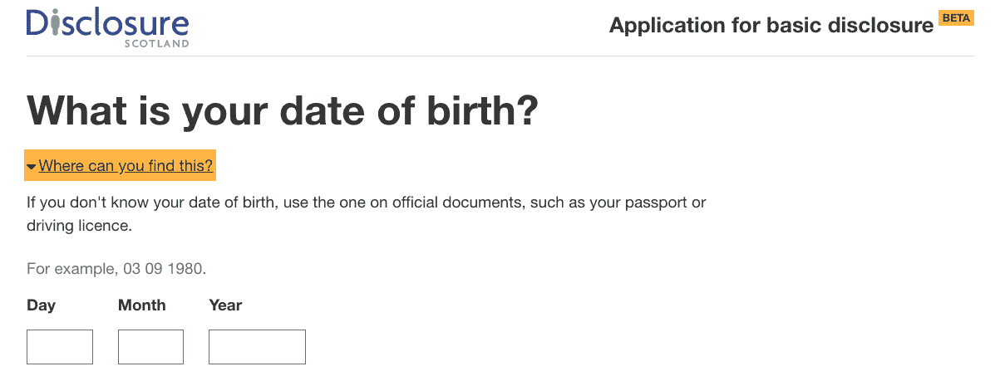

# 现在就行动起来，让你的 React 网站变得易于访问

> 原文：<https://blog.logrocket.com/make-your-react-website-accessible/>

这个词还没有传出去，可访问性通常是几个月甚至几年的 web 开发的补充。 [Webaim](https://webaim.org) 在[这份报告](https://webaim.org/projects/million/#wcag)中声称，97.8%的主页都有 WCAG 2 故障。web aim*是否制造工具来审计一个网站的可访问性问题，所以他们确实在这些数字中有既得利益，但是有一些*事实。**

 *我不关心各种 WCAG 2.x 标准。人们以这些标准为借口，做最起码的事情来使网站具有可访问性。我真正关心的是，辅助技术的真正用户可以验证我们开发的东西是可访问的。如果我们对辅助技术的真实用户进行测试，那么他们可以告诉我们什么是有效的，什么是无效的。目前的自动化可访问性工具产品还不能做到这一点。

使用像 [React](https://reactjs.org/) 这样的现代 JavaScript 框架创建的单页面应用程序增加了网站可访问性的复杂性。当用户单击链接时，不会向服务器请求新的 HTML。相反，狡猾的 JavaScript 诡计用新内容替换旧内容，并改变地址栏的 URL。除非你采取适当的行动，否则辅助技术很可能意识不到这种变化。

## 成为解决方案的一部分，而不是问题的一部分

我现在将概述一些简单的步骤，你可以做的，使你的反应网站更容易访问。

## 使用正确的 HTML 元素和属性(也称为使用语义 HTML)

> 打破！编写语义 HTML 并不比简单的`div`元素集合花费更多的时间。

守住头版。通过使用正确的 HTML 元素和属性，您可以使您的网站更容易被辅助技术访问！谁知道呢？

到底是谁没有使用正确的 HTML 和属性？这看起来很疯狂，但它经常发生，甚至可能不止一次，在我黑暗的过去，我创建了一个可点击的`div`元素，而不是使用按钮，或者可能有一个流氓输入，没有一个描述标签元素。让我们现在都重视做正确的事情。

### 一定要确保页面的内容符合逻辑顺序，不要依赖 CSS 或 JavaScript 在页面加载后重新排序内容

当谈到可访问性时，我收到的最好的建议之一是布局你的 HTML，就好像 CSS 不存在一样。如果你的主要布局是这样的，那么领先的屏幕阅读器就有机会在你的标记中轻松导航:

```
<html>
   <body>
     <header role="banner">
       <p>Put company logo, etc. here.</p>
     </header>
     <nav role="navigation">
       <ul>
         <li>Put navigation here</li>
       </ul>
     </nav>
     <main role="main">
       <p>Put main content here.</p>
     </main>
     <footer role="contentinfo">
       <p>Put copyright, etc. here.</p>
     </footer>
  </body>
</html>
```

正确的 HTML 地标元素和角色属性的组合允许屏幕阅读器的用户浏览地标区域，例如`header`、`main`和`footer`。屏幕阅读器识别这些标记区域，并提供查找它们的快捷键…..如果它们存在的话。这里有一个[视频](https://www.youtube.com/watch?v=Tslng1aDrIc&feature=youtu.be)展示了一个屏幕阅读器如何选择地标区域。

## 使用布局组件并在所有组件中使用语义 HTML

我是 React for consistency 中布局组件的忠实粉丝，我已经创建了这个代码沙箱，它显示了一个包装应用程序中所有组件的`Layout`组件:

```
const Layout = ({ children }) => (
  <React.Fragment>
    <header role="banner">
      <Logo />
    </header>
    <nav role="navigation">
      <Link to="/">Home</Link> <Link to="dashboard">Dashboard</Link>
    </nav>
    <main role="main">{children}</main>
    <footer role="contentinfo">
      <p>Put copyright, etc. here.</p>
    </footer>
  </React.Fragment>
);

const App = ({ children }) => (
  <React.Fragment>
    <Layout>
      <Router>
        <Home path="/" />
        <Dashboard path="dashboard" />
      </Router>
    </Layout>
  </React.Fragment>
);

const Home = () => (
  <div>
    <h2>Welcome</h2>
  </div>
);

const Dashboard = () => (
  <div>
    <h2>Dashboard</h2>
  </div>
);
```

`Layout`组件包装了`App`组件。您不需要向任何其他组件添加语义标记。

## 标题

标题是属于使用正确的 HTML 元素和属性范畴的另一个东西。标题告诉屏幕阅读器页面上的内容是如何组织的，让用户对内容有一个总体的了解。避免跳过标题，因为这会混淆屏幕阅读器。

我在苏格兰网站 [Disclosure Scotland](https://private-beta.disclosure.scot/) 工作，这是一个多步骤的向导式表单。表单的每一步都有*一个* < h1 >元素，清楚地表明该步骤的意图。



Clearly marked up h1 HTML element

在每一次页面转换或路由更改时，焦点会移到新内容的顶部，屏幕阅读器会读取描述该步骤目的的 h1 元素，这让我很快了解到路由器在 React 应用程序中应该如何工作。

## 将管理重点放在路线转换上

SPA(单页应用程序)最初的吸引力在于它消除了到服务器呈现新内容的需要。问题在于，一个新的服务器呈现的页面在屏幕阅读器上工作得很好，但是当您在 SPA 中更改路由时，屏幕阅读器不知道有新的内容。

幸运的是，在 react 生态系统中，有 [Reach 路由器](https://reach.tech/router/accessibility)为我们处理这个问题。

如果你使用的是 [react-router](https://github.com/ReactTraining/react-router) ，那么我已经创建了这个钩子，它将把焦点放在每个页面转换上。

```
import { usePrevious } from "./usePrevious";
import { useLayoutEffect } from "react";
import { useLocation } from "react-router-dom";

export const useScrollToTop = ({ ref }:{
  ref
}) => {
  const { pathname } = useLocation();
  const previousPathname = usePrevious(pathname);

  useLayoutEffect(() => {
    if (pathname === previousPathname || !ref?.current) {
      return;
    }

    window.scrollTo(0, 0);

    const clearTimer = setTimeout(() => {
      ref.current.focus();
    }, 100);

    return () => {
      clearTimeout(clearTimer);
    };
  }, [pathname, previousPathname, ref]);
};
```

我已经创建了一个 [CodeSandbox](https://codesandbox.io/s/usescrolltotop-1ecpc) 来展示钩子的作用。每一页的底部都有一个链接，点击这个链接就会调用钩子。钩子跟踪当前的 URL，然后检查新的导航变化，如果它们不匹配，钩子滚动到页面的顶部，并将焦点放在存储在 React `ref`中的 HTML 元素上。

## 键盘导航

因为我们现在有了语义 HTML、路由器和检测路由变化的容器组件，所以我们应该确保可以在页面上上下移动所有需要关注的元素。

如果你对按钮和链接使用合理的 HTML 元素选择，这并没有什么大不了的。例如，您不应该将 span 标记或 div 作为按钮或链接。这进一步证实了我们应该使用正确的 HTML 元素和属性的疯狂建议。我正在用这个疯狂的建议挑战极限。

我经常看到的另一件事是没有 href 的锚点或标签，没有必要这样做。没有 href 的主播没有任何意义，所以不要做。你可以设置一个按钮看起来像一个锚点，只需设置背景为透明和无边框，例如:

```
.link__button {
  background: transparent;
  border: none;
  padding: 0;
  margin: 0;
  color: #2096f3;
}
```

## 打破！所有表单控件都必须有标签

更明显的是，使用正确的 HTML 元素和属性。确保所有表单控件不仅有标签，而且有正确标记的伴随错误消息的一种方法是拥有一个更高的组件，如下所示:

```
export function FormControl<T>(
  Comp: Component<T>
): React.Component<T> {
  return class FormControlWrapper extends React.Component<T> {
    id: string;
    constructor(props) {
      super(props);

      this.id = this.props.id || this.props.name || prefixId();
    }

    render() {
      const {
        invalid,
        name,
        label,
        errorMessage,
        className,
        required,
        ...rest
      } = this.props as any;

      const errorId = `${this.id}-error`;

      return (
        <div>
          <Label
            id={`${this.id}-label`}
            htmlFor={this.id}
            required={required}
          >
            {label}
          </Label>
          <div>
            <Comp
              id={this.id}
              name={name}
              invalid={invalid}
              aria-invalid={invalid}
              required={required}
              aria-describedby={errorId}
              {...rest}
            />
          </div>
          <div
            id={errorId}
            aria-hidden={!invalid}
            role="alert"
          >
            {invalid &&
              errorMessage &&
              <Error
                errorMessage={errorMessage}
              />}
          </div>
        </div>
      );
    }
  };
}
```

有了这个高阶组件，我现在可以给任何组件添加正确的标签，比如一个`Input`组件:

```
export const FormInput = FormControl(Input)
```

使用这种方法，错误消息会突出显示给所有用户:



Text box with validation message below

## 验证信息和焦点管理

如果无效，上面的高阶组件负责在每个无效字段下显示一个错误。不幸的是，屏幕阅读器的用户不会知道这些错误，除非他们切换到该字段，所以我们需要提供一个描述每个错误的验证摘要，并给出从验证摘要到每个错误的导航链接。



At first glance, this is complete overkill for two fields, but in the context of a screen reader, this is a great practice. In the event of an error, the focus will be placed on the `h2` element in the `ValidationSummary` component. There is a link to each validation error. The link’s `href` is a bookmark link to the invalid form element. When the user presses tab, focus changes to each validation error link and the user can jump to the correct control to fix the error by clicking the link. A validation summary like this can ensure that all users have a pleasant experience.

## 链接

当链接被聚焦时，它们应该有不同的颜色来表示它们的不同状态:



A focused link with a different background colour

## aria-为新内容而活

aria 属性的第一条规则是不要使用它们。请不要从字面上理解这条规则，它是为了强调这样一个事实，即应该少用它们。

aria-live 属性就是这样一个例外。告诉屏幕阅读器页面上有新内容，用户应该被告知这一点。

下面是一个`HelpLink`扩展器组件，当点击一个链接时，它会扩展和收缩:

```
export const HelpLink = ({
  collapsibleId,
  linkText,
  helpText,
  open,
  onClick,
  children,
}) => (
  <div className={styles.container}>
    <Button
      buttonStyle={ButtonStyles.link}
      onClick={onClick}
      aria-expanded={open}
      aria-controls={collapsibleId}
      tabIndex={0}
    >
      <span
        className={cs(
          styles['link__title'],
          open && styles['link__title__open']
        )}
      >
        <span>{linkText}</span>
      </span>
    </Button>
    <div
      id={collapsibleId}
      aria-hidden={!open}
      aria-live="polite"
      className={cs(styles['closed'], open && styles['open'])}
      role="region"
      tabIndex={-1}
    >
      {helpText}
      {open && children}
    </div>
  </div>
)
```



Content that has been expanded with aria-live attribute

## 明智地使用 CSS

你应该确保你:

一些用户自定义网页的外观以满足他们的需求。为了支持这些用户，您应该确保:

如果可能的话，你应该避免使用 CSS 对页面上的内容进行重新排序，因为这可能会给键盘和屏幕阅读器用户带来问题。

## 不要因为使用自动化的易访问性测试工具而放松你的良心

我见过很多这种情况，开发团队认为他们正在通过运行一个工具或 linter 来检查网站的渲染 HTML 是否有不正确的 HTML 以及错误或缺失的属性。虽然这是值得的，但这并不能保证您的网站对于辅助技术的用户来说是可访问的。与真实用户一起测试是所有人都能访问你的网站的唯一保证。

## 收场白

令人沮丧的是，这篇文章压倒一切的主题是使用正确的 HTML 元素和属性。我会举起手说，我过去并不总是这样做。我在这篇文章中描述的并不是一个剧烈的变化，也没有给开发过程增加任何时间。通过做我在这里概述的事情，我们可以让所有用户都可以使用我们的 React 站点。

需要采取更多的行动，只要稍加思考和努力，变化就能发生。

## 使用 LogRocket 消除传统反应错误报告的噪音

[LogRocket](https://lp.logrocket.com/blg/react-signup-issue-free)

是一款 React analytics 解决方案，可保护您免受数百个误报错误警报的影响，只针对少数真正重要的项目。LogRocket 告诉您 React 应用程序中实际影响用户的最具影响力的 bug 和 UX 问题。

[ ](https://lp.logrocket.com/blg/react-signup-general) [  ](https://lp.logrocket.com/blg/react-signup-general) [LogRocket](https://lp.logrocket.com/blg/react-signup-issue-free)

自动聚合客户端错误、反应错误边界、还原状态、缓慢的组件加载时间、JS 异常、前端性能指标和用户交互。然后，LogRocket 使用机器学习来通知您影响大多数用户的最具影响力的问题，并提供您修复它所需的上下文。

关注重要的 React bug—[今天就试试 LogRocket】。](https://lp.logrocket.com/blg/react-signup-issue-free)*