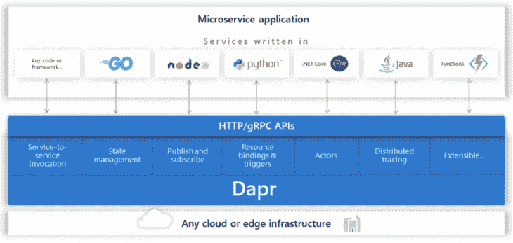
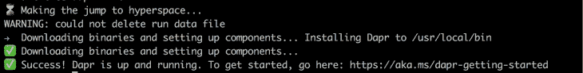
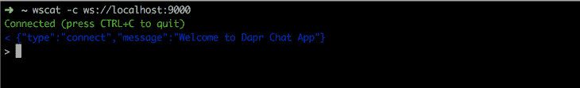
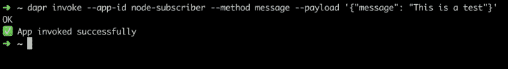
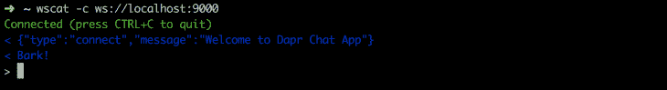
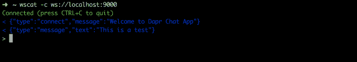
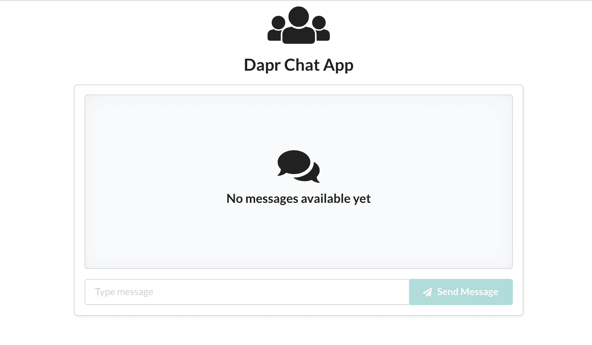
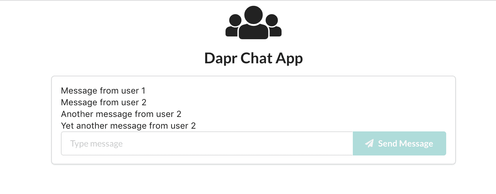
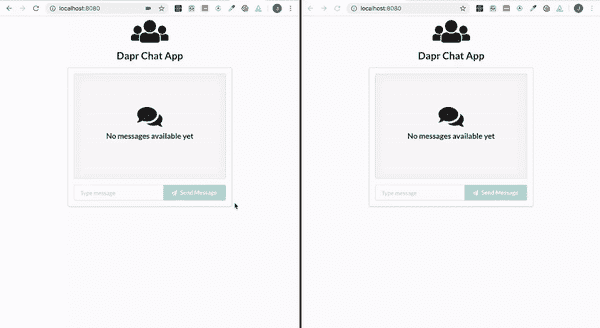

# 用 Dapr - LogRocket Blog 制作聊天应用

> 原文：<https://blog.logrocket.com/making-a-chat-app-with-dapr/>

## 介绍

分布式应用运行时( [Dapr](https://dapr.io/) )是由[微软](https://cloudblogs.microsoft.com/opensource/2019/10/16/announcing-dapr-open-source-project-build-microservice-applications/)开发的开源项目。它是一个事件驱动的可移植运行时，旨在简化开发人员构建微服务应用程序。Dapr 由标准 HTTP 或 gRPC APIs 访问的几个构建块组成，可以从各种编程语言中调用。



Source: [https://cloudblogs.microsoft.com/opensource/2019/10/16/announcing-dapr-open-source-project-build-microservice-applications/](https://cloudblogs.microsoft.com/opensource/2019/10/16/announcing-dapr-open-source-project-build-microservice-applications/)

Dapr 的主要构件包括:

*   **服务调用**–服务到服务的调用支持远程服务上的方法调用，包括重试，无论它们运行在受支持的托管环境中的何处
*   **状态管理**–允许存储、检索和删除键/值对。不同的状态存储组件支持不同的数据存储，如 Redis、Azure CosmosDB 和 DynamoDB
*   **发布和订阅服务间的消息传递**–这实现了事件驱动的架构，使水平扩展变得更加容易，并增加了故障恢复能力
*   **事件驱动的源绑定**–通过支持向外部资源(如数据库、队列、webhooks 等)接收和发送事件，事件驱动架构的可伸缩性和弹性得到了进一步提高
*   虚拟角色(Virtual actors)——无状态和有状态对象的模式，通过方法和状态封装使并发变得简单
*   **服务之间的分布式跟踪**–它编译 Dapr 实例之间的跟踪事件、指标和性能统计。这使您能够使用 W3C 跟踪上下文标准轻松地诊断和监控生产中多个服务之间的调用
*   **机密管理**–它提供了一种简单的方法来访问机密，而不需要知道正在使用的特定机密存储的复杂性。支持的秘密商店包括 Kubernetes、Azure Key Vault、AWS Secret manager 等。

在这篇文章中，我们将探讨如何使用一些构建模块来制作一个聊天应用程序。

## 先决条件

我们的聊天应用程序将使用 [Node.js](https://nodejs.org/en/) 和 [React](https://reactjs.org/) 构建。本文假设您对这两者都很熟悉，并且具备这两者的工作知识。在我们开始构建聊天应用程序之前，请确保您的机器上安装了[节点](https://nodejs.org/en/)、[纱线](https://yarnpkg.com/)或 [npm](https://npmjs.com/) 和 [Docker](https://www.docker.com/) 。如果您还没有安装它们，可以按照提供的链接中的说明进行安装。我们将使用 [create-react-app](https://github.com/facebook/create-react-app) 为我们的聊天应用程序创建 UI。

## 设置 Dapr

我们需要做的第一件事是在本地机器上安装 Dapr CLI。我们将为我们的操作系统使用特定的安装脚本:

### Linux:

```
$ wget -q https://raw.githubusercontent.com/dapr/cli/master/install/install.sh -O - | /bin/bash
```

### 窗口:

```
$ powershell -Command "iwr -useb https://raw.githubusercontent.com/dapr/cli/master/install/install.ps1 | iex"
```

### MacOS:

```
$ curl -fsSL https://raw.githubusercontent.com/dapr/cli/master/install/install.sh | /bin/bash
```

安装 CLI 后，需要使用以下命令在计算机中设置 Dapr:

```
$ dapr init
```



现在可以用`dapr run`在本地运行 Dapr。

## 设置订户

我们的聊天应用将由两个微服务组成。第一个微服务将是一个节点应用程序，它将从客户端 UI 订阅已发布的消息(已发送的消息)(第二个微服务)。

为我们的服务器创建以下文件夹结构:

```
node-subscriber
├── README.md
├── .gitignore
├── routes.js
└── app.js
```

或者，这可以通过终端以下列方式完成:

```
$ mkdir node-subscriber
$ cd node-subscriber
$ touch README.md app.js routes.js .gitignore
```

您可以在 README.md 中添加对项目内容的描述。您还应该将`node_modules`文件夹添加到`.gitignore`文件中，如下所示:

```
node_modules/
```

要生成不带提示的 package.json 文件，请运行以下命令:

```
$ npm init -y
```

package.json 文件的内容如下所示:

```
{
  "name": "node-subscriber",
  "version": "1.0.0",
  "description": "",
  "main": "app.js",
  "scripts": {
    "test": "echo \"Error: no test specified\" && exit 1"
  },
  "keywords": [],
  "author": "",
  "license": "ISC"
}
```

## 安装依赖项

```
$ yarn add express body-parser ws
```

在`app.js`中，我们将创建一个简单的 express 应用程序，它公开一些路由和处理程序，并初始化一个 WebSocket 服务器实例来发送连接到客户端的消息。将以下代码添加到 app.js 文件中:

```
const express = require("express");
const bodyParser = require('body-parser');
const WebSocket = require("ws");
const { createServer } = require("http");

const app = express();
app.use(bodyParser.json());
app.use("/", require("./routes"));

const port = process.env.PORT || 9000;

//initialize a http server
const server = createServer(app);
server.listen(port, () => {
  console.log(`Node subscriber server running on port: ${port}`);
});
//initialize the WebSocket server instance
const wss = new WebSocket.Server({ server });
wss.on("connection", (ws) => {
  console.info(`Total connected clients: ${wss.clients.size}`);
  app.locals.clients = wss.clients;
  //send immediate a feedback to the incoming connection
  ws.send(
    JSON.stringify({
      type: "connect",
      message: "Welcome to Dapr Chat App",
    })
  );
});
```

我们首先使用 express 创建一个简单的 HTTP 服务器，然后添加一个使用 express 服务器的 WebSocket 服务器。WebSocket 服务器的连接事件处理程序处理来自客户端的连接请求。然后，我们将 WebSocket 服务器的`clients`属性分配给`app.locals`。这使我们能够从任何路由端点向所有连接的客户端广播消息。最后，我们向客户机发送一条消息，表明连接成功。

我们公开了一个从客户端订阅消息的路由`/message`。路由处理器将在`routes.js`中定义。让我们添加一些代码，向连接的客户端发送一条简单的消息:

```
const router = require("express").Router();
const WebSocket = require("ws");
const broadcast = (clients, message) => {
  clients.forEach((client) => {
    if (client.readyState === WebSocket.OPEN) {
      client.send(message);
    }
  });
};
router.post("/message", (req, res) => {
  broadcast(req.app.locals.clients, "Bark!");
  return res.sendStatus(200);
});
module.exports = router;
```

## 使用 Dapr 运行节点订阅服务器

我们现在准备测试我们的节点订户服务器。确保您在`node-subscriber`目录中。使用 Dapr `dapr run --app-id node-subscriber --app-port 9000 --port 3500 node app.js`运行节点订阅者应用程序。

选项 app-id 和 app-port 将是我们选择的任何唯一标识符和我们的节点应用程序运行的端口。port 选项指示 Dapr 将在哪个端口上运行。我们还传递命令来运行我们的应用程序`node app.js`。

您可以使用 [wscat](https://www.npmjs.com/package/wscat) 实用程序或[智能 Websocket 客户端](https://chrome.google.com/webstore/detail/smart-websocket-client/omalebghpgejjiaoknljcfmglgbpocdp) Chrome 扩展来测试我们服务器的 WebSocket 功能。如果安装了 wscat，请打开一个新的终端选项卡并运行:

```
$ wscat -c ws://localhost:9000
```



一旦我们连接到 WebSocket，我们就可以使用 Dapr CLI post 消息进行测试，并查看连接的客户端是否收到消息:

```
dapr invoke --app-id nodeapp --method message --payload '{"message": "This is a test" }'
```





调用 message 方法后，连接的客户端会收到来自应用程序的消息。因为路由应该将从任何客户端发布的消息中继到其他连接的客户端，所以让我们对此方法做一些调整:

```
const router = require("express").Router();
const WebSocket = require("ws");
const broadcast = (clients, text) => {
  clients.forEach((client) => {
    if (client.readyState === WebSocket.OPEN) {
      client.send(JSON.stringify({
        type: "message",
        text
      }));
    }
  });
};
router.post("/message", (req, res) => {
  const message = req.body.message;
  if(message) {
    broadcast(req.app.locals.clients, message);
  }
  return res.sendStatus(200);
});
module.exports = router;
```

使用我们之前使用的示例消息调用该方法会产生以下结果:

服务器现在可以从客户端接收消息，并将其发送给其他连接的客户端。

## 聊天应用客户端

### 设置

我们的前端客户端将由服务器和应用程序组成。服务器将通过 Dapr 调用消息方法。让我们为客户创建文件夹结构:

```
$ mkdir dapr-chat-app-client
$ cd dapr-chat-app-client
$ touch README.md server.js .gitignore
```

将客户端的简短描述添加到 README.md 文件，并将 node_modules 文件夹添加到`.gitignore`文件。

接下来，使用以下命令生成 package.json 文件:

package.json 文件的内容如下所示:

```
{
  "name": "dapr-chat-app-client",
  "version": "1.0.0",
  "description": "",
  "main": "index.js",
  "scripts": {
    "test": "echo \"Error: no test specified\" && exit 1"
  },
  "keywords": [],
  "author": "",
  "license": "ISC"
}
```

### 安装依赖项

```
$ yarn add express body-parser request
```

进入 dapr-chat-app-client 目录，使用以下任意命令引导前端应用程序。

### npx:

```
$ npx create-react-app client
```

### npm:

```
$ npm init react-app client
```

### 纱线:

```
$ yarn create react-app client
```

### 前端服务器

当从前端应用发送消息时，前端服务器将调用节点订户的消息方法。将以下代码添加到`dapr-chat-app-client`目录下的 server.js 文件中:

```
const express = require('express');
const path = require('path');
const request = require('request');
const bodyParser = require('body-parser');

const app = express();
app.use(bodyParser.json());

const daprPort = process.env.DAPR_HTTP_PORT || 3500;
const daprUrl = `http://localhost:${daprPort}/v1.0`;
const port = 8080;

app.post('/publish', (req, res) => {
  console.log("Publishing: ", req.body);
  const publishUrl = `${daprUrl}/invoke/node-subscriber/method/message`;
  request( { uri: publishUrl, method: 'POST', json: req.body } );
  res.sendStatus(200);
});

// Serve static files
app.use(express.static(path.join(__dirname, 'client/build')));
// For all other requests, route to React client
app.get('*', function (_req, res) {
  res.sendFile(path.join(__dirname, 'client/build', 'index.html'));
});
app.listen(process.env.PORT || port, () => console.log(`Listening on port ${port}!`));
```

服务器文件创建一个 express 服务器，该服务器公开一个发布端点，该端点使用 Dapr 调用节点订阅者上的消息方法。它还为前端应用程序提供静态文件。

为了让客户端运行，我们需要构建并启动前端应用程序，我们在`dapr-chat-app-client`目录下的`client`文件夹中进行引导。

为此，我们需要在主文件夹的 package.json 文件中添加一些脚本:

```
"scripts": {
    "client": "cd client && yarn start",
    "start": "node server.js",
    "buildclient": "cd client && npm install && npm run build",
    "buildandstart": "npm run buildclient && npm install && npm run start"
},

```

使用 Dapr 运行应用程序:

```
dapr run --app-id dapt-chat-app-client --app-port 8080 npm run buildandstart
```

这将在开发模式下运行应用程序，您可以使用链接 [http://localhost:8080/](http://localhost:8080/) 在浏览器中查看它。

## 客户端应用

我们已经准备好工作的前端应用程序。导航到客户端文件夹:

```
cd client
```

### 安装附加依赖项

我们将使用[语义 UI 反应](https://react.semantic-ui.com/)进行样式化。

要安装它，请运行以下命令:

```
$ yarn add semantic-ui-react
```

为了主题化语义 ui 组件，我们需要语义 UI 样式表。最快的开始方式是使用 CDN。只需将此链接添加到公共文件夹中您的`index.html`文件的`<head>`:

```
<link rel="stylesheet" href="//cdn.jsdelivr.net/npm/[email protected]/dist/semantic.min.css" />
```

## 组件设置

我们的应用程序将存放在 app.js 文件中，这将是主要组件:

```
# Navigate to source directory
$ cd src/
```

当主组件挂载后，我们将创建一个 WebSocket 连接并使用 Refs 存储它。该连接将侦听来自我们的节点订阅服务器的消息。然后，接收到的消息将被添加到状态中，并被处理以供显示。初始设置如下所示:

```
import React, { Fragment, useState, useEffect, useRef } from "react";
import {
  Header
} from "semantic-ui-react";
import "./App.css";

const App = () => {
  const webSocket = useRef(null);
  const [socketMessages, setSocketMessages] = useState([]);

  useEffect(() => {
    webSocket.current = new WebSocket("ws://localhost:9000");
    webSocket.current.onmessage = message => {
      const data = JSON.parse(message.data);
      setSocketMessages(prev => [...prev, data]);
    };
    webSocket.current.onclose = () => {
      webSocket.current.close();
    };
    return () => webSocket.current.close();
  }, []);
  return (
    <div className="App">
      <Header as="h2" icon>
        <Icon name="users" />
        Dapr Chat App
      </Header>
      <Grid>
      </Grid>
    </div>
  );
};
export default App;
```


为了处理我们从节点订阅服务器收到的消息，我们将使用一个 useEffect，每当`socketMessages`发生变化时就会触发它。它将获取最后一条消息并进行处理:

```
useEffect(() => {
    let data = socketMessages.pop();
    if (data) {
      switch (data.type) {
        case "message":
          handleMessageReceived(data.text);
          break;
        default:
          break;
      }
    }
  }, [socketMessages]);
```

消息将被处理，如果消息的类型是`message`，它将调用`handleMessageReceived`处理程序。该处理程序将使用新消息更新 state messages 变量，然后向用户显示新消息:

```
const Chat = ({ connection, updateConnection, channel, updateChannel }) => {
  ...  
  const messagesRef = useRef([]);
  const [messages, setMessages] = useState({});
  ...
  const handleMessageReceived = (text) => {
    let messages = messagesRef.current;
    let newMessages = [...messages, text];
    messagesRef.current = newMessages;
    setMessages(newMessages);
  };
  ...
}
```

处理程序检索当前存储的消息，并在更新值之前添加新接收的消息。

现在我们已经处理了从节点订阅服务器接收消息，我们需要显示聊天消息。此外，我们将为用户提供一个输入，以便向聊天中的其他用户发送消息。如果没有要显示的消息，我们将有一个横幅显示尚未收到任何消息。



用如下消息框代码更新应用程序组件:

```
...
import {
  Icon,
  Input,
  Grid,
  Segment,
  Card,
  Comment,
  Button,
} from "semantic-ui-react";

const App = () => {
  ...
  const [message, setMessage] = useState("");
  ...
  const handleSubmit = (e) => {
    fetch('/publish', {
        headers: {
            'Accept': 'application/json',
            'Content-Type': 'application/json'
        },
        method:"POST",
        body: JSON.stringify({ message }),
    });
    e.preventDefault();
    setMessage('');
  }
  ...
  return (
    <div className="App">
      <Header as="h2" icon>
        <Icon name="users" />
        Dapr Chat App
      </Header>
      <Grid centered>
        <Grid.Column width={9}>
          <Card fluid>
            <Card.Content>
              {messages.length ? (
                  <Fragment>
                    {messages.map((text,id) => (
                      <Comment key={`msg-${id}`}>
                        <Comment.Content>
                          <Comment.Text>{text}</Comment.Text>
                        </Comment.Content>
                      </Comment>
                    ))}
                  </Fragment>
              ) : (
                <Segment placeholder>
                  <Header icon>
                    <Icon name="discussions" />
                    No messages available yet
                  </Header>
                </Segment>
              )}
              <Input
                fluid
                type="text"
                value={message}
                onChange={e => setMessage(e.target.value)}
                placeholder="Type message"
                action
              >
                <input />
                <Button color="teal" disabled={!message} onClick={handleSubmit}>
                  <Icon name="send" />
                  Send Message
                </Button>
              </Input>
            </Card.Content>
          </Card>
        </Grid.Column>
      </Grid>
    </div>
  );
}
```

当用户键入消息时，提交按钮将被启用，并且状态消息值将被设置。当用户点击`Send Message`按钮时，我们将调用`handleSubmit`事件处理程序，它将使用用户输入的消息调用前端服务器。

前端应用程序的应用程序组件的完整代码将如下所示:

```
import React, { useState, useEffect, useRef, Fragment } from "react";
import {
  Header,
  Icon,
  Input,
  Grid,
  Segment,
  Card,
  Comment,
  Button,
} from "semantic-ui-react";
import "./App.css";

const App = () => {
  const [socketMessages, setSocketMessages] = useState([]);
  const webSocket = useRef(null);
  const [message, setMessage] = useState("");
  const messagesRef = useRef([]);
  const [messages, setMessages] = useState({});

  useEffect(() => {
    webSocket.current = new WebSocket("ws://localhost:9000");
    webSocket.current.onmessage = message => {
      const data = JSON.parse(message.data);
      setSocketMessages(prev => [...prev, data]);
    };
    webSocket.current.onclose = () => {
      webSocket.current.close();
    };
    return () => webSocket.current.close();
  }, []);

  useEffect(() => {
    let data = socketMessages.pop();
    if (data) {
      switch (data.type) {
        case "message":
          handleMessageReceived(data.text);
          break;
        default:
          break;
      }
    }
  }, [socketMessages]);

  const handleMessageReceived = (text) => {
    let messages = messagesRef.current;
    let newMessages = [...messages, text];
    messagesRef.current = newMessages;
    setMessages(newMessages);
  };

  const handleSubmit = (e) => {
    fetch('/publish', {
        headers: {
            'Accept': 'application/json',
            'Content-Type': 'application/json'
        },
        method:"POST",
        body: JSON.stringify({ message }),
    });
    e.preventDefault();
    setMessage('');
  }

  return (
    <div className="App">
      <Header as="h2" icon>
        <Icon name="users" />
        Dapr Chat App
      </Header>
      <Grid centered>
        <Grid.Column width={9}>
          <Card fluid>
            <Card.Content>
              {messages.length ? (
                  <Fragment>
                    {messages.map((text,id) => (
                      <Comment key={`msg-${id}`}>
                        <Comment.Content>
                          <Comment.Text>{text}</Comment.Text>
                        </Comment.Content>
                      </Comment>
                    ))}
                  </Fragment>
              ) : (
                <Segment placeholder>
                  <Header icon>
                    <Icon name="discussions" />
                    No messages available yet
                  </Header>
                </Segment>
              )}
              <Input
                fluid
                type="text"
                value={message}
                onChange={e => setMessage(e.target.value)}
                placeholder="Type message"
                action
              >
                <input />
                <Button color="teal" disabled={!message} onClick={handleSubmit}>
                  <Icon name="send" />
                  Send Message
                </Button>
              </Input>
            </Card.Content>
          </Card>
        </Grid.Column>
      </Grid>
    </div>
  );
};
export default App;
```





就这样，我们使用 Dapr 构建了一个简单的聊天应用程序。这个版本的聊天应用程序在本地运行，非常适合您熟悉 Dapr CLI。如果您想将您的聊天应用程序部署到生产环境中，您可以使用 Kubernetes 集群来完成。你可以在 Dapr 文档中找到关于如何[设置环境](https://github.com/dapr/docs/blob/master/getting-started/environment-setup.md)的说明。

## 结论和下一步措施

我们构建的示例聊天应用程序功能非常有限。您可以添加一些功能，例如用户选择用户名和启动会话的能力。此外，您可以广播已加入其他已连接客户端的用户。聊天框中的消息也可以改进，以显示发送者的信息和消息发送的时间。从这个例子中，我们可以看到使用 Dapr 编写弹性可伸缩的微服务相当容易。你可以在 Dapr [GitHub](https://github.com/dapr) repo 中找到更多的信息和例子。如果你想看这个例子的完整代码，你可以在 GitHub 的[节点订户](https://github.com/jkithome/dapr-node-subscriber)和[聊天客户端](https://github.com/jkithome/dapr-chat-app-client) repos 上找到。

## 使用 LogRocket 消除传统反应错误报告的噪音

[LogRocket](https://lp.logrocket.com/blg/react-signup-issue-free)

是一款 React analytics 解决方案，可保护您免受数百个误报错误警报的影响，只针对少数真正重要的项目。LogRocket 告诉您 React 应用程序中实际影响用户的最具影响力的 bug 和 UX 问题。

[ ](https://lp.logrocket.com/blg/react-signup-general) [  ](https://lp.logrocket.com/blg/react-signup-general) [LogRocket](https://lp.logrocket.com/blg/react-signup-issue-free)

自动聚合客户端错误、反应错误边界、还原状态、缓慢的组件加载时间、JS 异常、前端性能指标和用户交互。然后，LogRocket 使用机器学习来通知您影响大多数用户的最具影响力的问题，并提供您修复它所需的上下文。

关注重要的 React bug—[今天就试试 LogRocket】。](https://lp.logrocket.com/blg/react-signup-issue-free)