# 为更好的 UX 制作清晰的网站导航菜单

> 原文：<https://blog.logrocket.com/ux-design/making-clear-navigation-menus-better-ux/>

清晰的网站导航对任何网站的成功都至关重要。用户不仅使用网站导航从一个页面移动到另一个页面，还可以确定他们在任何给定时刻的位置。就像指路的北极星一样，如果用户有任何疑问，他们应该能够通过导航来寻找方向。

但是当导航本身有问题时会发生什么呢？我们如何保证菜单项的分类是有意义的？如果菜单设计不完全符合用户的期望怎么办？用户的普遍感觉将是沮丧。

如果用户感到沮丧，他们不太可能留下来，大量研究表明情况就是这样。他们很有可能会直接去别的地方，去竞争对手的网站，而不是坚持他们所看到的一个破损的导航菜单。

从目标驱动的角度考虑用户是很重要的。我们可以有把握地假设，大多数用户在访问一个网站时，都想实现某个(或某些)目标。无论是了解最新的新闻，订购比萨饼，还是搜索当地的健康服务。

好的网站导航帮助用户实现目标。这使得用户需要去哪里实现它们变得显而易见。正确的导航对网站的成功至关重要，所以让我们来谈谈什么是网站导航，现有的不同导航系统，以及有效帮助用户的导航最佳实践。

网站导航是一个菜单和链接系统，允许用户浏览网站的内容和页面。它通常包括主菜单、下拉菜单和网站内其他页面的链接。

导航菜单旨在帮助用户快速方便地找到他们正在寻找的特定信息。这是导航系统的基本特性，无论实现什么类型的导航，都是如此。

也就是说，让我们看看现有的不同类型的网站导航，并考虑它们的使用案例。

### 水平条导航

水平栏导航是大多数用户都熟悉的导航样式。自从互联网出现以来，水平导航就已经存在了。顾名思义，一个带有一系列链接的水平栏横跨页面的顶部，在页眉中，包含了最重要的顶层导航项目。

理论上，这种风格的导航可以放在屏幕的底部，但是这种情况非常少见，而且违背了导航应该放在屏幕顶部的普遍观点。

> 注意，一般来说，在水平栏导航中，顶级菜单项不应该超过 7 个。超过这个数字会使导航显得混乱和难以使用。

在桌面上，带有嵌套子级项目的顶级项目通常显示为向下的人字形(⌄)。在手机上，常见的是加号(+)表示更多的菜单项，减号(-)表示隐藏这些菜单项。没有这些小符号，任何被归类为子项的项目对用户来说都是不可见的。

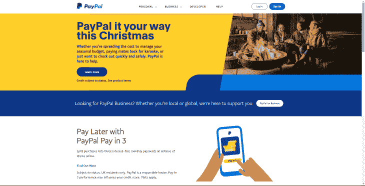

A typical approach used at PayPal — the logo is positioned on the left, navigational items are centered, and prominent calls to action are right-aligned while also styled as buttons.

对于有许多不同类别和多个子类别的复杂网站，大型菜单通常是最好的选择。由于其复杂的性质，巨型菜单需要仔细考虑和规划。在移动端尤其如此。对于如此复杂的网站导航来说，正确的分类至关重要。

卡片分类是将菜单项分类成最有意义的类别的行为，是对项目进行分类的理想方法。您可以在良好导航的最佳实践一节中了解更多信息。

大多数巨型菜单采用水平条导航的形式。当用户悬停在顶层项目上时，会显示进一步的子类别。如果你访问过亚马逊这样的大型电子商务网站，你会看到这种类型的菜单。

> 注意，应该避免在大菜单上做广告。有大量的例子表明，大型电子商务公司通过添加图形广告的方式来分割他们的巨型菜单，从而将流量导向网站的特定部分。不要这样！巨型菜单应该只用于导航链接。

然而，一些大型菜单可以采取稍微不同的形式，要么采用垂直侧边栏导航方法，要么采用水平和垂直相结合的混合方法，如沃尔玛的这个例子。

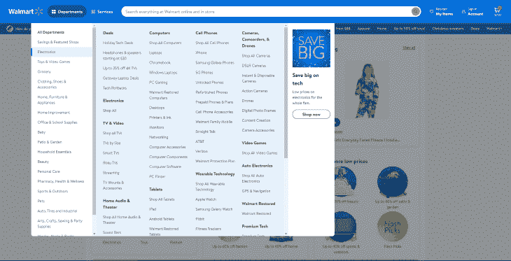

Walmart uses a mega menu for navigation because of the complex nature of their business.

### 面包屑导航

如果一个网站有一个巨大的下拉菜单，那么这个网站很有可能足够复杂，可以实现面包屑导航。

面包屑导航就像当你进一步浏览网站时，在你身后留下一点面包屑。如果用户在任何时候迷路了，他们可以通过向后跟踪面包屑返回到一个总体类别。

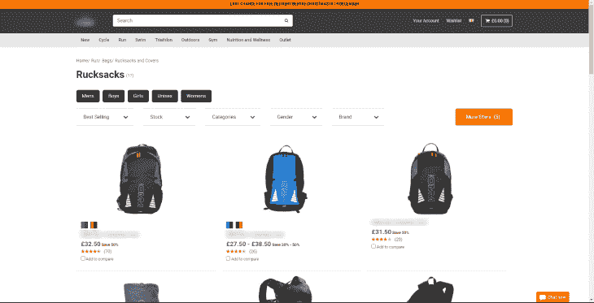

Breadcrumb navigation can help the user trace their steps backward.

垂直侧边栏导航有点不寻常，因为虽然它是一种定义良好的导航设计模式，但并不经常使用。

垂直侧边栏导航非常适合显示大量的内容项目，以及标题较长的内容项目，因为有可用的垂直屏幕空间。正因为如此，垂直侧栏在 SaaS 仪表板的上下文中通常很受欢迎，甚至可以让用户选择将菜单滑出画布，使仪表板中的内容更加突出和集中。

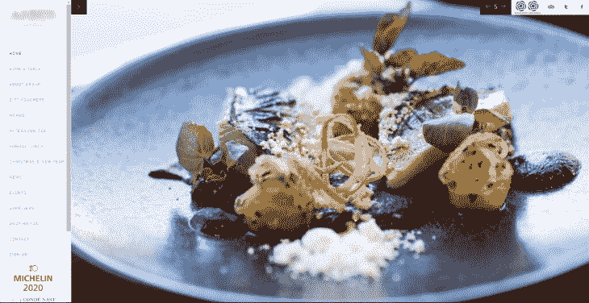

A typical example of vertical sidebar navigation is used for this restaurant.

使用这种导航风格有一些更明显的好处，其中之一是更容易浏览。当用户扫描时，他们倾向于以 F 模式扫描。主要是从左到右，上下。

在这种情况下，垂直侧边栏导航确实是一种更符合逻辑的设计。当使用垂直导航扫描屏幕时，用户不必像使用传统的水平导航那样扫描整个屏幕宽度。

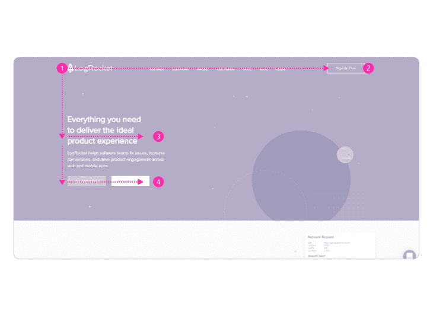

A visualization of how users tend to scan websites, in an F-shape manner.

然而，也许这个菜单出问题的地方是在需要一个复杂的大菜单的情况下。菜单可能会展开 2 个甚至 3 个子类别，而不是从上到下，迫使用户使用不熟悉的复杂设计模式，而不是更传统的水平方法，这种方法更好地为用户提供他们工作的每个类别的上下文。

### 汉堡导航

信不信由你,“汉堡按钮”自 80 年代末就已经出现了，但只是在最近十年，它才因为一种设备而变得突出:智能手机。

在设备上浏览网页的用户呈指数级增长，因此设计者寻求一种解决方案，以最适合移动设备大小的方式显示导航。然而，汉堡包按钮的实现并不是没有争议的，它引发了一场关于用户是否清楚地理解三条水平线代表一种导航方式的争论。

然而，考虑到它的流行，汉堡按钮导航方法已经成为移动设备导航中被接受的标准。

Hamburger menu on the mobile version of Zillow.

Hamburger menu on the mobile version of Target.

一般的设计模式是在画布的左侧显示汉堡包，它从左侧滑出一个导航抽屉，尽管确切的位置不是一成不变的。关键是将它放在移动设备的顶部，尽管这可能会导致单手使用的潜在问题。

在激活汉堡时，项目列表会从上到下显示，但也有可能菜单的右上角会有一个 X，表示如果按下，菜单将关闭。

在桌面上显示一个汉堡按钮怎么样？一般来说，这是不好的做法，通常仅限于重视设计美学高于一切的网站，如艺术相关或代理网站。一些设计师选择这种风格的桌面导航，因为它看起来“更干净”，因此有助于极简主义的概念。这可能是以给用户制造摩擦为代价的，所以请仔细考虑这种方法！

> 注意，不熟悉的用户会发现，当菜单项被恰当地标记时，摩擦会更少，这包括菜单本身。不要只显示标准的三行菜单，还要用单词 menu 来标记它！

### 底部导航栏

移动网站环境中的底部导航栏是一种网站导航，位于浏览设备的底部。它通常由四到五个链接组成，链接到网站的不同部分，旨在允许用户快速访问不同的部分，而不必返回到顶部。

在移动设备底部导航的另一个主要好处是方便用户使用，尤其是那些用一只手浏览的用户。

Example of bottom navigation bar as demonstrated on Instagram.

Example of bottom navigation bar as demonstrated on Twitter.

## 良好导航的最佳实践

### 信息架构

所以我们已经确立了网站导航的主要目的，那就是帮助用户在网站上从一页到另一页或者从一部分到另一部分进行导航。但是卓越的网站导航也有助于用户理解网站的上下文和内容。最有效的网站导航仔细考虑网站的整体信息架构，这对于导航本身的结构起着很大的作用。

这一点尤其重要，因为我们知道用户倾向于快速浏览内容，而不是纠结于每一个小细节。把它想象成在一个繁忙的城镇中以 40 英里的时速行驶，并阅读街道标志来确定自己的方位。能够快速浏览结构良好的导航有助于用户确定自己的位置，如果迷路了可以重新定位，并投入更多的时间来实现自己的目标。

但是我们如何确保导航是结构良好的呢？让我们考虑以下情况:

*   网站提供什么样的内容？
*   正在处理哪些主题，这些主题可以细分为子主题吗？
*   菜单中应该包括哪些导航项目？
*   我们能否对用户进行卡片分类，以验证我们当前的信息体系结构？
*   项目应该如何构造，子项目应该如何构造？
*   我们可以在主导航上放置多少个顶级项目？
*   我们需要辅助导航吗？

创建有效导航的大部分工作来自于信息本身的组织。这被称为信息架构。这是良好导航的本质——以用户觉得直观的方式组织类别和子类别。

我最喜欢的确保导航对用户有意义的方法是使用卡片分类。如果你不熟悉的话，卡片分类是将单个菜单项分类成组或主题的行为。目标是以对排序者最有意义的方式组织项目；通常是被邀请参加会议的参与者。

不管是使用开放还是封闭的卡片分类，最终的目标是创建一个导航系统来反映普通用户如何浏览网站。

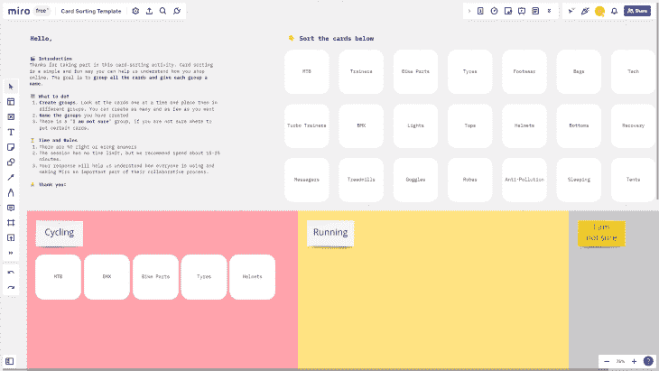

A typical remote card sorting session using the collaboration tool Miro. This is a closed card sort as the goal is to move the cards (menu items) into the categories below.

> 注意，在开放式卡片分类过程中，参与者会得到上面已经有导航项目的卡片。然后，他们将这些导航条目组织成他们认为最合理的内容。另一方面，封闭式卡片分类要求参与者不仅要组织物品，还要将它们归入预先存在的类别。

### 使用描述性的简单标签

设计网址导航的时候，经常会想起 KISS。不，不是由吉恩·西蒙斯领衔的 1973 年摇滚乐队，而是首字母缩略词“保持简单愚蠢”，这个词是由洛克希德·臭鼬工厂的首席工程师凯利·约翰逊首先提出的。

潜在的原则本身很简单:系统应该尽可能的简单和直观。如果不是，那是为什么？总是问问题，总是试图确定我正在做的事情是否符合 KISS 原则，这让我作为一名设计师更加体贴。

让我们考虑一个电子商务网站的主页。如果用户因为糟糕的菜单项标签而觉得导航过于复杂，他们很有可能会因为沮丧而立即放弃它。记住以目标为导向的用户——如果用户认为他们不会完成他们的目标，他们会去别的地方实现它。良好的导航减少了混乱和不确定性。它有助于而不是阻碍。

让我们看看下面的例子:

| 制品 | 服务 | 品牌 |  |  |  |  |
| 循环 | 奔跑 | 游泳铁人三项户外健身 | 培养 | 上述情况反映了我曾作为 UX 团队的一员为英国一家大型零售商工作时的类似情况。在进行用户研究后，我们得出结论，旧的导航不够描述性或即时性。来自用户的大部分反馈是，该公司出售的东西因标签不好而模糊不清。实际上，**产品**、**服务**和**品牌**过于笼统，有点模糊。我们的解决方案很简单:选取特定的子类别，将它们重新定位为总体类别，让我们的产品突然变得更加明显。 | 其结果是一个导航系统，让用户更有信心准确地导航到类别和产品，但也有助于企业实现自己的目标。同样重要的是要注意，在导航显得混乱和复杂之前，六到七个菜单项通常被视为最大值，所以我和我的团队确保我们从未超过这个限制。 | 注意，永远不要使用会疏远用户的内部语言。虽然在内部称某个东西为 T&G 可能是第二天性，但是使用玩具和游戏对用户来说要明显得多。 |

导航层次结构

导航层次结构是标题和导航项目在导航本身中的排列方式。总体部分通常被设计成标题，每个总体标题下都有子类别。这是一个很好建立的设计模式，对可扫描性特别好，因为每个部分都被清晰地定义，对用户来说很明显。

> 拥有一个清晰定义的层次结构也有利于在任何设备上工作，无论是台式机、平板电脑还是移动设备。当分隔网页或应用程序的元素时，空白是你的朋友。留白，或者有时被称为负空间，是一种下意识地向用户表示产品不同区域的方式。通过将区域“分块”到它们的逻辑位置，用户会发现体验更容易理解，压力更小，并且更有可能留下来。

### 颜色也经常被用来表示导航的不同区域，但是不应该仅仅被用来表示不同的部分。仅仅依靠颜色来吸引注意力不利于可访问性。经常会看到导航背景颜色与网站的其他部分不同，这进一步突出了导航部分，但是清晰的标题和空白应该是创建有意义的导航层次的第一选择。

冒着重复我自己的风险，请不要使用桌面上的汉堡菜单。对于许多用户来说，导航是永恒不变的。它是一致的，或者至少应该是一致的，正如前面提到的，最好的导航系统会演示如果在网站中迷路了该去哪里。理解了这个关键的方面以及为什么菜单项不应该被混淆，就清楚了为什么汉堡包菜单不应该被用在桌面网站上。

至于移动设备，汉堡包菜单现在被认为是导航的标准做法，应该这样使用。为了消除任何潜在的误解，试着在菜单上贴上“菜单”的标签对于那些不完全确定三条水平线代表什么的人来说，这消除了任何歧义。

在导航中何时使用按钮，而不是文本链接

在导航中看到行动号召按钮并不罕见，尽管它们只应该用来突出一两个行动号召。考虑企业的目标和访客的首要目标。是为了让他们报名吗？或许是为了取得联系？不管是什么，在导航菜单中有一个行动号召是突出网站主要目标的好方法。

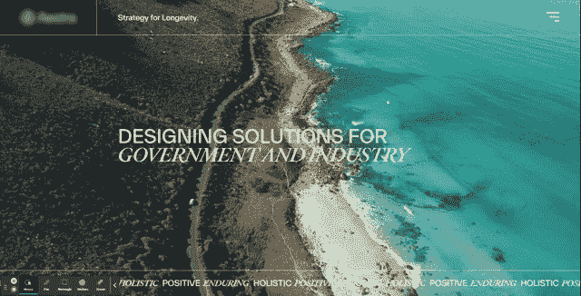

Hamburger buttons seem to be a popular choice of navigation for design agencies, potentially opting for minimalism over usability.

如果我们记得用户在浏览网页时倾向于使用的 F 模式，我们知道他们更可能关注菜单中的第一个和最后一个链接，所以在设计导航结构时要考虑这一点。

### 使用动画

在网站导航中使用动画是让网站更吸引人和吸引眼球的好方法，但是应该谨慎使用。动画通常用于创建更加身临其境的体验，并且通常可以吸引那些将动画与优雅的设计联系起来的用户，但是它们也可以通过提供更明显的视觉线索来吸引注意力。

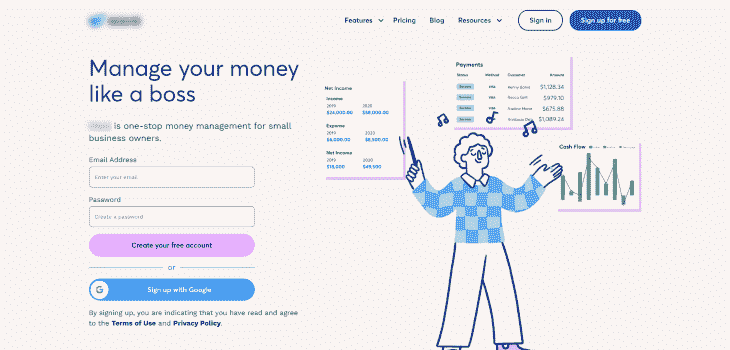

This is a typical navigation for a SaaS website, with their primary objectives shown as two calls to action on the right-hand side.

当不仅仅是为了取悦用户，而是为特定的微交互提供额外的反馈，以及可以帮助用户满足可访问性需求的提示时，动画工作得特别好。微交互是一种简单的方式，通过这种方式，一个触发器，比如悬停在一个菜单项上，向用户提供反馈。将用户反馈与微妙的动画结合起来可以带来更愉快的体验。

### 动画对于那些有辅助功能需求的人来说也是有益的，因为当适当地制作动画时，他们更容易注意到网页上发生的变化。如果用户没有注意到这样的变化，这被称为变化盲。

注意，变化盲是一种当用户没有注意到用户界面变化时发生的现象。当变化很细微，或者当用户分心或专注于其他事情时，就会发生这种情况。如果用户无法定位页面上的某些元素，或者无法完成网站上的任务，变化盲会导致混乱和沮丧。

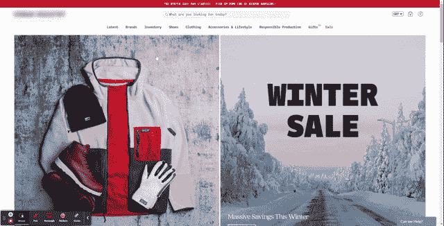

Urban Industry fades the navigation in when the user hovers over a top-level navigation item.

摘要

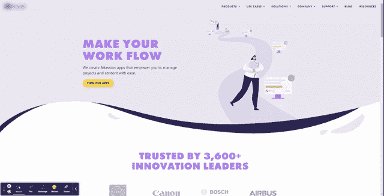

The Ricksoft website is a good example of animations used subtly. Notice the little nudge navigation items show when hovered over.

根据上下文的不同，可以使用许多导航样式，虽然它们的样式不同，或者定位不同，但它们基本上都做一件事。尽可能以最好的方式为用户服务，让他们轻松自信地浏览网站。

> 虽然所有的导航风格在某种程度上都是合适的，但是其他的应该谨慎使用，比如使用桌面上的汉堡菜单，或者使用依赖于大量动画的非常规方法。了解你的受众，了解你选择的导航风格是否适合他们。总有改进的空间，尤其是在网站设计的基础方面。

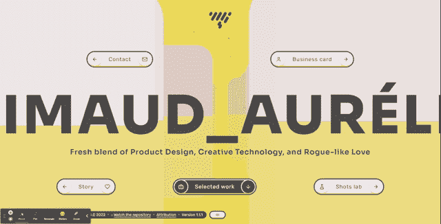

Aurélien Grimaud’s portfolio website is an example of navigation animation that is quite different from design norms. The content is engaging, and recruiters or other designers are likely to appreciate this style, but it works best in this limited context.

## [LogRocket](https://lp.logrocket.com/blg/signup) :无需采访即可获得 UX 洞察的分析

[LogRocket](https://lp.logrocket.com/blg/signup) 让您可以回放用户的产品体验，以可视化竞争，了解影响采用的问题，并结合定性和定量数据，以便您可以创建令人惊叹的数字体验。

查看设计选择、交互和问题如何影响您的用户— [立即尝试 LogRocket】。](hhttps://lp.logrocket.com/blg/signup)

## [LogRocket](https://lp.logrocket.com/blg/signup): Analytics that give you UX insights without the need for interviews

[LogRocket](https://lp.logrocket.com/blg/signup) lets you replay users' product experiences to visualize struggle, see issues affecting adoption, and combine qualitative and quantitative data so you can create amazing digital experiences.

See how design choices, interactions, and issues affect your users — [try LogRocket today](hhttps://lp.logrocket.com/blg/signup).