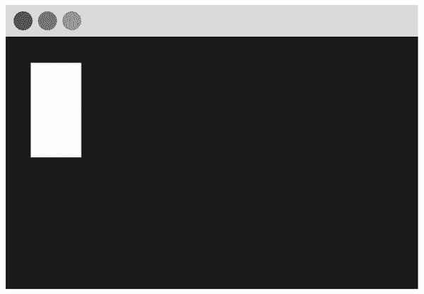
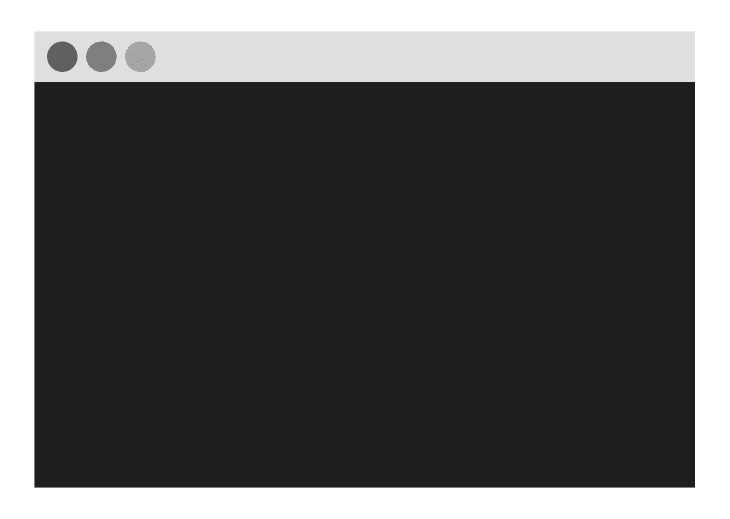
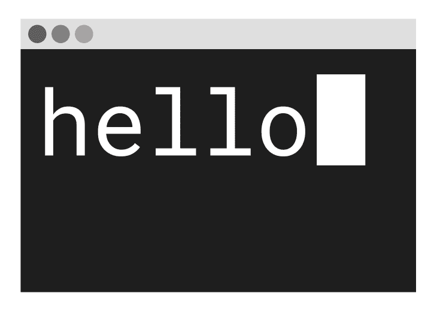
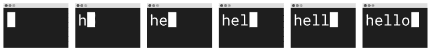
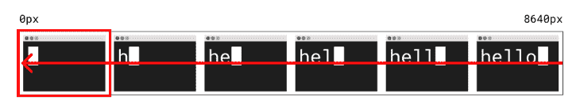

# 使用 sprite sheet 制作 CSS 动画

> 原文：<https://blog.logrocket.com/making-css-animations-using-a-sprite-sheet/>

Web 动画可以以多种方式使用，以视觉刺激的方式吸引人们对网站或应用程序的某些功能的注意。

例如，当您选择 LogRocket 网站右下角的语音气泡按钮时，语音气泡会转变为一个向下的箭头，并带有一个旋转的动画，为用户的交互添加了一个额外的亮点。

动画也可以用于纯粹的装饰，以使使用网站更有趣，对用户更有美感，例如在网站的登录页面上，否则会使用静态图像或有空白空间。

无论你用动画做什么，都有不同的方法来实现网页动画。

## 先决条件

*   代码编辑器，例如 Codepen
*   基本 HTML
*   CSS 的基础知识，特别是`animation`属性和`@media`查询
*   图像编辑软件，例如 Figma 或 Adobe Photoshop

## 使用 CSS 创建精灵表和动画

在这篇文章中，我将讲述如何创建你自己的精灵表，并使用 CSS 来制作动画。这是一个很酷的学习方法，事实上，许多流行的网站和应用程序都使用 sprite sheets 来制作用户功能的动画。

事实上，Twitter 使用一个 sprite sheet 来激活它的 heart 按钮，当你喜欢一条 tweet 时，它会填充并爆发出五彩纸屑。在本教程中，我们将创建一个终端窗口的简化图形，并打出文本“hello”。

这就是它的样子:



## 在 Figma 中创建 sprite 工作表

首先，打开您选择的图像编辑器。我喜欢使用 [Figma](https://www.figma.com/) 因为它是免费的，你可以在浏览器中使用它，以及 Adobe Photoshop、Illustrator 或任何 MS Paint 的复活！

我选择为桌面屏幕设计最大比例的图形，这样我就可以在平板电脑和移动屏幕上缩小它，而不是为最小的屏幕设计并扩展到更大的屏幕。

让我们创建一个桌面大小的工作区(1440 像素 x 1024px 像素)。请注意，动画的每一帧都是这个大小的图像。

接下来，通过为终端窗口绘制一个大的深灰色矩形来创建图形。然后在工具栏顶部添加一个浅灰色的矩形，并在工具栏上添加三个灰色的圆形按钮。到目前为止，您的基本终端图形应该如下所示:



下一步是绘制出最终的框架，它将包含您想要的全部文本以及您想要它在图形上的位置。我选择使用等宽字体 Roboto Mono，这样字母的大小和间距都是均匀的。我打出单词“hello ”,并为文本光标创建了一个矩形。它看起来像这样:



现在，您需要创建动画的每一帧，并将每一帧保存为单独的图像。我将从一个只显示终端上的文本光标的框架开始，然后当我为每个框架输入每个字母时，将它向右移动。这将总共创建六个帧。

一旦你有了每一帧，你可以把它们都添加到一个精灵图片文件中。我使用了一个 [CSS Sprites Generator](https://www.toptal.com/developers/css/sprite-generator/) 工具，在元素之间选择 0px 填充并左右对齐。

我下载的精灵文件如下所示:



## 动画精灵表

现在是时候添加你的精灵表动画到你的网页上了。首先在 HTML 文件中添加一个空的`<div>`，并给它一个类名“terminal”。

这个`<div>`元素将作为一个“视口”, sprite 工作表的每一帧将在动画中显示:

```
<div class="terminal"></div>

```

接下来，给`<div>`添加一些 CSS 样式。div 的`height`应该是 sprite sheet 图像文件的高度(在本教程中为 1024px)，而`width`应该是每个图像帧的宽度(1440px)。

背景 URL 应该设置为 sprite 工作表图像文件。您应该会看到动画的第一帧覆盖了`<div>`的背景。

```
.terminal {
  height: 1024px;
  width: 1440px;
  background: url("https://i.imgur.com/zLh2Pgs.png");
}

```

现在是添加 CSS 动画的时候了。在这种情况下，我们希望将背景图像从右向左拉进“视窗”，如下图所示。



首先，在一个`@keyframes`块下定义名为`sprite`的动画代码，该代码指定在动画中应用什么样式。

我们想从`0px`的开始`background-position`过渡到将 sprite sheet 图像文件的位置向左移动整个宽度(`8640px`，它是每个 1440px 宽度的图像乘以 6，因为有六帧)。这是代码:

```
@keyframes sprite {
  from { background-position: 0px; }
  to { background-position: -8640px; }
}

```

下一步是将这个`sprite`动画添加到用类`.terminal`设计的`<div>`元素中。

应用`sprite`中的`animation-name`并将`animation-duration`设置为您希望动画完成一个周期所需的时间长度(我选择了 1.5 秒的速度)。然后，设置`animation-timing-function`来定义动画如何进行。

这里，我们想使用`steps()`值，它将过渡分成相等的分段。这正是我们想要的效果——我们需要按顺序播放每一帧——所以将步数设置为`6`,因为动画中有六帧。

* * *

### 更多来自 LogRocket 的精彩文章:

* * *

最后，定义`animation-iteration-count`，它设置动画在停止前应该运行的次数。如果想让它连续运行，值应该是`infinite`。代码如下:

```
.terminal {
  ...
  animation-name: sprite; 
  animation-duration: 1.5s;
  animation-timing-function: steps(6);
  animation-iteration-count: infinite;
}

```

既然我们已经理解并分解了代码是如何工作的，我们可以对它进行一点重构。我们不必指定`@keyframes`规则中的`from`，因为默认情况下`background-position`是`0px`。

此外，可以使用 CSS `animation` [速记属性](https://developer.mozilla.org/en-US/docs/Web/CSS/animation)将动画样式块优雅地组合成一行。以下是重构后的代码:

```
@keyframes sprite {
  to { background-position: -8640px; }
}

.terminal {
  height: 1024px;
  width: 1440px;
  background: url("https://i.imgur.com/zLh2Pgs.png");
  animation: sprite 1.5s steps(6) infinite;
}

```

## 使动画视口响应迅速

目前，动画视窗`<div>`具有桌面屏幕的固定高度和宽度。这意味着`<div>`占据了桌面的整个屏幕，并且会在较小的屏幕上溢出。

让`<div>`响应不同屏幕尺寸的一个好方法是使用`transform: scale(0.5)`将元素大小减半，然后使用`@media`查询将所有大于`1024px`的屏幕的比例设置为`1`。

CSS `scale()`函数从中心调整元素的大小，所以需要`translate()`来保持元素在左上角的相同位置。代码如下所示:

```
.terminal {
  ...
  transform: translate(-25%, -25%) scale(0.5);
}

@media only screen and (min-width: 1024px) {
  .terminal {
    transform: scale(1);
  }
}

```

就是这样！这些是使用你制作的精灵表实现你自己的 CSS 动画的步骤。最终的动画和代码可以在 CodePen 上查看:

参见 [CodePen](https://codepen.io) 上 Hannah Gooding([@ Hannah Gooding](https://codepen.io/hannahgooding))
用雪碧表制作 CSS 动画的笔[。](https://codepen.io/hannahgooding/pen/MWjGwEw)

结论

## 出于本教程的目的，我用最少的帧数保持了图形的简单。

不使用 sprite 工作表，您可以通过将文本放置在终端的静态图像上来实现相同的效果，并使用键入效果通过 CSS 或 JavaScript 将文本动画化。

但是 CSS sprite sheet 方法比本教程中的方法更适合创建更复杂的图形。编码快乐！

你的前端是否占用了用户的 CPU？

## 随着 web 前端变得越来越复杂，资源贪婪的特性对浏览器的要求越来越高。如果您对监控和跟踪生产环境中所有用户的客户端 CPU 使用、内存使用等感兴趣，

.

[try LogRocket](https://lp.logrocket.com/blg/css-signup)

LogRocket 就像是网络和移动应用的 DVR，记录你的网络应用或网站上发生的一切。您可以汇总和报告关键的前端性能指标，重放用户会话和应用程序状态，记录网络请求，并自动显示所有错误，而不是猜测问题发生的原因。

[](https://lp.logrocket.com/blg/css-signup)[https://logrocket.com/signup/](https://lp.logrocket.com/blg/css-signup)

现代化您调试 web 和移动应用的方式— [开始免费监控](https://lp.logrocket.com/blg/css-signup)。

Modernize how you debug web and mobile apps — [Start monitoring for free](https://lp.logrocket.com/blg/css-signup).