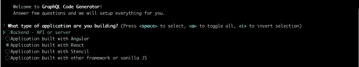
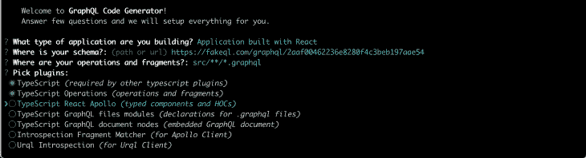
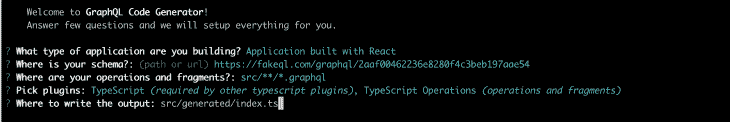
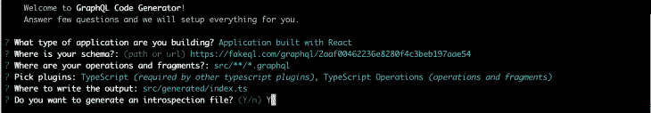
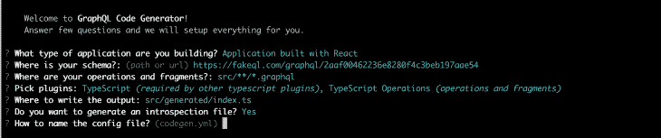
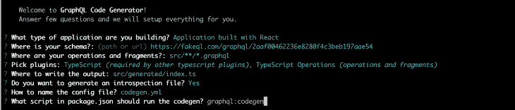

# 使用 React Query、GraphQL 代码生成器和 TypeScript - LogRocket 博客简化 GraphQL 请求

> 原文：<https://blog.logrocket.com/making-graphql-requests-easy-with-react-typescript-and-react-query/>

使用 GraphQL API 有明显的优势。有了 GraphQL，我们可以请求我们需要的精确数据，而不会出现数据提取不足或提取过多的情况。我们还可以在一个请求中获得多个资源。与此同时，请求本身可以作为一种文档形式，便于理解正在使用什么数据、在哪里使用以及为什么使用。

但是 GraphQL 最令人兴奋的特性是 API 完全由其模式描述，包括每个可能的查询或变异的所有数据类型。

为什么这很重要？

因为，基于该模式，我们可以在前端为整个 API 自动创建 TypeScript 类型。更重要的是，我们可以很容易地为像 React Query 这样的数据读取库自动生成完全类型化的自定义 React 挂钩。

让我告诉你怎么做。

## 使用 GraphQL 设置项目

### React 应用

首先，让我们用带有 TypeScript 模板的 Create React App 创建 React 项目。

```
yarn create react-app graphql --template typescript

```

### 部署 GraphQL API

接下来，我们需要一个 API。FakeQL 提供了一种创建和部署模拟 GraphQL API 的好方法。因为我们将使用默认定义，我们可以简单地通过点击**扩展 JSON** 然后**部署**来设置一切。该工具生成一个惟一的 URL，我们可以在那里访问我们的新 API。

### 创建数据提取库

现在我们有了 React 应用程序和 API，是时候建立我们的数据获取库了， [React Query](https://react-query.tanstack.com/) 。

让我们安装它:

```
yarn add react-query

```

现在，设置 React 查询客户机。

```
import { QueryClient, QueryClientProvider } from 'react-query'

import Posts from 'components/Posts'

const queryClient = new QueryClient()

const App = () => {
    return (
        <QueryClientProvider client={queryClient}>
            <Posts />
        </QueryClientProvider>
    )
}

export default App

```

### 构建组件

因为我们的 API 提供了一个帖子列表，所以我们将使用一个`Posts`组件来显示它们。目前，我们让它空着。

```
// components/Posts.tsx

const Posts = () => {
    return (
        <></>
    )
}

export default Posts

```

接下来，我们需要一个查询来获取文章列表。让我们在一个`.graphql`文件中定义它，并将它与我们的组件放在一起:

```
# components/Posts/posts.graphql

query Posts {
    posts {
        id
        title
    }
}

```

最后，让我们也添加一个删除帖子的变体:

```
# components/Posts/deletePost.graphql

mutation DeletePost($id: ID!) {
    deletePost(id: $id)
}

```

## 使用 TypeScript 和 GraphQL 代码生成器自动生成类型化的 React 查询挂钩

现在，我们已经准备好根据之前在`.graphql`文件中定义的请求，自动生成我们的定制和完全类型化的 React 查询钩子。我们将使用 [GraphQL 代码生成器](https://graphql-code-generator.com/)。

我们从安装开始:

```
yarn add graphql
```

```
yarn add -D @graphql-codegen/cli

```

接下来，我们需要初始化向导并完成以下步骤:

```
yarn graphql-codegen init

```

首先，我们选择要构建的应用程序类型:



然后，我们通过粘贴 FakeQL url 来定义我们的模式。


我们定义我们的操作和片段在哪里:


我们选择我们的插件:



我们选择在哪里写入输出:



让我们也生成一个自省文件:



我们需要将配置文件命名为:



最后，让我们将我们的脚本命名为`graphql:codegen`:



到目前为止，一切顺利！

为了生成定制的 React 查询挂钩，我们需要安装适当的插件:

```
yarn add -D @graphql-codegen/typescript-react-query

```

并添加对 codegen.yml 配置文件的快速编辑，以使其正常工作:

```
overwrite: true
schema: 'https://fakeql.com/graphql/2aaf00462236e8280f4c3beb197aae54'
documents: 'src/**/*.graphql'
generates:
    src/generated/index.ts:
        plugins:
            - typescript
            - typescript-operations
            - typescript-react-query
        config:
            fetcher:
                endpoint: 'https://fakeql.com/graphql/2aaf00462236e8280f4c3beb197aae54'

```

最后，我们需要运行我们的脚本。

```
yarn graphql:codegen

```

我们现在完成了！我们的全类型定制 React 查询钩子已经自动生成，并直接添加到我们项目的`generated`文件夹中。

让我们看看他们的行动吧！

## 发出 API 请求

在我们的`Posts`组件中，我们现在准备显示帖子列表:

```
import { usePostsQuery } from 'generated'

const Posts = () => {
    const { data } = usePostsQuery()
     return (
            <>
                {isLoading && <p>Loading ...</p>}
                {data &&
                    data.posts?.map(post => (
                        <div key={post?.id}>
                            <p>{post?.title}</p>
                            <hr />
                        </div>
                    ))}
            </>
        )
}

export default Posts

```

让我们也加入我们之前定义的`DeletePost`突变。

```
import { useQueryClient } from 'react-query'
import { usePostsQuery, useDeletePostMutation } from 'generated'

const Posts = () => {
    const queryClient = useQueryClient()
    const { data, isLoading } = usePostsQuery()
    const { mutate } = useDeletePostMutation({
        onSuccess: () => queryClient.invalidateQueries('Posts'),
    })

    return (
        <>
            {isLoading && <p>Loading ...</p>}
            {data &&
                data.posts?.map(post => (
                    <div key={post?.id}>
                        <p>{post?.title}</p>
                        <button onClick={() => post && mutate({ id: post.id })}>
                            Delete
                        </button>
                        <hr />
                    </div>
                ))}
        </>
    )
}

export default Posts

```

就这样，我们现在有了一个工作示例！

## 结论

上述方法允许我们在前端充分利用 GraphQL，为 API 自动创建 TypeScript 类型，并为每个请求生成定制的 React 查询挂钩。

通过使用它，我们还大大减少了需要编写的数据提取样板代码的数量。有了这个工具，为了为请求创建额外的 React 查询定制钩子，我们需要做的就是创建一个`.graphql`文件并运行`graphql:codegen`脚本。很酷，对吧？

好奇自己玩代码？在我的 GitHub [repo](https://github.com/IvaKop/React-Query-Typescript-GraphQL-Code-Generator-Example) 中找到完整的工作示例。

编码快乐！✨

## 使用 LogRocket 消除传统反应错误报告的噪音

[LogRocket](https://lp.logrocket.com/blg/react-signup-issue-free)

是一款 React analytics 解决方案，可保护您免受数百个误报错误警报的影响，只针对少数真正重要的项目。LogRocket 告诉您 React 应用程序中实际影响用户的最具影响力的 bug 和 UX 问题。

[ ](https://lp.logrocket.com/blg/react-signup-general) [  ](https://lp.logrocket.com/blg/react-signup-general) [LogRocket](https://lp.logrocket.com/blg/react-signup-issue-free)

自动聚合客户端错误、反应错误边界、还原状态、缓慢的组件加载时间、JS 异常、前端性能指标和用户交互。然后，LogRocket 使用机器学习来通知您影响大多数用户的最具影响力的问题，并提供您修复它所需的上下文。

关注重要的 React bug—[今天就试试 LogRocket】。](https://lp.logrocket.com/blg/react-signup-issue-free)

## [LogRocket](https://lp.logrocket.com/blg/typescript-signup) :全面了解您的网络和移动应用

[](https://lp.logrocket.com/blg/typescript-signup)

LogRocket 是一个前端应用程序监控解决方案，可以让您回放问题，就像问题发生在您自己的浏览器中一样。LogRocket 不需要猜测错误发生的原因，也不需要向用户询问截图和日志转储，而是让您重放会话以快速了解哪里出错了。它可以与任何应用程序完美配合，不管是什么框架，并且有插件可以记录来自 Redux、Vuex 和@ngrx/store 的额外上下文。

除了记录 Redux 操作和状态，LogRocket 还记录控制台日志、JavaScript 错误、堆栈跟踪、带有头+正文的网络请求/响应、浏览器元数据和自定义日志。它还使用 DOM 来记录页面上的 HTML 和 CSS，甚至为最复杂的单页面和移动应用程序重新创建像素级完美视频。

[Try it for free](https://lp.logrocket.com/blg/typescript-signup)

.