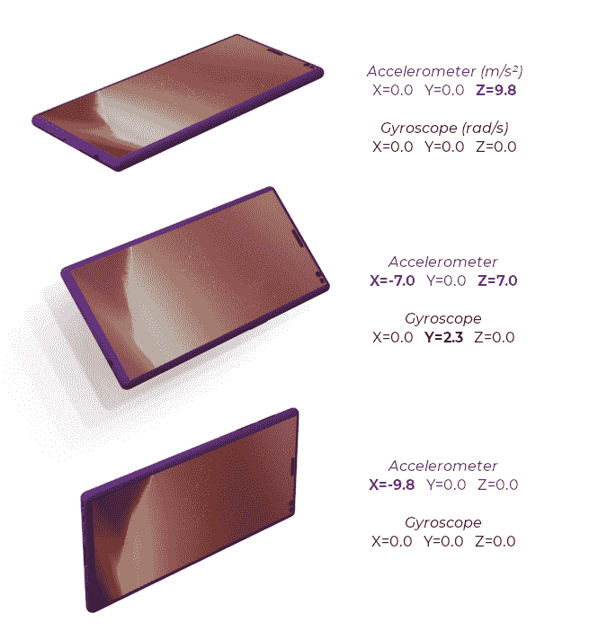
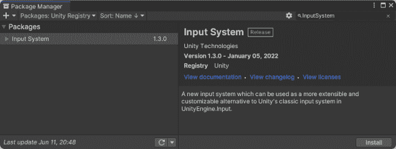
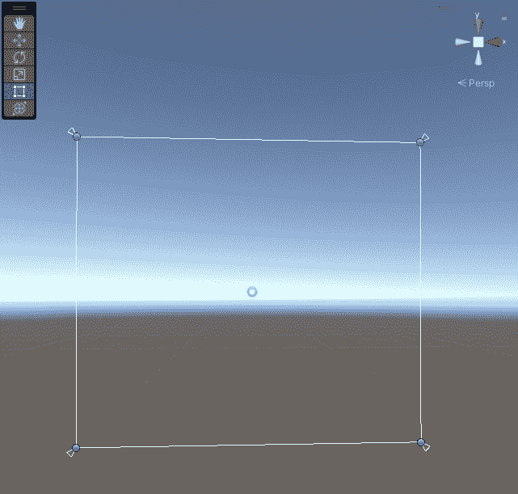
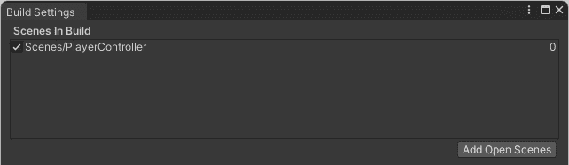
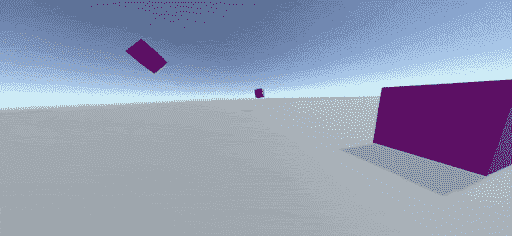
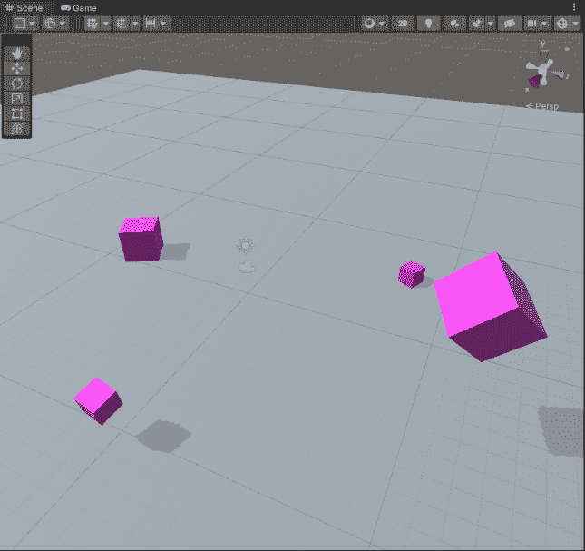
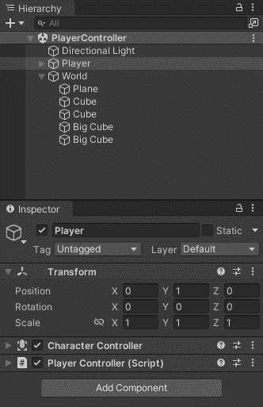
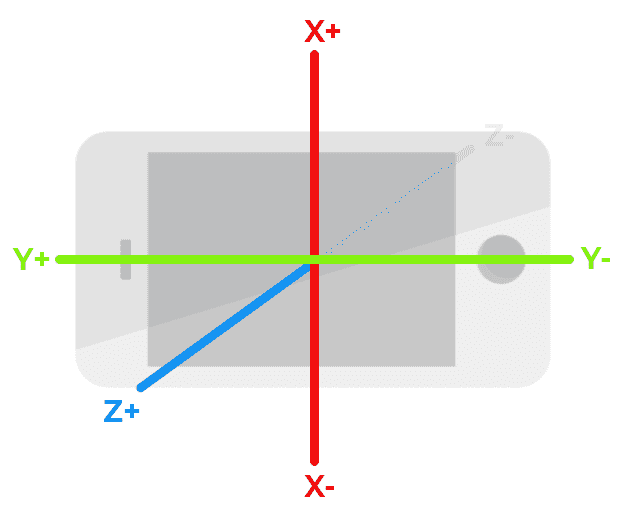

# 在 Unity 中制作带有运动传感器的手机游戏

> 原文：<https://blog.logrocket.com/making-mobile-game-motion-sensors-unity/>

在游戏开发中使用运动传感器是增强玩家体验的好方法。在一个最经典的用例中，运动传感器检测玩家设备的方向，并使用它来移动玩家。

在本帖中，我们将回顾在 Unity 应用中使用运动传感器的基础知识。这可以应用于任何应用程序，无论是休闲手机游戏、AR 或 VR 体验，还是包含依赖运动感的功能的应用程序。

## 工作的概念

在本文中，我们将创建一组两个示例。第一个很简单，您将学习从陀螺仪、加速度计和其他传感器读取值，然后将它们输出到文本字段。

第二个例子会更有趣一点。我们将为第一人称游戏构建一个`PlayerController`原型，玩家可以通过倾斜和定向移动设备来移动和环顾四周。

在这两个例子中，我们将使用更新的[输入系统](https://docs.unity3d.com/Packages/com.unity.inputsystem@1.4/manual/QuickStartGuide.html)。Unity 中还有一种传统的陀螺仪和加速度计工作方式，但我今天不打算讨论这个。我假设你至少对 Unity 引擎有一个基本的了解，尽管我将逐步展开教程。

作为一个边做边学的狂热爱好者，我鼓励你跟着做。我也建议你自己尝试这些例子来巩固你的新知识！

但在开始行动之前，让我们先简单谈谈陀螺仪和加速度计。

## 了解传感器和运动

陀螺仪和加速度计——这些传感器有何不同？它们有什么用处？

你可能已经知道智能手机配备了不同的模块和传感器。其中，你经常可以找到一个陀螺仪和一个加速度计。这些传感器的具体实现因设备而异，但目前几乎所有的移动设备都有。

加速度计测量加速度(因此得名)，陀螺仪确定方向或角速度的变化。查看每个传感器的实际值是说明这一切意味着什么的最佳方式。

请看下图，手机以各种方式躺着，比较两个传感器的值。



我使用 CPU-Z Android 应用程序从我的手机中获得这些值。如您所见，陀螺仪的值是沿各轴的角速度，单位为弧度/秒。当设备此时不旋转时，这些值为 0.0。

加速度采用标准加速度单位，米每秒平方。当我的手机在第一张照片中静止不动时，它的加速度传感器报告沿 z 轴的加速度为每秒 9.8 米，而 x 轴和 y 轴为 0。这是因为作用在设备上的唯一加速度是地球引力。理论上，如果你把这个装置放在月球上，它的值是每秒 1.62 米。

## 使用运动传感器构建 Unity 应用程序

现在让我们开始建造吧！

### 读取传感器值并作为文本输出

我们将从构建一个简单的 Unity 应用程序开始，我们可以用它来实时读取来自不同传感器的值。除了加速度计和陀螺仪，我们还将读取姿态和重力传感器的值。

如果你想跟着做，我推荐使用 [Unity 2021.3.4f1](https://unity3d.com/unity/qa/lts-releases) 并用 USB 线将你的设备连接到你的电脑。启用 USB 调试也很重要，这将允许您直接从 Unity 编辑器部署您的移动应用程序。

首先，在 Unity 中创建新项目后，我们必须导入`InputSystem`包。打开**窗口 *→* 套餐经理**。从**软件包库**中选择 **Unity Registry** ，在搜索栏中键入`InputSystem`，选择软件包，点击 **install** 。



然后，在**层级**选项卡中，用`Text`组件向我们的场景添加一个新的游戏对象。您可以通过右键单击并从上下文菜单中选择**UI*→*Legacy*→*Text**来完成此操作。对于这个例子，我们不需要文本网格 Pro 的所有功能。

我们加了一个`Text`的时候，Unity 编辑器也加了一个`Canvas`。`Text`现在是这个`Canvas`的子对象。在**场景**选项卡中，使用**矩形工具**调整`Text`对象的大小，直到它覆盖整个`Canvas`。它应该在拐角处咬合。



现在，在检查器中，更改**锚预置**以沿两个轴拉伸，并更改`Text`组件的属性以使实际文本垂直和水平居中。然后，添加一个新脚本。姑且称之为`SensorsReader`。


在我们输入下面的 C#代码之后，我们就可以在我们的移动设备上构建和运行这个应用程序了。

```
using UnityEngine;
using UnityEngine.InputSystem;
using UnityEngine.UI;

using Gyroscope = UnityEngine.InputSystem.Gyroscope;

[RequireComponent(typeof(Text))]
public class SensorsReader : MonoBehaviour
{
    private Text text;

    void Start()
    {
        text = GetComponent<Text>();

        InputSystem.EnableDevice(Gyroscope.current);
        InputSystem.EnableDevice(Accelerometer.current);
        InputSystem.EnableDevice(AttitudeSensor.current);
        InputSystem.EnableDevice(GravitySensor.current);
    }

    void Update()
    {
        Vector3 angularVelocity = Gyroscope.current.angularVelocity.ReadValue();
        Vector3 acceleration = Accelerometer.current.acceleration.ReadValue();
        Vector3 attitude = AttitudeSensor.current.attitude.ReadValue().eulerAngles; // ReadValue() returns a Quaternion
        Vector3 gravity = GravitySensor.current.gravity.ReadValue();

        text.text = $"Angular Velocity\nX={angularVelocity.x:#0.00} Y={angularVelocity.y:#0.00} Z={angularVelocity.z:#0.00}\n\n" +
                        $"Acceleration\nX={acceleration.x:#0.00} Y={acceleration.y:#0.00} Z={acceleration.z:#0.00}\n\n" +
                            $"Attitude\nX={attitude.x:#0.00} Y={attitude.y:#0.00} Z={attitude.z:#0.00}\n\n" +
                             $"Gravity\nX={gravity.x:#0.00} Y={gravity.y:#0.00} Z={gravity.z:#0.00}";
    }
}

```

在顶部，您可以看到我们正在使用`UnityEngine.InputSystem`名称空间。那是我们之前安装的`InputSystem`包里得到的。我们正在使用`UnityEngine.UI`，所以我们可以使用`Text`组件。我们还想使用来自`UnityEngine.InputSystem`名称空间的`Gyroscope`类，而不是遗留类。

`SensorsReader`是一个[单行为](https://docs.unity3d.com/ScriptReference/MonoBehaviour.html)，我们用`[RequireComponent(typeof(Text))]`属性装饰了这个类。这不是强制性的，但是使用这个属性是一个很好的做法。我们的定制`SensorsReader`组件在运行时依赖于`Text`，没有它会导致运行时错误。有了这个属性，我们就可以在编译时发现问题，这通常会更好。

该类只有一个成员，即类型为`Text`的`text`。我们在`Start`方法中为同一个对象上的`Text`组件分配了一个引用。我们使用`[GetComponent](https://docs.unity3d.com/ScriptReference/Component.GetComponent.html)`完成了这项工作。我们还启用了`Gyroscope`、`Accelerometer`、`Attitude`和`Gravity`传感器。

在第二个例子中，我们不打算使用所有的方法，但是我强烈建议进行试验，并尝试为所有的方法提出一些用例。要有好奇心和创造力！

最后，在`Update`方法中，我们将从传感器读取的值赋给`Vector3`结构，并在我们的`Text`组件中显示这些值。

这就是第一个例子。现在，切换回 Unity 编辑器，进入**文件** → **构建设置**，切换到你的移动设备运行的平台。

在**播放器设置**中，将默认方向更改为纵向或横向。然后，返回到**构建设置**，选择您想要运行该应用程序的设备，假设您已经按照前面的指定连接了一个设备。点击**构建并运行**。



过一会儿，你应该会在你的应用程序中看到来自运动传感器的实时值。如果一切正常，旋转并移动您的设备，同时观察数值。在移动到最后一个示例之前，尝试建立一个沿 x、y 和 z 轴的方向感。

正如您刚才看到的，从 Unity 中的运动传感器获取值非常简单。让我们来看一个更高级的例子。

### 建筑 a `PlayerController`

一个`PlayerController`允许我们根据来自`Accelerometer`和`AttitudeSensor`的值环顾四周并在空间中移动。



在**层级**选项卡中创建一个新的 Unity 场景和一个新的**平面**。将它移动到世界的原点，并在周围放置几个立方体。平面代表地面，立方体将作为定向点。



现在，在飞机上添加一个新的空`GameObject`，将其重命名为`Player`，并将`MainCamera`拖到上面。`MainCamera`成为它的子对象。然后，向`Player`添加一个`CharacterController`组件和一个新的定制脚本。姑且称之为`PlayerController`。



现场准备好了！现在，我们可以开始编写`PlayerController`脚本了。首先，我们需要一个额外的`using`语句，尽管这不是强制性的，我们还是要用`RequireComponent`属性来修饰这个类。

```
using UnityEngine;
using UnityEngine.InputSystem;

[RequireComponent(typeof(CharacterController))]
public class PlayerController : MonoBehaviour

```

这个类只需要几个成员。

```
private CharacterController characterController;

[SerializeField]
private float movementSpeed = 3.0f;

private Transform rotator;

[SerializeField] 
private float smoothing = 0.1f;

```

属性允许我们在**检查器**选项卡中编辑变量，同时保持它们的访问修饰符私有。但是，请注意，一旦 Unity 序列化了该字段，编译器将忽略代码中的默认值。默认情况下，Unity 会序列化公共字段。

在`Start`方法中，我们给`CharacterController`分配一个引用，启用`Accelerometer`和`AttitudeSensor`，并创建一个新的`GameObject`。我们把这个物体命名为`Rotator`。很快，我们将使用这个对象在它的`Transform`组件中存储中间旋转。

```
private void Start()
{
characterController = GetComponent<CharacterController>();

InputSystem.EnableDevice(Accelerometer.current);
    InputSystem.EnableDevice(AttitudeSensor.current);

rotator = new GameObject("Rotator").transform;
rotator.SetPositionAndRotation(transform.position, transform.rotation);
}

```

在`Update`方法中，我们在每一帧中调用`Move`和`LookAround`方法。这些方法是我们的`PlayerController`的精髓，我们将在`Update`之后立即编写。

```
private void Update()
{
Move();
LookAround();
}

```

先说`Move`法。我们从`Accelerometer`中读取数值，并使用沿 x 和 z 轴的加速度来创建运动方向。我们的移动方向将是一个`Vector3`，这个 3D 矢量将告诉`CharacterController``Player`应该移动的速度和方向。

我们不想沿着 y 轴移动(上下)，所以我们保持 y 为 0。沿着 z 轴(向前和向后)，我们通过向前和向后倾斜设备来推动移动。沿着 x 轴(左右)，我们要扫射。但是，我们需要反转 z 值，因为坐标系的方向与设备的视点相对应。



我们将`acceleration`乘以`moveSpeed`再乘以`Time.deltaTime`，以使移动速度独立于帧速率。这是如何工作的超出了本文的范围，但是如果你不知道，我强烈建议你熟悉一下！你可以在 Unity 文档的这里开始[。](https://docs.unity3d.com/ScriptReference/Time-deltaTime.html)

在将移动方向应用到`CharacterController`之前，我们需要将其从局部空间转换到世界空间。局部空间和世界空间的差异在游戏开发中无处不在。但是，这已经超出了本文的范围。

```
private void Move()
{
Vector3 acceleration = Accelerometer.current.acceleration.ReadValue();

Vector3 moveDirection = new(acceleration.x * movementSpeed * Time.deltaTime, 0, -acceleration.z * movementSpeed * Time.deltaTime);
Vector3 transformedDirection = transform.TransformDirection(moveDirection);

characterController.Move(transformedDirection);
}

```

本例中的最后一段代码是`LookAround`方法。在这个方法中，我们从`AttitudeSensor`中读取`attitude`。这个值是一个`quaternion`。如果这个术语对你来说是新的，从这里开始，他们通常在游戏中用来代表一个旋转。

我们将态度指定为我们`rotator`的旋转。在第一步中，我们将旋转体在其局部空间中沿 z 轴旋转 180 度，在第二步中，在世界空间中沿 x 轴旋转 90 度，在 y 轴旋转 180 度。

我们这样做是因为我们希望最终的旋转与我们将设备保持在横向左侧位置时的方向相匹配。当处于纵向位置的左侧现在是底部时，会出现这种情况。

最后，我们将从`rotator`开始的旋转应用到这个物体上，虽然不是直接的。它通过球面插值应用，也称为 [Slerp](https://docs.unity3d.com/ScriptReference/Quaternion.Slerp.html) 。Unity 为我们提供了一个静态的`Quaternion`类方法。作为一个`t`值，我们使用平滑因子。

```
>private void LookAround()
{
Quaternion attitude = AttitudeSensor.current.attitude.ReadValue();

rotator.rotation = attitude;
rotator.Rotate(0f, 0f, 180f, Space.Self);
rotator.Rotate(90f, 180f, 0f, Space.World);

transform.rotation = Quaternion.Slerp(transform.rotation, rotator.rotation, smoothing);
}

```

快到了！测试前你需要做的最后一件事是将**玩家设置**中的**默认方向**从**肖像**切换到**风景左侧**，并用**构建设置**中的当前场景替换之前示例中的场景。


## 结论

就是这样！现在，您的 Unity 项目有了一个基于运动传感器的`PlayerController`！

包含这两个例子的 Unity 项目可以在 GitHub 库中找到。

## 使用 [LogRocket](https://lp.logrocket.com/blg/signup) 消除传统错误报告的干扰

[](https://lp.logrocket.com/blg/signup)

[LogRocket](https://lp.logrocket.com/blg/signup) 是一个数字体验分析解决方案，它可以保护您免受数百个假阳性错误警报的影响，只针对几个真正重要的项目。LogRocket 会告诉您应用程序中实际影响用户的最具影响力的 bug 和 UX 问题。

然后，使用具有深层技术遥测的会话重放来确切地查看用户看到了什么以及是什么导致了问题，就像你在他们身后看一样。

LogRocket 自动聚合客户端错误、JS 异常、前端性能指标和用户交互。然后 LogRocket 使用机器学习来告诉你哪些问题正在影响大多数用户，并提供你需要修复它的上下文。

关注重要的 bug—[今天就试试 LogRocket】。](https://lp.logrocket.com/blg/signup-issue-free)