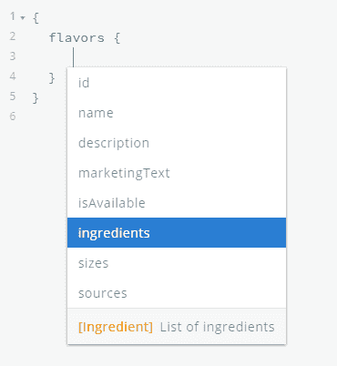

# 用 GraphQL 让 REST 更人性化

> 原文：<https://blog.logrocket.com/making-rest-more-human-with-graphql/>

哦，不——不会又是一篇比较 REST 和 GraphQL 的文章吧。我感觉到你了！

在过去的几年里，我们已经被[博客帖子](https://blog.logrocket.com/graphql-vs-rest-what-you-didnt-know/)、 [Twitter 帖子](https://twitter.com/search?q=graphql%20vs%20rest)和比较 REST 和 GraphQL 的会议讨论所淹没。虽然我们确实会在本文中进行一些比较，但我将尝试关注这个主题的另一个方面，这是我们在构建服务时经常忽略的:GraphQL 的人性化。

说什么？！

GraphQL 最大的隐藏好处之一是它对不太懂技术的人的吸引力。它可以通过让我们周围的每个人都更容易访问数据，打开一个全新的可能性世界。因此，在本文中，我们将了解 GraphQL 的哪些特性可以使我们的服务更人性化，以及它与更传统的 REST 方法相比如何。

你可能会想，“休息有什么问题？我完全可以理解！”我在某种程度上同意这一点，但请耐心听我讲五分钟，让我们看看能否用一些更具体的例子来找出这些“问题”。

## 休息吃冰淇淋

对于北半球的许多人来说，天气变得越来越暖和了，那么我们还有什么比吃一些清爽的冰淇淋更能享受的呢？(老实说，我认为冰淇淋在一年中的任何时候都很棒，但那可能只是我！)

我最大的问题之一是，我从来不知道我应该买哪种口味的……有时我想要更颓废的东西，有时我想要更健康的东西，有时我喜欢水果冰淇淋，其他人更喜欢巧克力冰淇淋，更不用说我周围经常有朋友过敏，所以我需要注意坚果或面筋之类的东西。

要考虑的事情太多了！我们如何一起构建一些东西来帮助决策？

还好我喜欢的冰淇淋品牌有公共 API(但愿！)来帮助我们做这些决定。但是在我们开始考虑这个新的应用程序之前，让我们暂停一下，快速回顾一下什么是 API。

在 Maggie Appleton 的这个令人惊叹的视觉解释中，她将 API 描述为在不同系统之间服务数据的微型机器人服务员。继续，花一分钟时间浏览一遍，这样我们就都在同一页上了。

我们已经可以看到的一点是，对于非技术人员来说，一个 API 立刻就像机器人一样给人一种疏远和冰冷的感觉，而不是像人类(至少我们大多数人)一样热情和欢迎。我们将在文章的后面讨论这个问题，但是现在，让我们回到我们美味的冰淇淋 API。

我们的目标是获得一个冰淇淋口味列表，其中包含每种口味的过敏原信息。从我们的小工具开始，我们需要知道哪些口味是可用的，所以我们将从查询`/api/flavors/`端点开始。

当我们这样做时，它会返回该品牌生产的所有口味的列表，如下所示:

```
[
  {
    id: 1,
    name: "Peanut Butter Cup",
    code: "BNJ-5345",
    description: "Peanut Butter Ice Cream with Peanut Butter Cups",
    isAvailable: true,
  },
  {
    id: 2,
    name: "Cookie Dough",
    code: "BNJ-6537",
    description: "Vanilla ice cream with chunks of chocolate chip cookie dough and chocolatey chunks",
    isAvailable: false,
  },
  ...
]
```

出于本文的目的，让我们只关注前两种风格，尽管您可以~~希望~~假设在响应中会有更多的风格。

有几件事很突出(除了想把每一个选项都塞进我的嘴里):一些相关信息丢失了(比如成分列表)，同时，还有一些我们并不真正关心的信息(比如内部代码)。

💾让我们将这两点保存到一个列表中，这样我们可以在以后对它们进行扩展。

接下来，我们想要找到关于每种口味的更多细节，这可以通过点击`/api/flavors/:id`端点来完成。使用`/api/flavors/1`调用，我们获得了第一种风格的详细信息:

```
{
  id: 1,
  name: "Peanut Butter Cup",
  code: "BNJ-5345",
  description: "Peanut Butter Ice Cream with Peanut Butter Cups",
  marketingText: "We kid you not. This is no peanut-buttery illusion… It is a tub of Peanut Butter Cup. Yep, this wonderful flavour has made its way across the pond from our U.S. creation station… & it’s thanks to you! You've been asking us to bring peanut butter over here, so here you have it, and with peanut butter ice cream & a whole host of peanut butter cup chunks for you to uncover, this certainly packs a peanut-buttery punch!",
  isAvailable: true,
  ingredients: [2, 5, 10, 23],
  sizes: ["mini", "regular"],
  sources: [4, 10, 42]
}
```

我们从 API 中获得了更多的信息，这很好，但似乎还有一些其他资源的标识符——比如配料——我们现在不知道如何获得。

在搜索了 web 上的文档后，我们了解到要获得每种成分的更多细节，我们需要在`/api/ingredients/:id`使用不同的端点。

这意味着我们现在必须跟踪两个不同的端点来获得我们想要的信息，如果我们以后需要一些关于源的信息，这个数字甚至可能会增加。

💾让我们把这两个“问题”也保存在我们的列表中。

我们需要获得配料列表的详细信息，并且我们现在知道我们需要使用一个新的端点，所以对于其中的每一个，我们单独调用`/api/ingredients/:id`。

这是我们从`/api/ingredients/2`请求中得到的结果，例如:

```
{
  id: 2,
  name: "Cream",
  code: "BNJ-9875",
  amount: 21,
  isFairtrade: false,
  allergens: [4],
}
```

有了这些信息，我们知道 ID 为`2`的成分是“奶油”，它占最终产品的`21`百分比。有一件事我们还不知道，那就是它含有哪种过敏原，所以我们需要再打一个电话到`/api/allergens/4`的一个新的 API 端点，以查明它含有牛奶。

这似乎不仅需要许多不同的 API 调用，就像我们之前看到的那样，而且还暴露了不同资源之间 API 关系的复杂性。当机器使用 API 时，这可能是好的，但这使得任何人都很难获得他们实际需要的信息(ID 为`10`的成分是什么？).

* * *

### 更多来自 LogRocket 的精彩文章:

* * *

💾我们的列表中又增加了几个“问题”!

我们完事了。我们知道如何获取构建这个小工具所需的所有信息，下面是我们使用的代码:

```
const getFlavorsWithAllergens = async () => {
  const baseUrl = "http://some.api.endpoint/api";
  const getFlavors = () => fetch(`${baseUrl}flavors`).then(res => res.json());
  const getFlavor = id =>
    fetch(`${baseUrl}flavors/${id}`).then(res => res.json());
  const getIngredient = id =>
    fetch(`${baseUrl}ingredients/${id}`).then(res => res.json());
  const getAllergen = id =>
    fetch(`${baseUrl}allergens/${id}`).then(res => res.json());

  const flavors = await getFlavors();

  const flavorsWithDetails = await Promise.all(
    flavors.map(flavor => getFlavor(flavor.id))
  );

  const flavorsWithIngredients = await Promise.all(
    flavorsWithDetails.map(async flavor => {
      return {
        ...flavor,
        ingredients: await Promise.all(
          flavor.ingredients.map(ingredient => getIngredient(ingredient))
        )
      };
    })
  );

  return await Promise.all(
    flavorsWithIngredients.map(async flavor => {
      return {
        ...flavor,
        ingredients: await Promise.all(
          flavor.ingredients.map(async ingredient => ({
            ...ingredient,
            allergens: await Promise.all(
              ingredient.allergens.map(allergen => getAllergen(allergen))
            )
          }))
        )
      };
    })
  );
};
```

我们需要做所有这些工作(对于非技术人员来说，这是否容易做到？)只是为了得到[这个信息](https://pgobw.sse.codesandbox.io/rest)(它比我们想要的数据多得多):

```
[
  {
    id: 1,
    name: "Peanut Butter Cup",
    code: "BNJ-5345",
    description: "Peanut Butter Ice Cream with Peanut Butter Cups",
    marketingText: "We kid you not. This is no peanut-buttery illusion… It is a tub of Peanut Butter Cup. Yep, this wonderful flavour has made its way across the pond from our U.S. creation station… & it’s thanks to you! You've been asking us to bring peanut butter over here, so here you have it, and with peanut butter ice cream & a whole host of peanut butter cup chunks for you to uncover, this certainly packs a peanut-buttery punch!",
    isAvailable: true,
    ingredients: [
      {
        id: 2,
        name: "Cream",
        code: "BNJ-9875",
        amount: 21,
        isFairtrade: false,
        allergens: [
          {
            id: 4,
            name: "Milk",
            group: "Dairy",
            code: "BNJ-1223"
          }
        ],
      }, 
      {
        id: 5,
        name: "Cocoa",
        code: "BNJ-9867",
        amount: 5,
        isFairtrade: true,
        allergens: [],
      },
      {
        id: 10,
        name: "Sugar",
        code: "BNJ-9854",
        amount: 15,
        isFairtrade: true,
        allergens: [],
      },
      {
        id: 23,
        name: "Peanuts",
        code: "BNJ-9844",
        amount: 9,
        isFairtrade: false,
        allergens: [
          {
            id: 16,
            name: "Peanuts",
            group: "Nuts",
            code: "BNJ-1212"
          }
        ],
      }
    ],
    sizes: ["mini", "regular"],
    sources: [4, 10, 42]
  },
  ...
]
```

📔简单回顾一下，让我们看看我们在检测到的“问题”列表中保存了什么:

*   跟踪多个端点
*   回应中缺少相关信息
*   响应中出现无关信息
*   获取必要的信息非常复杂
*   未知的相关数据
*   数据对人类来说很难理解

当然，这是一个非常人为的例子，我们可以有一个结构更好的 REST API。但是我相信你们过去都至少经历过几次类似的事情，所以时不时碰到这些问题并不罕见。

尤其相关的是，这些都是在试图使用这些服务的人面前设置障碍的问题，使得任何没有大量技术知识的人都非常具有挑战性。

## GraphQL 人性化的一面

在我们继续下一步之前，我已经创建了一个虚拟的 GraphQL 平台，我们可以在本节中使用它:

这多半是为了展示 GraphQL 的能力，不会返回任何相关数据(只有第一种味道，如上图)。如果你是 GraphQL 的新手(或者需要快速复习)，请确保你也查看了 Maggie 的 GraphQL 图解介绍。

### 一个端点来统治他们所有人

GraphQL 的一个独特的特性是它[提倡整个 API 使用一个端点](https://graphql.org/learn/best-practices/#http)。这对于使用 API 的任何人来说，都有减少认知负荷的直接好处，因为他们只需要知道一个端点就可以获得他们需要的所有数据。

问题不大，但我们总得从某个地方开始，对吧？

📔一个搞定了，还有五个！

*   ~~跟踪多个端点~~
*   回应中缺少相关信息
*   响应中出现无关信息
*   获取必要的信息非常复杂
*   未知的相关数据
*   数据对人类来说很难理解

### 眼睛看不到的东西，大脑不需要处理

这次我们要一口气解决三个问题！

REST APIs 的两个非常常见的问题是响应中缺失的相关信息(通常称为欠取)和响应中存在的不相关信息(称为过取)。

GraphQL 通过成为声明性语言解决了这个问题，这意味着我们需要显式地描述我们想要的信息。这有时会非常烦人，但是对于精确地知道 API 在任何时候将返回什么来说，这是一个很小的牺牲。

这使得 GraphQL 成为客户机和服务器之间更好的契约，因为每一方都确切地知道对方期望什么数据，并可以为此进行优化。

假设我们只想得到不同口味的名称。在 GraphQL 中，我们可以这样做:

```
{
  flavors {
     name
  }
}

```

它将返回以下数据:

```
{
  "data": {
    "flavors": [
      {
        "name": "Peanut Butter Cup"
      }
    ]
  }
}
```

简单吧？你可以去操场上自己试试，也许还可以要求描述一下！

如果我们在请求一件简单的事情时收到了大量的数据，这也大大减少了我们大多数人的认知负荷和压倒性的感觉。

另一方面，我们也经历了一些提取不足的情况:我们没有从最初的请求中获得我们需要的所有信息，必须进行额外的调用来获得关于每种味道、每种成分以及每种过敏原的详细信息。

有了 GraphQL，我们可以将所有不同的请求组合到同一个模式中，使它对用户来说是无缝的，并从想要使用它的人那里抽象出系统的复杂性。

举个例子:

```
{
  flavors {
    name 
    ingredients {
      name
      amount
    }
  }
}

```

它返回以下数据:

```
{
  "data": {
    "flavors": [
      {
        "name": "Peanut Butter Cup",
        "ingredients": [
          {
            "name": "Cream",
            "amount": 21
          },
          {
            "name": "Cocoa",
            "amount": 5
          },
          {
            "name": "Sugar",
            "amount": 15
          },
          {
            "name": "Peanuts",
            "amount": 9
          }
        ]
      }
    ]
  }
}
```

我们知道这是使用三个独立的 API 端点，并在后台进行至少六次调用，但所有这些细节都对用户隐藏，为没有技术背景的人消除了更多障碍。

顺便提一下，就像 REST 一样，GraphQL 也可能是“n+1 问题”的受害者，在这个问题中，在同一个查询中有许多链接的请求。如果我们认为我们可以获得 10 种不同风格的列表，那么我们可能会因为一个查询而收到超过 100 个请求，尽管 GraphQL 中有一些已知的策略来最小化这种类型的查询的影响。

📔我们只剩下两个问题了！

*   ~~跟踪多个端点~~
*   ~~响应中缺少相关信息~~
*   ~~响应中出现无关信息~~
*   ~~获取必要信息非常复杂~~
*   未知的相关数据
*   人类很难理解数据

### 浏览数据的向导

使用 GraphQL 的另一个巨大好处是它的自文档功能。这是可能的，因为 GraphQL 是一种强类型语言，所以我们甚至可以在知道我们将需要什么之前浏览资源之间所有可能的关系。

它还为我们提供了一些有用的帮助，如在我们键入查询时自动完成/建议字段:



这对于让所有人都能使用这样的服务是非常重要的。GraphQL 编辑器将能够指导用户浏览数据结构，并获得他们需要的信息，即使他们对 API 中实际可能的东西没有清晰的概念。

还记得我们最初的目标吗？我们希望获得一个冰淇淋口味列表，其中包含每种口味的过敏原信息，所以让我们看看 GraphQL 版本是什么样的:

```
{
  flavors {
    name 
    ingredients {
      name
      amount
      allergens {
        name
        group
      }
    }
  }
}
```

等等——是这个吗？

是的，它不仅对人类来说可读性更强、更直观，而且不需要任何技术知识就能理解正在发生的事情。你可以在[游乐场](https://pgobw.sse.codesandbox.io/)试试，看看会有什么回报！

哦，我们只是得到了我们实际需要的信息，而不是 REST API 开发者认为存储在每个资源上的所有信息。

📔GraphQL 拯救了世界！

*   ~~跟踪多个端点~~
*   ~~响应中缺少相关信息~~
*   ~~响应中出现无关信息~~
*   ~~获取必要信息非常复杂~~
*   ~~未知相关数据~~
*   ~~人类很难理解数据~~

## 结论

唷，太激烈了！为了更容易理解所有这些信息，我将留给您一些具体的行动要点，让您的系统对 GraphQL 更加友好。

#### API 只有一个端点

即使在更复杂的架构中，也可以考虑使用[模式拼接](https://www.apollographql.com/docs/graphql-tools/schema-stitching/)或[联合模式](https://blog.logrocket.com/the-what-when-why-and-how-of-federated-graphql/)来将其保持在单个图中。

> **为什么？**这减少了[必须知道许多不同端点及其具体用途的认知负荷](https://en.wikipedia.org/wiki/Cognitive_load)。这也提高了可发现性，因为无论人们在寻找什么，他们总是被指向同一个地方。

#### 以人为本构建 GraphQL 模式

这些微型机器人机器可以很好地处理 REST APIs，但使用 GraphQL 作为一个机会来重新思考数据连接的方式。查看人们如何使用现有的服务，并找到可以用不同的数据结构改进的行为和模式。

> **为什么？隐藏一个系统的复杂性降低了每个人的进入门槛，并且让使用它的人更容易理解。拥有一个更适合用户需求的数据结构会使系统更容易接近，更贴近用户。**

#### 扩展现有的服务，不要取代它们

同样，您可以将 GraphQL 服务视为现有服务的扩展。在许多情况下，GraphQL APIs 构建在现有的 REST APIs 之上，提供了访问相同数据的不同方式。你可以把 GraphQL 想象成一个聪明的人类服务员，使用微型机器人以优化的方式获取人们需要的数据。

> **为什么？**这种方法使得在不影响任何现有 API 的情况下开始使用 GraphQL 服务变得更加容易。这意味着您可以从一个小的模式开始，随着人们使用它，继续在它的基础上构建。

#### 使用 GraphQL 的特性和工具

最后，不要忘记 GraphQL 的语言和生态系统已经给了你很多工具来让你的 GraphQL 服务更加人性化，比如给每个字段添加适当的[描述](http://spec.graphql.org/June2018/#sec-Descriptions)。考虑一个公共的[游乐场](https://github.com/prisma-labs/graphql-playground)，[自动生成文档](https://2fd.github.io/graphdoc/)，或者甚至显示一个更加[可视化的方式](https://github.com/APIs-guru/graphql-voyager)来浏览数据。

> **为什么？**不同的人对系统有不同的理解方式，有些人更直观，有些人更实际。通过提供不同的工具来浏览数据，您扩大了服务的覆盖范围，并为使用它的人提供了支持。

想要一个这些原则在实践中的真实例子吗？

前往[figma-graphql.com](https://figma-graphql.com)看看我是如何在令人惊叹的 [Figma REST API](https://www.figma.com/developers/api) 之上构建以人为本的 GraphQL 服务的。例如，当我组合多个端点并花费大量时间寻找现有 API 的真实用例时，您可以看到这些点中的大部分。

与 REST API 的主要区别之一是，数据结构更适合非技术人员，并且有一堆快捷方式和助手可以改善从 Figma 文件中获取信息的体验。

就是这样！感谢您的阅读，如果您有任何反馈，您可以随时在 Twitter 上找到我。

## 监控生产中失败和缓慢的 GraphQL 请求

虽然 GraphQL 有一些调试请求和响应的特性，但确保 GraphQL 可靠地为您的生产应用程序提供资源是一件比较困难的事情。如果您对确保对后端或第三方服务的网络请求成功感兴趣，

[try LogRocket](https://lp.logrocket.com/blg/graphql-signup)

.

[](https://lp.logrocket.com/blg/graphql-signup)[https://logrocket.com/signup/](https://lp.logrocket.com/blg/graphql-signup)

LogRocket 就像是网络和移动应用的 DVR，记录下你网站上发生的每一件事。您可以汇总并报告有问题的 GraphQL 请求，以快速了解根本原因，而不是猜测问题发生的原因。此外，您可以跟踪 Apollo 客户机状态并检查 GraphQL 查询的键值对。

LogRocket 检测您的应用程序以记录基线性能计时，如页面加载时间、到达第一个字节的时间、慢速网络请求，还记录 Redux、NgRx 和 Vuex 操作/状态。

[Start monitoring for free](https://lp.logrocket.com/blg/graphql-signup)

.