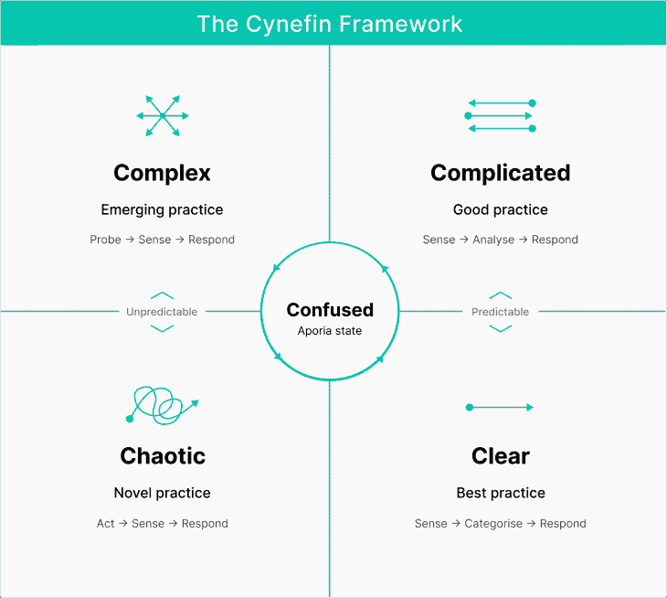

# 利用 Cynefin 框架做出更明智的 UX 设计决策

> 原文：<https://blog.logrocket.com/ux-design/making-smarter-ux-design-decisions-cynefin-framework/>

可怜的克莱夫·辛克莱爵士。20 世纪 80 年代初，他是英国的一家机构，然而对于这位成功的企业家来说，事情即将发生糟糕的转变。在一个充满科技愿景的世界里，他有一个激进的愿景，这在我们现在看来是理所当然的。1985 年，在一次炫目的发布会上，他准备向毫无戒心的英国公众推出“世界上第一辆电动汽车”。它本质上是一种电动辅助踏板自行车，利用了有利的新立法，允许电动辅助两轮和三轮车辆在英国道路上行驶。

“会出什么问题？”他想。“每个人都会喜欢一种小巧、智能、廉价的英国道路交通方式。让我们开始建造这些东西，每个人都会看到我的远见卓识。看，我在这里画了一张草图。它光滑，灰色，时速 15 英里，射程 20 英里。它只需要一个小马达。在生产开始之前，我们现在就来个大发布吧。”

你可以看到这是怎么回事。

Photo source: [Wikidata](https://www.wikidata.org/wiki/Q1429206#/media/File:SinclairC5-side.jpg)

## 一个设计问题:我们应该创新吗？

产品人都爱创新，不是吗？但是所有的设计问题都需要创新吗？我们如何知道自己是否创新？什么问题低到可以直接自动化？在一个大型设计项目的开始，考虑这一点可能会让人不知所措。呼吸…

我最近意识到，设计团队没有太多合适的工具来从纯设计的角度评估项目。开发和产品团队都有他们的规模确定方法，所有像设计思维和双钻石这样的大 D 都不关心这个基本问题。我们退回到一个标准化的过程，并试图将所有的设计问题，大的和小的，简单的和复杂的，纳入一个狭窄的规则集。所有的问题都以同样的方式处理。

## 设计创新的 Cynefin 框架

Cynefin，读作“kuh-nev-in”是一个威尔士词，意思是“栖息地”，或者更诗意地说，是“多种财产的地方”。在一个被设计思维、双钻石、敏捷和 scrum 等强大的行业工具所主宰的世界里，这是一个异常抒情的名字。

西妮芬只可能来自狄兰·马尔莱斯·托马斯。由 90 年代在 IBM 工作的 Dave Snowden 开发了多年，他对如何将复杂理论这一棘手的领域应用于决策很感兴趣。

该框架是一个有意义的工具，有助于识别问题的本质，从而找到解决问题的最佳方法。根据 Dave 的观点，了解世界并做出明智的决策是指拥有足够的知识，以便根据具体情况采取适当的行动。

Cynefin 框架允许你将问题分成五类:清晰的、复杂的、复杂的、混乱的和无序的。每个领域都需要不同的方法来解决问题。

The five domains of the Cynefin framework

由此产生的另一个想法是拥抱模糊性。拥抱模糊不会给你正确的答案，但它会给你更好的答案，同时告诉你哪些是错的，这是一个重要的哲学，在整个过程中要记住。

如果我们评估一个简单的设计问题，比如创建一个注册表单，产品团队可以使用最佳实践和已建立的规则来解决它。复杂的问题，比如创建一个新的产品类别，团队可能需要试验和迭代才能找到解决方案。

## 为什么 Cynefin 框架是有用的

Cynefin 框架与其他设计方法有所不同:

*   它没有告诉我们如何解决问题，而是向我们展示了一种让我们更有效地找到解决方案的策略
*   它让我们在选择最有效的长期设计方法时有一定的信心
*   它为我们提供了一个工具，以更明智的方式来评估设计问题
*   它让我们洞察问题的复杂性，让我们在面对曲线球时更加灵活

值得注意的是，Cynefin 框架是另一个工具，它补充了我们可以采用的许多其他设计方法。

## 让我们开始使用 Cynefin 框架

在任何新计划、史诗或设计项目的开始，你都有望拿到一份结构良好的产品推介，以及精心制作的工作故事。(有点黑色幽默。)

我列出了一些我需要回答的问题，例如:

1.  我可能需要什么资源？
2.  我需要用户研究吗？
3.  我需要什么级别的专家？
4.  创新是商业目标之一吗？
5.  测试难度会有多大？

然后，我会参考框架，看看这个设计问题可能属于五个领域中的哪一个。让我们从几个例子开始，这些例子涵盖了不断增长的复杂性。

## 明确的领域(已知的知识)

### 设计登录流程

我们公司希望新产品能在昨天之前上市。该产品需要一个强大的登录流程。这些流程是标准模式，幸运的是我们手头有一个设计模式，因为我们已经构建了一个。该流程包括标准组件，如表单字段、按钮、密码规则、验证等。

清晰的问题，也称为“简单”和“明显”的问题，是那些直截了当和容易理解的问题。解决方案显而易见，可以通过应用最佳实践或咨询专家来找到。他们有明确的因果关系。解决这些问题所需的知识和专业技能随处可得，并且可以通过遵循既定的程序找到解决方案。

我们的解决方案是选择最有效的登录流程。这个问题很简单，解决方案也很明显，因为流动应该是我们能找到的最有效和最快的模式。这里没什么令人兴奋或困难的。

策略是通过查看数据来“感知”，然后通过寻找模式和最佳实践来“分类”，最后通过采取行动来“响应”。

既然我们的商业目标是让用户快速进入一个产品，那么我们的设计目标就不是创新，而是让用户快速安全地进入。重要的是，我们不是在重新发明轮子，而是利用我们手头的东西来解决问题。然后，我们可以使用相同的因果分析来确定这个解决方案是否有效。如果没有，那么有一个明确的解决方案。我们可以不断完善，直到我们得到一个成功的结果。

## 复杂领域(已知未知)

### 修复前端性能问题

我们的下一个设计问题是关于解决产品性能问题。某些屏幕上的速度变慢了。当他们这样做时，我们缺乏有效的反馈，用户越来越沮丧。先从提问开始。

复杂的问题更难理解。这些问题的解决方案并不是显而易见的，可能需要对问题进行更深入的研究。他们仍然有明确的因果关系。这些类型的问题可以通过将它们分解成更小的部分并使用更详细的分析来解决。

我们这里的策略有点类似于一个清晰的问题，即通过查看数据来“感知”，然后通过寻找专家的信息来“分析”(我们需要比简单的分类更进一步)，最后通过采取行动来“响应”。

这些性能问题将需要专家的审查。由于这个问题涉及到产品的很多部分，我们需要考虑不同的场景。我们可以从分析中获得数据，客户服务团队可以帮助我们，我们有足够的开发人员专业知识来解决这个问题。同样，我们没有义务在这里创新，因为我们想尽快完成这项工作。

通过重新设计屏幕呈现内容的方式，使用标准的加载模式和反馈并监控效果，我们可以快速解决这个问题。我们需要更多的输入和思考，但是我们仍然可以使用标准的设计模式。

克莱夫·辛克莱最初认为英国公众会接受更便宜的汽车，这听起来是显而易见的。谁不想要一种在城市街道上出行的廉价方式呢？易于停放，易于维护。他将类似的模式应用于这种思考，然而他只咨询了几个专家，其中大部分都被他忽略了。这款车被匆忙投入生产，过于依赖他的直觉和一种信念，即足够的营销和一些活力会让他的愿景通过公众。毕竟，他是英国最伟大的科学家。

## 复数域(未知的未知数)

### 构建移动应用程序

我们现在正面临更棘手、更不可预测的问题。我们正在构建一个移动会计应用程序，我们本能地知道这是一个复杂的问题，因为我们的问题越来越长，越来越复杂。这个项目可能有创新的空间。

复杂的问题是那些难以理解并且有许多潜在解决方案的问题。这些类型的问题通常具有多重相互关联的因素和不可预测的结果。这些问题的解决方案并不是显而易见的，可能需要对问题进行更深入的研究，并通过实验找到最佳方法。

我们的策略应该是通过做用户研究来“探测”，然后通过查看我们收集的数据来“感知”，最后通过采取行动来“响应”。

我们可以通过试验和尝试不同的方法来解决这些问题。这意味着不是试图找到一个单一的解决方案，而是尝试和测试多个解决方案，看看哪一个效果最好。这些实验也能带来愉快的意外，让我们学到新的和新奇的东西。这可能会引发一个新的想法，使用[相邻可能](https://www.edge.org/conversation/stuart_a_kauffman-the-adjacent-possible)的概念，以新的方式组合现有的功能。

测试不同的方法可以更深入地了解问题，并有助于确定问题的根本原因，从而找到最有效的解决方案。

在进行实验时，拥有清晰的评估标准并使用良好的数据来衡量结果是至关重要的，这可以让我们立即了解哪种方法效果更好。

## 混沌领域(过山车之旅)

### 隐私条例的变更

我呈现了一个挑战的过山车。让我们来看看隐私法规中一个影响产品的重大且出乎意料的变化。这项新的数据隐私法改变了公司收集和处理个人信息的方式。同样，这里也有创新的空间。

改变法规是高度不可预测的，并且没有明确的因果关系，因为新法规可能很复杂，并且可能会改变产品的运营方式。这类问题的特点是快速变化、高度不确定性和缺乏结构。如果不解决这个问题，可能会导致严重的合规性问题和财务损失。

在《组织知识》 中，帕特里克·拉姆比说得好，“行动——任何行动——是第一个也是唯一一个适当回应的方式。”

我们的策略是通过尽快做我们认为需要做的事情来“行动”，然后通过查看我们收集的数据来“感知”是否解决了问题，最后通过采取行动来“响应”。

因此，这个问题需要随着情况的变化而立即采取行动和适应，例如审查产品及其基础设施以确保符合新的法规，更新服务条款和隐私政策，并向客户提供关于如何使用其数据的透明度和控制。

拥有一个灵活且适应性强的方法可以帮助最小化问题的影响，例如创建一个处理意外情况的计划，并建立一个可以快速有效响应的团队。

1985 年中期，辛克莱发现自己陷入了混乱。C5 在开发和制造过程中面临各种挑战，包括电池寿命不足、操控性和稳定性差以及耐用性低。选择使用非常规材料，如塑料外壳和轻质车架，这使得很难以具有成本效益的价格制造车辆。

复杂的事情堆积起来，他反应不够快。他也没有做适当的市场调查。是辆车吗？是自行车吗？当他在单调潮湿的英国冬天推出 C5 时，事情并没有一个有希望的开始。这完全是一场灾难。不到一年就停产了，只卖出了 5000 辆。

## 困惑的领域(不知道从哪里开始)

最后，困惑域，有时被称为无序，是当你不确定一个问题属于哪一类的时候。在决定行动方案之前，对问题达成共识。这里还有一个次要术语叫做 aporia，意思是怀疑、不确定或难以解决的问题或疑问。

当一个问题属于困惑的范畴时，这意味着问题的性质不是立即清楚的，并且很难确定它属于哪个范畴。在决定行动方案之前，先退一步，对问题达成共识。没有对问题的清晰理解，就很难确定哪种解决问题的方法是最合适的。

这个过程应该包括提问、收集数据和进行研究，以更好地理解问题及其背景。有必要将情况分解成可管理的块，并对它们进行相应的分类。通过将问题分解成更小的部分，您可以更好地理解和解决每个单独的问题。

密切关注混乱的问题，因为如果不处理和没有适当的解决方案，它们可能是有害的。你的首要任务应该是建立一种对问题进行分类的方法，将问题从未知转移到已知。

## 辉煌的愿景

Sinclair 的 C5 是一个被不可预见的混乱环境毁掉的绝妙主意。从事 C5 项目的工业设计师 Gus Desbarats 说，Sinclair“未能理解一个新的市场——计算市场和一个成熟的市场——交通市场——之间的区别，后者有更多的基准可以比较。”如果他没有让辉煌的愿景蒙蔽了他的双眼，让他看不到摆在面前的相当不幸的复杂情况，我们的道路可能充满了自鸣得意的三轮车。

下次当你被一个设计问题弄得不知所措时，记得后退一步，参考一下框架。

*   是明确的问题吗？使用标准实践和模式
*   是一个复杂的问题吗？请专家帮忙
*   复杂吗？获取用户研究和测试
*   混乱吗？构建尽可能多的原型，并快速测试。快速获得反馈，迭代；你需要旋转
*   你在一个困惑的领域吗？你需要感觉出来。这意味着讨论。这可能会很痛苦，但你会在某个阶段找到回到其他四个领域的方法。

Cynefin 框架将帮助您了解设计问题的本质，保持灵活性，并允许您选择解决问题的最佳方法。

我这篇文章只是触及了皮毛，如果你想了解更多，Cynefin——将意义编织到我们世界的结构中——是一个深入学习的好地方，当然还有戴夫·斯诺登关于 thecynefin.co[的大量文章。](https://thecynefin.co/)

*标题图片来源:* [图标侦察](https://iconscout.com/icon/gears-lubricant-1842009)

## [LogRocket](https://lp.logrocket.com/blg/signup) :无需采访即可获得 UX 洞察的分析

[LogRocket](https://lp.logrocket.com/blg/signup) 让您可以回放用户的产品体验，以可视化竞争，了解影响采用的问题，并结合定性和定量数据，以便您可以创建令人惊叹的数字体验。

查看设计选择、交互和问题如何影响您的用户— [立即尝试 LogRocket】。](hhttps://lp.logrocket.com/blg/signup)