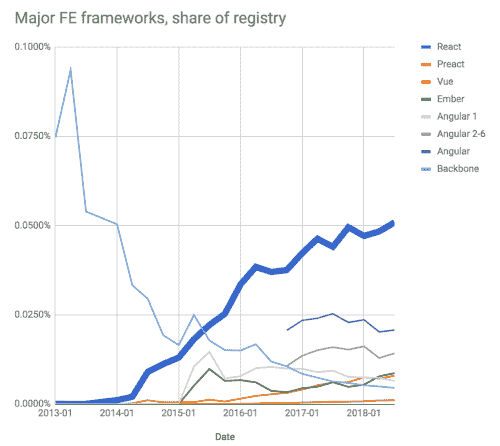
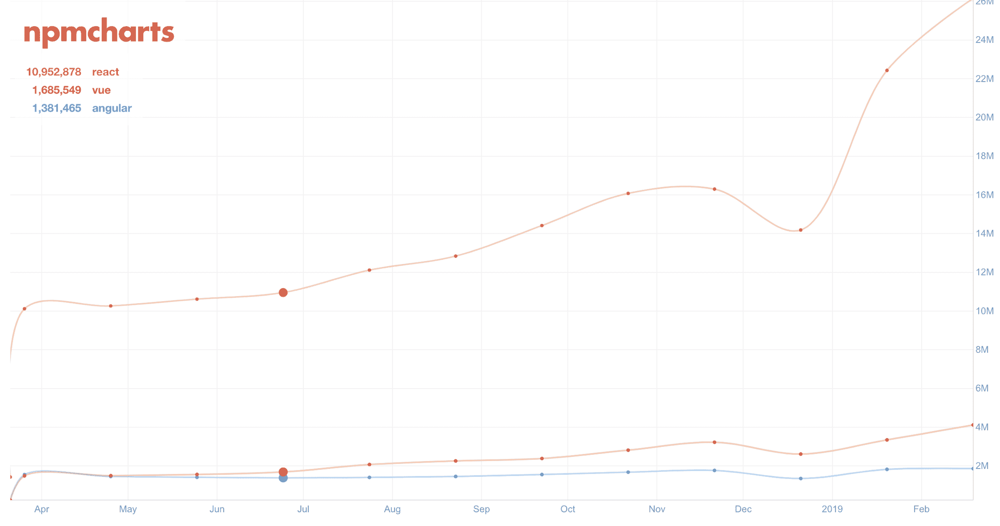
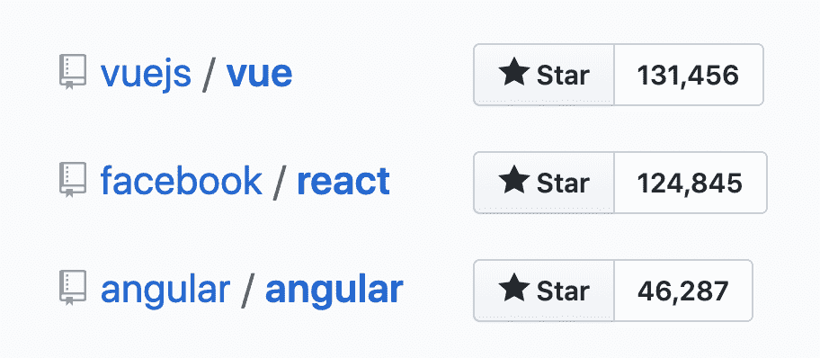
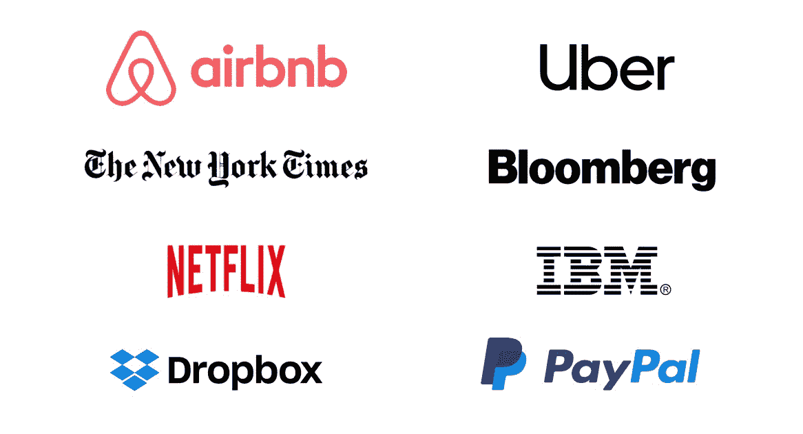
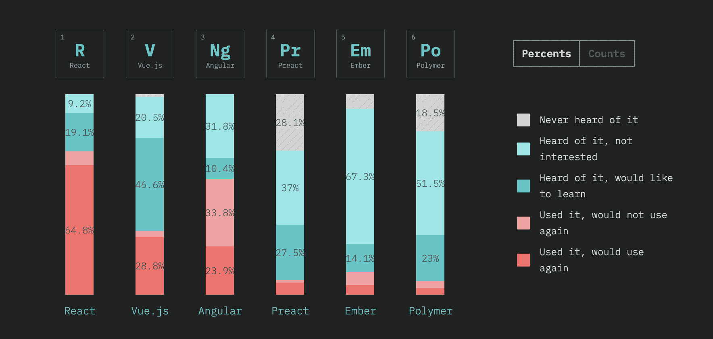

# 为 2019 年的反应做商业案例-日志火箭博客

> 原文：<https://blog.logrocket.com/making-the-business-case-for-react-in-2019-74463bbb22de/>

React 是世界上最流行的 JavaScript 框架。

当然，衡量开源 JavaScript 项目实际使用情况的唯一方法是查看 npm 数据——以及 npm 今年在《JavaScript: 2018 in review》中的 [*和 npm 对 2019 年的预测*](https://medium.com/npm-inc/this-year-in-javascript-2018-in-review-and-npms-predictions-for-2019-3a3d7e5298ef) 得出结论**“React 将成为 2019 年的主导框架。”**

React 已经达到了 60%的市场份额，正如文章所说，这对于 web 框架来说是史无前例的。

### 主要的公司支持和开源贡献

Angular 和 React 分别得到了谷歌和脸书这两家大公司的支持。然而，React 有更多的贡献者。

虽然脸书本身在 React 上投入了大量资金，但还有许多其他人在这个项目上也有股份。共有 1，285 名开发人员为 React 代码库做出了贡献。869 个贡献者的角度时钟。

最终，这两个数字都足够高，表明这些项目在可预见的未来仍将得到支持。相比之下，Vue 只有 269 个贡献者，没有大公司支持。

### 解释 Vue 的兴起

虽然 npm 数据显示了实际的*使用量*，另一个衡量开发者受欢迎程度的有用指标是 GitHub stars。

2018 年 6 月，Vue 框架在这一点上超过了 React。如何解释这种篡夺？比 React 更新更好的东西来了吗？

我们可以将 Vue 的流行归因于这样一个事实，即对不太关注 JavaScript 的人来说，它不那么令人生畏。Vue 往往会受到那些想要更接近传统前端开发的开发体验的人的欢迎。这不一定是一件坏事，但它肯定不会使 Vue 成为一个客观上更好的框架。

在向最终用户交付具有良好体验的高性能应用程序方面，Vue 没有明显的优势。Vue 缺乏大公司的支持，在企业中的采用率仍然很低。因此，React 仍然是一个长期风险较小的更安全的选择。

### 长期的努力

正如我们所见，React 现在很流行。然而，这并不是昙花一现。React 是一个经过战斗考验的已知量。React 在脸书内部使用后，于 2013 年向全世界发布。React 有后劲。

### 谁在使用 React？

React 被用于从《纽约时报》这样的基于内容的网站到 Twitter 这样的应用。React 甚至被 web 开发者的圣经使用: [MDN](https://webcache.googleusercontent.com/search?q=cache:wyqgCjUvhigJ:https://github.com/mdn/mdn/blob/master/ADRs/001-use-react.md+&cd=1&hl=en&ct=clnk&gl=uk) 。

Vue 在大公司中的采用要小得多——除了在中国，阿里巴巴、百度和腾讯已经采用了它。

### 为什么受欢迎很重要

受欢迎通常是质量的结果。然而，这可能是良好的营销、品牌和大公司支持的结果。客观技术优势不是评价技术的唯一显著因素；受欢迎程度本身就很重要。

高使用率带来了许多优势，比如容易招募。它为开发人员提供了更多的资源和教程，增加了错误修复的可能性，并且更容易征求建议。

这也意味着面向 React 社区的更广泛的开源项目。React 开发了自己的开源库、组件和工具生态系统。这些项目包括 React Native、Framer X 和 Gatsby。

### React 对浏览器供应商有影响力

React 现在如此受欢迎，以至于浏览器都在优化用它构建的网站的性能。React 公布钩子的时候，Chrome *瞬间* [优化了 V8 引擎](https://docs.google.com/document/d/1hWb-lQW4NSG9yRpyyiAA_9Ktytd5lypLnVLhPX9vamE/edit)，提高了数组析构的性能。

虽然可以使用任何框架编写一个缓慢的应用程序，但 React 在默认情况下提供了良好的性能。没有其他框架能达到如此重要的规模，让浏览器工程师以这种方式迎合它。Mozilla 甚至使用 React 来构建 [Firefox DevTools UI 和调试器](https://mozilladevelopers.github.io/playground/debugger/05-learn-more/)。

React 核心团队的 Dan Abramov 最近表示:

> 我们很高兴能与供应商合作制定规范，推进网络的未来。这包括正在进行的用户界面响应、显示锁定、主线程调度和虚拟滚动 API 等其他计划。其中一些合作目前是由 Chrome 推动的，但我们也与 Mozilla、苹果和微软就他们对我们的投入感兴趣的主题进行了合作。

### 开发者满意度

Javascript 2018 调查的 [*状态收集了超过 2 万名开发者的数据。Angular 和 React 之间的满意度差距非常明显:32%的开发人员对学习 Angular 没有兴趣。惊人的 33.8%的人表示*不会再使用它。只有 23.9%的回答者表示对使用该框架感到满意，相比之下，react 的这一比例高达 64.8%。**](https://stateofjs.com/)

开发人员的满意度会带来更快乐、更积极、更有生产力的员工。

### 未来路线图

React 已经存在了一段时间，但远没有停滞不前。很少有公告像 React 最近增加的钩子一样让开发者兴奋。

[React 的路线图](https://reactjs.org/blog/2018/11/27/react-16-roadmap.html)包括并发模式，React DOM 的现代化，以及数据获取和服务器渲染的悬念。最终，从商业角度来看，这意味着 React 可能会推动事情向前发展，并在提供快速网站和良好用户体验方面保持相关性。

## 使用 LogRocket 消除传统反应错误报告的噪音

[LogRocket](https://lp.logrocket.com/blg/react-signup-issue-free)

是一款 React analytics 解决方案，可保护您免受数百个误报错误警报的影响，只针对少数真正重要的项目。LogRocket 告诉您 React 应用程序中实际影响用户的最具影响力的 bug 和 UX 问题。

  [LogRocket](https://lp.logrocket.com/blg/react-signup-issue-free)

自动聚合客户端错误、反应错误边界、还原状态、缓慢的组件加载时间、JS 异常、前端性能指标和用户交互。然后，LogRocket 使用机器学习来通知您影响大多数用户的最具影响力的问题，并提供您修复它所需的上下文。

关注重要的 React bug—[今天就试试 LogRocket】。](https://lp.logrocket.com/blg/react-signup-issue-free)