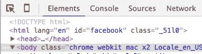
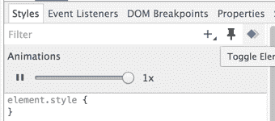
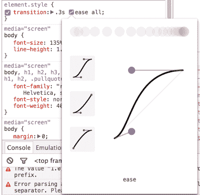
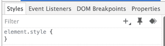
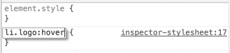
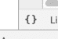
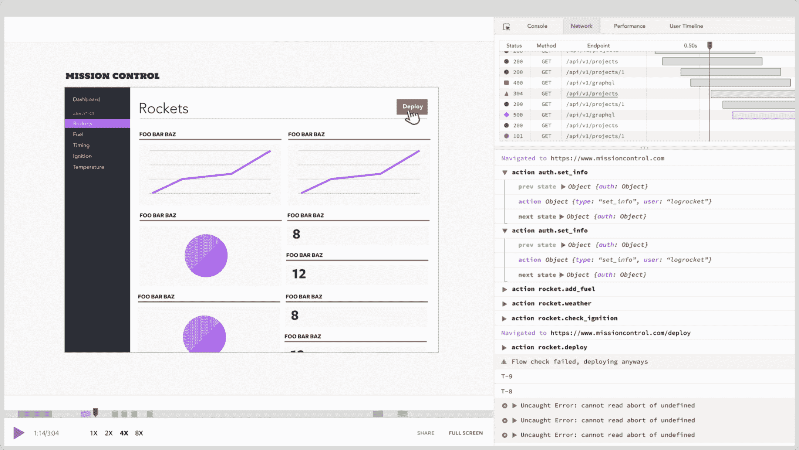

# 充分利用 Chrome 开发工具:第 1 部分- LogRocket 博客

> 原文：<https://blog.logrocket.com/making-the-most-of-the-chrome-developer-tools-8cac9a206979/>

# 充分利用 Chrome 开发工具:第 1 部分

## 

2017 年 2 月 27 日 2 分钟阅读 634

#### 大多数 web 开发人员都熟悉 chrome 开发人员工具的基本功能 DOM 检查器、样式面板和 JavaScript 控制台——但是，还有许多鲜为人知的功能可以极大地改进调试或创建工作流程。

### 选择模式

dev 工具提供了许多选择元素的方法，其中最方便的是选择模式。这个工具是通过按下开发工具面板左上角的鼠标图标激活的(或者用 cmd + shift + c ),让您只需点击它们就可以选择页面上的元素。激活后，您可以在页面上移动鼠标并预览选择，然后单击选择要检查的元素。

这个工具对于快速选择页面上的元素非常有用，因为点击 cmd+shift+c 将打开开发工具并直接进入选择模式。

#### 动画工具

最近，Chrome 团队增加了许多用于调试和创建动画的新功能。单击“样式”标签右上角的图标，会显示一个滑块，让您限制站点上所有动画的速度。您还可以暂停所有动画，这对于忙于动画内容的站点特别有用。

CSS animation controller

最近添加到元素面板的另一个奇妙的工具是动画检查工具。这使您可以查看动画的运动曲线，并微调其属性。此外，您可以使用箭头图标滚动预设动画列表，以应用于您的元素。

### 模拟元素伪状态

设置元素样式的另一个便捷工具是元素状态模拟器，通过单击“样式”面板右上角的图钉图标可以访问该工具。该工具允许您模拟悬停、活动、聚焦和已访问的元素伪状态，以及与这些选择器相关联的视图样式。

要为这些伪状态添加样式，只需添加一个新的选择器(带有“+”图标)并将:<state>添加到选择器字符串的末尾。例如，要将悬停规则添加到具有类“logo”的 li，创建一个新的选择器“li.logo:hover”，并在其中添加样式。然后，您可以通过检查“:hover”元素状态来模拟悬停在元素上，从而测试您的样式。</state>

### 美化 CSS/JavaScript

调试或查看缩小的 JavaScript 和 CSS 实际上是不可能的，但幸运的是 Chrome 提供了一个工具，让这变得稍微容易一些。在“源代码”标签中打开一个缩小的文件后，你可以点击文件左下角的括号标志，Chrome 就会“美化”代码。这对于 CSS 文件来说工作得很好，对于 JavaScript 来说也做得不错，尽管在缩小过程中丢失了一些信息(比如变量名)。

关于使用 Chrome 开发工具的更多技巧，请查看本系列的第 2 部分。

* * *

### 生产中的调试问题

Chrome 开发工具只有在你自己的机器上运行你的应用时才有效。如果你对理解用户在生产中看到的错误和性能问题感兴趣，试试 [LogRocket](https://logrocket.com/signup/) 。

LogRocket 是一个前端日志工具，可以让你回放问题，就像问题发生在你自己的浏览器中一样。LogRocket 不需要猜测错误发生的原因，也不需要向用户询问截图和日志转储，而是让您重放会话以快速了解哪里出错了。它可以与任何应用程序完美配合，不管是什么框架，并且有插件可以记录来自 React、Angular 和 Vue.js 的额外上下文。

LogRocket 让你的应用程序记录控制台日志、带有头+主体的网络请求/响应、浏览器元数据、Redux 动作/状态和性能计时。它还记录页面上的 HTML 和 CSS，甚至可以重建最复杂的单页面应用程序的像素级完美视频。

你可以[在这里](https://logrocket.com/signup/)查看 LogRocket。