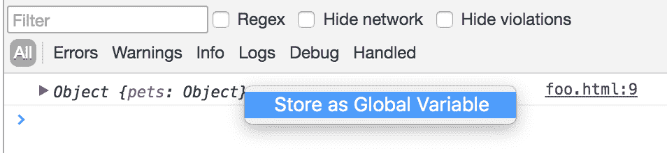
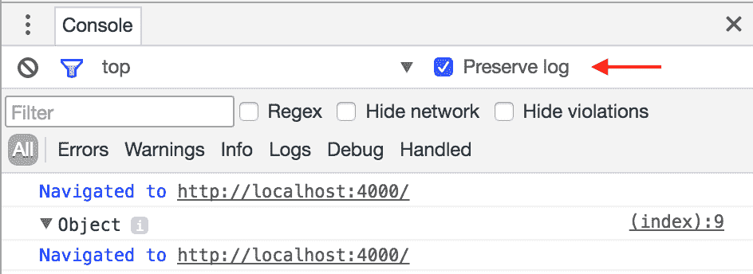
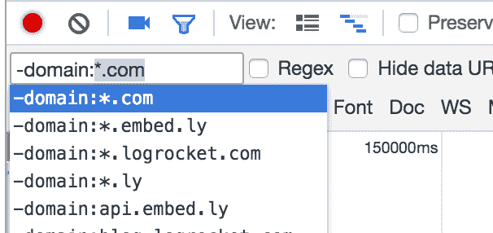
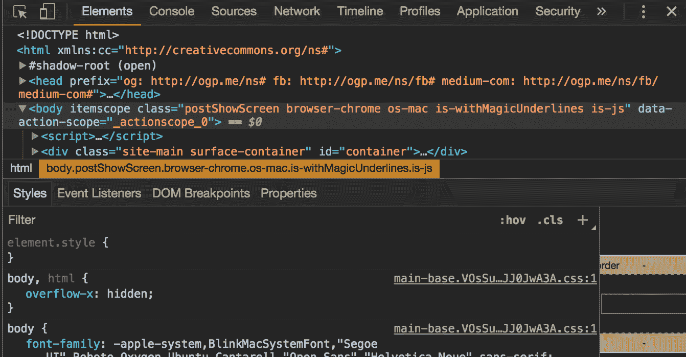

# 充分利用 Chrome 开发工具:第 2 部分- LogRocket 博客

> 原文：<https://blog.logrocket.com/making-the-most-of-the-chrome-developer-tools-part-2-4aa347970b30/>

# 充分利用 Chrome 开发工具:第 2 部分

## 

2017 年 3 月 21 日 2 分钟阅读 656

大多数 web 开发人员都熟悉 chrome 开发人员工具的基本功能 DOM 检查器、样式面板和 JavaScript 控制台——但是，还有许多鲜为人知的功能可以极大地改进调试或创建工作流程。

### 存储为全局变量

如果记录到控制台的复杂对象有许多键，或者包含难以手动解析的值，那么检查这些对象有时会很棘手。幸运的是，Chrome 使得用 JavaScript 检查这些对象变得很容易。

为此，右键单击控制台中的一个对象，然后按“存储为全局变量”。这将对象存储为一个名为`temp1`的全局变量，然后您可以使用 JavaScript 来处理它。

### Alt +向上/ Alt +向下

调试 CSS 时，您可以选择一个属性并使用向上/向下键来调整它的值。默认情况下，箭头键通过+/- `1`调整值。但是，通过按住`alt`键，您可以使用箭头键以`0.1`的步长微调数值，这在处理小数值时特别有用。

相反，您可以按住`shift`以`10`的步长调整数值。

### 保留日志

保留日志是一个复选框，允许您在页面刷新之间保留日志。这在调试需要您刷新页面的网站问题时非常有用，因为否则会清除所有控制台输出。启用此选项时，控制台中会出现一种新类型的“导航”日志，以显示页面刷新或导航到不同页面的事件。

### 在选择模式下按住 shift 键

在本系列的第一部分[中，我讨论了选择模式，它是通过按下 DOM 检查器左上角的图标来激活的。这使您可以通过将鼠标悬停在页面上来直观地选择要检查的元素。](https://blog.logrocket.com/making-the-most-of-the-chrome-developer-tools-8cac9a206979#.hhqcm2lq7)

我最近了解到，通过按住 shift 键，可以“遍历”堆栈中最顶层的元素，并选择更深层的元素。这对于复杂的 DOM 部分，或者具有某种覆盖其他元素的页面很有帮助。

### 网络+日志过滤器

调试具有大量网络请求或控制台日志的应用程序时，过滤特定类型的事件会很有用。Chrome 有一种过滤语言，支持许多不同的属性，以及像`*`这样的运算符来进行通配符匹配。

如果你输入“-”，Chrome 将显示一个 typeahead，显示你可以过滤的各种属性。您还可以打开“正则表达式”模式，对每行中显示的数据进行正则表达式匹配。

### 奖励:黑暗主题

Chrome 为开发工具提供了一个内置的深色主题。你可以通过点击开发工具窗格右上角的三个点图标，点击“设置”，然后切换主题来启用它。

我有时觉得这样对我的眼睛更舒服，而且，很明显，它看起来更酷🙂

### 生产中的调试问题

Chrome 开发工具只有在你自己的机器上运行你的应用时才有效。如果你对理解用户在生产中看到的错误和性能问题感兴趣，试试 [LogRocket](https://logrocket.com/signup/) 。

[https://logrocket.com/signup/](https://logrocket.com/signup/)

LogRocket 是一个前端日志工具，可以让你回放问题，就像问题发生在你自己的浏览器中一样。LogRocket 不需要猜测错误发生的原因，也不需要向用户询问截图和日志转储，而是让您重放会话以快速了解哪里出错了。它可以与任何应用程序完美配合，不管是什么框架，并且有插件可以记录来自 React、Angular 和 Vue.js 的额外上下文。

LogRocket 让你的应用程序记录控制台日志、带有头+主体的网络请求/响应、浏览器元数据、Redux 动作/状态和性能计时。它还记录页面上的 HTML 和 CSS，甚至可以重建最复杂的单页面应用程序的像素级完美视频。

你可以[在这里](https://logrocket.com/)查看 LogRocket。

> LogRocket 帮助您了解影响用户的问题，以便您可以重新开始构建优秀的软件。

进一步阅读

* * *

### Further reading