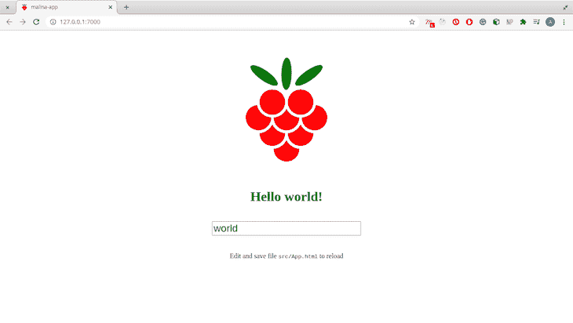
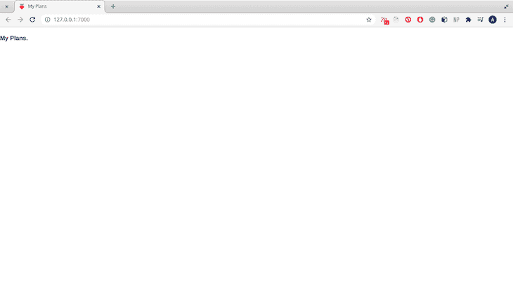
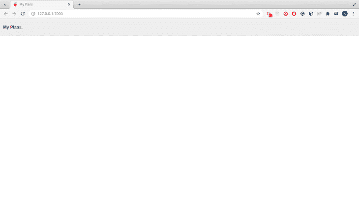
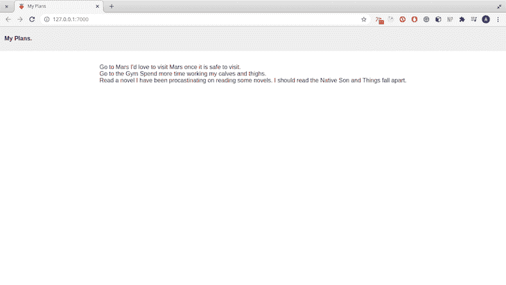
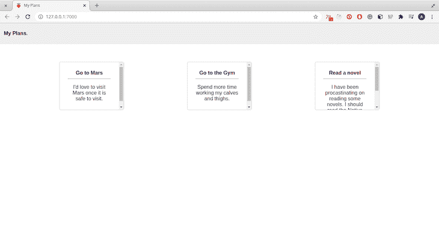
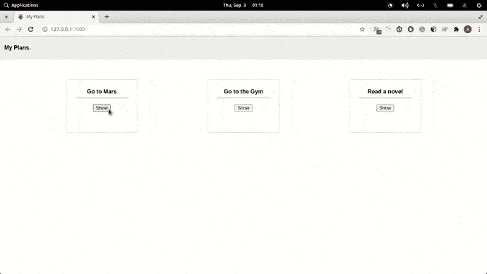
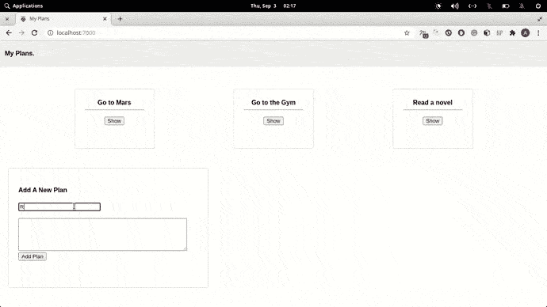

# 探索 Malina.js:使用工作演示的完整概述

> 原文：<https://blog.logrocket.com/malina-js-complete-overview/>

js 是一个受 Svelte 启发的前端编译器。它将您的 web 应用程序编译成 JavaScript，这意味着您的应用程序在前端不使用任何框架。

在本文中，您将了解 Malina.js 是什么，如何用它构建应用程序，以及它的语法。为了跟上本文，您应该对 HTML、CSS、JavaScript 和 npm 的使用有一个基本的了解。

## 粘合剂

绑定是用于将数据从父组件传递到子组件的机制。它们还用于将数据绑定(即附加)到属性和值。[和 Svelte](https://blog.logrocket.com/truly-reactive-programming-with-svelte-3-0-321b49b75969/) 一样，绑定也有单向绑定和双向绑定两种。

### 单向绑定

在单向绑定中，信息只沿一个方向流动，通常是从数据源到控件。本质上，数据在单向绑定中是只读的。

下面是一个单向绑定的示例:

```
<script>
let name="LogRocket";
</script>

<input name={name} />
```

在上面的代码块中，`input`标签中的`name`是属性，其中`{name}`是有界值。为了减少代码重复，可以将`input`重写为`<input {name}`——这种简化方法只适用于属性的名称和要绑定的值完全相同的情况。

当构建助手组件来呈现来自源的数据时，单向绑定非常有用。

### 双向装订

在双向绑定中，数据在两个方向上流动:从数据源到控件，以及从控件到数据源。这在设置表单时特别有用。双向绑定的一个例子是:

```
<script>
    let name = '';
    let checked = false;
</script>

<input type="text" :value={name} />
<input type="checkbox" :checked />
```

在上面的代码块中，当用户在文本框中键入一个值时，`name`值被填充。

## 式样

Malina.js 中的样式化可以通过创建单独的样式表文件来完成，也可以通过内嵌直接在`<style></style>`中的 HTML 文件中进行样式化。要执行内嵌样式，可以使用以下任一方法:

### 1.类绑定

```
class:className="{value ? 'blue' : 'red'}"

<style>

</style>
```

上面的代码用于根据传递给它的条件设置一个类值。对于要设置的类值，类名必须在`<style></style>`标签中定义。

### 2.样式绑定

```
style:color={'blue'}
```

上面用来设置一个样式值。在执行内联操作时，样式绑定更加方便。

## 事件

事件是构建应用程序不可或缺的组成部分，尤其是在前端。Malina 通过`on:eventName={handler}`或`@eventName={handler}`监听事件。`eventName`可以是点击、悬停等。和其他库一样，您可以定义内联事件函数。

## 碎片

Malina.js 中的片段作为可重用的代码。文件中的一个例子:

```
<div>
    {#fragment:button text}
        <div class="col-sm-6 smallpad">
            <button @click type="button" class="btn">{text}</button>
        </div>
    {/fragment}

    <fragment:button text='Left' @click:left />
    <fragment:button text='Right' @click:right />
</div>
```

在上面的例子中，您有一个已定义的`button`片段，它允许您在定义按钮时声明按钮的值，就像一个道具一样。上面的片段减少了再次设计按钮的压力。让我们在下一节看看组件。

## Malina.js 中的组件

组件是必不可少的，因为它们有助于减少重复。在 Malina.js 中，组件是通过从 HTML 的组件文件中导出`script`标签中的值来定义的。这些组件也被导入到另一个文件中，以传统的 ES6 方式使用。一个示例组件可能是:

```
//Name.html

<script>
export let name;
</script>

<p>Hello {name}, you have invoked a component! </p>
```

在上面的组件中，道具处理程序是导出的变量`name`。如果该值未导出，则不会呈现任何内容。

要在另一个组件中使用此组件:

```
//App.html

<script>
import Name from './Name.html';

let myName = "Abdulazeez";

</script>

<Name name={myName} />
```

上面的代码将呈现“你好，Abdulazeez，你已经调用了一个组件！”这很简单。

在下一节中，您将结合所学的知识来构建一个简单的应用程序。

## 构建 Malina.js 应用程序

在本节中，您将构建一个简单的应用程序来跟踪您打算执行的计划。您将从使用`create-malina-app`工具搭建一个启动应用程序开始:

```
npx create-malina plans-app
```

该工具负责搭建和安装后流程。安装过程完成后，运行应用程序:

```
npm run dev
```

它在`[http://localhost:7000](http://localhost:7000)`载入一个网页:



您将要构建的计划应用程序将由三个组件组成:`Header`、`Plans`和`Plan`。在`src`中新建一个名为`components`的文件夹，并将上述三个文件添加到其中。

### 编写组件

在本节中，您将为 plans 应用程序构建组件。您将从`Header`组件开始:

#### `Header.html`

这是一个显示应用程序名称的简单组件:

```
<header>
  <h4> My Plans </h4>
</header>
```

接下来，导入位于`src/App.html`的主组件中的组件。

#### `App.html`

将文件中的整个代码替换为:

```
<script>
  import Header from './components/Header.html';
</script>

<Header />
```

在上面的代码块中，您已经在脚本标记中导入了`Header`组件，并将其呈现在第 5 行。保存文件后，live 应用程序会立即重新加载:



标题看起来平淡无奇。让我们增加一点风格:

```
<style>
    header {
        background-color: #EEEEEE;
        border: solid 2px transparent;
        display: inline-block;
        font-size: 1rem;
        padding-left: 10px;
        position: fixed;
        top: 0%;
        width: 100%;
     }
</style>
```

这个看起来好一点:



现在让我们构建`Plans`组件，因为它负责列出您的计划。

#### `Plans.html`

该组件将呈现您设置的所有计划。您还可以在此组件中添加新计划。首先在您的`script`标签中添加虚拟计划:

```
<script>

let plans = [
        {
            title: 'Go to Mars',
            description: 'I'd love to visit Mars once it is safe to visit.'
        },
        {
            title: 'Go to the Gym',
            description: 'Spend more time working my calves and thighs.'
        },
        {
            title: 'Read a novel',
            description: 'I have been procrastinating on reading some novels. I should read the Native Son and Things Fall Apart.'
        }
    ]

</script>
```

迭代计划列表并呈现它们:

```
{#each plans as plan}
  {plan.title}
  {plan.description}
  <br>
{/each}
```

在 Malina 中，遍历列表是通过`{#each}..{/each}`标签完成的。

在上面的代码块中，您正在迭代 plans 数组中的每个计划，并显示标题和描述。导入`App.html`中的`Plans`组件:

```
<script>
  import Header from './components/Header.html';
  import Plans from './components/Plans.html';
</script>

...
<Plans />
```

该应用程序如下所示:



列表呈现得很好，但是没有样式。接下来，您将编写一个助手组件来帮助呈现计划。

#### `Plan.html`

在这个组件文件中，您将定义一个接受两个属性值的助手组件:`title`和`description`。从导出道具开始:

```
<script>
  export let title;
  export let description;
</script>
```

组件只接收导出的变量作为属性值。未导出的变量用于本地绑定和支持。接下来，编写组件体:

```
<div class="box">
  <b>{title}>
  <hr>
  <p>
    {description}
  </p>
</div>
```

在上面的代码块中，您将标题呈现为粗体元素，将描述呈现为段落。该计划在类别`box`下呈现。为`box`类添加样式:

```
<style>
  .box {
      margin: 20px 20px;
      text-decoration: none;
      padding: 50px 40px;
      border-radius: 4px;
      border: solid 1px rgba(189, 189, 189, 0.747);
      text-align: center;
  }

  @media only screen and (min-width: 780px) {
    .box {
        width: 200px;
        height: 150px;    
        padding: 25px;
        border-radius: 4px;
        border: thin 3px #000;
        overflow: auto;
    }
</style>
```

让我们使用`Plans`组件中的助手组件。

首先，在脚本标签下导入`P``lan`组件:

```
import Plan from './Plan.html';
```

接下来，修改从数组中呈现平面图的代码块:

```
{#each plans as plan}
  <Plan title={plan.title} description={plan.description} />
{/each}
```

重新加载应用程序会出现另一个屏幕:



应用程序看起来更好的风格！现在让我们添加一些额外的功能。

### 切换`Description`可见性

此功能将使您能够隐藏和显示计划描述。这也是一个很好的特性，可以巩固你之前学到的关于事件的概念。

在脚本标签中，定义一个处理可见性状态的函数`showDescription`:

```
<script>
...
  let show = false; // Our state handler.
  const showDescription = (e) => {
    show != show // change state
    return show
  }
</script>
```

接下来，修改`p`标签，仅在`show`变量设置为 true 时显示描述:

```
<p>
{show ? description: ''}
</p>
```

接下来，添加一个按钮来切换可见性:

```
<div>
...
<button @click:showDescription>{show ? 'Hide' : 'Show'} </button>
</div>
```

在上面的代码中，您在按钮上添加了一个点击监听器。点击事件触发`showDescription`功能。现在，您的计划应用程序显示和隐藏点击按钮的描述:



### 添加新计划

您将添加的下一个功能是用于添加新计划的部分。在您的`Plans`组件中，在您的脚本标签中定义一个函数`addPlan`:

```
let title = '';
let description = '';

const addPlan = () => {
        let newPlan = {
            title: title,
            description: description
        }
        title = description = '';
        return plans.push(newPlan)
    }
```

在上面的代码块中，您定义了两个将绑定到输入标记的变量。函数`addPlan`使用 title 和 description 变量的值创建一个对象，然后将它放入数组中。

接下来，在同一个文件中的`main`标记后键入下面的代码:

```
<div class="box">
    <h4>Add A New Plan</h4>
    <input type="text" name="title" :value={title}>
    <br><br/> 
    <textarea cols="50" rows="5" :value={description}></textarea>
    <button @click:addPlan>Add Plan</button>
</div>
```

在上面的代码块中，您已经以双向绑定的方式绑定了`title`和`description`变量。这意味着每当您在任一文本框中输入文本时，您都在更新变量。您还创建了一个触发`addPlan`函数的点击事件监听器。

最后，添加来自`Plan`组件的`box`类的代码:

```
<style>
  .box {
      margin: 20px 20px;
      text-decoration: none;
      padding: 50px 40px;
      border-radius: 4px;
      border: solid 1px rgba(189, 189, 189, 0.747);
      text-align: center;
  }

  @media only screen and (min-width: 780px) {
    .box {
        width: 200px;
        height: 150px;    
        padding: 25px;
        border-radius: 4px;
        border: thin 3px #000;
        overflow: auto;
    }
</style>
```

这就完成了您正在构建的基本应用程序🙂。



## 结论

在本文中，您学习了 Malina.js 的基本概念，并构建了一个简单的应用程序来补充概念性知识。你可以在他们的[官方文档](https://malinajs.github.io/docs/)中读到更多关于 Malina.js 的内容，你也可以在 [GitHub](https://github.com/Youngestdev/plans-app) 上找到本文使用的代码。

## 您是否添加了新的 JS 库来提高性能或构建新特性？如果他们反其道而行之呢？

毫无疑问，前端变得越来越复杂。当您向应用程序添加新的 JavaScript 库和其他依赖项时，您将需要更多的可见性，以确保您的用户不会遇到未知的问题。

LogRocket 是一个前端应用程序监控解决方案，可以让您回放 JavaScript 错误，就像它们发生在您自己的浏览器中一样，这样您就可以更有效地对错误做出反应。

[](https://lp.logrocket.com/blg/javascript-signup)[https://logrocket.com/signup/](https://lp.logrocket.com/blg/javascript-signup)

[LogRocket](https://lp.logrocket.com/blg/javascript-signup) 可以与任何应用程序完美配合，不管是什么框架，并且有插件可以记录来自 Redux、Vuex 和@ngrx/store 的额外上下文。您可以汇总并报告问题发生时应用程序的状态，而不是猜测问题发生的原因。LogRocket 还可以监控应用的性能，报告客户端 CPU 负载、客户端内存使用等指标。

自信地构建— [开始免费监控](https://lp.logrocket.com/blg/javascript-signup)。