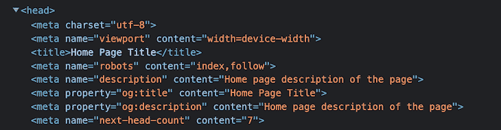
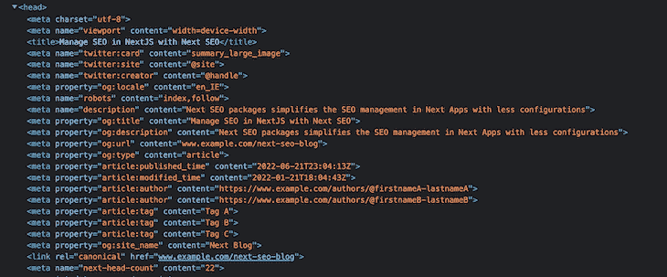
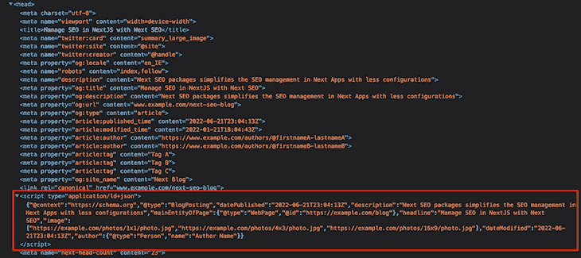
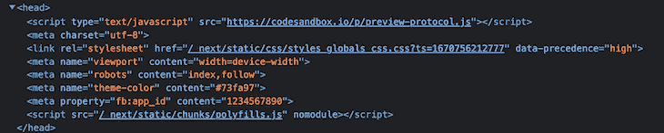
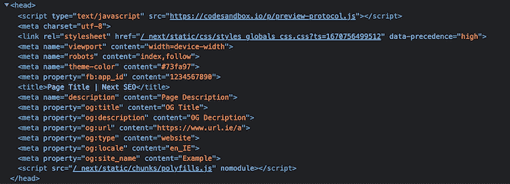
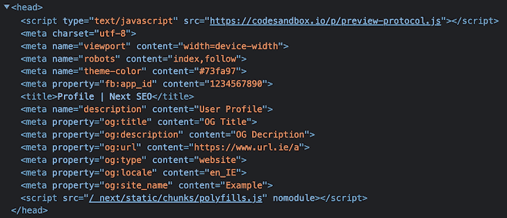
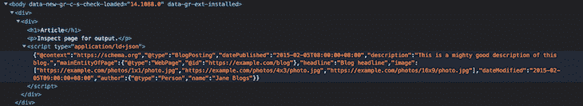

# 用 Next SEO 管理 Next.js 中的 SEO

> 原文：<https://blog.logrocket.com/manage-seo-next-js-with-next-seo/>

SEO 是市场营销的一个重要方面，可以帮助网站在搜索引擎结果页面中更有效地排名。更高的 SERPs 排名会增加有机流量并带来更多的商业机会，所以你可以明白为什么记住它是至关重要的！

因此，作为开发人员，确保我们项目的网站 SEO 得到正确管理，不遗漏任何属性，这一点至关重要。

在本文中，我们将使用 Next SEO 来管理 Next.js 应用程序中的搜索引擎优化。

## Next SEO 和 Next.js

Next.js 支持静态站点生成(SSG ),这比客户端渲染提供了更好的 SEO 功能。它还有一个内置的 head 组件来管理 SEO 元信息，如标题、描述、规范和开放图形标签。

当一个网站上有更多的页面时，也有更多的元标签需要考虑。随着站点的增长，管理这些会成为一个令人生畏的过程。

为了简化这一点，我们可以使用一个名为 [next-seo](https://github.com/garmeeh/next-seo) 的包。Next SEO 使得在 Next.js 项目中管理 SEO 更加容易。

通过使用 Next SEO，我们可以将 SEO 属性作为一个对象来传递，并且这个包会自动将这些属性添加到页面头部。

您可以将它单独添加到每个页面，或者使用`DefaultSeo`组件将其覆盖到其他页面。

让我们开始吧，看看它是如何工作的。

## 快速设置

首先，使用以下命令在 Next.js 项目中安装 next-seo 包:

`yarn add next-seo`

## 向页面添加下一个 SEO

让我们将 next-seo 包导入到带有 seo 属性的`page`组件中。为此，将以下代码添加到`home`组件中:

```
//home.js

import { NextSeo } from 'next-seo';

const Home = () => (
    <>
        <NextSeo
            title="Home Page Title"
            description="Home page description of the page"
        />
        <p>Simple Usage</p>
    </>
);

export default Home;

```

这将为您的页面呈现一个带有标题和描述的`<head>`标签。您可以通过检查来验证它，如下所示:



使用 title 和 description 属性，您可以看到标签默认包含了`og:title`和`og:description`。

这是一个简单的配置；让我们在下一次 SEO 中探索其他可用的选项。

## 默认搜索引擎优化

要将默认属性添加到我们所有的页面，我们可以使用`DefaultSeo`组件，而不是手动将属性分别添加到每个页面。如果需要，我们还可以覆盖页面上的任何属性。

将`DefaultSeo`组件添加到`_app.js`中，并添加以下代码:

```
//_app.js

import '../styles/globals.css'
import {DefaultSeo} from 'next-seo';

function MyApp({Component, pageProps}) {
    return (
        <>
            <DefaultSeo
                title="Next SEO Example"
                description="Next SEO is a plug in that makes managing your SEO easier in Next.js projects."
                openGraph={{
                    type: 'website',
                    locale: 'en_IE',
                    url: 'https://www.url.ie/',
                    siteName: 'SiteName',
                }}
                twitter={{
                    handle: '@handle',
                    site: '@site',
                    cardType: 'summary_large_image',
                }}
            />
            <Component {...pageProps} />
        </>
    )
}

export default MyApp

```

现在，添加到默认组件的 SEO 属性将呈现在所有页面上。您可以通过再次检查页面来验证这一点，如下所示:


### 覆盖默认属性

现在，让我们覆盖我们的**博客**页面上的默认 SEO 属性，因为每个博客都有一个单独的标题和描述。将以下代码添加到页面中:

```
//blog.js

import {NextSeo} from 'next-seo';

const Blog = () => (
    <>
        <NextSeo
            title="Manage SEO in NextJS with Next SEO"
            description="Next SEO packages simplifies the SEO management in Next Apps with less configurations"
            canonical="www.example.com/next-seo-blog"
            openGraph={{
                type: 'article',
                article: {
                    publishedTime: '2022-06-21T23:04:13Z',
                    modifiedTime: '2022-01-21T18:04:43Z',
                    authors: [
                        'https://www.example.com/authors/@firstnameA-lastnameA',
                        'https://www.example.com/authors/@firstnameB-lastnameB',
                    ],
                    tags: ['Tag A', 'Tag B', 'Tag C'],
                },
                url: 'www.example.com/next-seo-blog',
                images: {
                    url: 'https://www.test.ie/images/cover.jpg',
                    width: 850,
                    height: 650,
                    alt: 'Photo of text',
                },
                site_name: 'Next Blog'
            }}
        />
        <p>Manage SEO in NextJS with Next SEO - Blog</p>
    </>
);

export default Blog;

```

这里，我们已经覆盖了`title`、`description`和其他属性。您还可以看到一些与我们的博客文章特别相关的新属性:

*   `publishedTime`:博客发布日期
*   `modifiedTime`:博客更新日期
*   `tags`:与博客文章相关联的标签
*   `authors`:博客作者

您可以通过检查页面来验证这些信息:



正如你所看到的，有一些与 Twitter 卡片相关的元信息，但是我们没有在博客页面中包含这些信息——它是由 Next SEO 添加的，我们之前使用`DefaultSeo`组件添加的。

通过这个例子，您可以看到它是如何支持与博客相关的 SEO 属性的，开箱即用，易于使用。

## 开放图形支持

开放图形协议控制在社交媒体上共享链接时应该显示什么内容。在网页中使用 Open Graph 标签使它们能够成为社交图中的丰富对象。

例如，OG 协议允许你控制在社交媒体平台上分享链接时显示什么标题、图片和描述。如果你的分享没有 OG 标签，社交媒体平台会随机选择一个标题、图片和描述。

像 Twitter、LinkedIn 和脸书这样的平台可以识别开放图形标签——然而，Twitter 也有称为 Twitter Cards 的元标签，但在不需要使用 Twitter Cards 标签时，会使用 OG 标签。

Next SEO 支持以下 OG 属性:

1.  声音的
2.  录像
3.  文章
4.  轮廓
5.  书

## 音频示例

以下配置启用了对多个音频文件的音频开放图形支持:

```
//Podcast.js

import { NextSeo } from 'next-seo';
const Podcast = () => (
  <>
    <NextSeo
      title="Podcast Page Title"
      description="Next SEO PodCast"
      openGraph={{
        title: 'Open Graph Audio',
        description: 'Description of open graph audio',
        url: 'https://www.example.com/audio/audio',
        audio: [
          {
            url: 'http://examples.opengraphprotocol.us/media/audio/1khz.mp3',
            secureUrl: 'https://d72cgtgi6hvvl.cloudfront.net/media/audio/1khz.mp3',
            type: "audio/mpeg"
          },
          {
            url: 'http://examples.opengraphprotocol.us/media/audio/250hz.mp3',
            secureUrl: 'https://d72cgtgi6hvvl.cloudfront.net/media/audio/250hz.mp3',
            type: "audio/mpeg"
          },
        ]
        site_name: 'SiteName',
      }}
    />
    <h1>Audio Page SEO</h1>
  </>
);
export default Podcast;

```

可以看看其他 OG 类型的其他[例子](https://github.com/garmeeh/next-seo#open-graph-examples)了解更多。

## 结构化数据支持

结构化数据是一种标准化格式，用于提供有关页面的信息并对页面内容进行分类。这有助于搜索引擎理解网页，并向最终用户显示最相关的标题、描述、图像和其他信息。

Next SEO 还支持结构化数据，只需要有限的配置，支持多种 JSON-LD 类型，如`article`、`blog`、`FAQ`和`course`。

让我们通过一个例子来看看这一点。

`ArticleJsonLd`组件用于向页面添加结构化数据。添加以下代码，将结构化数据添加到我们的博客中:

```
//blog.js

import {ArticleJsonLd, NextSeo} from 'next-seo';

const Blog = () => (
    <>
        <NextSeo
            title="Manage SEO in NextJS with Next SEO"
            description="Next SEO packages simplifies the SEO management in Next Apps with less configurations"
            canonical="www.example.com/next-seo-blog"
            openGraph={{
                type: 'article',
                article: {
                    publishedTime: '2022-06-21T23:04:13Z',
                    modifiedTime: '2022-01-21T18:04:43Z',
                    authors: [
                        'https://www.example.com/authors/@firstnameA-lastnameA',
                        'https://www.example.com/authors/@firstnameB-lastnameB',
                    ],
                    tags: ['Tag A', 'Tag B', 'Tag C'],
                },
                url: 'www.example.com/next-seo-blog',
                images: {
                    url: 'https://www.test.ie/images/cover.jpg',
                    width: 850,
                    height: 650,
                    alt: 'Photo of text',
                },
                site_name: 'Next Blog'
            }}
        />
        <ArticleJsonLd
            type="BlogPosting"
            url="https://example.com/blog"
            title="Manage SEO in NextJS with Next SEO"
            images={[
                'https://example.com/photos/1x1/photo.jpg',
                'https://example.com/photos/4x3/photo.jpg',
                'https://example.com/photos/16x9/photo.jpg',
            ]}
            datePublished="2022-06-21T23:04:13Z"
            dateModified="2022-06-21T23:04:13Z"
            authorName="Author Name"
            description="Next SEO packages simplifies the SEO management in Next Apps with less configurations"
        />
        <p>Manage SEO in NextJS with Next SEO - Blog</p>
    </>
);

export default Blog;

```

我们现在已经为`JsonLd`添加了一些 SEO 属性，如下所示:



JSON 数据呈现在`<script>`标签中。您可以查看所有可用的 [JSON-LD 类型](https://github.com/garmeeh/next-seo#json-ld)以获得更多关于这方面的信息。

## 下一个 SEO 选项

下面是`NextSeo`组件的属性，我们可以用它来处理不同的 meta 标签属性。一些最常用的属性是:

*   `defaultTitle`:如果页面上没有设置标题，将使用该字符串代替空标题
*   `noindex`:设置页面是否索引的选项
*   `nofollow`:设置是否跟随页面的选项
*   `canonical`:设置页面的规范 URL
*   `facebook`。`appId`:将脸书应用 ID 添加到您的页面，以接收脸书洞察数据
*   `additionalMetaTags`:附加元标签，如`title`和`content`
*   附加的元链接，如图标

## Next.js 13 应用程序目录支持

Next.js 13 为`app`目录引入了一个 beta 特性，用于沿着`pages`目录路由。

由于这一变化，next-seo 的使用和配置也发生了变化，因为新的`app`目录给现有流程带来了以下变化:

1.  Next.js 不再删除头部的重复标签，所以我们不能使用`DefaultSeo`组件进行全局 SEO
2.  `app`目录包含了包含`<head>`标签的`head.js`文件，但是它不支持同步内联脚本。因此，JSON-LD 组件不能在`head.js`中添加，所以需要在`page.js`中添加，添加到文档的`<body/>`
3.  默认情况下，Next.js 不添加 below meta 标签，所以我们需要在根布局中手动添加

根据新的`app`目录，`DefaultSeo`元标签不能在其他页面被覆盖。

因此，我们需要识别公共标签，并将它们放在根布局(`/app/layout.js`)中，如下所示:

```
// app/layout.js
import { NextSeo } from 'next-seo';

export default function RootLayout({ children }) {
  return (
    <html>
      <head>
        {/* Used to be added by default, now we need to add manually */}
        <meta charSet="utf-8" />
        <meta name="viewport" content="width=device-width" />
        {/* 
          Anything we add in layout will appear on EVERY PAGE. At present it can not be overridden lower down the tree.
          This can be useful for things like favicons, or other meta tags that are the same on every page.
        */}
        <NextSeo
          useAppDir={true}
          facebook={{ appId: '1234567890' }}
          themeColor="#73fa97"
          titleTemplate="%s | Next SEO"
        />
      </head>
      <body>{children}</body>
    </html>
  );
}

```

> **注意，**新道具`useAppDir`强制 next-seo 使用兼容版本的`app`目录。

以下是上例中呈现的 meta 标记:



要使用常见的元标签，如`og`、`image`、`title`和`description`，首先添加带有常见元标签的`next-seo-config.js`文件，并将其导入所需页面。这里有一个例子来说明我的意思:

```
// next-seo-config.js
export const NEXT_SEO_DEFAULT = {
  title: 'Page Title',
  description: 'Page Description',
  openGraph: {
    type: 'website',
    locale: 'en_IE',
    url: 'https://www.url.ie/a',
    title: 'OG Title',
    description: 'OG Decription',
    siteName: 'Example',
  },
};

```

现在，将`next-seo-config.js`文件导入到`head.js`中，如下所示:

```
// app/head.js
import { NextSeo } from 'next-seo';

import { NEXT_SEO_DEFAULT } from './next-seo-config'; // your path will vary

export default async function Head() {
  return <NextSeo {...NEXT_SEO_DEFAULT} useAppDir={true} />;
}

```

以下是我们对上述示例的输出:



### 覆盖默认搜索引擎优化

如有必要，您可以覆盖其他页面上的默认`next-seo-config` meta 标签——看看下面的例子，看看是怎么做的:

```
 // app/profile/head.js
import { NextSeo } from 'next-seo';

import { NEXT_SEO_DEFAULT } from '../next-seo-config'; // your path may vary

export default async function Head() {
  const updateMeta = {
    ...NEXT_SEO_DEFAULT,
    title: 'Profile',
    description: 'User Profile',
  };
  return <NextSeo {...updateMeta} useAppDir={true} />;
}

```

这里，我们将默认 SEO meta 标签的标题和描述更新为我们自己的规范。

以上示例的输出如下:



## 添加 JSON-LD 组件

正如我们之前看到的，新的`app`目录`head.js`不支持内嵌的`<script>`。我们可以将 JSON-LD 添加到`page.js`文件中，该文件将 JSON-LD 结构化数据添加到文档体中。

看看下面的例子:

```
// app/blog/page.js
import { ArticleJsonLd } from 'next-seo';

const Article = () => (
  <>
    <h1>Article</h1>
    <p>Inspect page for output.</p>
    <ArticleJsonLd
      useAppDir={true}
      type="BlogPosting"
      url="https://example.com/blog"
      title="Blog headline"
      images={[
        'https://example.com/photos/1x1/photo.jpg',
        'https://example.com/photos/4x3/photo.jpg',
        'https://example.com/photos/16x9/photo.jpg',
      ]}
      datePublished="2015-02-05T08:00:00+08:00"
      dateModified="2015-02-05T09:00:00+08:00"
      authorName="Jane Blogs"
      description="This is a mighty good description of this blog."
    />
  </>
);

export default Article;

```

以上示例的输出如下:



## 结论

对于需要有机发现的网页，SEO 是必不可少的。为了有高的网页排名，网站需要被组织起来，这样他们就可以很容易地被搜索引擎抓取。

Next SEO 使得 Next.js 项目中的搜索引擎优化管理变得非常简单，并且易于实现——它帮助开发人员有效地添加 SEO 属性，而不会遗漏任何重要的元标签，同时避免重复的发生。

你可以在官方[文档](https://github.com/garmeeh/next-seo)中找到其他属性和示例。

在下面的评论中让我知道你自己使用 Next SEO 的经历，感谢你的阅读！

## [LogRocket](https://lp.logrocket.com/blg/nextjs-signup) :全面了解生产 Next.js 应用

调试下一个应用程序可能会很困难，尤其是当用户遇到难以重现的问题时。如果您对监视和跟踪状态、自动显示 JavaScript 错误、跟踪缓慢的网络请求和组件加载时间感兴趣，

[try LogRocket](https://lp.logrocket.com/blg/nextjs-signup)

.

[](https://lp.logrocket.com/blg/nextjs-signup)[](https://lp.logrocket.com/blg/nextjs-signup)

LogRocket 就像是网络和移动应用的 DVR，记录下你的 Next.js 应用上发生的一切。您可以汇总并报告问题发生时应用程序的状态，而不是猜测问题发生的原因。LogRocket 还可以监控应用程序的性能，报告客户端 CPU 负载、客户端内存使用等指标。

LogRocket Redux 中间件包为您的用户会话增加了一层额外的可见性。LogRocket 记录 Redux 存储中的所有操作和状态。

让您调试 Next.js 应用的方式现代化— [开始免费监控](https://lp.logrocket.com/blg/nextjs-signup)。