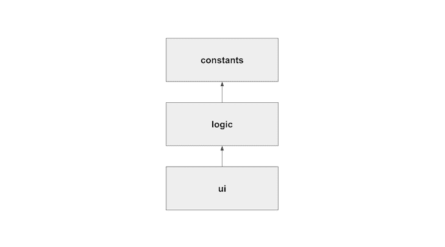
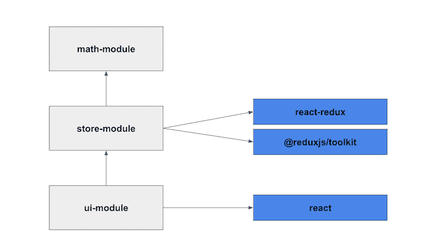

# 在 TypeScript 中管理依赖边界

> 原文：<https://blog.logrocket.com/managing-dependency-boundaries-typescript/>

当从事大型项目时，开发人员倾向于遵循某些有助于管理复杂性的原则，即架构，使应用程序更容易理解和扩展。虽然管理架构的方式有很多，但是一些流行的例子包括[模型-视图-控制器(MVC)](https://blog.logrocket.com/dont-underestimate-the-model-in-mvc/) 和[六角形](https://en.wikipedia.org/wiki/Hexagonal_architecture_(software))架构模式。

在这些模式中，抽象被设置为高级系统设计或架构蓝图，描述每个模块的职责以及它们之间的关系和它们的依赖关系。正确的架构选择将取决于系统的上下文、需求，以及您是需要实时数据处理还是单一的 web 应用程序。

保持日常的开发与架构蓝图保持一致是具有挑战性的，尤其是如果您的项目或组织正在快速发展的话。虽然拉式请求评审、指导、文档和知识共享可能会有所帮助，但仅仅这些可能还不够。

在本文中，我们将讨论依赖关系在 TypeScript 上下文中的重要性。我们将回顾依赖关系未被检查时的潜在陷阱，并且我们将提出一个解决方案来保持我们的代码与架构依赖关系同步。我们开始吧！

## TypeScript 中的依赖项

在 TypeScript 中，像`functions`、`objects`和`values`这样的变量可以使用 [ES6 模块](https://developer.mozilla.org/en-US/docs/Web/JavaScript/Guide/Modules)语法在文件之间导入或导出。用`export`标注的变量将被导出，并且可以使用`import`语法导入:

```
// constants.ts
export const USER = "Alain";

// logic.ts
import { USER } from "./constants";
export const greet = (): string =&gt; `Hi ${USER}!`;

// ui.ts
import { greet } from "./logic";
const html = `&lt;h1&gt;${greet()}&lt;/h1&gt;`; // &lt;h1&gt;Hi Alain!&lt;/h1&gt;

```

有了这个特性，您可以将应用程序的功能分解成模块，然后按照架构蓝图来组织这些模块。重要的是要注意，导入本地文件和本地或远程包是可能的，就像那些通过 npm 可用的包一样。

这个模块语法提供了很大的灵活性，对您可以导入和导出的内容没有任何限制。依赖关系图是在整个应用程序中隐式定义的。



Dependency graph for the example above

然而，随着项目的发展，隐式依赖图可能会不受控制地增长，从而导致一些问题。

## 未检查的依赖管理的缺点

未检查依赖的一个缺陷是，任何程序模块都可以导入并创建对代码库中导出的任何方法的依赖。私有和辅助方法可以在它们的模块之外被引用，所以保持一个模块的公共 API 需要持续的人工监督。

导入第三方包构成了另一个权衡。第三方模块很棒，可以提高你的开发速度，防止你重新发明轮子。然而，另一方面，太多的依赖关系会使项目暴露于安全问题，这是由于过时的包、包之间的冲突以及巨大的包大小。

第三个也是主要的问题是，没有办法以编程方式强制或验证代码是否遵循架构的依赖规则。随着时间的推移，蓝图和实现可能会分离，以至于参考体系结构不再有效，从而使体系结构的内在特征无效。

例如，在 MVC 中，我们可能会失去视图和控制器之间的分离，这种分离包含了业务逻辑，使得测试变得困难，并且降低了在不破坏业务逻辑的情况下迭代 UI 的能力。

在下一节中，我们将学习如何使依赖关系显式化，以便模块内部保持私有，第三方依赖关系处于控制之下，并且架构与代码保持同步。

## 使用围栏添加显式依赖关系

为了明确模块之间的依赖关系并设置限制性的依赖规则，我们将使用 [good-fences](https://github.com/smikula/good-fences) 包。good-fences 使您能够在 TypeScript 项目中创建和实施边界，它可以极大地帮助减少上述缺陷。

让我们通过一个例子来学习如何使用 good-fences 包。我们将使用由 good-fence 提供的栅栏的概念，来确保项目的实现随着时间的推移匹配并维护计划的依赖图。

栅栏定义了一个模块如何与其他模块和栅栏目录交互。我们可以通过向 TypeScript 目录添加一个`fence.json`文件来创建一个栅栏。栅栏只限制通过它们的东西，比如导入、导出和外部依赖。在隔离目录中，没有模块导入限制。您也可以标记围栏，以便其他围栏配置可以标记它们。

## 依赖边界:一个实际的例子

此示例的完整代码可在报告后的[中找到。我们将使用一个简单的 React 应用程序，它遵循商店驱动的 UI 架构，类似于](https://github.com/aperkaz/code-boundaries) [React 的表示组件模式](https://blog.logrocket.com/react-component-design-patterns-2022/#the-presentational-and-container-component-patterns)。该应用程序提供了对[斐波那契](https://en.wikipedia.org/wiki/Fibonacci_number)或[佩尔](https://en.wikipedia.org/wiki/Pell_number)数列的第 n 个数的计算。就像我说的，这是个简单的应用程序。

UI 无法访问应用程序中的业务逻辑方法，因为它们被抽象在商店后面。此外，业务逻辑代码不依赖于任何 UI 代码，因此 UI 可以在不涉及业务逻辑的情况下发展。

下面是模块之间的依赖关系图。请注意，模块之间的依赖关系用箭头标记。内部模块为灰色，外部包装为蓝色。



为了实现上面的模式，我们将创建三个不同的隔离目录，`math`、`store`和`ui`。每个目录映射到模式中的一个模块。

为了防止其他模块或任一模块的类型进入实现细节，每个隔离目录只允许从`index.ts`文件导入。只要在`index.ts`文件上定义的公共 API 没有被修改，实现细节和助手工具仍然可以安全地更改。

此外，为了防止循环或不必要的依赖，如`ui`直接依赖于`logic`，每个围栏都被标记，定义它可以从哪些其他围栏导入。

最后，为了缓解未经检查的第三方进口的问题，每个栅栏将明确声明哪些第三方包允许进口。要添加新的包，您必须修改`fence.json`文件，使这些依赖关系显式化。

我们项目的围栏配置如下:

```
// ./math/fence.json
{
  "tags": ["math-module"],
  "exports": ["index"],
  "imports": [],
  "dependencies": []
}
// ./store/fence.json
{
  "tags": ["store-module"],
  "exports": ["index"],
  "imports": ["math-module"],
  "dependencies": ["react-redux", "@reduxjs/toolkit"]
}
// ./ui/fence.json
{
  "tags": ["ui-module"],
  "imports": ["store-module"],
  "dependencies": ["react"]
}

```

关于栅栏配置选项的深入解释，可以查看[官方文档](https://github.com/smikula/good-fences)。

所有这些规则都可以通过运行`good-fences` npm 包，指向项目的`tsconfig.json`文件，即`yarn good-fences`，以编程方式进行检查。现在，您可以将检查作为 CI/CD 管道的一部分或作为提交挂钩来运行！

## 结论

适当的依赖管理和在实现过程中遵循架构设计是健康和可维护的代码库的重要方面。

good-fences 不是解决这个复杂问题的灵丹妙药，而是手边的一个很好的工具。随着项目的增长，自动化手动的依赖关系规则检查是很容易的，这鼓励了团队对依赖关系的关注。该代码在回购后的[中可用；请随意更改并进一步探索它。编码快乐！](https://github.com/aperkaz/code-boundaries)

## [LogRocket](https://lp.logrocket.com/blg/typescript-signup) :全面了解您的网络和移动应用

[](https://lp.logrocket.com/blg/typescript-signup)

LogRocket 是一个前端应用程序监控解决方案，可以让您回放问题，就像问题发生在您自己的浏览器中一样。LogRocket 不需要猜测错误发生的原因，也不需要向用户询问截图和日志转储，而是让您重放会话以快速了解哪里出错了。它可以与任何应用程序完美配合，不管是什么框架，并且有插件可以记录来自 Redux、Vuex 和@ngrx/store 的额外上下文。

除了记录 Redux 操作和状态，LogRocket 还记录控制台日志、JavaScript 错误、堆栈跟踪、带有头+正文的网络请求/响应、浏览器元数据和自定义日志。它还使用 DOM 来记录页面上的 HTML 和 CSS，甚至为最复杂的单页面和移动应用程序重新创建像素级完美视频。

[Try it for free](https://lp.logrocket.com/blg/typescript-signup)

.