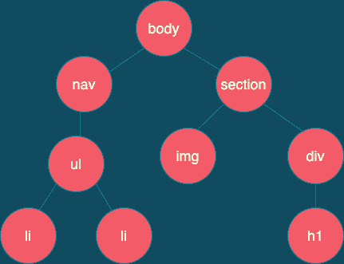
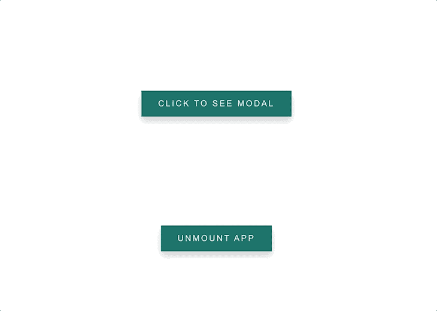
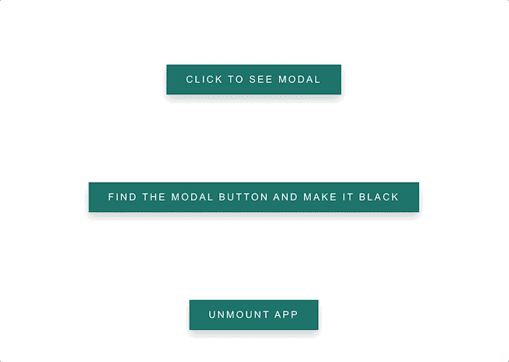
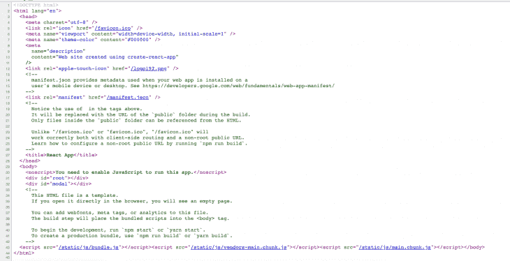
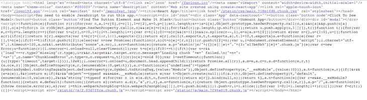

# 用 ReactDOM 管理 DOM 组件

> 原文：<https://blog.logrocket.com/managing-dom-components-reactdom/>

每当你创建一个 React 项目时，你需要安装的第一件事就是`react-dom`包。你有没有想过你为什么需要它？

这可能令人惊讶，但是我们不能只使用`react`包来呈现 UI 组件。为了将 UI 呈现给浏览器，我们必须使用`react-dom`。在本指南中，我们将通过创建一个示例应用程序来探索使用 ReactDOM 管理 DOM 组件。随着您的跟进，我们将对代码进行一些更改，以了解您可以使用的多种方法。

你可以在 Github 和[部署站点](https://react-dom-tutorial.vercel.app/)上查看示例应用的[代码。](https://github.com/hulyak/ReactDOM-tutorial)

## 反应能力

ReactDOM 将组件或 JSX 元素呈现给 DOM。ReactDOM 对象只有少数几个方法；你可能用过`render()`方法，它负责在浏览器中呈现应用程序。

`react-dom`包充当 DOM 的入口点。我们在项目的顶部导入它，如下所示:

```
import ReactDOM from 'react-dom';

```

在我们进入 ReactDOM 方法的细节之前，让我们首先理解为什么我们需要 ReactDOM 而不是仅仅使用 DOM。

## 虚拟 DOM (VDOM)与 DOM

JavaScript 和 HTML 不能直接相互通信，所以开发了 DOM 来处理这个问题。当您打开网页时，浏览器引擎会将其所有内容转换为 JavaScript 可以理解的格式，即 DOM 树。

该树的结构与相应的 HTML 文档的结构相同。如果 HTML 代码中的一个元素嵌套在另一个元素中，这将反映在 DOM 树中。

通过打开浏览器的开发者工具面板中的**元素**选项卡，您可以看到 DOM 的样子。您将看到的内容与 HTML 代码非常相似，只是您看到的不是 HTML 标记，而是 DOM 树的元素。

DOM 是由用户浏览器创建并存储在其中的网页的逻辑表示。浏览器获取网站的 HTML 并将其转换为 DOM，然后将 DOM 绘制到用户的屏幕上，使用户可以看到网站。

让我们来看看 DOM 是如何工作的。下图显示了 DOM 如何看待 HTML:

```
<body>
   <nav> 
       <ul>
          <li>Home</li>
          <li>Contact</li>
      </ul>
  </nav>
    <section class="cards">
         
            <div class="post-content">
                <h1>Virtual DOM vs DOM</h4> 
            </div>
    </section>
</body>

```



然而，DOM 也有一些问题。假设用户点击一个按钮来删除一个项目。该节点以及依赖于它的所有其他节点都将从 DOM 中删除。

每当浏览器检测到 DOM 发生变化时，它会使用新版本重新绘制整个页面。但是我们真的需要重新绘制整个页面吗？比较两个 DOM 来确定哪些部分发生了变化是非常耗时的。

因此，每当用户与站点交互时，浏览器简单地重画整个页面实际上更快。这就是虚拟 DOM 发挥作用的地方。

虚拟 DOM 是 React 创建自己的 DOM 表示，作为 JavaScript 对象。每当对 DOM 进行更改时，库就会制作这个 JavaScript 对象的副本，对该副本进行更改，并比较这两个 JavaScript 对象以查看发生了什么变化。然后它通知浏览器这些变化，并且只重画 DOM 的那些部分。

对 JavaScript 对象进行修改并进行比较，比试图用 DOM 做同样的事情要快得多。因为 DOM 的这个副本作为 JavaScript 对象存储在内存中，所以它被称为虚拟 DOM。

虚拟 DOM 通过只重画更新的元素和组来防止不必要的重画。VDOM 是实际 DOM 的轻量级、快速的内存表示。

尽管 React 尽可能使用 VDOM，但它仍然会定期与实际的 DOM 交互。React 更新实际 DOM 以与 VDOM 一致的过程称为[协调](https://reactjs.org/docs/reconciliation.html)。

## `ReactDOM.render()`

现在我们对 DOM 和 VDOM 有了更好的理解，我们可以开始学习我们的第一个方法:`ReactDOM.render`。render 方法的用法如下:

```
ReactDOM.render(element, container[, callback])
ReactDOM.render(<h1>ReactDOM</h1>, document.getElementById("app"))

```

第一个参数是我们想要呈现的元素或组件，第二个参数是我们想要将它附加到的 HTML 元素(目标节点)。

通常，当我们用`create-react-app`创建我们的项目时，它给我们一个`div`，在`index.html`中有一个`root`的`id`，并且我们在这个根 div 中包装我们的 React 应用程序。

因此，当我们使用`ReactDOM.render()`方法时，我们为第一个参数传入我们的组件，并用`document.getElementById("root")`作为第二个参数引用`id="root"`:

```
<!DOCTYPE html>
<html lang="en">
  <head>
    <!-- ... -->
  </head>
  <body>
   <!-- ... -->
    <div id="root"></div>
  </body>
</html>

```

```
// src/index.js
import React from 'react';
import ReactDOM from 'react-dom';

// create App component
const App = () => {
   return <div>Render Me!</div>
}

// render App component and show it on screen
ReactDOM.render(<App />, document.getElementById('root'));

```

### 再见`ReactDOM.render()`

6 月，React 团队宣布 [React 18](https://reactjs.org/blog/2021/06/08/the-plan-for-react-18.html) ，随着新的更新，我们将不再使用`ReactDOM.render()`。相反，我们将使用`ReactDOM.createRoot`。

React 18 的 alpha 版本已经推出，但公测还需要几个月的时间。如果您想尝试 React 18 alpha 版本，请按如下方式安装:

```
npm install [email protected] [email protected]

```

使用 React 18，我们将使用`ReactDOM.createRoot`创建一个根，然后将根传递给渲染函数。当你切换到`createRoot`时，你将默认获得 React 18 的所有新功能:

```
import ReactDOM from "react-dom";
import App from "App";

const container = document.getElementById("app");
const root = ReactDOM.createRoot(container);

root.render(<App />);

```

## `ReactDOM.createPortal()`

我们关于 ReactDOM 的第二个方法是`createPortal`。

* * *

### 更多来自 LogRocket 的精彩文章:

* * *

你曾经需要创建一个覆盖，或模态？React 有不同的功能来处理模态、工具提示或其他类似的特性。一个是`ReactDOM.createPortal()`功能。

为了呈现一个模态或者覆盖图，我们需要使用`z-index`属性来管理元素在屏幕上出现的顺序。`z-index`允许我们沿着 z 轴根据深度定位元素。

但是，如您所知，我们只能呈现一个 div，所有其他元素都嵌套在我们的根 div 中。在`createPortal`函数的帮助下，我们可以在主组件树之外呈现我们的模态。modal 将是 body 元素的子元素。让我们看看怎么做。

在我们的`index.html`中，我们将为模态添加另一个 div:

```
// index.html
<body>
    <noscript>You need to enable JavaScript to run this app.</noscript>
    <div id="root"></div>
    <div id="modal"></div>
 </body>

```

`ReactDOM.createPortal()`函数有两个参数:第一个是 JSX，或者我们想要在屏幕上呈现的内容，第二个参数是我们想要附加到我们的模态的元素的引用:

```
// Modal.js

import { createPortal } from 'react-dom';
const modalRoot = document.querySelector('#modal');

const Modal = ({ children }) => createPortal(children, modalRoot);

export default Modal;

```

现在，为了呈现我们的组件，我们可以在模态组件的开始和结束标记之间传递我们想要显示的任何内容。这将在模态组件中呈现为`children`。我已经渲染了`App.js`里面的模态。

在我们的`App.js`文件中，我们有一个打开模态的按钮。当用户与按钮交互时，我们将显示带有关闭按钮的模式:

```
// App.js

import React, { useCallback, useState } from 'react';
import Modal from '../Modal';

const App = () => {
  const [showModal, setShowModal] = useState(false);

  const openModal = useCallback(() => setShowModal(true), []);
  const closeModal = useCallback(() => setShowModal(false), []);

  return (
    <div className='App'>
      <button onClick={openModal} className='button node'>
        Click To See Modal
      </button>
      {showModal ? (
        <Modal>
          <div className='modal-container'>
            <div class='modal'>
              <h1>I'm a modal!</h1>
              <button onClick={closeModal} className='close-button'></button>
            </div>
          </div>
        </Modal>
      ) : null}
    </div>
  );
};

export default App;

```


## `ReactDOM.unmountComponentAtNode()`

当我们需要在挂载 DOM 节点后移除它，并清理它的事件处理程序和状态时，我们使用这个方法。

我们将再次继续我们的代码，这一次我们将卸载我们的`root div`:

```
ReactDOM.unmountComponentAtNode(container)

```

对于容器，我们传入根 div，因此当用户单击按钮时，它将卸载应用程序。

如果您尝试卸载`modal id`，您将看到一个错误。这是因为 modal 没有挂载，所以它会返回`false`:

```
// App.js

const App = () => {
  ReactDOM.unmountComponentAtNode(document.getElementById("root"));

  return (
    <button onClick={handleUnmount} className='button'>
      Unmount App
    </button>
  )
}

```

这段代码足以卸载根目录。



## `ReactDOM.findDOMNode()`

我们知道可以用`render`方法呈现 DOM 元素。我们还可以借助`findDOMNode`方法访问底层 DOM 节点。根据 React 文档，不鼓励使用这种方法，因为它穿透了组件抽象。

> 注意:`findDOMNode`方法在 StrictMode 中已被弃用。

一般来说，如果你需要引用任何 DOM 元素，建议使用[`useRef`钩子](https://blog.logrocket.com/a-guide-to-react-refs/)。在大多数情况下，您可以在 DOM 节点上附加一个 ref，完全避免使用`findDOMNode`。

另一个要点是，您想要访问的节点元素必须被挂载，这意味着它必须在 DOM 中。如果没有安装，`findDOMNode`返回 null。一旦可以访问挂载的 DOM 节点，就可以使用熟悉的 DOM API 来检查节点。

`findDOMNode`取一个参数，它是组件:

```
ReactDOM.findDOMNode(component)

```

我们将继续使用我们在`createPortal`方法中使用的代码。我创建了一个新按钮，添加了文本`Find The Modal Button and Change its Background Color`，并添加了一个`onClick`处理函数。通过这个函数，我用`document.querySelector`方法访问了它的`className`，并将它的背景颜色改为黑色:

```
const App = () => {
  const handleFindDOMNode = () => {
    const node = document.querySelector('.node');
    ReactDOM.findDOMNode(node).style.backgroundColor = 'black';
  };

 return (
  <button onClick={handleFindDOMNode} className='button'>
    Find The Modal Button and Change its Background Color
  </button>
  )
}

```



## `ReactDOM.hydrate()`和服务器端渲染(SSR)

`hydrate`方法将帮助我们在服务器端预先渲染一切，然后将完整的标记发送给用户。它用于将内容添加到由 ReactDOMServer 呈现的容器中。

现在这听起来像是胡言乱语，但主要的收获是我们可以在客户端或服务器端呈现我们的 React 应用程序。这里有一个客户端渲染(CSR)和服务器端渲染(SSR)之间的主要区别的快速概述。

### 客户端渲染(CSR)

当我们用`create-react-app`创建并运行我们的项目时，它不显示页面的内容:



正如您在截图中看到的，我们只有 div 和对 JavaScript 包的引用，没有其他的了。所以，这其实是一张白纸。这意味着当我们第一次加载页面时，服务器向 HTML、CSS 和 JavaScript 发出请求。在初始渲染之后，服务器检查我们捆绑的 JavaScript(或者 React 代码，在我们的例子中)并绘制 UI。这种方法有一些优点和缺点。

优点:

*   快的
*   静态部署
*   支持单页应用程序(SPA)

缺点:

*   在初始加载时呈现空白页
*   捆绑包的大小可能很大
*   对 SEO 不好

### 服务器端呈现(SSR)

有了服务器端呈现，我们不再呈现空白页面。使用这种方法，服务器创建浏览器呈现的静态 HTML 文件。

SSR 是这样工作的:当用户请求一个网站时，服务器呈现应用程序的静态版本，允许用户看到网站已加载。网站还没有交互，所以当用户与应用程序交互时，服务器下载 JavaScript 并执行它。

通过用动态内容替换静态内容，站点变得有响应性。函数实际上是在这些脚本的 load 事件上被调用的，并将功能与呈现的标记挂钩。

如果您很好奇，当我们用 SSR 创建项目时，我们可以看到在初始加载时呈现的 HTML 和 JavaScript 代码:



优点:

*   更好的性能
*   伟大的搜索引擎优化，帮助我们创建容易索引和抓取网站
*   快速互动
*   在向用户发送请求之前，通过在服务器上运行 React 来加快上传速度。

缺点:

*   创建大量服务器请求
*   如果你的网站上有很多交互元素，会降低渲染速度

### `ReactDOM.hydrate()`的演示

可以想象，要实现这一点，我们需要创建一个服务器。我们将使用 Express 创建服务器，但是首先我们需要做一些清理工作。

要使用`hydrate`运行 Node.js 服务器，我们需要删除对`window`和`document`的所有引用，因为我们将在服务器中呈现我们的标记，而不是在浏览器中。

让我们转到`Modal.js`文件，并将`document.querySelector`移动到模态组件中:

```
// Modal.js

import { createPortal } from 'react-dom';
let modalRoot;

const Modal = ({ children }) => {
  modalRoot = modalRoot ? modalRoot : document.querySelector('#modal');
  return createPortal(children, modalRoot);
};

export default Modal;

```

接下来，我们需要将`src/index.js`文件中的`ReactDOM.render`改为`ReactDOM.hydrate`:

```
ReactDOM.hydrate(
  <React.StrictMode>
    <App />
  </React.StrictMode>,
  document.getElementById('root')
);

```

现在，我们可以创建我们的服务器。创建一个名为`server`的新文件夹，并在这个文件夹中创建一个名为`server.js`的文件。用`npm install express`安装快递:

```
// server/server.js

import express from 'express';
import fs from 'fs';
import path from 'path';
import React from 'react';
import { renderToString } from 'react-dom/server';
import App from '../src/App';

const app = express();

app.use('^/$', (req, res, next) => {
  fs.readFile(path.resolve('./build/index.html'), 'utf-8', (err, data) => {
    if (err) {
      console.error(err);
      return res.status(500).send('Error');
    }
    return res.send(
      data.replace(
        '<div id="root"></div>',
        `<div id="root">${renderToString(<App />)}</div>`
      )
    );
  });
});

app.use(express.static(path.resolve(__dirname, '..', 'build')));

app.listen(3000, () => {
  console.log('Listening on port 3000');
});

```

这里我们需要来自 src 文件夹的 Express、`fs`(文件系统)模块、path、React、`ReactDOMServer.renderToString`和`App`。

`ReactDOMServer.renderToString`返回我们应用程序的静态 HTML 版本。

接下来，运行构建命令`npm run build`来创建一个`build`文件夹。配置巴别塔，然后安装`npm i @babel/preset-env @babel/preset-react @babel/register ignore styles`。最后，创建一个名为`server/index.js`的新文件:

```
// server/index.js

require('ignore-styles');
require('@babel/register')({
  ignore: [/(node_modules)/],
  presets: ['@babel/preset-env', '@babel/preset-react'],
});
require('./server');

```

在`package.json` : `"ssr": "node server/index.js"`中添加 SSR 的脚本。用`npm run ssr`运行服务器。

请记住，如果您在应用程序中进行更改，首先运行`npm run build`，然后运行`npm run ssr`。

### 使用 React 18 更改`hydrate`

在 React 18 中，引入了新的[基于悬念的 SSR 架构](https://github.com/reactwg/react-18/discussions/37?ck_subscriber_id=842896979)。`hydrate`方法也将被`hydrateRoot`取代。

## 结论

关于反应堆，我们已经讲了很多。总而言之，以下是我们在这篇文章中学到的要点:

*   React 使用虚拟 DOM，这有助于我们避免不必要的 DOM 重画，并且只更新 UI 中已经改变的内容
*   我们使用`render`方法将 UI 组件呈现给浏览器，这是最常用的 ReactDOM 方法
*   在 React 18 中，我们使用`createRoot`方法而不是`render`方法
*   我们可以用`createPortal`方法创建模态和工具提示
*   我们可以用`unmountComponentAtNode`方法卸载一个组件
*   我们可以用`findDOMNode`方法访问任何 DOM 节点，但是最好的方法是使用`ref`来代替
*   我们可以借助`hydrate`方法在 React 中使用 SSR，只是要为 React 18 和基于悬念的 SSR 架构做好准备
*   SSR 帮助我们在服务器端预渲染一切，以实现更好的 SEO 优化

## 使用 LogRocket 消除传统反应错误报告的噪音

[LogRocket](https://lp.logrocket.com/blg/react-signup-issue-free)

是一款 React analytics 解决方案，可保护您免受数百个误报错误警报的影响，只针对少数真正重要的项目。LogRocket 告诉您 React 应用程序中实际影响用户的最具影响力的 bug 和 UX 问题。

[ ](https://lp.logrocket.com/blg/react-signup-general) [  ](https://lp.logrocket.com/blg/react-signup-general) [LogRocket](https://lp.logrocket.com/blg/react-signup-issue-free)

自动聚合客户端错误、反应错误边界、还原状态、缓慢的组件加载时间、JS 异常、前端性能指标和用户交互。然后，LogRocket 使用机器学习来通知您影响大多数用户的最具影响力的问题，并提供您修复它所需的上下文。

关注重要的 React bug—[今天就试试 LogRocket】。](https://lp.logrocket.com/blg/react-signup-issue-free)