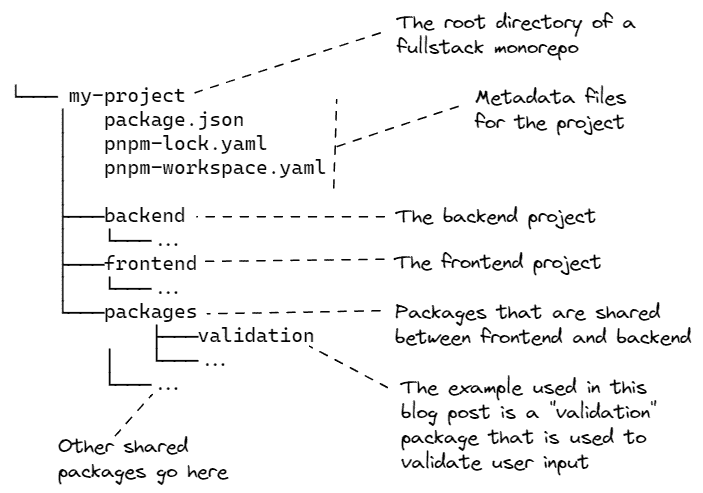
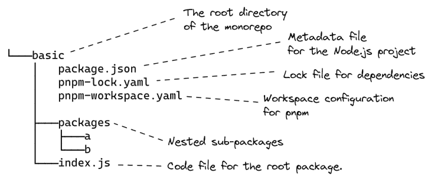
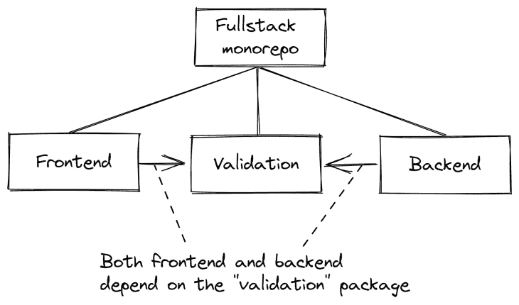

# 使用 pnpm 管理全栈、多包 monorepo

> 原文：<https://blog.logrocket.com/managing-full-stack-monorepo-pnpm/>

pnpm。有什么大惊小怪的？

pnpm 中的“p”代表“performant”——哇，它真的提供了性能！

和 npm 一起工作，我变得非常沮丧。它似乎变得越来越慢。处理越来越多的代码仓库意味着要进行更频繁的 npm 安装。我花了那么多时间坐着等它结束，想着，一定有更好的办法！

然后在同事的坚持下，我开始用 pnpm，一直没有回去。对于大多数新的(甚至一些旧的)项目，我已经用 pnpm 取代了 npm，我的工作生活因此变得更好了。

虽然我开始使用 pnpm 是因为它著名的性能(我并没有失望)，但我很快发现 pnpm 有许多工作区的特殊特性，这使得它非常适合管理多包 [monorepo](https://en.wikipedia.org/wiki/Monorepo) (甚至是多包 [meta repo](https://github.com/mateodelnorte/meta) )。

在这篇博文中，我们将通过以下几节来探讨如何使用 pnpm 来管理我们的全栈、多包 monorepo:

1.  [什么是全栈式多包 monorepo？](#full-stack-multi-package-monorepo)
2.  [创建一个基本的多包 monorepo](#creating-basic-monorepo)
    1.  [安装 Node.js 和 pnpm](#install-nodejs-pnpm)
    2.  [创建根项目](#create-root-project)
    3.  [创建一个嵌套的子包](#create-nested-sub-package)
    4.  [我们基本单一回购的布局](#layout-basic-monorepo)
3.  [在全栈 JavaScript monorepo 中共享代码](#sharing-code-full-stack-javascript-monorepo)
    1.  [检查我们的项目结构](#examining-project-structure)
    2.  [在 JavaScript 中运行所有包的脚本](#running-scripts-packages-javascript)
    3.  [`--stream`标志是做什么的？](#stream-flag)
    4.  [在特定包上运行脚本](#running-scripts-packages)
4.  [在全栈 TypeScript monorepo 中共享类型](#sharing-types-typescript)
    1.  [项目间共享类型定义](#sharing-type-definitions)
    2.  [运行 TypeScript 中所有包的脚本](#running-scripts-packages)
5.  pnpm 是如何工作的？

如果你只关心 pnpm 和 npm 相比如何，请直接跳到[第 5 节](#how-does-pnpm-work)。

## 1.什么是全栈多包 monorepo？

那么我们到底在谈论什么呢？让我来分解一下。

这是一个*回购*，因为它是一个代码库。在这种情况下，我们谈论的是 Git 代码库，Git 是卓越的主流版本控制软件。

这是一个 *monorepo* 因为我们已经将多个(子)项目打包到一个代码库中，通常是因为它们由于某种原因属于一起，并且我们同时对它们进行工作。

代替单一回购，它也可以是一个*元回购*，一旦它变得太大太复杂，这是你的单一回购的一个很好的下一步——或者，例如，你想把它分开，每个项目有单独的 CI/CD 管道。

我们可以通过将每个子项目拆分成自己的存储库，然后使用元工具将它们重新组合在一起，从而从 monorepo 过渡到 meta repo。元回购具有单一回购的便利，但允许我们为每个子项目拥有单独的代码回购。

这是*多重包装*，因为我们在回购中有一个或多个包装。Node.js 包是一个项目，其根目录下有一个 p `ackage.json`元数据文件。通常，要在多个项目之间共享一个包，我们必须将它发布给 [npm](https://www.npmjs.com/) ，但是如果这个包只在少数项目之间共享，这将是大材小用，特别是对于专有或闭源项目。

是*全栈*，因为我们的回购包含一个全栈项目。monorepo 包含前端和后端组件、一个基于浏览器的 UI 和一个 REST API。我认为这是展示 pnpm 工作空间好处的最好方式，因为我可以向您展示如何在 monorepo 中的前端和后端项目之间共享一个包。

下图显示了典型全堆栈、多封装 monorepo 的布局:

当然，pnpm 非常灵活，这些工作区可以以许多不同的方式使用。

其他一些例子:

*   我现在将 pnpm 用于我公司的闭源微服务 meta repo
*   我还用它来管理我的开源数据伪造笔记本项目，该项目包含浏览器和电子共享包的项目，所有这些都包含在 monorepo 中

## 2.创建基本的多包 monorepo

这篇博客文章附带了工作代码，你可以在 GitHub 上亲自试用。你也可以在这里下载压缩文件，或者使用 Git 克隆代码库:

```
git clone [email protected]:ashleydavis/pnpm-workspace-examples.git

```

现在，打开终端并导航到目录:

```
cd pnpm-workspace-examples

```

让我们从使用 pnpm 创建一个简单的多包 monorepo 开始，只是为了学习基础知识。

如果这看起来太基础，请[直接跳到第 3 节](#sharing-code-full-stack-javascript-monorepo)看更实际的全栈单回购。

下面是我们将创建的简单结构:


我们有一个工作区，其中包含一个根包以及子包 A 和 b。为了演示 monorepo 中的依赖关系:

*   根工作空间依赖于包 A 和包 B
*   包 B 依赖于包 A

让我们学习如何为我们的项目创建这个结构。

### 安装 Node.js 和 pnpm

要尝试这些代码，你首先需要安装 Node.js。如果你还没有 Node.js，请按照他们网页上的说明[操作。](https://nodejs.org/en/)

在我们使用 pnpm 做任何事情之前，我们还必须安装它:

```
npm install -g pnpm
```

根据您的操作系统，有许多其他方法可以安装 pnpm 。

### 创建根项目

现在让我们创建我们的根项目。我们将把我们的项目*称为 basic* ，它[与你可以在 GitHub](https://github.com/ashleydavis/pnpm-workspace-examples/tree/main/basic) 中找到的代码一致。第一步是为项目创建一个目录:

```
mkdir basic

```

或者在 Windows 上:

```
md basic

```

我从现在开始就用`mkdir`好了；如果你在 Windows 上，请记得用`md`代替。

现在，转到该目录并为我们的根项目创建`package.json`文件:

```
cd basic
pnpm init

```

在许多情况下，pnpm 就像常规的老式 npm 一样使用。例如，我们将包添加到项目中:

```
pnpm install dayjs

```

注意，这会生成一个与 npm 的 package-lock.json 文件相对的`pnpm-lock.yaml`文件作为[。您需要将这个生成的文件提交给版本控制。](https://blog.logrocket.com/javascript-package-managers-compared)

然后，我们可以在代码中使用这些包:

```
const dayjs = require("dayjs");

console.log(dayjs().format());

```

然后我们可以使用 Node.js 运行我们的代码:

```
node index.js

```

到目前为止，pnpm 与 npm 没有任何不同，除了(在这个小例子中，您可能不会注意到)它比 npm 快得多。随着我们项目规模的增长和依赖项数量的增加，这一点会变得更加明显。

### 创建嵌套的子包

pnpm 有一个“工作区”工具，我们可以用它在 monorepo 中创建包之间的依赖关系。为了用 *basic* 示例进行演示，我们将创建一个名为 A 的子包，并从根包中创建对它的依赖。

为了让 pnpm 知道它正在管理子包，我们向我们的根项目添加了一个`[pnpm-workspace.yaml](https://github.com/ashleydavis/pnpm-workspace-examples/blob/main/basic/pnpm-workspace.yaml)`文件:

```
packages:
- "packages/*"

```

这向 pnpm 表明,`packages`目录下的任何子目录都可以包含子包。

现在让我们为包 A 创建`packages`目录和子目录:

```
cd packages
mkdir a
cd a 

```

现在我们可以为包`A`创建`package.json`文件:

```
pnpm init

```

我们将用导出的函数为包 a 创建一个简单的代码文件，我们可以从根包中调用它:

```
function getMessage() {
    return "Hello from package A";
}

module.exports = {
    getMessage,
};

```

接下来，更新根包的`package.json`，以添加对包 a 的依赖。

```
"a": "workspace:*",

```

更新后的`package.json`文件如下所示:

```
{
  "name": "basic",
    ...
  "dependencies": {
    "a": "workspace:*",
    "dayjs": "^1.11.2"
  }
}

```

既然我们已经将我们的根包链接到子包 A，我们可以在我们的根包中使用包 A 中的代码:

```
const dayjs = require("dayjs");
const a = require("a");

console.log(`Today's date: ${dayjs().format()}`);
console.log(`From package a: ${a.getMessage()}`);

```

请注意我们是如何引用包 a 的。如果没有工作区，我们可能会使用如下的相对路径:

```
const a = require("./packages/a");

```

相反，我们通过名称引用它，就好像它安装在[节点包存储库](https://www.npmjs.com/)的`node_modules`下一样:

```
const a = require("a");
```

通常，为了实现这一点，我们必须将我们的包发布到节点包存储库中(公开地或秘密地)。为了方便地重用而被迫发布一个包会导致一个痛苦的工作流，尤其是当您只在一个 monorepo 中重用这个包的时候。在第 5 节中，我们将讨论让共享这些包而不发布它们成为可能的魔法。

在我们的终端中，我们再次导航回根项目的目录，并调用`pnpm install`将根包链接到子包:

```
cd ...
pnpm install
```

现在我们可以运行我们的代码，看看效果:

```
node index.js

```

请注意如何从包 A 中检索消息并显示在输出中:

```
From package a: Hello from package A

```

这显示了根项目如何使用子包中的函数。

### 我们基本 monorepo 的布局

我们可以像添加包 a 一样将包 B 添加到我们的 monorepo 中，你可以在示例代码中的基本目录下看到最终结果[。](https://github.com/ashleydavis/pnpm-workspace-examples/tree/main/basic)

下图显示了带有包 A 和包 B 的基本项目的布局:

我们已经学会了如何创建一个基本的 pnpm 工作区！让我们继续研究更高级的全栈 monorepo。

## 3.在全栈 JavaScript monorepo 中共享代码

对全栈项目使用 monorepo 非常有用，因为它允许我们将后端和前端组件的代码放在同一个存储库中。这很方便，因为后端和前端通常是紧密耦合的，应该一起变化。使用 monorepo，我们可以对两个组件进行代码更改，并提交到一个代码库中，同时更新两个组件。推动我们的提交然后触发我们的连续交付管道，它同时将前端和后端部署到我们的生产环境中。

使用 pnpm 工作空间很有帮助，因为我们可以创建嵌套包，在前端和后端之间共享。我们将在这里讨论的示例共享包是一个验证代码库，前端和后端都使用它来验证用户的输入。

您可以在此图中看到，前端和后端本身都是包，并且都依赖于验证包:



请亲自尝试全栈回购:

```
cd fullstack
pnpm install
pnpm start

```

通过将浏览器导航到`[http://localhost:1234/](http://localhost:1234/)`打开前端。

您应该会在待办事项列表中看到一些项目。尝试输入一些文本，然后单击**添加待办事项**将项目添加到您的待办事项列表中。

看看如果您不输入文本并点击**添加待办事项**会发生什么。尝试向列表中添加空的待办事项时，会在浏览器中显示警告；前端的验证库已阻止您添加无效的待办事项。

如果你愿意，可以绕过前端，直接打 REST API，在后端使用[VS 代码 REST 客户端脚本，添加一个无效的待办事项。然后，后端的验证库做同样的事情:它拒绝无效的待办事项。](https://github.com/ashleydavis/pnpm-workspace-examples/blob/main/fullstack/backend/test/backend.http)

### 检查我们的项目结构

在[全栈项目](https://github.com/ashleydavis/pnpm-workspace-examples/tree/main/fullstack)中，`[pnpm-workspace.yaml](https://github.com/ashleydavis/pnpm-workspace-examples/blob/main/fullstack/pnpm-workspace.yaml)`文件包含后端和前端项目作为子包:

```
packages:
  - backend
  - frontend
  - packages/*

```

在`packages`子目录下，您可以找到前端和后端共享的验证包。作为一个例子，这里的`[package.json from the backend](https://github.com/ashleydavis/pnpm-workspace-examples/blob/main/fullstack/backend/package.json)`展示了它对验证包的依赖:

```
{
    "name": "backend",
    ...
    "dependencies": {
        "body-parser": "^1.20.0",
        "cors": "^2.8.5",
        "express": "^4.18.1",
        "validation": "workspace:*"
    }
}

```

前端使用验证包来验证新的待办事项是否有效，然后将其发送到后端:

```
const validation = require("validation");
// ...

async function onAddNewTodoItem() {
    const newTodoItem = { text: newTodoItemText };
    const result = validation.validateTodo(newTodoItem);
    if (!result.valid) {
        alert(`Validation failed: ${result.message}`);
        return;
    }

    await axios.post(`${BASE_URL}/todo`, { todoItem: newTodoItem });
    setTodoList(todoList.concat([ newTodoItem ]));
    setNewTodoItemText("");
}

```

后端也使用验证包。在前端和后端都验证用户输入总是一个好主意，因为您永远不知道用户什么时候会绕过您的前端，直接访问您的 REST API。

喜欢的话可以自己试试这个。在[full stack/back end/test/back end . http](https://github.com/ashleydavis/pnpm-workspace-examples/blob/main/fullstack/backend/test/backend.http)下的示例代码库中查找一个 [VS Code REST 客户端](https://marketplace.visualstudio.com/items?itemName=humao.rest-client)脚本，该脚本允许您用一个无效的待办事项触发 REST API。使用该脚本直接触发 HTTP `POST`路由，将项目添加到待办事项列表中。

您可以在后端代码中看到它如何使用验证包来拒绝无效的待办事项:

```
// ...

app.post("/todo", (req, res) => {

    const todoItem = req.body.todoItem;
    const result = validation.validateTodo(todoItem)
    if (!result.valid) {
        res.status(400).json(result);
        return;
    }

    //
    // The todo item is valid, add it to the todo list.
    //
    todoList.push(todoItem);
    res.sendStatus(200);
});

// ...

```

### 用 JavaScript 在所有包上运行脚本

pnpm 对于管理多包 monorepo 非常有用的一点是，您可以使用它在嵌套包中递归地运行脚本。

要了解这是如何设置的，请看一下[根工作区的 package.json 文件](https://github.com/ashleydavis/pnpm-workspace-examples/blob/main/fullstack/package.json)中的脚本部分:

```
{
    "name": "fullstack",
    ...
    "scripts": {
      "start": "pnpm --stream -r start",
      "start:dev": "pnpm --stream -r run start:dev",
      "clean": "rm -rf .parcel-cache && pnpm -r run clean"
    },
    ...
}

```

让我们看一下脚本`start:dev`，它用于在开发模式下启动应用程序。下面是来自`package.json`的完整命令:

```
pnpm --stream -r run start:dev

```

`-r`标志使 pnpm 对工作区中的所有包运行`start:dev`脚本——至少是所有有`start:dev`脚本的包！它不会在没有实现它的包中运行，比如验证包，它不是一个可启动的包，所以它不需要那个脚本。

前端和后端包确实实现了`start:dev`，所以当您运行这个命令时，它们都将被启动。我们可以发出这个命令，同时启动我们的前端和后端！

### `--stream`旗是做什么的？

`--stream`启用流输出模式。这只是让 pnpm 在您的终端中连续显示每个包的脚本的完整和交叉输出。这是可选的，但我认为这是同时轻松查看前端和后端所有输出的最佳方式。

不过，我们不必运行完整的命令，因为那是工作区的`package.json`中的`start:dev`所做的。因此，在我们的工作空间的根，我们可以简单地调用这个命令，以开发模式启动我们的后端和前端:

```
pnpm run start:dev

```

### 在特定包上运行脚本

有时能够在特定的子包上运行一个脚本也很有用。您可以使用 pnpm 的`--filter`标志来实现这一点，该标志将脚本指向所请求的包。

例如，在根工作区中，我们可以只为前端调用`start:dev`，就像这样:

```
pnpm --filter frontend run start:dev

```

我们可以使用`--filter`标志将任何脚本指向任何子包。

## 4.在全堆栈类型脚本 monorepo 中共享类型

在我们的 monorepo 中共享代码库的一个最好的例子是在一个 TypeScript 项目中共享类型。

[全栈 TypeScript 示例项目](https://github.com/ashleydavis/pnpm-workspace-examples/tree/main/typescript)与之前的全栈 JavaScript 项目具有相同的结构，我只是将它从 JavaScript 转换为 TypeScript。TypeScript 项目还在前端和后端项目之间共享一个验证库。

但是，不同之处在于 TypeScript 项目也有类型定义。特别是在这种情况下，我们使用了[接口](https://blog.logrocket.com/interfaces-in-typescript-what-are-they-and-how-do-we-use-them-befbc69b38b3/)，我们希望在前端和后端之间共享这些类型。然后，我们可以确定它们对于在它们之间传递的数据结构是一致的。

请亲自尝试一下全栈 TypeScript 项目:

```
cd typescript
pnpm install
pnpm start

```

通过将浏览器导航到`[http://localhost:1234/](http://localhost:1234/)`打开前端。

现在，与全栈 JavaScript 示例一样，您应该看到一个待办事项列表，并能够向其中添加待办事项。

### 在项目之间共享类型定义

验证库的 TypeScript 版本包含定义前端和后端之间共享的公共数据结构的接口:

```
//
// Represents an item in the todo list.
//
export interface ITodoItem {
    //
    // The text of the todo item.
    //
    text: string;
}

//
// Payload to the REST API HTTP POST /todo.
//
export interface IAddTodoPayload {
    //
    // The todo item to be added to the list.
    //
    todoItem: ITodoItem;
}

//
// Response from the REST API GET /todos.
//
export interface IGetTodosResponse {
    //
    // The todo list that was retrieved.
    //
    todoList: ITodoItem[];
}

// ... validation code goes here ...

```

这些类型在验证库中的`[index.ts file](https://github.com/ashleydavis/pnpm-workspace-examples/blob/main/typescript/packages/validation/src/index.ts)`中定义，并在前端用于验证我们在编译时通过 HTTP `POST`发送到后端的数据结构:

```
async function onAddNewTodoItem() {
    const newTodoItem: ITodoItem = { text: newTodoItemText };
    const result = validateTodo(newTodoItem);
    if (!result.valid) {
        alert(`Validation failed: ${result.message}`);
        return;
    }

    await axios.post<IAddTodoPayload>(
          `${BASE_URL}/todo`, 
          { todoItem: newTodoItem }
      );
    setTodoList(todoList.concat([ newTodoItem ]));
    setNewTodoItemText("");
}

```

这些类型也在后端用于验证(同样，在编译时)我们通过 HTTP `POST`从前端接收的数据的结构:

```
app.post("/todo", (req, res) => {

    const payload = req.body as IAddTodoPayload;
    const todoItem = payload.todoItem;
    const result = validateTodo(todoItem)
    if (!result.valid) {
        res.status(400).json(result);
        return;
    }

    //
    // The todo item is valid, add it to the todo list.
    //
    todoList.push(todoItem);
    res.sendStatus(200);
});

```

我们现在对前端和后端之间共享的数据结构进行了一些编译时验证。当然，这是我们使用 TypeScript 的原因。编译时验证有助于防止编程错误——它为我们自己提供了一些保护。

然而，我们仍然需要运行时保护来防止用户的误用，无论是意外的还是恶意的，您可以看到对`validateTodo`的调用仍然存在于前面的两个代码片段中。

### 在 TypeScript 中对所有包运行脚本

全栈 TypeScript 项目包含另一个在所有子包上运行脚本的好例子。

当使用 TypeScript 时，我们经常需要构建我们的代码。这是开发过程中发现错误的有用检查，也是将代码发布到产品中的必要步骤。

在这个例子中，我们可以构建所有的 TypeScript 项目(我们有三个单独的 ts 项目！)在我们这样的 monorepo 中:

```
pnpm run build

```

如果您查看 TypeScript 项目的 [`package.json`文件](https://github.com/ashleydavis/pnpm-workspace-examples/blob/main/typescript/package.json)，您会看到`build`脚本是这样实现的:

```
pnpm --stream -r run build

```

这会在每个嵌套的 TypeScript 项目上运行`build`脚本，为每个项目编译代码。

同样，`--stream`标志从每个子脚本产生流交错输出。与默认选项相比，我更喜欢这个选项，默认选项单独显示每个脚本的输出，但有时它会折叠输出，这会导致我们错过重要的信息。

另一个很好的例子是`clean`脚本:

```
pnpm run clean

```

没有什么比亲自尝试来建立理解更好的了。您应该尝试在您自己的全栈 TypeScript 项目副本中运行这些`build`和`clean`命令。

## 5.pnpm 是如何工作的？

在我们结束之前，这里有一个 pnpm 与 npm 如何工作的简明摘要。如果你正在寻找一个更完整的图片，看看这篇文章。

pnpm 比 npm 快得多。有多快？显然，[根据基准测试](https://github.com/pnpm/benchmarks-of-javascript-package-managers)，快了 3 倍。我不知道那件事；对我来说，pnpm 感觉快 10 倍。这就是它给我带来的巨大变化。

pnpm 有一个非常有效的方法来存储下载的包。通常，npm 会为您安装在计算机上的每个项目提供一个单独的包副本。当您的许多项目将共享依赖项时，会浪费大量的磁盘空间。

pnpm 也有一个完全不同的存储方法。它将所有下载的包存储在主目录中的一个子目录下。从那里，它将包符号链接到需要它们的项目中，从而在所有项目中共享包。他们的工作方式看似简单，但却意义重大。

正如我们所看到的，pnpm 支持在工作区中共享包和针对子包运行脚本，这也很棒。npm 现在也提供了工作区，它们是可用的，但是用 npm 运行子包的脚本似乎不像用 pnpm 那么容易。请告诉我我是否遗漏了什么！

pnpm 也支持在一个项目中共享包，同样使用符号链接。它在`node_modules`下为每个共享包创建符号链接。npm 做了类似的事情，所以它并不真正令人兴奋，但我认为 pnpm 在这里胜出，因为它提供了更方便的方式来跨您的子包运行您的脚本。

## 结论

我一直在寻找成为更有效的开发者的方法。采用支持我的工具，避免阻碍我的工具，是成为快速开发人员的关键部分，也是我的新书 *[快速全栈开发](https://rapidfullstackdevelopment.com/)* 的主题。这就是我选择 pnpm 而不是 npm 的原因——它快得多，对我的工作效率产生了重要影响。

感谢您的阅读，我希望您能从 pnpm 中获得一些乐趣。[在 Twitter 上关注我](https://twitter.com/codecapers)获取更多类似内容！

## 您是否添加了新的 JS 库来提高性能或构建新特性？如果他们反其道而行之呢？

毫无疑问，前端变得越来越复杂。当您向应用程序添加新的 JavaScript 库和其他依赖项时，您将需要更多的可见性，以确保您的用户不会遇到未知的问题。

LogRocket 是一个前端应用程序监控解决方案，可以让您回放 JavaScript 错误，就像它们发生在您自己的浏览器中一样，这样您就可以更有效地对错误做出反应。

[](https://lp.logrocket.com/blg/javascript-signup)[https://logrocket.com/signup/](https://lp.logrocket.com/blg/javascript-signup)

[LogRocket](https://lp.logrocket.com/blg/javascript-signup) 可以与任何应用程序完美配合，不管是什么框架，并且有插件可以记录来自 Redux、Vuex 和@ngrx/store 的额外上下文。您可以汇总并报告问题发生时应用程序的状态，而不是猜测问题发生的原因。LogRocket 还可以监控应用的性能，报告客户端 CPU 负载、客户端内存使用等指标。

自信地构建— [开始免费监控](https://lp.logrocket.com/blg/javascript-signup)。