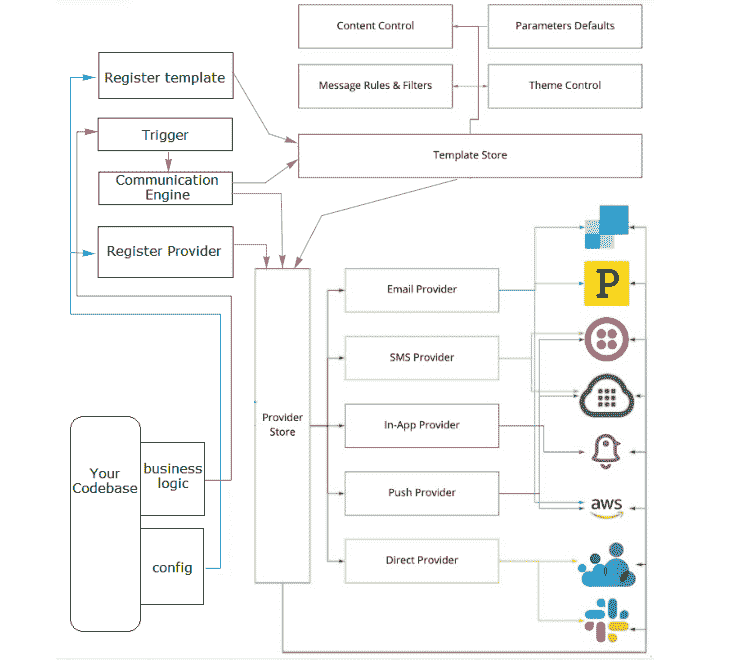

# 用 Notifire - LogRocket 博客管理多渠道通知流

> 原文：<https://blog.logrocket.com/managing-multi-channel-notification-streams-notifire/>

如今，用户更有可能从多个渠道接收信息。

这样做的根本原因是消费者希望能够根据自己的需求定制沟通渠道——这迫使开发人员跨代码库处理所有这些 API。通知有各种形状和大小；从 Reddit 到脸书，Twitter，等等。

对客户来说，通知代表了他们最喜欢的人、企业和兴趣的更新。因此，通知系统是网站开发者和 SaaS 营销人员将他们的商品呈现在相关人员面前的强有力的方法。

有大量的知识可用，但人们只有这么多的时间和能力来分享，这意味着只有最有吸引力的服务才能吸引他们的目标人群。

同时，跨在线浏览器和移动操作系统的原生通知系统的流行对于能够成功利用它们进行客户拓展的组织是有益的。这些及时的信息会对客户保持和参与绩效产生巨大影响。

在本文中，您将了解 Notifire，它是如何实现的，以及它在根据特定需求为目标终端用户提供机会方面的多功能性。

## 什么不是火？

Notifire 是一个强大的可定制的开源通知基础设施，它使用一个 API 来管理多渠道的事务通知。

Notifire 的优势和特点:

*   电子邮件、推送通知和 SMS 等所有消息服务都使用相同的 API
*   轻松管理多个渠道，如 Twilio、SendGrid、Slack 等
*   面向高级布局和设计的高度可定制、以模板为中心的引擎
*   缺失变量的内置保护
*   易于设置和集成
*   用可预测的静态类型用 TypeScript 编写
*   社区驱动和开源

## 架构和设置

Notifire 写在[类型脚本](https://blog.logrocket.com/whats-new-typescript-4-5/)中；你可以用 Notifire 在几分钟内创建一个通知层。

在深入实现之前，您需要理解库背后的架构，以便清楚地了解 Notifire 是如何增强通知的。

Notifire 的架构侧重于关注点的分离。根据这一原则，事务性沟通由许多独立的元素组成，每个元素负责某项工作。为了方便合并和维护额外的功能，必须对通信层进行建模。

看看下面的图表。



以下元素可确保向最终用户成功发送通知:

### 模板

模板充当蓝图，为每条消息提供框架或结构。每条消息都与一个特定的通道相关联，为该通道提供了内容模板和编码规则，如过滤器、优先级和其他影响给定消息传递的元数据。

### 提供者

提供者负责消息传递。他们负责通过指定的渠道向最终用户提供警报。Notifire 处理状态并协调所有特定于提供者的定制，因为每个提供者都是无状态的，并且符合指定的接口。

### 扳机

显示通知消息所需的变量和数据将由每个触发器发送。如果某个值不存在，变量保护模式被激活，消息被*而不是*发送。

触发器负责通知系统发生了事件，但不负责通知消息将在何时何地发送。

### 通信引擎

通信引擎负责读取模板配置、确定必要的通道、与提供商连接以及执行警报的传递。定时、优先级和信道都由通信引擎维护。

### 模板和提供程序存储

在运行时执行期间，这两层管理配置并保存在内存中以备将来使用。每个存储都提供接口来查询通信引擎要使用的提供者和模板。

## 基于模板的方法

让我们看看 Notifire 中基于模板的方法。

* * *

### 更多来自 LogRocket 的精彩文章:

* * *

模板包含消息传递所需的元数据。这些模板可以重复使用，并存储在模板库中以供访问。包含`subject`、`channel`、`template`和`active`开关等主要部分。

看看下面这个简单的例子:

```
const UpdateEmailTemplate = await notifire.registerTemplate({
  id: "update-email",
  messages: [
    {
      subject: "Your email update request",
      channel: ChannelTypeEnum.EMAIL,           // Email Channel
      template: `
        Hi {{firstName}}!

        To update your email, click <a href="{{emailLink}}">here.</a>

        {{#if organization}}
            
        {{/if}}
      `,
    },
    {
      channel: ChannelTypeEnum.SMS,             // SMS Channel
      template: ` 
        Hey {{firstName}}, here's the link to update your email: {{emailLink}}
        `,
      active: (trigger) => !trigger.$phone,
    },
  ],
});

```

如您所见，`messages`数组保存了一个通信信道列表和要发送给用户的相应消息细节。您可以通过包括类似于上述示例的特定于渠道的详细信息来个性化渠道体验。

`channel`指定用户需要被告知的媒介。基于选择的`channel`,从提供者存储中使用合适的提供者。

通道的例子可以是:`SMS`、`EMAIL`、`PUSH`、`DIRECT_MESSAGE`、`IN_APP`。每个用枚举值指定的`channel`保存其对象块，如上例所示。

`template`变量保存消息内容。Notifire 利用了[把手](https://handlebarsjs.com/)，因此您可以用把手表达式格式编写模板，如下例所示:

```
{{#each tasks}}
  {{title}}
  {{#if done}}
    <span> Done </span>
  {{/if}}
{{/each}}

```

`active`开关用于根据提供的布尔值决定是否发送消息。`active`也用于发送基于触发器的消息。

### 基于模板的方法的优势:

*   高度可定制和可重复使用的通信模板
*   具有可变保护的可扩展和防故障方法
*   根据变量、功能、条件和行为确定目标用户

## 整合您最喜欢的提供商

Notifire 为提供者提供了一个即插即用的解决方案，一旦加载到提供者存储的内存中，它通常会保持待机模式。让我们看看 Notifire 支持的提供者列表:

### 电子邮件

电子邮件是最常见和最广泛使用的沟通渠道之一。Notifire 提供了下面的接口来实现你自己版本的`channel`:

```
export interface IProvider {
  id: string;                       // ID of the template
  channelType: ChannelTypeEnum;     // Type of channel such as EMAIL
}

export interface IEmailOptions {
  to: string | string[];            // One or multiple recepients
  subject: string;                  // Subject of the email
  html: string;                     // Content body of the email
  from?: string;                    // Email ID of the sender
  text?: string;                    // Plain text content body of the email
}

export interface IEmailProvider extends IProvider {
  channelType: ChannelTypeEnum.EMAIL;

  sendMessage(options: IEmailOptions): Promise<any>;        // Method to be overridden to send email message
}

```

目前支持流行的电子邮件提供商，包括 SendGrid、Mailgun、AWS SES、邮戳、NodeMailer、Mailjet、Mandrill、SendinBlue、EmailJS，支持的提供商数量还在不断增加。

要注册特定的电子邮件提供者，您需要将它注册到 Notifire 库，如下所示:

```
import { SESEmailProvider } from "@notifire/ses"        // Import your required provider

const provider = new SESEmailProvider({                 // Declare your provider
    region: "eu-west-1",                                ////
    accessKeyId: "AWS_ACCESS_KEY_ID",                   ////    Provide configuration details to register your provider
    secretAccessKey: "AWS_SECRET_ACCESS_KEY",           ////
    from: "[email protected]",                             ////
});                                                     //

import { MailgunEmailProvider } from '@notifire/mailgun';   // Mailgun email provider

const provider = new MailgunEmailProvider({
  apiKey: process.env.MAILGUN_API_KEY,
  domain: process.env.MAILGUN_DOMAIN,
  username: process.env.MAILGUN_USERNAME,
});

import { SendinblueEmailProvider } from './sendinblue.provider';    //  SendinBlue email provider

const provider = new SendinblueEmailProvider({
  apiKey: process.env.SENDINBLUE_API_KEY
});

```

### 短信

就像电子邮件一样，Notifire 也允许短信提供商。下面是用于实现 SMS 提供程序的接口:

```
export interface IProvider {
  id: string;                           // ID of the template
  channelType: ChannelTypeEnum;         // Type of communication channel
}

export interface ISmsOptions {
  to: string;                           // Number on which SMS needs to be sent
  content: string;                      // Content body to be sent in the SMS
  from?: string;                        // Number of the sender
}

export interface ISmsProvider extends IProvider {
  sendMessage(options: ISmsOptions): Promise<any>;      // Method to be overridden to send email message

  channelType: ChannelTypeEnum.SMS;
}

```

目前支持包括 Twilio、AWS SNS 和 Plivo 在内的流行短信提供商，支持的短信提供商数量也在增长。要注册特定的 SMS 提供程序，您需要将它注册到 Notifire 库，如下所示:

```
import { TwilioSmsProvider } from '@notifire/twilio';   // Twilio SMS provider

const provider = new TwilioSmsProvider({
  accountSid: process.env.TWILIO_ACCOUNT_SID,
  authToken: process.env.TWILIO_AUTH_TOKEN,
  from: process.env.TWILIO_FROM_NUMBER,                 // a valid twilio phone number
});

import { SNSSmsProvider } from "@notifire/sns"          // AWS SNS provider

const provider = new SNSSmsProvider({
    region: "eu-west-1",
    accessKeyId: "AWS_ACCESS_KEY_ID",
    secretAccessKey: "AWS_SECRET_ACCESS_KEY",
});

import { PlivoSmsProvider } from '@notifire/plivo';      // Plivo SMS provider

const provider = new PlivoSmsProvider({
  accountSid: process.env.PLIVO_ACCOUNT_ID,
  authToken: process.env.PLIVO_AUTH_TOKEN,
  from: process.env.PLIVO_FROM_NUMBER,
});

```

### 更多提供商

如您所见，根据您的需要即插即用您最喜欢的提供商是很简单的；您需要做的就是使用配置向 Notifire 注册提供程序，并开始使用声明的模板。

除了电子邮件和短信提供商，Notifire 将来还会扩展，允许设置直接消息、推送通知和应用内消息的提供商。

这将包括 Slack、微软团队、Discord、PagerDuty、AWS SNS 等提供商。

## 扩展您的实施

如今，许多组织使用各种不同的沟通平台，随着此类平台的不断增加，事情开始变得混乱。Notifire 通过在架构中使用模板等组件，非常聪明地解决了这个问题。

当扩展您的产品或服务时，您的实现还需要处理用户和通信的规模。

下面是一些您应该遵循的最佳实践，以确保为您的用户提供良好的体验。

### 避免使用通用内容

在推送消息中使用一般的、冗长的、非个人化的材料是一个严重的错误，会让接收者不知所措、心烦意乱。这种警告可能导致与该特定推送消息链接的移动应用被卸载。

### 避免轰炸你的用户

在没有足够的商业智能(BI)和消费者行为分析的情况下发送通知或通信可能会导致糟糕的用户体验，并且您可能会以不相关的用户为目标。

### 避免在不恰当的时间锁定目标

营销人员在使用推送通知时最常犯的一个错误是在错误的时间发送。在繁忙的工作时间或深夜发送信息不是一个好主意。这可能会激怒用户，结果他们可能会停止使用你的产品或服务。

### 利用个性化

在许多情况下，营销人员会在没有对行为特征、个人数据、位置信息和客户兴趣进行充分的行为分析的情况下发送通用通知，从而犯下这种错误。

有几种用户以不同的方式响应警报。绝大多数用户，57%的用户阅读并打开应用程序，如果信息是适当定制的，他们会立即回答。

### 发送欢迎通知

当用户完全加入后，你可以向他们发送一条欢迎他们加入应用的推送通知。或者，你可以给他们提供一张你提供的产品的折扣券，让他们有一个好的开始。同样，作为一名试用者，给他们提供一些免费的好东西——任何能让他们体验你的软件并吸引他们更多使用它的东西。

## 结论

在当今的数字市场中，通过适当的通知和沟通来锁定用户是至关重要的。

不言而喻，通知已经超越了应用程序、产品、服务及其用户之间的所有其他通信模式。

因此，现代组织的存在需要强大的通知策略。

Notifire 提供了一个平台，以惊人的能力构建和扩展您的通知基础设施。

随着用例的增长和扩展，Notifire 将为您提供大量的选项和提供者实现，以便无缝地集成到您的工作流中。

该解决方案旨在为具有良好能力的开发人员提供一个便捷的解决方案。

## 使用 [LogRocket](https://lp.logrocket.com/blg/signup) 消除传统错误报告的干扰

[](https://lp.logrocket.com/blg/signup)

[LogRocket](https://lp.logrocket.com/blg/signup) 是一个数字体验分析解决方案，它可以保护您免受数百个假阳性错误警报的影响，只针对几个真正重要的项目。LogRocket 会告诉您应用程序中实际影响用户的最具影响力的 bug 和 UX 问题。

然后，使用具有深层技术遥测的会话重放来确切地查看用户看到了什么以及是什么导致了问题，就像你在他们身后看一样。

LogRocket 自动聚合客户端错误、JS 异常、前端性能指标和用户交互。然后 LogRocket 使用机器学习来告诉你哪些问题正在影响大多数用户，并提供你需要修复它的上下文。

关注重要的 bug—[今天就试试 LogRocket】。](https://lp.logrocket.com/blg/signup-issue-free)