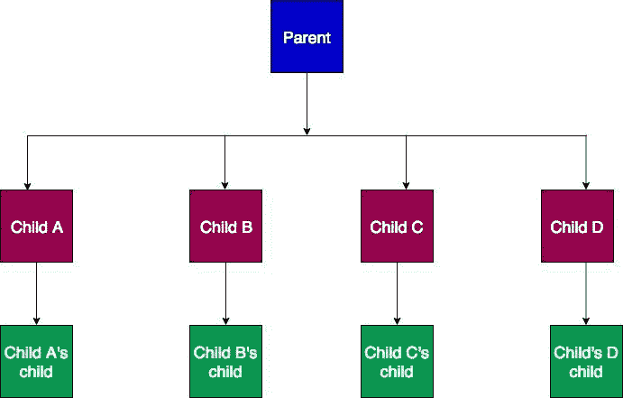

# 使用 Vuex 管理多个商店模块

> 原文：<https://blog.logrocket.com/managing-multiple-store-modules-vuex/>

***编者按:**本文于 2022 年 5 月 10 日更新，以更准确地反映 Vuex 的功能，并修复一个误导性的标题。*

## 介绍

当在 Vue 中构建复杂的 web 应用程序时，您可能会遇到这样的情况:您需要在组件的深层嵌套层次结构中共享数据，并且您希望使用 [Vuex](https://blog.logrocket.com/consume-apis-with-vuex-pinia-axios/) 来管理状态。在这种情况下，使用“[关注点分离](https://en.wikipedia.org/wiki/Separation_of_concerns)”概念是有意义的，方法是将您的 Vuex 商店分成模块，从而抽象出将所有逻辑放在一个商店中的复杂性。

Vuex 模块本质上是小型、独立的 Vuex 商店，它们组合成一个更大的中央 Vuex 商店。这使得管理它们变得更加容易，这也是 Vuex 开发人员应该具备的技能。

在本文中，我们将学习如何使用 Vuex 管理多个商店模块。

### 很高兴见到你

## 为什么是 Vuex？

在一个只有几个组件的简单 Vue 应用程序中，可以使用[道具](https://vuejs.org/guide/components/props.html)和[组件事件](https://vuejs.org/guide/components/events.html#emitting-and-listening-to-events)来实现数据共享。然而，当您的组件开始逐步增长时，建议引入一个状态管理包，作为一个独立的服务来管理应用程序中跨组件的数据，以避免“钻取”

当数据通过层次结构中每一层的每个组件传递直到到达目的地时，就会发生适当的钻探。这本身就是一个问题，因为你最终会写出更多重复和难以阅读的代码。

那么，在嵌套组件之间共享数据的最佳方式是什么呢？



这就是 Vuex 的用武之地。Vuex 充当应用程序中所有组件的中央存储。无论应用程序中有多少嵌套组件，任何组件都可以访问该存储。

问题是，默认情况下，Vuex 存储由一个大对象组成，其中包含我们应用程序的所有`state`、`mutations`、`actions`和`getters`。这可能会导致我们的应用程序变得臃肿，因为它增加了大小和复杂性。

为了使 Vuex 商店更容易扩展，可以将其分成多个模块。每个模块可以有自己的`state`、`mutations`、`getters`和`actions`。我们甚至可以嵌套模块。

## 入门指南

使用以下任一选项，可以轻松地将 Vuex 添加到项目中:

首先，通过 CDN(内容交付网络)

对于这种方法，您可以简单地将脚本插入到您的`.html`文件的 head 标签之间:

```
<script src="https://unpkg.com/[email protected]/dist/vuex.global.js"></script>

```

记得在 Vue 脚本之后添加 Vuex 脚本，如下所示:

```
<script src="/path/to/vue.js"></script>
<script src="/path/to/vuex.js"></script>

```

其次是 npm 或纱线。如果您正在构建一个复杂的应用程序，强烈推荐使用这种方法:

```
npm install [email protected] --save
#OR Yarn
yarn add [email protected] --save

```

要使用 npm 或 yarn 设置 Vuex，在`src`文件夹的根目录下创建一个`store`文件夹，并在其中创建一个名为`index.js`的文件。

在我们访问 Vuex 的属性之前，Vue 需要知道外部资源，然后才能使用它。在位于`src`文件夹内的`main.js`文件中添加以下代码:

```
import { createApp } from 'vue'
import App from './App.vue'
import store from "./store";

createApp(App)
.use(store)
.mount('#app')

```

接下来，在商店`folder`中创建一个`modules`文件夹，并添加文件`jokes.js`和`crypto.js`。对于本教程，我们的商店将由这两个模块组成。

`jokes.js`模块将从 [Chuck Norris 笑话 API](https://api.chucknorris.io/) 获取笑话，而`crypto.js`模块将从 [Coincap API](https://docs.coincap.io/) 获取加密货币数据。

为了让我们的模块工作，我们需要在中央存储中配置它们，这是我们的`index.js`文件。像这样导入模块:

```
//store/index.js

import { createStore } from 'vuex'
import jokes from './modules/jokes'
import crypto from './modules/crypto'

export default createStore({
    modules: {
        jokes,
        crypto
    },
})

```

## 创建 Vuex 模块

在这一节中，我们将更新我们的空模块文件，以包含从各种 API 获取数据的代码。

创建一个模块与普通的中央 Vuex 商店没有什么不同。语法基本相同，只是我们没有在模块中创建新的 store 实例。相反，我们将包含其所有属性的对象导出到中央存储实例中:

```
// modules/crypto.js

export default {
    namespaced: true,
    state: {
        data: {},
    },
    getters: {
        data: state => state.data,
    },
    actions: {
        async getData({commit }) {
            const data = await fetch('https://api.coincap.io/v2/assets');
            commit('SET_DATA', await data.json());
        },
    },
    mutations: {
        SET_DATA(state, data) {
            state.data = data;
        },
    }
}

// modules/jokes.js

export default {
    namespaced: true,
    state: {
        data: {},
    },
    getters: {
        data: state => state.data,
    },
    actions: {
        async getData({commit }) {
            const data = await fetch('http://api.icndb.com/jokes/random/15');
            commit('SET_DATA', await data.json());
        },
    },
    mutations: {
        SET_DATA(state, data) {
            state.data = data;
        },
    }
}

```

上面，我们给模块对象添加了属性`namespaced:true`,这样我们的模块就可以是自包含的和可重用的。给模块命名也有助于防止命名问题，因为您可以为您的状态、变异和动作重用相同的名称，而不会导致任何错误。

## 从模板访问 Vuex 模块

在这一节中，我们将讨论如何访问模板文件中的存储模块。

我们将使用`App.vue`文件来获取和显示从我们的每个存储模块获得的数据，如下所示:

```
// App.vue

<template>
  <div id="app">
    
    <div>
      <button @click="jokeData">Get Jokes</button>
      <button @click="cryptoData">Get Crypto Data</button>
    </div>
    <div class="display">
      <pre>{{ jokes.data }}</pre>
      <pre>{{ crypto.data }}</pre>
    </div>
  </div>
</template>
<script>
import { mapState } from "vuex";
export default {
  name: "App",
  computed: {
    ...mapState(["jokes", "crypto"]),
  },
  methods: {
    jokeData() {
      this.$store.dispatch("jokes/getData");
    },
    cryptoData() {
      this.$store.dispatch("crypto/getData");
    },
  },
};
</script>

```

在上面的代码中，有两种方法用于从我们的每个存储模块中获取数据。因为我们已经将`namespaced`属性设置为`true`，为了从存储中访问数据，我们必须在动作名称前面加上一个正斜杠作为模块名称的前缀，以便成功地调度它。

然后，为了从存储模块中获取状态，我们使用 Vuex `mapstate`助手，然后在模板上显示每个模块的状态中存储的数据。

## 结论

Vuex 让您可以根据自己的项目结构灵活地管理多个商店模块。我们也可以选择对动作、突变和 getters 使用相同的名称，只要您将`namespaced`属性设置为 true。

你可以在这里了解更多关于 Vuex 模块[的信息。](https://vuex.vuejs.org/guide/modules.html)

## 像用户一样体验您的 Vue 应用

调试 Vue.js 应用程序可能会很困难，尤其是当用户会话期间有几十个(如果不是几百个)突变时。如果您对监视和跟踪生产中所有用户的 Vue 突变感兴趣，

[try LogRocket](https://lp.logrocket.com/blg/vue-signup)

.

[](https://lp.logrocket.com/blg/vue-signup)[https://logrocket.com/signup/](https://lp.logrocket.com/blg/vue-signup)

LogRocket 就像是网络和移动应用程序的 DVR，记录你的 Vue 应用程序中发生的一切，包括网络请求、JavaScript 错误、性能问题等等。您可以汇总并报告问题发生时应用程序的状态，而不是猜测问题发生的原因。

LogRocket Vuex 插件将 Vuex 突变记录到 LogRocket 控制台，为您提供导致错误的环境，以及出现问题时应用程序的状态。

现代化您调试 Vue 应用的方式- [开始免费监控](https://lp.logrocket.com/blg/vue-signup)。