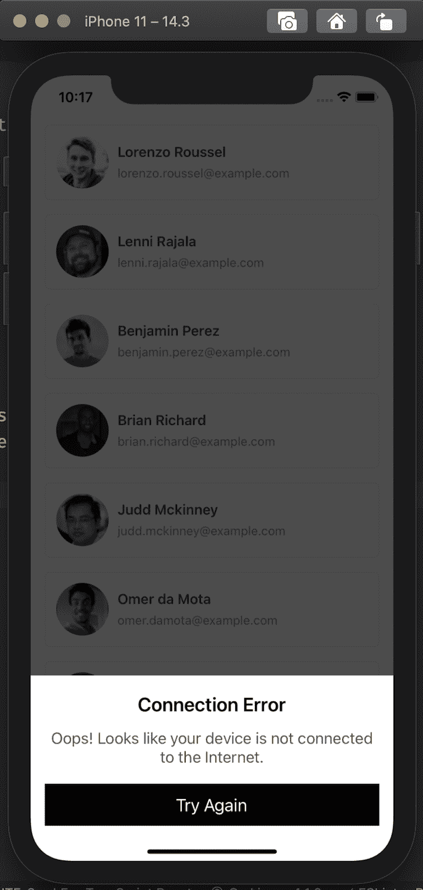

# 在 React Native - LogRocket 博客中管理网络连接状态

> 原文：<https://blog.logrocket.com/managing-network-connection-status-in-react-native/>

在本指南中，您将了解如何通过利用`NetInfo`获取网络连接信息，并利用`axios`向公共 API 发出网络请求，来优雅地处理 React 本机应用程序中的网络连接状态更改。

对于我们这些参与移动应用程序开发的人来说，考虑那些可能无法访问互联网或网络连接不良，但仍然希望访问您的应用程序的用户，已经迅速成为一个优先事项。让你的应用在面对未知连接时具有弹性，可以极大地改善用户体验，从而提高用户保留率。

## 入门指南

在我们开始演示之前，我们必须首先通过运行以下命令创建一个 React 本地项目:

```
npx react-native init MyOfflineApp

```

在我的例子中，项目的名称是“MyOfflineApp”，但是您可以根据自己的喜好更改它。

接下来，进入项目文件夹并安装所需的 npm 包:

```
cd MyOfflineApp
npm i --save @react-native-community/netinfo axios react-native-modal

```

然后，在 iOS 上运行以下命令，使用 [CocoaPods](https://cocoapods.org/) 链接库:

```
npx pod-install

```

在以下几节中，我们将讨论如何让您的应用和用户为网络连接的变化做好准备。

## 向用户传达状态更改

大多数移动应用程序需要用户连接互联网才能从 API 获取数据。然而，作为一名开发人员，你不能指望用户一直有稳定的互联网连接。这意味着，如果你希望你的用户能够随时使用你的移动应用，不管连接情况如何，你需要一个计划来处理当应用从服务器检索数据时用户的互联网连接中断的情况。

该计划的第一步应该是让用户知道他们的设备没有连接到互联网；在连接再次建立之前，设置一个后备 UI 也是明智的。

## `NetInfo`套餐

`NetInfo`包提供了关于用户活动网络连接及其移动设备连接状态的信息。它还识别用户的当前网络类型(WiFi、蜂窝、以太网等)。如果连接是蜂窝的，那么`netinfo`还将返回代类型(2G、3G、4G)，以及连接在电池消耗和货币价值方面有多贵。

### 如何使用`NetInfo`

您可以将`NetInfo`包导入到组件文件中，如下所示:

```
import NetInfo from "@react-native-community/netinfo";

```

您可以使用`addEventListener()`方法订阅网络状态更改:

```
NetInfo.addEventListener(networkState => {
  console.log("Connection type - ", networkState.type);
  console.log("Is connected? - ", networkState.isConnected);
});

```

`addEventListener()`方法将返回对 unsubscribe 方法的引用，当组件卸载时，您可以使用该方法删除侦听器。

如果您只需要一次活动网络状态，您可以使用`fetch()`方法，而不是监听变化:

```
NetInfo.fetch().then(networkState => {
  console.log("Connection type - ", networkState.type);
  console.log("Is connected? - ", networkState.isConnected);
});

```

网络状态对象具有以下形状:

```
{
  type: "wifi",
  isConnected: true,
  isInternetReachable: true,
  isWifiEnabled: true,
  details: {...}
}

```

`type`键(网络类型)可以是下列值之一。

*   `none`
*   `unknown`
*   `cellular`
*   `wifi`
*   `bluetooth`
*   `ethernet`
*   `vpn`
*   `wimax`
*   `other`

注意，`details`属性对于`type`属性的每个值都是不同的。你可以在[文档](https://github.com/react-native-netinfo/react-native-netinfo#readme)中找到更多关于 NetInfo API 的细节。

## 演示设置:使用`NetInfo`和`axios`管理连接

对于这个示例，我们将创建一个示例应用程序，其中包含一个用户列表，该列表将从随机用户 API 中获取。

首先，在组件文件的顶部导入所需的包:

```
import React, {useEffect, useState} from 'react';
import axios from 'axios';
import {
  View,
  StyleSheet,
  FlatList,
  Image,
  Text,
  Dimensions,
  SafeAreaView,
} from 'react-native';

```

接下来，创建一个`User`组件，它将为列表中的单个用户显示数据。这不应该非常复杂；添加一个显示用户头像的`Image`组件和几个显示用户名和电子邮件的`Text`组件:

```
const User = ({name, email, avatar}) => (
  <View style={styles.user}>
    <Image source={{uri: avatar}} style={styles.avatar} />
    <View style={styles.info}>
      <Text style={styles.name}>{name}</Text>
      <Text style={styles.email}>{email}</Text>
    </View>
  </View>
);
```

在`Users`组件中，从 API 获取数据，并使用`FlatList`组件呈现用户列表。要发出网络请求，使用`axios.get()`方法并传递 API 端点。

作为参考，`axios`用于向公共 API 发出网络请求。`react-native-modal`包将用于在屏幕底部显示连接错误通知。

最后，获取`useEffect`钩子回调中的用户，并将结果存储在`users`状态变量中。您还将在一个`isLoading`变量中存储加载状态，以指示数据正在被获取。

```
const Users = () => {
  const [isLoading, setLoading] = useState(false);
  const [users, setUsers] = useState([]);

  useEffect(() => {
    fetchUsers();
  }, []);

  const fetchUsers = () => {
    setLoading(true);

    axios
      .get('https://randomuser.me/api/?results=30')
      .then(({data}) => {
        const {results} = data;
        setUsers(results);
      })
      .finally(() => {
        setLoading(false);
      });
  };

  return (
    <SafeAreaView style={styles.container}>
      <FlatList
        onRefresh={fetchUsers}
        refreshing={isLoading}
        data={users}
        renderItem={({item: user}) => (
          <User
            name={`${user.name.first} ${user.name.last}`}
            email={user.email}
            avatar={user.picture.thumbnail}
          />
        )}
        keyExtractor={(user) => user.login.uuid}
      />
    </SafeAreaView>
  );
};

export default Users;
```

您可以找到下面组件的`styles`对象:

```
const styles = StyleSheet.create({
  container: {
    ...StyleSheet.absoluteFillObject,
  },
  user: {
    width: Dimensions.get('screen').width - 32,
    alignSelf: 'center',
    marginVertical: 8,
    padding: 12,
    borderWidth: 1,
    borderColor: '#eee',
    borderRadius: 6,
    flexDirection: 'row',
    alignItems: 'center',
  },
  info: {
    marginLeft: 10,
  },
  avatar: {
    width: 60,
    height: 60,
    borderRadius: 100,
  },
  name: {
    color: '#424242',
    fontSize: 16,
    fontWeight: '600',
  },
  email: {
    marginTop: 6,
    color: '#888',
  },
});

```

此时，您应该能够从 API 获取用户数据并将其显示在屏幕上，如下图所示。


## 用`NetInfo.addEventListener`提醒用户

接下来，我们将回顾当用户的互联网连接中断时如何处理 UI。

首先，创建一个`isOffline`状态变量，它将保存一个布尔值来表示用户是否离线。在`useEffect`钩子中添加`NetInfo.addEventListener`，监听网络变化，更新`isOffline`状态的值。

见下文:

```
const Users = () => {
  // ...

  const [isOffline, setOfflineStatus] = useState(false);

  useEffect(() => {
    const removeNetInfoSubscription = NetInfo.addEventListener((state) => {
      const offline = !(state.isConnected && state.isInternetReachable);
      setOfflineStatus(offline);
    });

    fetchUsers();

    return () => removeNetInfoSubscription();
  }, []);

  // ...
}

```

在这种设置下，只要`isOffline`状态为`false`，就会打开一个小模式，显示错误信息和重试按钮。

当按下重试按钮时，调用`fetchUsers()`函数，如果请求成功，将`isOffline`状态设置为`false`。

```
const Button = ({children, ...props}) => (
  <TouchableOpacity style={styles.button} {...props}>
    <Text style={styles.buttonText}>{children}</Text>
  </TouchableOpacity>
);

const NoInternetModal = ({show, onRetry, isRetrying}) => (
  <Modal isVisible={show} style={styles.modal} animationInTiming={600}>
    <View style={styles.modalContainer}>
      <Text style={styles.modalTitle}>Connection Error</Text>
      <Text style={styles.modalText}>
        Oops! Looks like your device is not connected to the Internet.
      </Text>
      <Button onPress={onRetry} disabled={isRetrying}>
        Try Again
      </Button>
    </View>
  </Modal>
);

const fetchUsers = useCallback(() => {
  setLoading(true);

  axios
    .get('https://randomuser.me/api/?results=30')
    .then(({data}) => {
      const {results} = data;
      setUsers(results);
      isOffline && setOfflineStatus(false);
    })
    .finally(() => {
      setLoading(false);
    });
}, [isOffline]);

// inside <Users /> component
<NoInternetModal
  show={isOffline}
  onRetry={fetchUsers}
  isRetrying={isLoading}
/>

```

要测试它，禁用您的 WiFi 网络，并检查应用程序屏幕。(如果在模拟器上获得预期结果有困难，请尝试使用真实设备)。



为了获得与上面相同的模态外观，您可以将下面的`style`对象与用户组件的样式包含在一起。

```
const styles = StyleSheet.create({
  // ...
  modal: {
    justifyContent: 'flex-end',
    margin: 0,
  },
  modalContainer: {
    backgroundColor: '#fff',
    paddingHorizontal: 16,
    paddingTop: 20,
    paddingBottom: 40,
    alignItems: 'center',
  },
  modalTitle: {
    fontSize: 22,
    fontWeight: '600',
  },
  modalText: {
    fontSize: 18,
    color: '#555',
    marginTop: 14,
    textAlign: 'center',
    marginBottom: 10,
  },
  button: {
    backgroundColor: '#000',
    paddingVertical: 12,
    paddingHorizontal: 16,
    width: '100%',
    alignItems: 'center',
    marginTop: 10,
  },
  buttonText: {
    color: '#fff',
    fontSize: 20,
  },
});

```

## 结论

在本指南中，我们回顾了`NetInfo`库和一个处理网络连接状态的简单用例。对于进一步的实践，您可以研究使用[上下文 API](https://blog.logrocket.com/a-deep-dive-into-react-context-api/) 或像 Redux 这样的第三方库使网络连接状态对所有组件(全局)可用的方法。

在一个更高级的用例中，您可以通过缓存来自服务器的数据，让用户在没有互联网的情况下浏览应用程序。这是社交媒体应用程序常用的一种策略，用来增加参与度，阻止用户退出应用程序。

我希望你能从这本指南中学到一些新东西。干杯！

## [LogRocket](https://lp.logrocket.com/blg/react-native-signup) :即时重现 React 原生应用中的问题。

[](https://lp.logrocket.com/blg/react-native-signup)

[LogRocket](https://lp.logrocket.com/blg/react-native-signup) 是一款 React 原生监控解决方案，可帮助您即时重现问题、确定 bug 的优先级并了解 React 原生应用的性能。

LogRocket 还可以向你展示用户是如何与你的应用程序互动的，从而帮助你提高转化率和产品使用率。LogRocket 的产品分析功能揭示了用户不完成特定流程或不采用新功能的原因。

开始主动监控您的 React 原生应用— [免费试用 LogRocket】。](https://lp.logrocket.com/blg/react-native-signup)