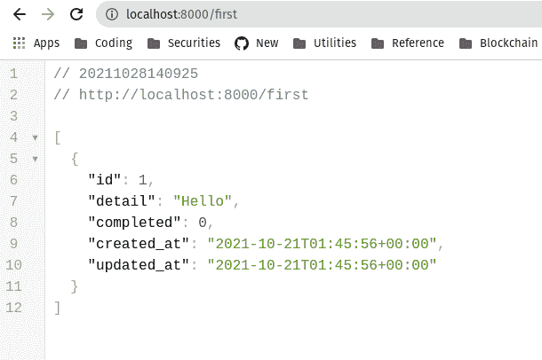

# mason ite:Python-log rocket 博客的 MVC web 框架

> 原文：<https://blog.logrocket.com/masonite-mvc-web-framework-python/>

大多数 Python 框架通常分为两类:像 Flask 和 FastAPI 这样的极简框架，或者包含电池的更健壮的框架，比如流行的 Django 框架。

然而，Django 有一个非常陡峭的学习曲线，主要是因为它的模式与几乎所有其他 Python 框架都非常不同。例如，其他框架调用控制器*动作*在 Django 中被称为*视图*。

Django 项目被组织成应用程序，这有时会混淆典型的 MVC 组织，但在模块化方面提供了好处。开箱即用，如果不使用像 [DjangoRestFramework](https://www.django-rest-framework.org) 这样的库，构建 REST API 会非常复杂。Django 的文件夹结构经常导致多个文件夹和子文件夹同名，这在团队中造成了混乱。

虽然许多开发人员仍然在使用和喜爱 Django，但是已经认识到需要一个遵循更传统的框架模式的框架，类似于 Ruby 的 Rails、PHP 的 Laravel 或 NestJS 所使用的那些模式。Masonite 框架允许我们以更健壮、更熟悉的方式使用 Python。

在本教程中，我们将通过构建一个简单的待办事项列表来熟悉 Masonite。要跟随本教程，您需要安装 Python 3.6 以上版本。首先，让我们回顾一下 Masonite 的一些功能和额外待遇。

### Masonite 特征

*   内置电子邮件支持`MailProvider`、`SMTP`和`MailgunDriver`
*   IOC 容器和自动解析依赖注入
*   易于向框架添加功能的服务提供商
*   极其简单的静态文件配置
*   [Masonite ORM](https://orm.masoniteproject.com/) :类似于活动记录的演说家的替代者
*   包括一个有用的命令行工具，叫做 [craft 命令](https://docs.masoniteproject.com/the-craft-command/introduction)
*   使用`Broadcast`提供者、`pusher`、`ably`和`pubnub`驱动程序从您的服务器发送 WebSocket 请求
*   极度可扩展

### 梅森奈特术语

Masonite 的术语是 Rails、Laravel 和大多数其他 MVC web 框架所熟悉的:

*   **控制器**:包含几个叫做动作的方法的类
*   **动作**:决定如何响应特定请求的控制器方法
*   **Routes** :决定哪些 URL 或方法组合应该被定向到哪些控制器动作的规则

## 创建新的 Masonite 项目

首先，让我们创建一个新的虚拟环境:

```
python -m venv venv

```

要激活您的虚拟环境，请运行`source ./venv/bin/activate`。要停用，使用命令`deactivate`。接下来，安装 Masonite，如下所示:

```
pip install masonite

```

使用下面的命令创建一个新项目:

```
craft new firstproject

```

接下来，导航到`firstproject`目录。运行以下代码安装其他依赖项:

```
craft install 

```

本质上，`craft`是一个在 Masonite 中作为前缀的命令，类似于 Rails 和 Laravel 中的`rails`和`artisan`命令。

## Masonite 控制器

现在，我们将创建我们的第一个控制器:

```
craft controller First

```

上面的命令将创建`app/http/FirstController.py`文件，其中包含以下代码:

```
"""A FirstController Module."""

from masonite.request import Request
from masonite.view import View
from masonite.controllers import Controller

class FirstController(Controller):
    """FirstController Controller Class."""

    def __init__(self, request: Request):
        """FirstController Initializer

        Arguments:
            request {masonite.request.Request} -- The Masonite Request class.
        """
        self.request = request

    def show(self, view: View):
        pass

```

在`__init__`函数定义中，我们声明了一个名为`request`的参数。`request`使用依赖注入来生成请求对象，其中包含 URL 参数、查询等。，适用于我们所有的航线。或者，您可以逐个操作地声明参数，比如在`show`方法中的`view`参数。

## 渲染模板和视图

假设您正在构建一个将呈现模板的全栈应用程序；我们将使用传递给`show`方法的`view`参数，呈现所需的模板:

```
def show(self, view: View):
return view.render("helloworld", {"phrase": "Hello World"})

```

上面的代码告诉 Masonite 在`/resources/templates`中查找名为`helloworld.html`的模板，并使用作为第二个参数传递的字典中的数据来呈现它。

要创建伴随的`view`，运行命令`craft view helloworld`。最后，将下面的代码添加到新创建的`resources/templates/helloworld.html`中:

```
<!DOCTYPE html>
<html lang="en">
<head>
    <meta charset="UTF-8">
    <meta http-equiv="X-UA-Compatible" content="IE=edge">
    <meta name="viewport" content="width=device-width, initial-scale=1.0">
    <title>Hello World</title>
</head>
<body>
    <h1>{{ phrase }}</h1>
</body>
</html>

```

## 创建 Masonite 路线

要查看上面的代码，我们只需要将控制器连接到一个路由，这样它就可以呈现`view`。打开`routes/web.py`，让我们添加如下路线:

```
"""Web Routes."""

from masonite.routes import Get, Post

ROUTES = [
    Get("/", "[email protected]").name("welcome"),
    Get("/first", "[email protected]").name("first")
]

```

我们使用`Get`函数为`GET`请求声明一个路由。第一个字符串表示路由的 URL，第二个字符串表示应该从控制器调用的操作。在我们的例子中，我们从`FirstController`调用`show`。`name`方法允许我们给我们的路线起一个名字，我们将在模板内的链接中使用这个名字来引用它。

现在，您可以使用命令`craft serve`运行服务器。我们可以在`localhost:8000/first`上看到我们的页面。那很简单！

## 发送 JSON 数据

发送 JSON 数据非常简单。我们将在操作中返回字典或数组。如果我们将`FirstController`中的`show`动作修改如下，当您在浏览器中查看页面时，您将会看到 JSON 数据:

```
def show(self, view: View):
return {"Hello": "World"}

```

## 使用迁移

要为迁移设置我们的应用程序，首先，我们将在`.env`文件中配置数据库细节:

```
DB_CONNECTION=mysql
DB_HOST=127.0.0.1
DB_PORT=3306
DB_DATABASE=masonite
DB_USERNAME=root
DB_PASSWORD=root
DB_LOG=True

```

`DB_CONNECTION`字段对应于`config/database.py`中的不同预设。现在，让我们把这些都注释掉，使 Masonite 默认为 SQLite3:

```
#DB_CONNECTION=mysql
#DB_HOST=127.0.0.1
#DB_PORT=3306
#DB_DATABASE=masonite
#DB_USERNAME=root
#DB_PASSWORD=root
#DB_LOG=True

```

现在，让我们运行一次迁移，迁移出开箱即用的默认用户身份验证迁移，并创建我们的 sqlite3 数据库:

```
craft migrate

```

接下来，让我们创建一个迁移来创建一个`todos`表:

```
craft migration create_todos_table --create todos

```

上面的代码在`databases/migrations`中生成一个新文件，看起来像下面的代码:

```
"""CreatePostsTable Migration."""

from masoniteorm.migrations import Migration

class CreatePostsTable(Migration):
    def up(self):
        """
        Run the migrations.
        """
        with self.schema.create("todos") as table:
            table.increments("id")

            table.timestamps()

    def down(self):
        """
        Revert the migrations.
        """
        self.schema.drop("todos")

```

`up`函数表示当我们运行迁移时会发生什么，而`down`迁移表示当我们回滚迁移或删除表时会发生什么。接下来，让我们在`up`函数中为`todo`表添加一些字段:

```
    def up(self):
        """
        Run the migrations.
        """
        with self.schema.create("todos") as table:
            table.increments("id")

            table.string("detail")
            table.boolean("completed")

            table.timestamps()

```

在上面的代码块中，我们添加了一个名为`detail`的字符串字段和一个名为`completed`的布尔字段。现在，让我们运行迁移并在数据库中创建表:

```
craft migrate

```

## 创建模型

现在，我们为我们的`Todos`准备了一张桌子。我们现在需要的是一个允许我们与数据交互的模型:

```
craft model Todo

```

让我们用我们的模型类创建文件`app/Todo.py`:

```
"""Todo Model."""

from masoniteorm.models import Model

class Todo(Model):
    """Todo Model."""
    pass

```

目前，我们所有的模型方法都是在`Todo`类中通过继承 Masonite 的`Model`类获得的。

通常，表名是类名的复数形式，即。`Dog`和`Dogs`。虽然在我们的例子中表应该自动工作，但是让我们显式地声明它应该连接到的数据库表:

```
"""Todo Model."""

from masoniteorm.models import Model

class Todo(Model):
    """Todo Model."""
    __table__ = 'todos'

```

## 在 Python shell 中添加待办事项

运行以下命令，打开一个预装了 Masonite 容器的 Python shell:

```
craft tinker

```

然后，我们将导入我们的`todo`模型，如下所示:

```
from app.Todo import Todo

```

现在，让我们通过多次添加以下代码片段来创建一些待办事项列表项:

```
Todo.create(detail="Hello", completed=False)

```

添加了一些待办事项后，用`quit()`退出 Python shell。现在，让我们将模型导入到我们的控制器中，并将所有那些待办事项列表项作为 JSON 发送回去。将以下代码添加到您的`app/http/controllers/FirstController.py`文件中:

```
"""A FirstController Module."""

from masonite.request import Request
from masonite.view import View
from masonite.controllers import Controller
from app.Todo import Todo

class FirstController(Controller):
    """FirstController Controller Class."""

    def __init__(self, request: Request):
        """FirstController Initializer

        Arguments:
            request {masonite.request.Request} -- The Masonite Request class.
        """
        self.request = request

    def show(self, view: View):
        return Todo.all()

```

用`craft serve`打开服务器，并在`localhost:8000/first`上检查结果。

## 克-奥二氏分级量表

在部署应用程序之前，我们需要设置我们的 CORS 头，以防我们收到对应用程序的外部请求。

让我们将`CORSProvider`(一个帮助配置 CORS 中间件的内置提供程序)导入并添加到`Providers`数组中。将以下代码块添加到`/config/providers.py`:

```
"""Providers Configuration File."""

from masonite.providers import (
    AppProvider,
    CorsProvider, # ADD THIS
    RequestHelpersProvider,
    AuthenticationProvider,
    BroadcastProvider,
    CacheProvider,
    CsrfProvider,
    HelpersProvider,
    MailProvider,
    QueueProvider,
    RouteProvider,
    SessionProvider,
    StatusCodeProvider,
    UploadProvider,
    ViewProvider,
    WhitenoiseProvider,

)
from masonite.logging.providers import LoggingProvider
from masonite.validation.providers import ValidationProvider
from masoniteorm.providers import ORMProvider

"""Providers List
Providers are a simple way to remove or add functionality for Masonite
The providers in this list are either ran on server start or when a
request is made depending on the provider. Take some time to can
learn more more about Service Providers in our documentation
"""

PROVIDERS = [
    # Framework Providers
    AppProvider,
    CorsProvider, # ADD THIS
    RequestHelpersProvider,
    CsrfProvider,
    AuthenticationProvider,
    SessionProvider,
    RouteProvider,
    StatusCodeProvider,
    WhitenoiseProvider,
    ViewProvider,
    # Optional Framework Providers
    MailProvider,
    UploadProvider,
    QueueProvider,
    CacheProvider,
    BroadcastProvider,
    HelpersProvider,
    ValidationProvider,
    # Third Party Providers
    LoggingProvider,
    ValidationProvider,
    ORMProvider,
    # Application Providers
]

```

## 配置 CORS 中间件

为了配置我们的 CORS 中间件，首先，让我们声明一个 CORS 变量，并给它分配一个我们的`cors`头的字典。将以下代码添加到您的`/config/middleware.py`文件中:

```
"""Middleware Configuration Settings."""

from masonite.middleware import (
    ResponseMiddleware,
    MaintenanceModeMiddleware,
    GuardMiddleware,
)

from app.http.middleware.AuthenticationMiddleware import AuthenticationMiddleware
from app.http.middleware.CsrfMiddleware import CsrfMiddleware
from app.http.middleware.LoadUserMiddleware import LoadUserMiddleware
from app.http.middleware.VerifyEmailMiddleware import VerifyEmailMiddleware

"""HTTP Middleware
HTTP middleware is middleware that will be ran on every request. Middleware
is only ran when a HTTP call is successful (a 200 response). This list
should contain a simple aggregate of middleware classes.
"""

HTTP_MIDDLEWARE = [
    LoadUserMiddleware,
    CsrfMiddleware,
    ResponseMiddleware,
    MaintenanceModeMiddleware,
]

"""Route Middleware
Specify a dictionary of middleware to be used on a per route basis here. The key will
be the alias to use on routes and the value can be any middleware class or a list
of middleware (middleware stacks).
"""

ROUTE_MIDDLEWARE = {
    "auth": AuthenticationMiddleware,
    "verified": VerifyEmailMiddleware,
    "guard": GuardMiddleware,
}

## ADD THIS
CORS = {
    'Access-Control-Allow-Origin': "*",
    "Access-Control-Allow-Methods": "*",
    "Access-Control-Allow-Headers": "*",
    "Access-Control-Max-Age": "3600",
    "Access-Control-Allow-Credentials": "true"
}

```

## 将我们的 Masonite 应用程序部署到 Heroku

要将我们的 Masonite 待办事项列表应用程序部署到 Heroku，让我们安装 [G](https://gunicorn.org) [unicorn](https://gunicorn.org) 和 [P](https://pypi.org/project/psycopg2/) [sycopg2](https://pypi.org/project/psycopg2/) 。如果您没有使用 Heroku Postgres，请确保为您的部署平台安装正确的驱动程序:

```
pip install psycopg2
pip install gunicorn

```

在项目根目录下创建一个名为`Procfile`的文件，并运行以下命令:

```
web: gunicorn wsgi

```

接下来，创建一个`runtime.txt`文件:

```
python-3.9.0

```

要创建当前依赖项的列表，请运行`pip freeze > requirements.txt`:

```
backpack==0.1
bcrypt==3.1.7
certifi==2021.5.30
cffi==1.14.6
charset-normalizer==2.0.5
cleo==0.8.1
clikit==0.6.2
crashtest==0.3.1
cryptography==3.4.8
exceptionite==1.0.1
Faker==4.18.0
gunicorn==20.1.0
hfilesize==0.1.0
hupper==1.9.1
idna==3.2
inflection==0.3.1
Jinja2==2.11.3
MarkupSafe==2.0.1
masonite==3.0.12
masonite-dot==0.0.5
masonite-logging==1.0.1
masonite-orm==1.0.55
masonite-validation==3.0.14
passlib==1.7.4
pastel==0.2.1
pendulum==2.1.2
psutil==5.6.7
psycopg2==2.9.1
pycparser==2.20
pylev==1.4.0
python-dateutil==2.8.2
python-dotenv==0.10.5
pytzdata==2020.1
requests==2.26.0
requests-file==1.5.1
simplejson==3.17.5
six==1.16.0
tabulate==0.8.9
text-unidecode==1.3
tldextract==2.2.3
urllib3==1.26.6
whitenoise==4.1.4

```

如果您缺少上面的任何依赖项，或者您遇到了 Psycopg2 的问题，您可以很容易地将缺少的依赖项复制到您的`requirements.txt`文件中。

接下来，我们将把我们的项目推进到 GitHub，并部署到一个新的 Heroku 项目。转到**资源**选项卡，提供一个 Heroku Postgres 数据库。获取数据库的凭证，并将以下变量添加到 Heroku `config vars`:

```
DB_CONNECTION=postgres
DB_HOST=<get value from herok>
DB_PORT=<get value from herok>
DB_DATABASE=<get value from herok>
DB_USERNAME=<get value from herok>
DB_PASSWORD=<get value from herok>
DB_LOG=True

```

最后，将`key`变量从你的本地`.env`复制到你的 Heroku `config vars`并设置一个变量。我们最终应用程序的代码如下图所示:

## 

## 结论

在本教程中，我们用 Masonite 构建了一个简单的待办事项列表应用程序，mason ite 是一个使用 MVC 模型的 Python web 框架。Masonite 提供了 PHP、Ruby 和 NestJS 等现代框架的许多最佳特性，将它们打包到 Python 中。

CLI 功能强大，它帮助您生成应用程序的组件，同时还提供足够简单的工作流来最大限度地提高工作效率。既然您已经熟悉了 Masonite 的基础知识，那么您应该能够构建自己的复杂应用程序。编码快乐！

## 使用 [LogRocket](https://lp.logrocket.com/blg/signup) 消除传统错误报告的干扰

[](https://lp.logrocket.com/blg/signup)

[LogRocket](https://lp.logrocket.com/blg/signup) 是一个数字体验分析解决方案，它可以保护您免受数百个假阳性错误警报的影响，只针对几个真正重要的项目。LogRocket 会告诉您应用程序中实际影响用户的最具影响力的 bug 和 UX 问题。

然后，使用具有深层技术遥测的会话重放来确切地查看用户看到了什么以及是什么导致了问题，就像你在他们身后看一样。

LogRocket 自动聚合客户端错误、JS 异常、前端性能指标和用户交互。然后 LogRocket 使用机器学习来告诉你哪些问题正在影响大多数用户，并提供你需要修复它的上下文。

关注重要的 bug—[今天就试试 LogRocket】。](https://lp.logrocket.com/blg/signup-issue-free)