# 使用 Matplotlib - LogRocket 博客掌握 Python 中的数据可视化

> 原文：<https://blog.logrocket.com/mastering-data-visualization-python-matplotlib/>

根据 [2020 Kaggle 机器学习和数据科学调查](https://www.kaggle.com/c/kaggle-survey-2020) , [Matplotlib](https://matplotlib.org/stable/index.html) 是 ka ggler 中排名第一的数据可视化库，遥遥领先。

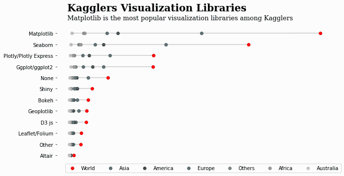

许多课程和教程最近吸引了初级数据科学家对新的、闪亮的、交互式库的注意，如 [Plotly](https://plotly.com/python/) ，但 Matplotlib 仍然是数据可视化库之王，我怀疑在可预见的未来可能会继续如此。

正因为如此，我强烈建议您学习它，并超越基础，因为当您利用其更高级的特性时，Matplotlib 的威力会变得更加明显。

在本教程中，我们将涵盖其中的一些，并对 Matplotlib 的面向对象(OO)接口做一个坚实的介绍。

## Matplotlib 中的面向对象接口是什么？

当您第一次学习 Matplotlib 时，您可能会通过其 PyPlot 接口开始使用该库，py plot 接口是专门为初学者设计的，因为它对用户友好，创建视觉效果所需的代码较少。

但是，当您想要对图形执行高级定制时，它的功能就不够了。这就是面向对象的 API 发挥作用的地方。

在幕后，Matplotlib 由称为 artists 的基类组成。

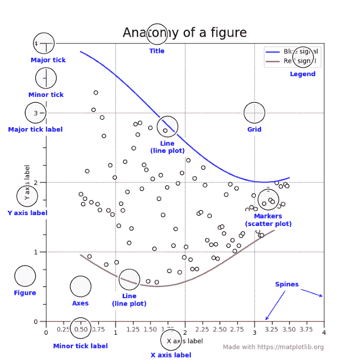

为可视化中的每个元素创建唯一的类给了 Matplotlib 用户极大的灵活性。上图中每个带圆圈注释的组件都是一个独立的类，继承自基本艺术家。这意味着您可以调整图上可见的每一条小线、点、文本或对象。

在接下来的部分中，我们将学习这些类中最重要的，从图形和轴对象开始。

## Matplotlib 中的图形和轴对象

让我们首先导入 Matplotlib 及其子模块:

```
import matplotlib as mpl  # pip install matplotlib
import matplotlib.pyplot as plt
```

接下来，我们使用`subplots`函数创建一个图形和一个轴对象:

```
>>> fig, ax = plt.subplots()
```

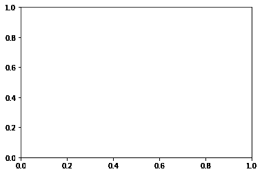

现在，让我们解释一下这些物体的功能。

`fig`(图)是最高层次的艺术家，一个包含一切的物体。把它想象成你可以在上面画画的画布。axes 对象(`ax`)代表一组 XY 坐标系。所有 Matplotlib 绘图都需要一个坐标系，因此您必须创建至少一个图形和一个轴对象来绘制图表。

`plt.subplots`是这样做的简写——它在一行代码中创建一个图形和一个或多个 axes 对象。更详细的版本应该是:

```
>>> fig = plt.figure()
>>> ax1 = fig.add_axes()

<Figure size 432x288 with 0 Axes>
```

因为这需要更多的代码，所以人们通常坚持使用`subplots`。此外，您可以向它传递额外的参数来同时创建多个轴对象:

```
>>> fig, axes = plt.subplots(nrows=1, ncols=3)
```

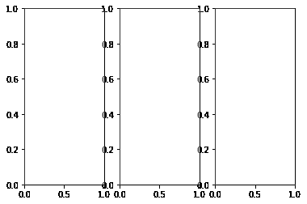

通过更改`nrows`和`ncols`参数，您创建了一组子情节——存储在`axes`中的多个轴对象。您可以通过使用循环或索引操作符来访问每一个。

在[文档](https://matplotlib.org/stable/api/_as_gen/matplotlib.pyplot.subplots.html)中深入学习如何使用支线剧情功能。

## Matplotlib 中的绘图函数

当您从 PyPlot 切换到 OOP API 时，绘图的函数名不会改变。您可以使用 axes 对象调用它们:

```
import seaborn as sns

tips = sns.load_dataset("tips")

fig, ax = plt.subplots()

ax.scatter(tips["tip"], tips["total_bill"])
ax.set(
   title="Tip vs. Total Bill amount in a restaurant",
   xlabel="Tip ($)",
   ylabel="Totalb bill ($)",
);
```

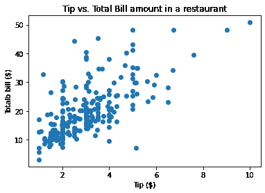

在这里，我引入了`set`函数，您可以在任何 Matplotlib 对象上使用它来调整其属性。

上面的图有点乏味，无法与 Seaborn 创建的默认散点图相比:

```
>>> sns.scatterplot(tips["tip"], tips["total_bill"]);
```

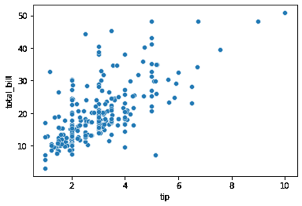

为此，让我们在下一节讨论两个非常灵活的函数，您可以使用它们来定制您的绘图。

## Matplotlib 中的 get_*函数

还记得 Matplotlib 如何为每个绘图组件创建单独的类吗？在接下来的几节中，我们将利用这个特性。

在自定义我的图时，我通常使用以下工作流程:

1.  创造基本情节
2.  确定需要定制的图的弱点
3.  提取那些微弱的物体
4.  使用`setp`功能定制它们(稍后将详细介绍)

在这里，我们将讨论第三步——如何提取情节的不同组成部分。

首先，让我们创建一个简单的情节:

```
fig, ax = plt.subplots()

# Create the data to plot
X = np.linspace(0.5, 3.5, 100)
Y1 = 3 + np.cos(X)
Y2 = 1 + np.cos(1 + X / 0.75) / 2
Y3 = np.random.uniform(Y1, Y2, len(X))

ax.scatter(X, Y3)
ax.plot(X, Y1)
ax.plot(X, Y2);
```

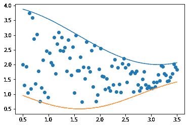

我们使用了`subplots`函数来创建图形和轴对象，但是让我们假设我们没有轴对象。我们如何找到它？

记住，人物对象是最高级的艺术家，包含了剧情中的一切。因此，我们将在`fig`对象上调用`dir`,看看它有哪些方法:

```
>>> dir(fig)

[
...
'gca',
'get_agg_filter',
'get_alpha',
'get_animated',
'get_axes',
'get_dpi',
'get_edgecolor',
'get_facecolor',
'get_figheight',
'get_figure',
'get_figwidth',
'get_frameon',
'get_gid',
'get_in_layout'
...
]
```

在列表中，我们看到了`get_axes`方法，这是我们需要的:

```
axes = fig.get_axes()

>>> type(axes)
list

>>> len(axes)
1
```

来自`get_axes`的结果是一个包含我们在上面的图中创建的单轴对象的列表。

axes 示例证明 Matplotlib 中的所有东西都只是一个类。一个图包含几个实现为单独类的组件，每个组件可以有一个或多个子类。

* * *

### 更多来自 LogRocket 的精彩文章:

* * *

它们都有一个共同点:您可以使用相关的`get_*`函数提取这些类或子类。你只需要知道他们的名字。

一旦你提取出这些物体，你会做什么？你拧他们！

## `plt.getp`和`plt.setp`功能

要调整任何组件的属性，您必须知道它有什么参数以及每个参数接收什么值。您将使用许多对象，因此每次访问文档都会变得令人厌烦。

幸运的是，Matplotlib 的创作者们想到了这个问题。一旦提取了相关的对象，就可以使用`plt.getp`函数查看它接受什么参数。例如，让我们看看 axes 对象的属性:

```
fig, _ = plt.subplots()

ax = fig.get_axes()[0]

>>> plt.getp(ax)
   ...
   xlabel =
   xlim = (0.0, 1.0)
   xmajorticklabels = [Text(0, 0, ''), Text(0, 0, ''), Text(0, 0, ''), T...
   xminorticklabels = []
   xscale = linear
   xticklabels = [Text(0, 0, ''), Text(0, 0, ''), Text(0, 0, ''), T...
   xticklines = <a list of 12 Line2D ticklines objects>
   xticks = [0\.  0.2 0.4 0.6 0.8 1\. ]
   yaxis = YAxis(54.0,36.0)
   yaxis_transform = BlendedGenericTransform(     BboxTransformTo(     ...
   ybound = (0.0, 1.0)
   ygridlines = <a list of 6 Line2D gridline objects>
   ylabel =
   ylim = (0.0, 1.0)
   ymajorticklabels = [Text(0, 0, ''), Text(0, 0, ''), Text(0, 0, ''), T...
   yminorticklabels = []
   yscale = linear
   ...
```

如您所见，`getp`函数列出了它所调用的对象的所有属性，显示了它们的当前值或默认值。我们可以对 fig 对象做同样的事情:

```
>>> plt.getp(fig)
   ...
   constrained_layout_pads = (0.04167, 0.04167, 0.02, 0.02)
   contains = None
   default_bbox_extra_artists = [<AxesSubplot:>, <matplotlib.spines.Spine object a...
   dpi = 72.0
   edgecolor = (1.0, 1.0, 1.0, 0.0)
   facecolor = (1.0, 1.0, 1.0, 0.0)
   figheight = 4.0
   figure = Figure(432x288)
   figwidth = 6.0
   frameon = True
   gid = None
   in_layout = True
   label =
   linewidth = 0.0
   path_effects = []
   ...
```

一旦您确定了您想要更改的参数，您必须知道它们接收的值的范围。为此，您可以使用`plt.setp`功能。

假设我们想改变轴对象的`yscale`参数。为了查看它接受的可能值，我们将 axes 对象和参数名传递给`plt.setp`:

```
>>> plt.setp(ax, "yscale")
yscale: {"linear", "log", "symlog", "logit", ...} or `.ScaleBase`
```

正如我们看到的，yscale 接受五个可能的值。这比在 Matplotlib 的大文档中挖掘要快得多。

`setp`功能非常灵活。仅传递不带任何其他参数的对象将列出该对象的所有参数，显示它们可能的值:

```
>>> plt.setp(ax)
 ...
 xlabel: str
 xlim: (bottom: float, top: float)
 xmargin: float greater than -0.5
 xscale: {"linear", "log", "symlog", "logit", ...} or `.ScaleBase`
 xticklabels: unknown
 xticks: unknown
 ybound: unknown
 ylabel: str
 ylim: (bottom: float, top: float)
 ymargin: float greater than -0.5
 yscale: {"linear", "log", "symlog", "logit", ...} or `.ScaleBase`
 yticklabels: unknown
 yticks: unknown
 zorder: float
 ...
```

现在我们知道了我们想要改变什么参数以及我们想要传递给它们什么值，我们可以使用`set`或`plt.setp`函数:

```
fig, ax = plt.subplots()

# Using `set`
ax.set(yscale="log", xlabel="X Axis", ylabel="Y Axis", title="Large Title")

# Using setp
plt.setp(ax, yscale="log", xlabel="X Axis", ylabel="Y Axis", title="Large Title")

plt.setp(fig, size_inches=(10, 10));
```

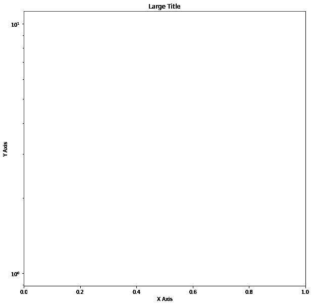

## 使用 Line2D 对象

任何图中最常见的图形是线和点。几乎所有的图，如条形图、箱线图、直方图、散点图等。，使用矩形，因此，线。

Matplotlib 实现了一个绘制线条的全局基类，Line2D 类。在实践中您从来没有直接使用它，但是每次 Matplotlib 画线时都会调用它，无论是作为绘图还是作为某些几何图形的一部分。

因为许多其他类都是从这个类继承的，所以了解它的属性是有益的:

```
from matplotlib.lines import Line2D
xs = [1, 2, 3, 4]
ys = [1, 2, 3, 4]

>>> plt.setp(Line2D(xs, ys))
 ...
 dash_capstyle: `.CapStyle` or {'butt', 'projecting', 'round'}
 dash_joinstyle: `.JoinStyle` or {'miter', 'round', 'bevel'}
 dashes: sequence of floats (on/off ink in points) or (None, None)
 data: (2, N) array or two 1D arrays
 drawstyle or ds: {'default', 'steps', 'steps-pre', 'steps-mid', 'steps-post'}, default: 'default'
 figure: `.Figure`
 fillstyle: {'full', 'left', 'right', 'bottom', 'top', 'none'}
 gid: str
 in_layout: bool
 label: object
 linestyle or ls: {'-', '--', '-.', ':', '', (offset, on-off-seq), ...}
 linewidth or lw: float
 ...
```

我建议关注使用最多的`linestyle`、`width,`和`color`论元。

## 在 Matplotlib 中自定义轴记号

所有 Matplotlib 图的一个重要方面是轴刻度。它们不会引起太多的注意，但会默默地控制数据在图中的显示方式，从而对图产生实质性的影响。

幸运的是，Matplotlib 使得使用 axis 对象的`tick_params`方法定制轴刻度变得轻而易举。让我们了解一下它的参数:

```
Change the appearance of ticks, tick labels, and gridlines.

Tick properties that are not explicitly set using the keyword
arguments remain unchanged unless *reset* is True.

Parameters
----------
axis : {'x', 'y', 'both'}, default: 'both'
   The axis to which the parameters are applied.
which : {'major', 'minor', 'both'}, default: 'major'
   The group of ticks to which the parameters are applied.
reset : bool, default: False
   Whether to reset the ticks to defaults before updating them.

Other Parameters
----------------
direction : {'in', 'out', 'inout'}
   Puts ticks inside the axes, outside the axes, or both.
length : float
   Tick length in points.
width : float
   Tick width in points.
```

上面是它的[文档](https://matplotlib.org/stable/api/_as_gen/matplotlib.axes.Axes.tick_params.html)的一个片段。

第一个也是最重要的论点是`axis`。它接受三个可能的值，并表示要更改哪个轴刻度。很多时候，你两者都选。

接下来是`which`,它将节拍改变为小节拍或大节拍。如果次要刻度在您的图上不可见，您可以使用`ax.minorticks_on()`打开它们:

```
fig, ax = plt.subplots(figsize=(10, 10))

ax.minorticks_on()
```

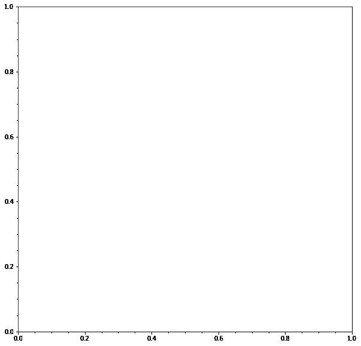

其余的就不言自明了。让我们把所有的概念放在一个例子中:

```
fig, ax = plt.subplots(figsize=(6, 6))

ax.tick_params(axis="both", which="major", direction="out", width=4, size=10, color="r")
ax.minorticks_on()
ax.tick_params(axis="both", which="minor", direction="in", width=2, size=8, color="b")
```

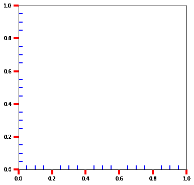

当我们在这里的时候，你也可以调整脊柱。例如，让我们看看顶部和右侧的脊椎:

```
fig, ax = plt.subplots(figsize=(6, 6))

ax.tick_params(axis="both", which="major", direction="out", width=4, size=10, color="r")
ax.minorticks_on()
ax.tick_params(axis="both", which="minor", direction="in", width=2, size=8, color="b")

for spine in ["top", "right"]:
   plt.setp(ax.spines[spine], ls="--", color="brown", hatch="x", lw=4)
```

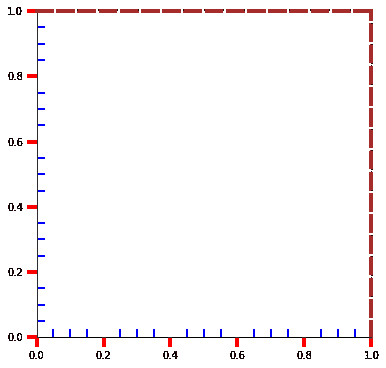

您可以使用 axes 对象的`spines` 属性访问脊椎，剩下的就很容易了。因为脊线是一条线，所以它的属性与 Line2D 对象的属性相同。

## 结论

伟大情节的关键在于细节。Matplotlib 默认值很少达到专业标准，因此定制它们的任务就落在了您的身上。在本文中，我们深入 Matplotlib 的核心，向您介绍其内部原理，以便您能够更好地理解更高级的概念。

一旦你开始实施教程中的想法，你将有希望看到一个戏剧性的变化，你如何创建你的情节和定制它们。感谢阅读。

## 使用 [LogRocket](https://lp.logrocket.com/blg/signup) 消除传统错误报告的干扰

[](https://lp.logrocket.com/blg/signup)

[LogRocket](https://lp.logrocket.com/blg/signup) 是一个数字体验分析解决方案，它可以保护您免受数百个假阳性错误警报的影响，只针对几个真正重要的项目。LogRocket 会告诉您应用程序中实际影响用户的最具影响力的 bug 和 UX 问题。

然后，使用具有深层技术遥测的会话重放来确切地查看用户看到了什么以及是什么导致了问题，就像你在他们身后看一样。

LogRocket 自动聚合客户端错误、JS 异常、前端性能指标和用户交互。然后 LogRocket 使用机器学习来告诉你哪些问题正在影响大多数用户，并提供你需要修复它的上下文。

关注重要的 bug—[今天就试试 LogRocket】。](https://lp.logrocket.com/blg/signup-issue-free)