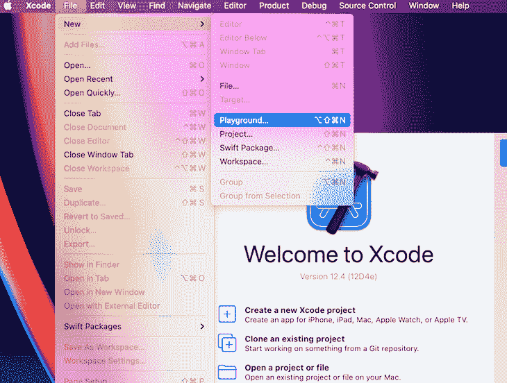
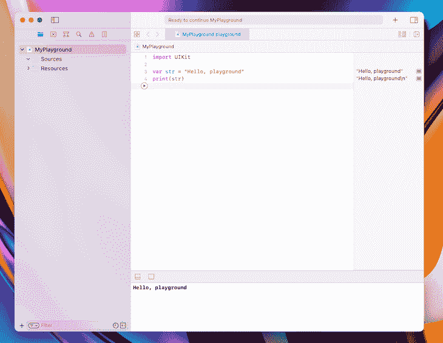

# 掌握 Swift 基础知识- LogRocket 博客

> 原文：<https://blog.logrocket.com/mastering-swift-fundamentals/>

苹果在 2014 年发布的编程语言 Swift 已经迅速成为历史上发展最快的语言之一。如果你有兴趣为 macOS 或 iOS 构建应用，Swift 在我看来是最好的语言选择。

在本教程中，我们将通过学习 Swift 的基本操作和一些相关示例来熟悉它。我们开始吧！

## 装置

Swift 在 Mac、Windows 和 Linux 上的[版本为 5.4.1](https://swift.org/download/#releases) 。使用 [Xcode 安装 Swift 很容易，Xcode 是苹果用于桌面和原生 iOS 开发的免费工作流程](https://developer.apple.com/xcode/)。


您可以从 macOS 内部的 App Store 或在【Swift 官方网站下载 Xcode。如果您使用的是 Windows 或 Linux，请从其官方网站下载并安装 Swift。

如果你不想在电脑上安装 Swift，你可以试试 Swift 的[在线游乐场。](http://online.swiftplayground.run/)

### 开一个 Xcode 游乐场

一旦你在电脑上安装了 Swift，打开一个使用 Xcode 的游戏场，在那里你可以开始编写代码。





## 数据类型

我们需要知道 Swift 支持哪些数据类型，以了解我们能完成什么。我们将使用以下六种数据类型:

| 数据类型 | 例子 | 代表 | 目的 |
| --- | --- | --- | --- |
| 性格；角色；字母 | `s`，`w` | 一个 16 位的 Unicode 字符 | 单个字符编辑 |
| 线 | T2`swift language` | 文本数据 | 保存、更新、修改文本/信息 |
| （同 Internationalorganizations）国际组织 | `5`，`-5` | 一个整数 | 代表任意整数 |
| 浮动 | `5.5`，`-5.5` | 32 位浮点数 | 代表一个 32 位浮点数 |
| 两倍 | `5.5`，`-5.5` | 64 位浮点数 | 代表一个 64 位浮点数 |
| Bool | `true`，`false` | 代表状态(真/假) | 提供真/假值用于我们的程序 |

## 变量

写程序需要大量的数据。变量提供了一种标记数据的方式，使得修改和引用变得更加容易。

### 可变结构

我们将使用以下结构来格式化一个变量:`Keyword variableName:dataType`。您可以在下面的代码块中看到使用的结构:

```
var name:String

```

当我们使用上面的结构定义一个变量时，我们最初并没有在变量中放入任何数据。让我们在变量中添加数据，将它从代表编程中的空值的`null`修改为`string`:

```
var name:String = "nerdjfpb"

```

稍后，我们可以根据需要引用上面的代码来访问数据。比如`print(name)`会在操场控制台上显示`nerdjfpb`。你可以把打印一些东西看作是显示结果。我们可以看到名字里面有什么价值。

我们可以很容易地改变变量值:

```
name = "Nerd Jfpb"

```

在 Swift 中编写时，当我们从数据的值开始时，我们不需要指定数据类型。例如，在下面的代码中，Swift 认为该名称是一个字符串:

```
var name = "nerdjfpb" 

```

如果我们编写下面的代码块，我们将收到一个错误。因为 Swift 是一种类型化语言，我们不能改变变量的数据类型:

```
name = 5

```

假设您想通过编程引用一个变量，但不想改变它的值。Swift 提供了引用变量的特定方法。

### 引用变量

为了引用一个变量，我们将使用下面的结构:`Keyword(let) variableName dataType = Value`，如下例所示:

```
let ownerName = "Nerdjfpb" 
```

我们只能定义一次`ownerName`的值，不能改变。该值将在整个程序中保持不变。

## 经营者

要使用 Swift，我们需要了解这些[基本运算符](https://docs.swift.org/swift-book/LanguageGuide/BasicOperators.html):

### 比较运算符

| 操作员 | 例子 | 解释 |
| --- | --- | --- |
| `==` (等于
到) | T2`variable1 == variable2` | 返回s true
如果变量相等 |
| `!=` (不是
等于) | T2`variable1 != variable2` | 如果变量不相等则返回 s
true |
| `>` (比
大) | T2`variable1 > variable2` | 如果变量 1 大于变量 2，则返回真 |
| `>=` (大于
)大于或等于 | T2`variable1 >= variable2` | 如果变量 1 大于或
等于变量 2，返回 s true |
| `<` (比
少) | T2`variable1 < variable2` | 如果变量 1 小于变量 2 ，则返回
真 |
| `<=` (小于
)大于或等于 | T2`variable1 <= variable2` | 如果变量 1 小于或等于变量 2，则返回真 |

算术运算符

### 操作员

| 例子 | 解释 | `+` (补充) |
| --- | --- | --- |
| T2`print(variable1 + variable2)` | 打印变量 1 和
变量 2 的相加 | `-` (减法) |
| T2`print(variable1 - variable2)` | 打印变量 1 与变量 2
的减法 | `*` (乘法) |
| T2`print(variable1 * variable2)` | 打印变量 1 和变量 2 的乘积 | `/` (分部) |
| T2`print(variable1 / variable2)` | 打印变量 1 的
除以变量 2 的除法 | `%` ( 余数) |
| T2`print(variable1 % variable2)` | 打印变量 1 的剩余变量和
变量 2 的剩余变量 | 控制流和条件 |

## 编程包括做出复杂的决策。我们需要学习如何在 Swift 中做出决策。假设我们试图确定一个数是偶数还是奇数。为此，我们需要检查一个给定的数是否能被 2 整除而不留余数。

在 Swift 中，我们使用`%`来寻找余数，并确定它是否等于零。假设我们有一个`var num = 15`。让我们写条件来找出这个数是偶数还是奇数。

剩余结构

### 要查找余数，请遵循以下结构:

我们将使用的关键字是`if`。条件为`num % 2 == 0`，执行代码为打印读数`Given number is an even number`:

```
Keyword (conditions) {
    // code for execution here
}

```

比方说，如果数字不是偶数，我们也要通知用户。这部分挺容易的！对于每个`if`语句，我们可以写一个`else`语句。

```
var num = 5
if (num%2 == 0) {
print("Given number is an even number")
}

```

`If/else`报表结构

### 我们的代码将使用下面的结构:

您将在下面的代码块中看到结构和条件:

```
if (conditions) {
    // Run the code inside if block
} else {
    // Run the code inside else block
}

```

由于有了`num`值，要么`if`语句有效，要么`else`语句有效。一次只能满足一个。

```
var num = 5
if (num%2 == 0) {
print("Given number is a even number")
} else {
print("Given number is a odd number")
}

```

我们把问题延伸一下。假设我们想忽略所有的负数。我们将运行一个排除小于零的数字的`if/else`语句。

按照下面的结构解决问题:

很简单，对吧？

```
if (conditions) {
    // Run the code inside if block
} else if(conditions) {
    // Run the code inside else if block
} else {
    // Run the code inside else block
}

if (num < 0) {
    print("Given number is a negative number")
} 
else if (num%2 == 0) {
    print("Given number is an even number")
} 
else {
    print("Given number is an odd number")
}

```

现在，假设您想要显示一个数字是正数还是负数，以及该数字是偶数还是奇数:

您将收到以下输出:

```
var num = 3

if (num == 0) {
    print("Given number is a zero")
} else if (num < 0) {
    print("Given number is a negative number")
} else {
    print("Given number is a positive number")
}

if (num%2 == 0) {
    print("Given number is an even number")
} 
else {
    print("Given number is an odd number")
}

```

环

```
Given number is a positive number
Given number is an odd number

```

## 假设你想写出从 0 到 100 的每一个数字。这应该是相当容易的，对不对？如果我让你写出从 0 到 1000 的每一个数字会怎么样？还是零到一万？这将是困难的，无聊的，耗时的。

在这种情况下，计算机编程来拯救。你可以给你的电脑编程，让它在一定的时间内执行某项任务，你还可以告诉它该做什么。我们将要求计算机使用循环在 Swift Playground 中写出 0 到 100。

在循环中，我们可以提供顺序任务和中断条件。Swift 中有几个[循环可用，包括`for-in`、`while`、`repeat-while`。](https://docs.swift.org/swift-book/LanguageGuide/ControlFlow.html)

我们将讨论每个循环，并使用每个循环执行相同的任务。假设我们需要从零数到 100。

`for-in`结构

### 使用以下布局构建一个`for-in`回路:

我们将使用`for`作为关键字，`count index`作为`counterVariable`。`lowerLimit`是我们开始计数的最小数字，`upperLimit`是我们停止计数的最大数字:

```
keyword counterVariable in lowerLimit .. upperLimit {
// code for execution
}

```

现在，让我们用`while`循环执行同样的任务。

```
for count in 1...100 {
    print(count) // for printing
}

```

`while`循环结构

### 按照以下顺序设置您的`while`循环:

我们将使用的关键字是`while`，我们将指定的条件是为了停止循环。在我们的例子中，当计数等于 100 时我们停止。

```
keyword condition {
// code for execution
}

```

更多来自 LogRocket 的精彩文章:

* * *

### 如果我们不使用`count = count + 1`增加值，那么`while`循环将无限期地继续，最终使程序崩溃。运行缓慢的计算机可能很难重置，所以在运行`while`循环之前，一定要再读一遍代码，以确保包含一个停止点。

* * *

```
var count = 1
while (count <= 100) {
    print(count) // for printing
    count = count + 1 // for increment value
}

```

`repeat-while`结构

### 在上面的`while`循环中，我们首先检查条件，然后运行里面的代码。考虑上面看到的使用`101`作为输入的相同代码示例:

在这种情况下，我们不会收到任何输出，因为条件没有得到满足。

```
var count = 101
while (count <= 100) {
    print(count) // for printing
    count = count + 1 // for increment value
}

```

让我们使用`repeat-while`再次尝试我们的例子。一个`repeat-while`循环首先执行任务，然后检查条件，本质上按照与`while`循环相反的顺序操作:

`repeat-while`代码的输出是`101`。

```
var count = 101
repeat {
    print(count)
    count = count + 1
}
while (count <= 100) 

```

希望现在您已经熟悉了 Swift loops！

这里有一个问题需要你解决:找出 1 到 100 之间的所有偶数，并在控制台中打印出来。您完成的代码将类似于下面的代码块:

尝试自己使用`while`和`repeat-while`执行相同的任务。

```
for count in 1...100 {
    if (count%2 == 0) {
        print(count)
    } 
}

```

功能

## 为了理解函数，我们将重温循环。循环允许我们编写可以一次又一次重复相同任务的程序。

函数允许我们在需要的时候重用代码块。我们既可以写一个`if/else`语句，也可以在函数内部写一个循环。通常，函数接受一些参数，并使用这些参数返回结果。

让我们运行一个例子。使用一个函数，我们得到两个数的和结果，我们可以任意改变输入值。注意，一个函数只有在你调用它的时候才起作用，你可以根据需要经常调用它。

功能结构

### 我们将使用以下结构来完成此示例:

下面，您将找到包含关键字、函数名、参数和返回类型的完整代码:

```
keyword functionName (parameters: parameters type) → returnType { 
    // block of code here
}

```

下面的代码块演示了函数的灵活性。请注意，每一行都包含不同的数值:

```
func sumOfTwo(num1: Int, num2: Int) -> Int { 
  return num1 + num2
} 
var total = sumOfTwo(num1: 10, num2: 20) 
print(total)

```

我们可以用新的值一次又一次地调用函数，每次都得到新的结果！

```
func sumOfTwo(num1: Int, num2: Int) -> Int {
    return num1 + num2
}

var firstFunc = sumOfTwo(num1: 10, num2: 20)
print(firstFunc)

var secondFunc = sumOfTwo(num1: 5, num2: 7)
print(secondFunc)

var thirdFunc = sumOfTwo(num1: 12, num2: 51)
print(thirdFunc)

```

然而，我们可以大大简化我们的代码。如果我们只是打印结果，那么我们可以通过缩短来改进代码:

这里使用的代码将给出与上面编写的代码相同的结果。我们可以直接从函数中打印，因为我们没有在其他地方使用该值。

```
func sumOfTwo(num1: Int, num2: Int) -> Void {
    print(num1 + num2)
}

sumOfTwo(num1: 10, num2: 20)
sumOfTwo(num1: 5, num2: 7)
sumOfTwo(num1: 12, num2: 51)

```

你可能已经注意到我们用了一个`Void`而不是`Int`来代替`returnType`。`Void`表示我们不返回任何东西，只在内部执行任务。您可以通过运行以下代码来实现同样的目的:

您也可以编写不带任何参数的函数:

```
func emptyReturn() {}
func emptyReturn() -> Void {}
func emptyReturn() -> () {}

```

请注意，我们写日志时不要在里面传递任何值。

```
func goodMorning() {
    print("Good morning")
}

goodMorning()

```

让我们用我们所学的知识来尝试一个困难的例子！假设我们正在使用一个可以将两个数相加和相减的函数构建一个迷你计算器:

最后一项任务是使用以下函数打印给定数组中的所有偶数和奇数:

```
func sumOfTwo(num1: Int, num2: Int) -> Int {
    return num1 + num2
}

func substractOfTwo(num1: Int, num2: Int) -> Int {
    return num1 - num2
}

func miniCalculator(num1:Int, num2: Int, work: String) {
    if (work == "+") {
        print(sumOfTwo(num1: num1, num2: num2))
    }
    else if (work == "-") {
       print(substractOfTwo(num1: num1, num2: num2))
    } else {
        print("This operator function is not available yet.")
    }
}

miniCalculator(num1: 12, num2: 21, work: "+")
miniCalculator(num1: 12, num2: 5, work: "-")

```

有许多不同的方法来编写上面的代码，但我选择保持简单。

```
func oddOrEven(lowerLimit:Int, upperLimit: Int) {
    for index in lowerLimit...upperLimit {
        if(index%2 == 0){
            print("\(index) is an even number")
        } else {
            print("\(index) is an odd number")
        }
    }
}

oddOrEven(lowerLimit: 1, upperLimit: 100)

```

结论

## 现在，您应该对 Swift 编程语言的工作原理有了清晰的了解。如果您正确理解了基础知识，那么您就可以用 Swift 编写更复杂的代码了。

记住这是一场马拉松，不是短跑。提高你的编码能力需要你每天练习。请务必查看[Swift 官方文档](https://swift.org/documentation/)以了解更多关于 Swift 的信息。

使用 [LogRocket](https://lp.logrocket.com/blg/signup) 消除传统错误报告的干扰

## [LogRocket](https://lp.logrocket.com/blg/signup) 是一个数字体验分析解决方案，它可以保护您免受数百个假阳性错误警报的影响，只针对几个真正重要的项目。LogRocket 会告诉您应用程序中实际影响用户的最具影响力的 bug 和 UX 问题。

[](https://lp.logrocket.com/blg/signup)

然后，使用具有深层技术遥测的会话重放来确切地查看用户看到了什么以及是什么导致了问题，就像你在他们身后看一样。

LogRocket 自动聚合客户端错误、JS 异常、前端性能指标和用户交互。然后 LogRocket 使用机器学习来告诉你哪些问题正在影响大多数用户，并提供你需要修复它的上下文。

关注重要的 bug—[今天就试试 LogRocket】。](https://lp.logrocket.com/blg/signup-issue-free)

Focus on the bugs that matter — [try LogRocket today](https://lp.logrocket.com/blg/signup-issue-free).