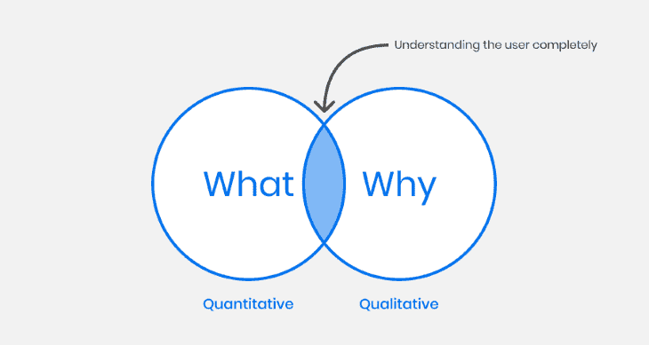
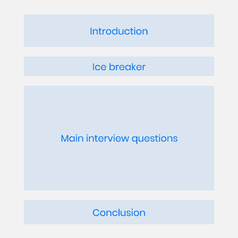

# 掌握 UX 用户访谈:指南、技巧和例子

> 原文：<https://blog.logrocket.com/ux-design/mastering-ux-user-interviews/>

用户访谈是产品设计过程中至关重要的一部分，因为它让我们能够洞察产品用户的需求、行为和动机。

用户访谈的主要目的是了解用户的痛点和需求。这些关键见解将帮助我们对 UX 设计做出决策，并确保最终产品满足用户需求。

本文的目的是 360 度解释这种技术，为什么我们在 UX 研究中使用它，你可以收集哪种数据，如何准备问题，你可以用这些数据做什么，并为你提供许多技巧，帮助你制定一个伟大的用户访谈过程。

## 目录

## 定量和定性研究

在用户研究过程中，我们可以收集两种数据:定性数据和定量数据。

定量数据来自告诉我们发生了什么的分析工具。例如，他们可以显示有多少用户将产品添加到他们的购物车中，然后什么也没买就离开了页面。

定性数据来自访谈、观察和焦点小组，以了解某些事情为什么会发生。例如，如果我们看到 35%的人放弃了他们的购物车，里面有商品，我们可以采访他们找出原因。

定量和定性数据是有价值的信息，有助于我们了解我们的用户。定量数据告诉我们发生了什么，定性数据告诉我们为什么。

## 什么是用户访谈，什么不是？

我们确实可以从与用户的每一次对话中获得洞察力。但是，与我们沿途进行的简单交谈不同，采访是我们在 UX 研究过程中进行的结构化过程，有着明确的目标:更好地了解用户及其需求。让我们仔细看看什么是用户访谈。

### 这不是销售会议

用户访谈不是销售会议。在一次用户访谈中，我们不能推销我们的产品。产品设计师不做销售，但有时会邀请销售代表。我们应该向他们解释，我们在会议中倾听用户的意见，而不是向他们出售任何东西。

### 用户访谈不是功能反馈会议

用户访谈不是讨论即将推出的功能或用户问题的潜在解决方案的地方。

第一，用户无法考虑产品架构和公司的依赖关系。

除此之外，用户往往更关注他们现有的解决方案，而不是开发新的解决方案。正如亨利·福特所说，“如果我问人们想要什么，他们会说更快的马。”

### 这不是可用性测试

当产品设计师进行可用性测试时，他们会检查用户是否理解设计师的解决方案。当执行可用性测试时，我们的目标是确定用户是否理解界面来执行一些动作，以及流程是否顺畅。

因此，在用户访谈中，我们询问用户的需求和痛点，在可用性测试中，我们想看看他们是否理解解决方案。

## 何时以及为什么你应该进行用户访谈

采访用户是构建解决人们问题的产品的一种非常有效的方式，在产品的生命周期中，它可以以不同的方式使用。

首先，我们可以利用用户访谈来发现一个问题，比如在我们开始建立一家创业公司之前。我们可以专注于一个话题，比如网上购物，问人们不喜欢它的什么。也许我们会发现很多人都在遭受的一个大问题，我们会发现有很多问题需要解决。

如果我们有一个产品，想要发展业务，解决更多的问题，也是一样的。我们可以引导他们并收集有价值的信息。

用户访谈的结果是，您将拥有大量数据，可以用来创建用户角色和用户旅程。这样，所有的团队成员都会对用户的需求和团队想要解决的问题保持一致。此外，因为每个人都知道用户需要什么，所以做决定会更容易。

## 用户访谈有局限性

首先，人们通常需要记住他们做了什么或者他们自动执行任务，所以他们不记得分享关键细节。此外，由于每个人都是不同的，面试官应该是专业的，知道如何与每个人互动，这样他们就会对他们敞开心扉，分享他们的经验。

## 准备用户访谈

在进行用户访谈之前，遵循一定的步骤是很重要的，所以让我们来回顾一下。

### 为用户访谈设定明确的目标

你需要写下你面试的目标。你通常有 3-5 个目标，但是如果超过 5 个，你的目标需要更加集中。

例如，如果你有一个卖鞋的网站，你的目标可以是:

1.  了解人们如何在网上购买鞋子
2.  了解为什么人们喜欢/不喜欢在网上买鞋
3.  了解为什么人们会放弃装有产品的购物车

花点时间把这部分做好，因为如果做得好，其他部分会更容易。

### 采访谁和多少人

考虑你的研究目标并选择与这些目标相关的人是很重要的。比如你有一个卖跑鞋的网店，你一定要搜索跑步的人，因为这样会更精准。选择不跑的用户就不会得到准确的信息。

你面试的人数可以有所不同，但一般来说，你应该和 3 到 8 个人交谈。如果你采访的人少于三个，你可能得不到一个有代表性的样本，采访超过八个人可能会花费很多时间，而且不会给你额外的洞察力。以总共 5 次面试为目标通常是一个很好的平衡，因为它允许识别模式，同时仍然是可管理的。

### 如何找到用户，如何邀请他们

寻找要采访的人可能很棘手，但这里有一些地方你可以找到他们:

*   **联系现有用户**:如果产品有一些用户，你可以给他们发电子邮件，问问他们是否愿意加入。您可以从客户成功团队或销售团队获得帮助，因为他们每天都与用户交流
*   **论坛和社交媒体**:搜索关注同一话题的论坛和其他在线社区，并邀请他们参与。如果您的产品提供 DevOps 支持，您可以找到一些专门从事 DevOps 的开发人员社区，并邀请他们参与进来
*   利用你的关系网:如果你有一个广泛的人际关系网，你可能会通过它找到面试的人。例如，如果您为 DevOps 开发工具，并且与几个 DevOps 专业人员有直接联系，您可以邀请他们参与

最好是通过人脉关系或者介绍而不是冷冰冰的邮件找到用户进行用户面试。例如，销售团队成员可以向您介绍潜在的候选人，这可以增加潜在候选人接受面试的可能性。

为你的邮件准备一些模板会帮助你更快地工作。当你第一次与用户联系时，你应该发一封邮件解释你是谁，为什么你要进行面试。你还应该再发一封邮件，解释面试将如何进行，安排时间，最后一封邮件感谢候选人。

为了与用户保持成功的关系，你必须对他们诚实，并迅速回复他们的邮件。

## 现场与远程

在现场采访中，你可以更好地观察用户的肢体语言。另一方面，远程面试有很多优点，比如面试不同时区和地点的人。此外，这也简单多了，因为对方不需要离开他们的舒适区。

我更喜欢远程选项，但是如果某些限制要求在现场完成，这也是一个选项。

以下提示将帮助你准备现场或在线面试。

**现场面试**

1.  为面试准备一个舒适的地方
2.  确保桌上有一个水瓶
3.  提供办公室的方向，让用户知道它在哪里

**在线面试**

1.  确保您的互联网连接工作正常
2.  找一个安静的地方进行采访
3.  确保您的耳机正常工作，并且您的所有语音设置都设置正确

## 写采访的脚本

一份包含问题的清晰的脚本对于一次成功的面试至关重要。该脚本有四个部分。

### 介绍

首先，我们要介绍自己和记录员(帮助我们做笔记的人，如 UX 设计师、产品经理或开发人员)，解释我们为什么要进行面试，面试将如何进行，我们不是在测试候选人或他们的知识。这会让他们在面试中感到舒服，所以他们会更愿意分享信息。

如果你想记录会议，现在是征求他们同意的时候了(我建议你提前书面询问)。最后，在继续之前，询问他们是否还有其他问题。

### 让我们打破僵局

在这一部分，你将问 3-5 个问题来打破与受访者的僵局。例如，你可能会问:

*   你能简单介绍一下你自己和你的专业背景吗？
*   你第一次对你现在工作的领域感兴趣是什么时候？
*   在你目前的角色或职责中，你最喜欢什么？
*   当你有空的时候，你喜欢做什么？
*   你典型的一天是怎样的？

### 主要面试问题

这里你问主要的研究问题。问 10-12 个问题会给你带来好的结果，但你应该准备 20-25 个问题，因为有些人很难获得信息，所以更多的问题会有帮助。为了让它更有条理，你要想好开头要问什么，结尾要问什么。以下是一些写好它们的技巧:

问一些与你的研究目标相符的问题。不要问超出你要找的范围的问题。

避免引导性问题，因为它们会导致有偏见或不准确的回答，并使参与者感到不舒服或被迫给出某个答案。假设我们为一家销售跑鞋的网店做用户调研。

如果你问“能告诉我你从哪些网站买的跑鞋吗？”你假设用户在网上买了鞋子，但是你不知道。

如果我问:“你在哪里买的跑鞋？”会不会好一点？

避免含糊的问题，因为它们会导致不清楚或混乱的回答，让参与者感到沮丧。相反，要问清楚具体的问题。

一个模糊问题的例子是:你觉得网站上的购物体验怎么样？

更好的问题可以是:

*   在网站上找到你想要的跑鞋有多容易或多难？
*   哪些因素影响了你买还是不买一双鞋的决定？

开放式问题比封闭式问题好。开放式问题在用户访谈中更好，因为它们允许参与者表达他们的想法，并给你更多的洞察力。封闭式问题的答案只能是是或不是，所以它不会帮助我们找到我们需要的信息。

一个近距离提问的例子是:“你在网上买跑鞋吗？”

一个开放性的问题会是:“你能告诉我你是怎么买跑鞋的吗？”

我们有时候会想问一个封闭的问题来继续提问。先问一个封闭式问题，再问一个开放式问题，这样可以更好地理解用户的行为。比如你可以问用户“你的跑鞋是在网上买的吗？”

如果答案是肯定的，你可能会问:

*   你为什么在网上买鞋？
*   你在网上哪里买你的鞋？

如果答案是否定的，你可能会问:

*   你为什么不在网上买鞋？
*   你在哪里买你的鞋？

试着从一个大问题开始。从一个大问题开始，然后问相关的问题，会让你一步步挖掘得更深刻。你可以问，例如:

"你能告诉我你最后一次买新跑鞋是什么时候吗？"

然后问类似这样的子问题:

*   是什么时候？
*   你花了多长时间挑选鞋子？
*   你在哪里找到他们的？
*   是什么让你选择这个品牌/鞋子？

**最后一个问题**:在这部分的最后，你可以问一个非常开放的问题，这个问题会给你更多关于用户的信息。例如，“如果你有一根神奇的棍子可以帮助你选择下一双跑鞋，它会做什么？”

### 结论

在这一点上，我们要感谢受访者，并解释我们计划如何处理这些数据。在你结束采访之前，问问被采访者是否有任何问题。这样，你就给了他们最后的发言权。

## 面试的时候

为了从受访者那里获得高质量的信息，在面试中你需要做一些关键的事情。

*   面试的时候，要冷静，不要紧张。把它想象成两个人之间的对话
*   本节课的目的是提问并从参与者那里获得信息，所以你应该少说多听。建议你 15%的时间说，85%的时间听
*   请不要回避用户对产品的负面反馈；你可以从用户的抱怨中获得有价值的洞察力
*   如果你看到用户想说话，但是你把剧本里的问题都做完了，不要怕即兴发挥。在用户访谈中获得更多的经验将有助于你更好地即兴发挥
*   偶尔人少说话，通话可能会觉得沉默。这很好，你可以等到用户继续说话。然而，如果需要很长时间，你可以打破沉默
*   做远程采访的时候，打开自动字幕功能(很多在线通话 app 都有这个功能)。这将有助于你更好地理解他人，尤其是当你用外语交流或者他们说话带有浓重的口音时
*   就我的经验来看，录下面试并再看一遍是确保你得到一切的最有效的方法
*   搜索痛点，因为这是您可以开始为用户寻找解决方案的地方

## 面试后

这是整理你收集的所有信息的时候了。你可以总结每一次面试，并从中得出要点。一旦你总结了所有的访谈，你就可以创建一份报告，与产品经理和开发人员分享。通过这种方式，团队可以优先考虑其希望开发的以下解决方案。

此外，如果您正在开发一个新产品，您可以创建一个用户角色和一个用户旅程。因此，所有团队成员都将更加了解用户及其需求。

所有的报告都应该简明扼要。写一篇长文档很容易，但是为了有效地交流结果，你必须关注关键点，而不是陷入不必要的细节。如果团队成员需要更多的解释，您可以包含访问摘要的链接。

## 最后

用户访谈是产品设计过程中至关重要的一部分，因为它允许设计师深入了解用户的需求、行为和动机。本文回顾了有效进行用户访谈所需了解的所有细节。

我们首先讨论了什么是定性和定量研究，以及用户访谈如何适合这些类别。我们还研究了何时进行用户访谈，以及如何准备。这包括设定明确的目标，确定要采访的用户，决定是现场采访还是在线采访。我们还讨论了如何创建面试脚本。

接下来，我们看到了进行顺利面试的技巧，最后，我们讨论了如何处理您收集的数据。

*精选图片来源:* [IconScout](https://iconscout.com/icon/global-team-1543500)

## [LogRocket](https://lp.logrocket.com/blg/signup) :无需采访即可获得 UX 洞察的分析

[LogRocket](https://lp.logrocket.com/blg/signup) 让您可以回放用户的产品体验，以可视化竞争，了解影响采用的问题，并结合定性和定量数据，以便您可以创建令人惊叹的数字体验。

查看设计选择、交互和问题如何影响您的用户— [立即尝试 LogRocket】。](hhttps://lp.logrocket.com/blg/signup)