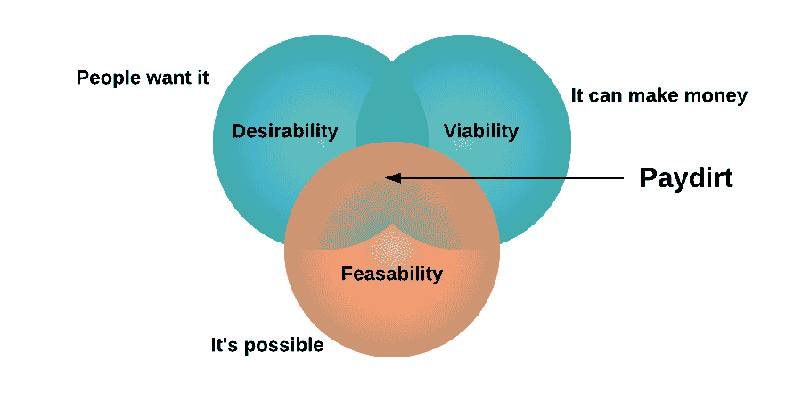
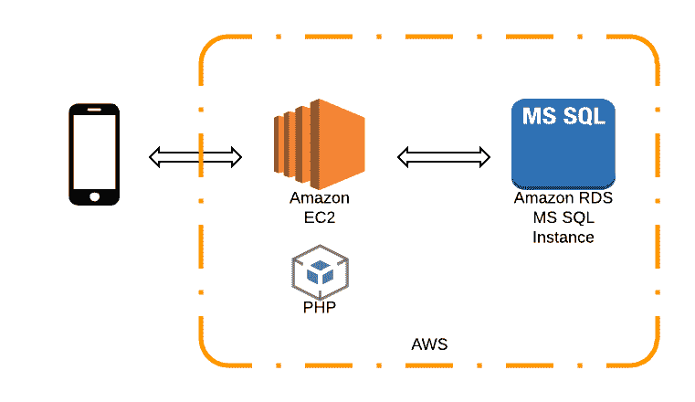
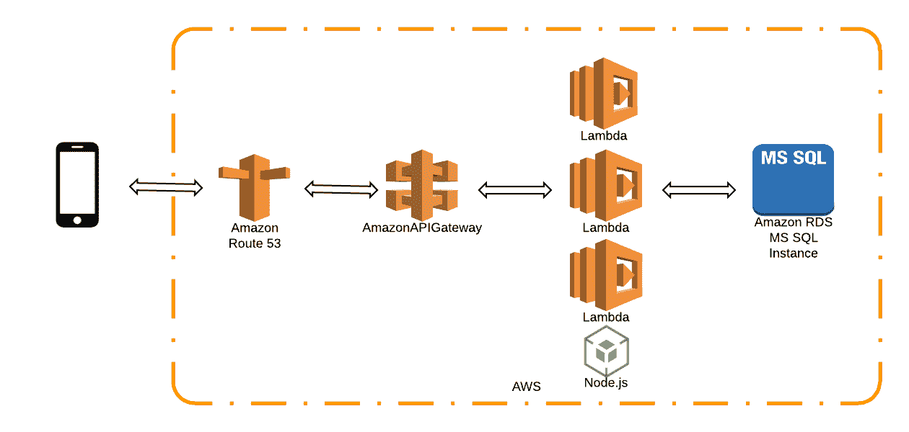
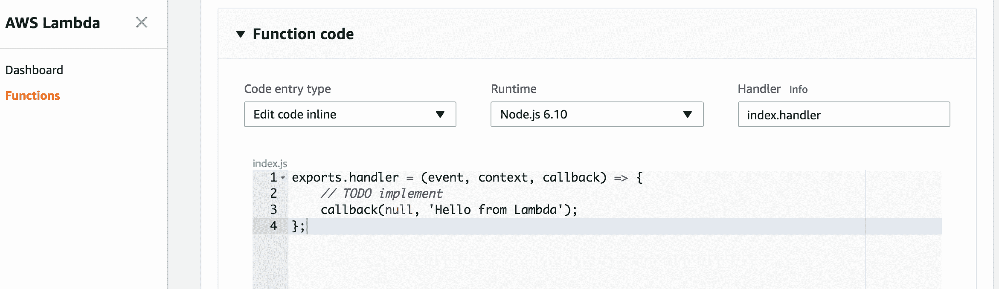
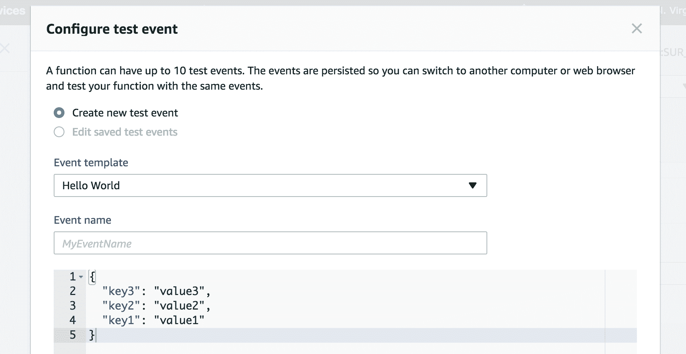

# 作为一个全栈开发者，最大化商业价值意味着一个漂亮的前端和一个简单的后端

> 原文：<https://blog.logrocket.com/maximizing-business-value-as-a-full-stack-developer-means-a-beautiful-frontend-and-a-simple-backend-55104fb27adb/>

Beautiful car! Probably doesn’t need that ridiculous engine though

当你是一个独立的开发者时，你默认是一个全栈工程师；不管你愿不愿意。虽然我的日常工作是在一个全职的创新团队，但我也在业余时间构建解决方案——应用程序、网站、Alexa 技能等等。

我(和其他人)的时间都是有限的，所以考虑每一层花多少时间，前端和后端，真的很重要。这些考虑将对我实际的架构和设计决策产生影响。

我总是从对用户重要的东西开始。

### 对用户来说什么是重要的

当我建立一个应用程序或网站(或其他任何东西)时，我总是先列出我认为重要的东西。不言而喻，最重要的是:

> 我构建的东西实际上需要做用户想要或需要的事情

本质上，我把合意性放在首位。如果没人需要，就没人下载。建起来他们就不会来了。

Clichéd at this stage but still true

你可以通过早期和迭代的用户反馈来验证这种愿望，你的想法应该是既**可行**(有财务意义)又**可行**(实际上是可能的)。

一旦这三个问题都解决了，列表的其余部分看起来就像:

1.  用户关心什么
2.  好了

显然我有点油嘴滑舌。用户关心的东西可能包括一些他们可能没有意识到他们想要的东西，但是如果他们稍微思考一下，他们可能会这样做。

用户想要出色的体验。这意味着他们想要:

*   一个易于使用的前端
*   性能前端
*   漂亮的前台
*   安全性和隐私
*   正确/获得最新信息的前端

以下是用户并不真正关心的:

*   RESTful API
*   一个 NoSQL 数据库，而不是 MySQL
*   Node.js 代替 PHP
*   缓存图层

作为开发人员，您可能需要这些东西，因为它们可以帮助您交付用户想要的东西。这使得它们很重要，但没有用户想要的重要，这基本上是一种奇妙的前端体验。

### 做什么

除非有无限的资源，否则你应该把大部分时间花在前端。

尽可能简单地在后端花费尽可能少的时间。达到可靠性、效率、准确性、安全性，然后离开。

### 后端工程师做的所有令人惊叹的工作呢？

如果你是网飞，大概有一大堆炙手可热的后端工程师，你可以花得起时间(和金钱)让你的后端尽可能的精彩。

然而，我们中的大多数人都需要保持事情的简单，直到我们的优秀产品变得如此成功，以至于我们能够负担起自己的一批优秀后端工程师。

只有这样，我们才能说“让我们再增加一两个缓存层”或“如果我们给 ISP 提供我们自己的服务器来加快速度会怎么样？”

### 我的方法

如果可能的话，我会选择无服务器架构，例如 [AWS Lambda](https://aws.amazon.com/lambda/) 。

谁愿意花时间配置和维护服务器？有了 Lambda，你可以在云端运行代码，AWS 会为你处理底层基础设施。

这不会对所有事情都有效(尽管我听到了相反的观点)，但是当它有效时，它可以显著减少你在项目期间和之后需要花费的时间。

### 一个例子

我目前有一个应用程序，是几年前为我孩子的学校开发的。后端托管在 AWS EC2 服务器上，该服务器运行 PHP 并连接到 AWS RDS MySQL 数据库:

Old backend infrastructure for school app

这在当时是有意义的，但现在是一个麻烦。今年早些时候，当我不得不更改一些证书时，我花了太多的时间，这些时间用在其他地方会更好，试图记住在服务器上的哪里更改证书！说真的…也许是垃圾箱里的某个文件夹？

如果学校里的家长知道服务器的事，我相当肯定他们不会关心它——它是我的，我不想关心它。

所以，我用这个架构代替了整个东西:

New infrastructure for school app backend

这看起来比旧的基础设施更复杂，但是维护起来更容易，设置起来也不需要那么长时间。不同组件的细分:

[**AWS 路线 53**](https://aws.amazon.com/route53/)

Route 53 管理你的 DNS 入口，例如 myamazingapi.com——实际上，如果你想为你的 API 使用一个定制的 url，你只需要这一步。

API Gateway 将为您提供一个 URL，如下所示:

> [https://api-id.execute-api.region.amazonaws.com/stage](https://api-id.execute-api.region.amazonaws.com/stage)

你可以毫无问题地使用它，你可以把 53 号公路从你的建筑中去掉。

如果你确实想使用自定义 URL，你需要设置一个“API Gateway 中 API 的自定义域名”，如这里的[所详述的](http://docs.aws.amazon.com/apigateway/latest/developerguide/how-to-custom-domains.html)，这实际上是一点额外的工作，需要一段时间，你可能认为在你的超级简单的后端中是不必要的。

[**AWS API 网关**](https://aws.amazon.com/api-gateway/)

你想要的是 AWS API Gateway——Amazon 的 API 管理器，允许你快速轻松地设置 API，完成版本控制和不同的“阶段”,如开发、测试、生产等。

您可以设置您期望的标准请求—获取、发布等。并指定这些 API 请求端点中的哪些指向哪些 AWS Lambda 函数。

**AWS Lambda 功能**

* * *

### 更多来自 LogRocket 的精彩文章:

* * *

它们用 Node.js 编写，简洁明了——每个执行一个任务(基本上是一个微服务架构):

*   一个λ获取最新的学校新闻列表
*   另一个允许张贴缺勤表
*   另一个给最新的学校事件

实际上我喜欢 PHP，但是自从我开始使用 Node，我就再也没有回去过。Node 太容易设置了，有这么多很棒的 npm 模块可用(比如 [mysql](https://www.npmjs.com/package/mysql) 来连接和使用 MySQL db ),无论如何，对我来说，这减少了需要编写的代码。

Lambdas 本身提供了一种运行(和测试)代码的简单方法，并且它们消除了对服务器的需求。您可以在在线编辑器中编写代码:

screenshot of AWS Lambda function

或者你可以上传你的代码的压缩文件。我用的是 Node.js，但你也可以写 C#、Java 或 Python。您还可以在同一个 GUI 中设置多个测试事件:

screenshot of configuring AWS Lambda test event.

我提到过不涉及服务器吗？

[**RDS MySQL**](http://docs.aws.amazon.com/AmazonRDS/latest/UserGuide/CHAP_MySQL.html)

我保留了 MySQL 数据库，因为它工作简单——只有几个表，容易连接，相对安全。它托管在 AWS RDS 上，所以我不需要担心维护 MySQL 等——您只需启动一个实例，然后连接到您的数据库。

AWS 上的替代品包括 [DynamoDB](https://aws.amazon.com/dynamodb/) ，这是一个 NoSQL 数据库，也不需要服务器，可以通过 AWS SDKs 在您的代码中轻松访问。我试过了，超级好用，我就是比较喜欢 MySQL。

### 仅此而已。简单。

一个运行良好的后端，易于维护并且相对便宜(取决于你的流量和用户数量)。对于我的学校应用程序来说，这只是微不足道的美元，实际上是由我从发布 Alexa 技能中获得的推广积分来支付的，所以它基本上是免费托管的。

最后，还值得注意的是 Route 53、API Gateway、Lambdas(如果您正在编写内联代码)和 RDS db 的设置都是在 AWS 门户上在线使用的，从而最大限度地减少了您需要在机器上使用的软件，并允许您更少地受限于您的机器。

### 可供选择的事物

我展示了如何使用 AWS 构建一个简单的后端(主要是因为我喜欢 AWS 的定价模型和易用性)。还有很多其他选择——微软的 Azure 或谷歌的 T2 Firebase 只是其中两个。

重要的是，无论你使用什么，你都要保持简洁和简单，以最小化你现在和将来的努力。

**你拥有的所有额外时间都可以用来美化你的前台(以及你的用户想要的所有其他东西)**

保持后端简单的目的是让你有更多的时间关注前端——花时间让它变得漂亮、高性能、易于使用，以及我们前面讨论的其他用户“需求”。

关于如何让你的应用看起来不糟糕的建议，见我之前的帖子[这里](https://medium.freecodecamp.org/the-engineers-guide-to-not-making-your-app-look-awful-8b178b670e27)，关于更多网站相关的设计建议，见[丹·施洛瑟](https://medium.com/u/59bbc929ff7a)的帖子[这里](https://blog.logrocket.com/design-101-from-a-non-designer-a383e20dbfcb)，也在 LogRocket 博客上。

我希望这能对你有所帮助——如果你有任何想法或问题，请在下面发表评论，并随时点击那个小按钮！谢谢安迪

## 200 只显示器出现故障，生产中网络请求缓慢

部署基于节点的 web 应用程序或网站是容易的部分。确保您的节点实例继续为您的应用程序提供资源是事情变得更加困难的地方。如果您对确保对后端或第三方服务的请求成功感兴趣，

[try LogRocket](https://lp.logrocket.com/blg/node-signup)

.

[https://logrocket.com/signup/](https://lp.logrocket.com/blg/node-signup)

LogRocket 就像是网络和移动应用程序的 DVR，记录下用户与你的应用程序交互时发生的一切。您可以汇总并报告有问题的网络请求，以快速了解根本原因，而不是猜测问题发生的原因。

LogRocket 检测您的应用程序以记录基线性能计时，如页面加载时间、到达第一个字节的时间、慢速网络请求，还记录 Redux、NgRx 和 Vuex 操作/状态。

[Start monitoring for free](https://lp.logrocket.com/blg/node-signup)

.