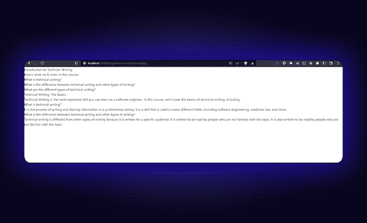
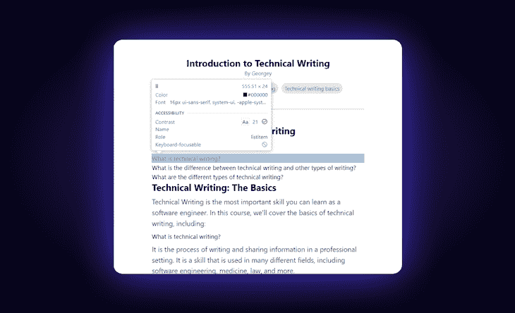
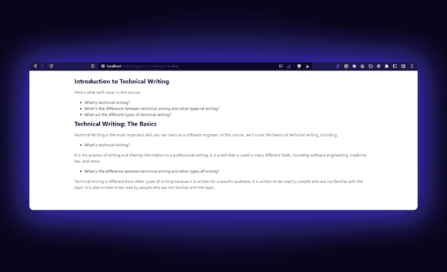
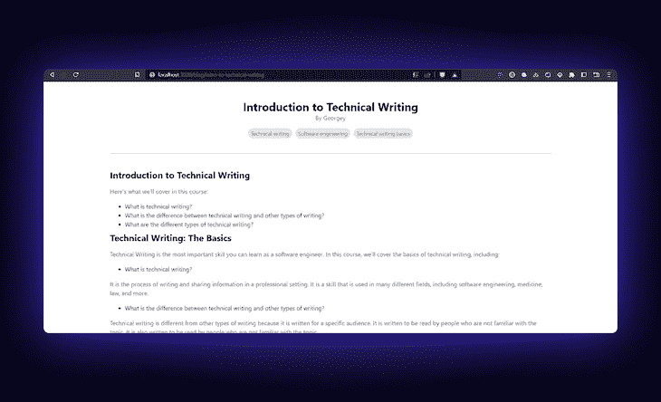
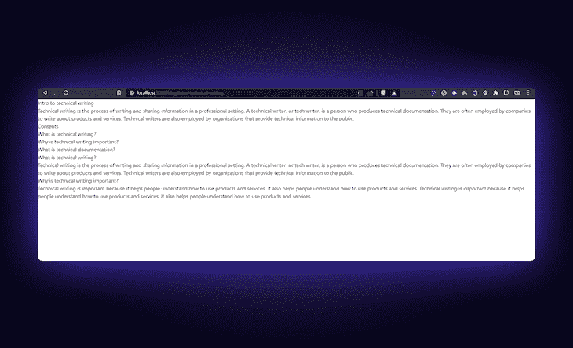
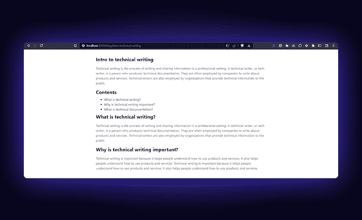
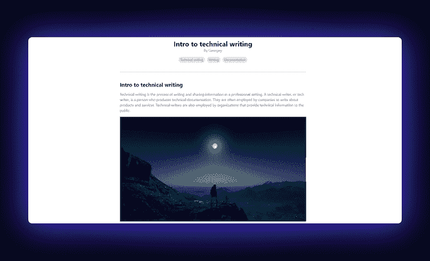
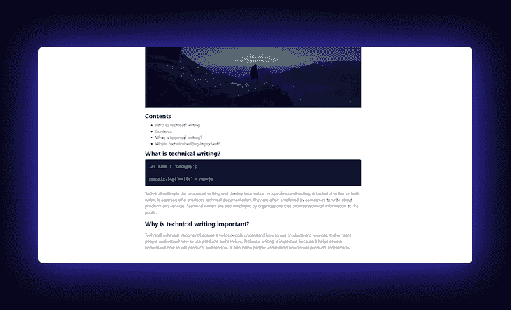

# Next.js 的 MDX 集成策略

> 原文：<https://blog.logrocket.com/mdx-integration-strategies-next-js/>

MDX 是一种基于降价的格式，因其易用性和简单性而广泛用于出版行业。Markdown 是一种具有明文格式语法的轻量级标记语言。虽然它被广泛用于编写网页，但它被设计为对于不一定熟悉 HTML 语法的用户来说易于编写和阅读。本文将探讨如何将 MDX 集成到 Next.js 应用程序中。

以下是我们将在本文中涵盖的内容！

*向前跳转:*

要跟随教程，请参考下面的[库](https://github.com/GeoBrodas/mdx-strategies)。

## 什么是降价？

Markdown 是一个简单而强大的格式化纯文本文档的工具。只需几次击键，您就可以创建标题、强调单词、创建列表等等。Markdown 易于读写，允许您创建丰富的格式化文档，而无需复杂的文字处理器。

无论你是在网上写作，在电子邮件中写作，还是在软件文档文件中写作，Markdown 都是你工具箱中的一个有价值的工具。在本文中，我们将进一步了解将 Markdown 与 Next.js 集成起来有多容易。

## Next.js 和 Markdown

[Next.js](https://blog.logrocket.com/tag/nextjs/) 是一个 JavaScript 框架，用于构建[服务器渲染和静态生成的](https://blog.logrocket.com/ssg-vs-ssr-in-next-js/)应用。Next.js 的一个有趣的特性是它与 Markdown 的集成。使用 Next.js，您可以轻松地在应用程序中导入和呈现 Markdown 文件。这对[创建博客文章](https://blog.logrocket.com/create-next-js-mdx-blog/)、文档或其他需要格式化的内容很有用。

要在 Next.js 中使用 Markdown，您需要安装所需的依赖项，比如`remark`和`rehype-react`。然后，您将使用`remark-react`组件来呈现您的降价内容。这允许您以简单易读的语法编写内容，而 Next.js 负责呈现和格式化。

在本教程中，我们将使用`next/mdx`、`next-mdx-remote`和`next-mdx-enhanced`来实现降价。

## 用`next/mdx`实现降价

要开始使用，请安装以下依赖项:

```
npm install @next/mdx @mdx-js/loader @mdx-js/react

```

要配置页面，请将以下代码添加到`next.config.js`文件中:

```
const nextConfig = {
  reactStrictMode: true,
  swcMinify: true,
};

const withMDX = require('@next/mdx')({
  extension: /\.mdx?$/,
  options: {
    remarkPlugins: [],
    rehypePlugins: [],
    providerImportSource: '@mdx-js/react',
  },
});

module.exports = nextConfig;

module.exports = withMDX({
  pageExtensions: ['js', 'jsx', 'ts', 'tsx', 'md', 'mdx'],
});

```

将上面的代码添加到 Next.js 项目中后，每个扩展名为`.mdx`的文件都将被转换成一个页面。

接下来，在`./pages`目录中创建一个文件，比如`./pages/blog/hello-world.mdx`。然后，您可以在文件中写一些降价，尽管它可能看起来很简单。下面是它的样子:



现在，我们将为我们的博客页面创建一个布局来个性化我们的 HTML 组件。在位置`./layouts/Layout.tsx`创建一个文件，并在文档中键入以下代码:

```
import { MDXProvider } from '@mdx-js/react';

interface LayoutProps {
  children: React.ReactNode;
}

function Layout ({children, ...props}: LayoutProps) {
   return (
    <MDXProvider components={components}>
      {children}
    </MDXProvider>
}

```

接下来，将这个`Layout`组件添加到降价页面:

```
import Layout from '../../components/layout';

# Hello World!

{/* Markdown content */}

export default ({ children }) => <Layout>{children}</Layout>;

```

虽然现在没有发生什么，但是我们已经建立了配置减价页面的框架。现在，让我们创建一些基本的定制组件，从标题标签开始。

### 创建自定义组件

在`./components/mdx/Heading.tsx`中，添加以下内容:

```
export const Heading = {
  H1: ({ children }) => <h1 className="text-2xl font-bold">{children}</h1>,
  H2: ({ children }) => <h2 className="text-xl font-bold">{children}</h2>,
};

```

类似地，在`./components/mdx/Para.tsx`为段落标签添加一个:

```
function Para({ children }) {
  return <p className="text-gray-700 my-4 text-base">{children}</p>;
}
export default Para;

```

您可以根据规格制造更多独特的组件。您可以通过点击`Ctrl + Shift + C`来访问开发工具。您可以将鼠标悬停在想要检查的元素上，查看网站上哪些元素围绕着它:



接下来，转到`Layout`组件，添加以下更改:

```
const components = {
  h1: Heading.H1,
  h2: Heading.H2,
  p: Para,
  ul: UnorderedList,
};

function Layout ({children, ...props}: LayoutProps) {
  return (
    <MDXProvider components={components}>
      <div className="w-[80%] mx-auto p-6">
        {children}
      </div>
    </MDXProvider>
  )
}

```

看起来更好！



使用`next/mdx`的另一个技巧是给你的减价内容添加元数据。当[将 SEO 添加到你的减价页面](https://blog.logrocket.com/manage-seo-next-js-with-next-seo/)时，这会很有帮助。

现在，将下面的代码添加到您刚刚创建的 Markdown 页面中:

```
export const meta = {
  author: 'Georgey',
  title: 'Introduction to Technical Writing',
  slug: 'introduction-to-technical-writing',
  topics: [
    'technical writing',
    'software engineering',
    'technical writing basics',
  ],
};

{/* Makrdown content */}

export default ({ children }) => <Layout meta={meta}>{children}</Layout>;

```

现在可以用我们之前创建的`Layout.tsx`组件来访问这个对象。在`./layouts/Layout.tsx`文件中，在 Next.js 提供的`Head`组件上添加一些元数据内容:

```
// ...imports
import Head from "next/head"

interface LayoutProps {
  children: React.ReactNode;
  meta: { author: string; title: string; slug: string; topics: string[] };
}

function Layout ({children, ...props}: LayoutProps) {
  return (
    <MDXProvider components={components}>
      <Head>
        <title>{props.meta.title}</title>
        <meta name="description" content={props.meta.title} />
      </Head>
    </MDXProvider>
  )
}

```

完成后，我们的页面可以被[网络爬虫](https://blog.logrocket.com/node-js-web-scraping-tutorial/)索引，而不会遇到问题，并在[灯塔评分](https://blog.logrocket.com/lighthouse-and-how-to-use-it-more-effectively/)上获得一分。现在我们有了元数据，我们也可以将它包含在 TL 中；该页的 DR 部分为读者提供了一个快速概览。

在`./layouts/Layout.tsx`组件中，添加以下内容:

```
function Layout ({children, ...props}: LayoutProps) {
  return (
    <MDXProvider>
      <div className="w-[80%] mx-auto p-6">
        {/* Head */}

        <div className="flex flex-col mt-6 mb-10 items-center justify-center text-center">
          <h1 className="text-3xl font-bold">{props.meta.title}</h1>
          <p className="text-md text-gray-500">By {props.meta.author}</p>
          {/* topics */}
          <div className="flex flex-wrap gap-2 mt-4">
            {props.meta.topics.map((topic) => (
              <span
                key={topic}
                className="text-sm text-gray-500 bg-gray-200 rounded-full px-2 py-1"
              >
                {topic.slice(0, 1).toUpperCase() + topic.slice(1)}
              </span>
            ))}
          </div>
        </div>

        {children}
      </div>
    </MDXProvider>
  )
} 

```

为了帮助用户理解页面的相关性，我们在上面的部分显示了文章所属的`key`标签。下面是它的样子:



## MDX 与`next-mdx-remote`的集成

要在 repo 中查看该方法的代码，请将分支更改为`using-next-mdx-remote`以引用`next-mdx-remote`的代码。

从`next-mdx-remote`开始，安装下面的依赖项:

```
npm install next-mdx-remote

```

您可以注释掉我们之前为`next/mdx`添加到`next.config.js`文件中的配置。对于`next-mdx-remote`我们不需要任何东西。

接下来，清除`./pages/blog`目录中的降价文件，并将它们移动到`./pages`之外的一个单独的目录中，这个目录名为`./database`。在`./database`目录中，确保你为每个文章页面创建了所有的 Markdown 文件。

您的文件结构应该如下所示:

```
- pages
  |- blog
    |- [slug].tsx
- database
  |- intro-to-technical-writing
    |- intro-to-technical-writing.mdx

```

当我们在文章中添加图像等元素时，这种文件格式会很有用。之后，Markdown 文件和元数据对象需要删除`export`行。你现在可以在你的降价文件中包含一个名为`frontmatter`的特性。

这将作为我们页面的元数据，并在获取减价内容时自动处理:

```
---
title: Intro to technical writing
author: Georgey
topics: technical writing, writing, documentation
description: A short introduction to technical writing
---
# Intro to technical writing
Technical writing is the process of writing and sharing information in a professional setting. A technical writer, or tech writer, is a person who produces technical...
{/* ...content below */}

```

剩下要做的就是在`[slug].tsx`文件中设置`next-mdx-remote`。我们将使用 Next.js 的[动态路由](https://blog.logrocket.com/implementing-ssr-next-js-dynamic-routing-prefetching/)特性为我们的`./database`目录中的每个文件创建一个页面。

我更喜欢这种方法，因为它将 Markdown 内容从数据获取代码中分离出来，这一点更重要。在`[slug].tsx`中，添加以下几行:

```
import fs from "fs"

export async function getStaticPaths() {
  const files = fs.readdirSync('database');
  return {
    paths: files.map((file) => ({
      params: {
        slug: file,
      },
    })),
    fallback: false,
  };
}

```

需要用构建时静态生成的路由数量来指定`./pages`中的动态路由。这就是使用`getStaticPaths`的地方。我们可以使用 Node.js 文件系统[模块](https://nodejs.org/dist/latest-v18.x/docs/api/fs.html#fswritefilesyncfile-data-options)来检索文件名，用作每个文章页面的路径名。

一旦完成，剩下的就是获取特定的降价内容。为此，创建一个`getStaticProps`函数并包含以下代码:

```
import { GetStaticPropsContext } from 'next';
import { serialize } from "next-mdx-remote/serialize"
import path from "path"

export async function getStaticProps(ctx: GetStaticPropsContext) {
  const { slug } = ctx.params;

  const source = fs.readFileSync(
    path.join('database', slug as string, (slug + '.mdx') as string),
    'utf8'
  );

  const mdxSource = await serialize(source, { parseFrontmatter: true });
  return {
    props: {
      source: mdxSource,
    },
  };
}

```

在上面的代码中，请求的`slug`被用作从`./database`目录中获取降价内容的`parameter`。同样，使用`fs`模块，减价内容被获取并序列化到 JSX，由`next-mdx-remote`提供的`parser`使用。

我们将很快在客户端使用它。注意，我们向属性标记为`parseFrontmatter`的`serialize`函数传递了一个额外的对象，以解析来自 Markdown 内容的`frontmatter`。如果不这样做，您可能会在序列化后得到一个空对象。

### 配置客户端

现在让我们转到客户端。添加以下代码以立即查看降价:

```
import { GetStaticPropsContext, InferGetStaticPropsType } from 'next';
import { MDXRemote } from 'next-mdx-remote';
import Head from 'next/head';

function ArticlePage({
  source,
}: InferGetStaticPropsType<typeof getStaticProps>) {
  return (
    <div>
      <Head>
        <title>{source.frontmatter.title}</title>
      </Head>
      <MDXRemote {...source} />
    </div>
  );
}

// getStaticPaths + getStaticProps

export default ArticlePage;
```



像以前一样，让我们向 MDX 解析器添加一些定制组件。在`next-mdx-remote`中做这件事相当简单:

```
<div className="max-w-4xl mx-auto px-4 sm:px-6 lg:px-8 py-8">
 <MDXRemote
  {...source}
  components={{
   h1: Heading.H1,
   h2: Heading.H2,
   p: Para,
   ul: UnorderedList,
  }}
 />
</div>

```

接下来，导入我们之前用于`@next/mdx`的定制组件:

```
import { Heading } from '../../components/mdx/Heading';
import Para from '../../components/mdx/Para';
import UnorderedList from '../../components/mdx/UnorderedList';

```

瞧啊。



## 使用`react-markdown`进行 MDX 集成

现在，我们将看看使用`[react-markdown](https://blog.logrocket.com/how-to-safely-render-markdown-using-react-markdown/)`作为 MDX 集成的策略。首先，安装以下依赖项:

```
npm install react-markdown gray-matter

```

与`next-mdx-remote`中内置的`serialize`函数不同，`gray-matter`是一个用于解析页面中可用的`frontmatter`的包。

让我们继续看我们的`[slug].tsx`文件。当我们获取文件名时,`getStaticPaths`函数将保持不变。在`getStaticProps`功能中只有一件事会改变，那就是用`gray-matter`代替`serialize`功能。`gray-matter`帮助解析 Markdown 页面中可用的元数据内容，并对其进行适当的序列化。

同样导入`gray-matter`并添加以下代码:

```
import matter from 'gray-matter';

export async function getStaticProps(ctx: GetStaticPropsContext) {
  const { slug } = ctx.params;
  const source = fs.readFileSync(
    path.join('database', slug as string, (slug + '.md') as string),
    'utf8'
  );
  const { data, content } = matter(source);
  return {
    props: {
      data,
      content,
    },
  };
}

```

可以析构`matter`函数的返回值，得到`data`和`content`。请注意，我们将对`react-markdown`使用`.md`文件扩展名，而不是`.mdx`，所以请确保在上面的`path.join()`方法中进行这一更改。接下来，转到`client`函数并添加以下几行:

```
import ReactMarkdown from "react-markdown"

function ArticlePage({
  data,
  content,
}: InferGetStaticPropsType<typeof getStaticProps>) {
  return (
    {/* header and layout */}
    <Layout meta={data}>
      <ReactMarkdown children={content} />
    </Layout>
  )
}   

```

完成后，您的页面应该能够呈现降价内容。接下来，让我们像往常一样添加自定义组件。同样，这在`react-markdown`中非常简单:

```
<ReactMarkdown
  children={content}
  components={{
    h1: Heading.H1,
    h2: Heading.H2,
    p: Para,
    ul: UnorderedList,
  }}
/>

```

要查看可定制组件的完整列表，请访问[官方 MDX.js 页面](https://mdxjs.com/)。

## 延迟加载和图像优化

我们的文章也可能包含图像，所以让我们定制`img`标签来使用 Next.js `Image`组件，它允许延迟加载和[图像优化](https://blog.logrocket.com/next-js-automatic-image-optimization-next-image/)。

首先，创建一个新文件`./components/mdx/Image.tsx`:

```
import Image from 'next/legacy/image';

function CustomImage({ src, alt, ...props }) {
  return (
    <div className="w-[10rem] p-10 mx-auto">
      <Image
        src={src}
        width={300}
        height={100}
        layout="responsive"
        alt={alt}
        {...props}
      />
    </div>
  );
}
export default CustomImage;

```

然后，将其添加到`ReactMarkdown`组件内的配置中:

```
<ReactMarkdown
  children={content}
  components={{
    h1: Heading.H1,
    h2: Heading.H2,
    p: Para,
    ul: UnorderedList,
    image: ({ src, alt, ...props }) => {
      return <CustomImage src={src} alt={alt} {...props} />;
    },
  }}
/>

```

完成后，您应该能够查看图像:



## 添加语法突出显示

您可以添加到博客中的另一个有趣的特性是代码块的语法突出显示。为此，我们将使用 [react-syntax-highlighter](https://blog.logrocket.com/guide-syntax-highlighting-react/) 。要安装它，请按如下方式使用 npm:

```
npm install react-syntax-highlighter

```

接下来，导入`Provider`和我们将用于代码块的主题:

```
// syntax-highlighter
import { Prism as SyntaxHighlighter } from 'react-syntax-highlighter';
import { atomDark } from 'react-syntax-highlighter/dist/cjs/styles/prism';

```

在`ReactMarkdown`组件中，添加另一个定制组件:

```
<ReactMarkdown
  children={content}
  components={{
    ...components,
    code({ node, inline, className, children, ...props }) {
     const match = /language-(\w+)/.exec(className || '');
     return !inline && match ? (
      <SyntaxHighlighter
       children={String(children).replace(/\n$/, '')}
       style={atomDark}
       language={match[1]}
       PreTag="div"
       {...props}
      />
     ) : (
      <span className={className} {...props}>
       {children}
      </span>
     );
    },
  }}
/>

```

这一行代码检查 Markdown 内容中是否存在单个`"``"`代码标签或代码块，它们通常被包装在`"```---content---```"`中。如果是一个代码块，它检索语言并将其分配给`SyntaxHighlighter`组件，添加适当的语法高亮显示。一旦添加了此功能，您应该会在代码片段中看到以下主题:

```
```js
let name = "Georgey";

console.log("Hello " + name );
```

```



## 结论

总之，本文概述的三种不同的 MDX 集成策略各有其独特的优点和缺点。通过将`@next/mdx`添加到你的 Next.js 项目中，你可以很容易地在你的 Markdown 文件中编写 JSX，并利用 Next.js 提供的[自动代码拆分](https://blog.logrocket.com/dynamic-imports-code-splitting-next-js/)

允许您将 Markdown 内容从代码库中分离出来，使其更易于管理。同时，`react-markdown`为您提供了一个轻量级的解决方案，以最少的设置将 Markdown 转换为 JSX。最终，您的 Next.js 项目的最佳 MDX 集成策略将取决于您的特定需求和要求。

## [LogRocket](https://lp.logrocket.com/blg/nextjs-signup) :全面了解生产 Next.js 应用

调试下一个应用程序可能会很困难，尤其是当用户遇到难以重现的问题时。如果您对监视和跟踪状态、自动显示 JavaScript 错误、跟踪缓慢的网络请求和组件加载时间感兴趣，

[try LogRocket](https://lp.logrocket.com/blg/nextjs-signup)

.

[](https://lp.logrocket.com/blg/nextjs-signup)[](https://lp.logrocket.com/blg/nextjs-signup)

LogRocket 就像是网络和移动应用的 DVR，记录下你的 Next.js 应用上发生的一切。您可以汇总并报告问题发生时应用程序的状态，而不是猜测问题发生的原因。LogRocket 还可以监控应用程序的性能，报告客户端 CPU 负载、客户端内存使用等指标。

LogRocket Redux 中间件包为您的用户会话增加了一层额外的可见性。LogRocket 记录 Redux 存储中的所有操作和状态。

让您调试 Next.js 应用的方式现代化— [开始免费监控](https://lp.logrocket.com/blg/nextjs-signup)。