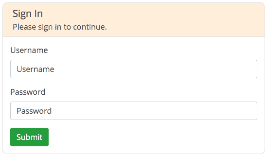
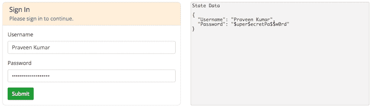
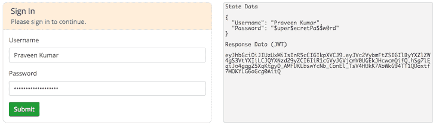
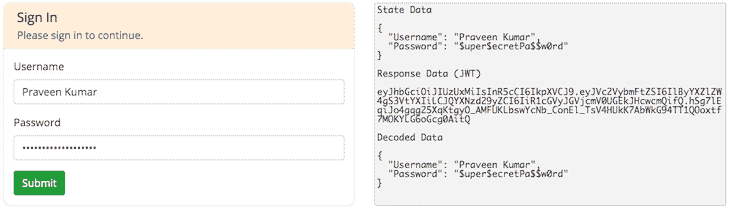
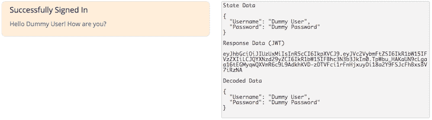
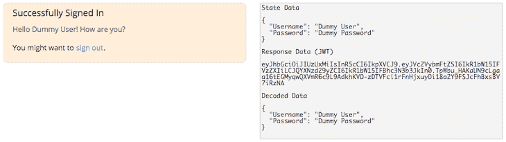
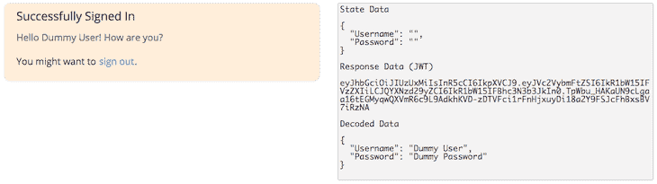
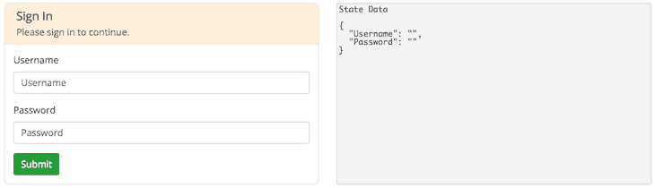

# 使用 JWT 认证创建全栈 MERN 应用程序:第 3 部分

> 原文：<https://blog.logrocket.com/mern-app-jwt-authentication-part-3/>

这是我们关于使用 JWT 认证创建全栈 MERN 应用程序系列的第二部分的继续。如果你还没有阅读第二部分，请阅读额外的上下文以便你能更好地理解这篇文章。你也可以[在这里阅读第一部分](https://blog.logrocket.com/mern-app-jwt-authentication-part-1/)。

到目前为止，我们已经有了一个可以在服务器端生成 JSON Web 令牌的系统。让我们通过在前端构建一个 React 单页面应用程序来开始使用它。

## 创建 React 应用程序

我首先推荐的是环境设置。在经历了 Wes Bos 的[课程后，我更倾向于使用 Visual Studio 代码(我一开始很讨厌它，因为它是一个](https://wesbos.com/courses/)[完全不同的开发环境](https://blog.praveen.science/my-personal-development-environment/)，忠实于 Sublime Text)。

创建新的 React 应用程序最简单的方法是使用简单的 [`create-react-app`](https://facebook.github.io/create-react-app/) 。导航到终端中的客户端目录，然后运行:

```
➜  FrontEnd git:(master) $ npx create-react-app .
```

这里的`[npx](https://www.npmjs.com/package/npx)`不是输入错误，而是正确的命令。`create-react-app`应用程序安装像`react`、`react-dom`和`react-scripts`这样的包。一旦完成，您就有了全新的 React 应用程序。

## 确保 HTTPS 的安全

我们今天访问的几乎所有网站都受到 HTTPS 的保护。如果你的还没有，[应该是](https://developers.google.com/web/fundamentals/security/encrypt-in-transit/why-https)。使用 HTTPS 保护您的服务器还将确保您无法从不受 HTTPS 保护的服务器向此服务器发送请求。这给使用本地开发环境的开发人员带来了一个问题，因为他们都是在开箱即用的`[http://localhost](http://localhost)`上运行的。

当我们使用不同的认证机制、支付网关和类似的技术时，我们肯定需要用 HTTPS 保护我们的本地开发环境，不仅要使它们工作，还要模拟生产服务器。你有一个简单的方法使用 React 来使用 HTTPS，你可以在"[使用 React 的代理来超越 CORS &使用 HTTPS 进行 API 调用](https://blog.praveen.science/using-reacts-proxy-to-get-ahead-of-cors/)"

## 安装依赖项

因为应用程序是使用`create-react-app`构建的，所以所有东西都是默认安装的。主要依赖关系包括:

*   `react`
*   `react-dom`
*   `react-scripts`

`react-scripts`实际上是一个完整的包，包含了将 React JSX 和 ES6+转换成基于 ES5 的 JavaScript 所需的所有依赖项(比如`webpack`和`babel`)。除了上面的依赖项，我们可能还需要一些。

我们将使用的一个主要的样式相关的包是 [`node-sass`](https://www.npmjs.com/package/node-sass) ，用于将 [SCSS](https://sass-lang.com/) 编译成 CSS。另一个值得注意的是用于触发 HTTP `GET`、`POST`、`PUT`和`DELETE`调用的 [`axios` AJAX 库](https://github.com/axios/axios)。这只是一个漂亮的 [`fetch()` API](https://developer.mozilla.org/en-US/docs/Web/API/Fetch_API) 的包装器。

让我们通过使用我们最喜欢的`npm install`命令来安装上面两个依赖项。您可以使用`npm install`安装多个包，方法是使用空格分隔的库名来指定它们，如下所示:

```
➜  FrontEnd git:(master) $ npm install axios node-sass
npm WARN [email protected] requires a peer of [email protected]* but none is installed. You must install peer dependencies yourself.

+ [email protected]
installed 1 package and audited 36854 packages in 8.074s
```

### 同行要求

在任何情况下，如果您为 React 应用程序使用 TypeScript，您可能需要使用`npm`为`[ts-pnp](https://www.npmjs.com/package/ts-pnp)`安装`[typescript](https://www.npmjs.com/package/typescript)`包，这是一个低级包，它导出一个函数来实现来自`CompilerHost` 的 [`resolveModuleName`钩子:](https://github.com/Microsoft/TypeScript/wiki/Using-the-Compiler-API%23customizing-module-resolution)

```
➜  FrontEnd git:(master) npm install typescript
+ [email protected]5
added 1 package from 1 contributor, updated 1 package and audited 36855 packages in 8.982s
➜  FrontEnd git:(master) npm install axios
+ [email protected]
updated 1 package and audited 36855 packages in 8.959s
```

您可以看到，一旦安装了`typescript`包，错误就消失了。

## 使用 React 的代理

在开发阶段，我们可以在 React web 应用程序中设置一个简单的代理服务器来模拟 API 调用的真实环境。这非常重要，因为我们将只使用域的相对 URL 来进行 API 调用，所有调用都将使用前缀`/api/`进行路由。

我们需要做的就是在我们的`package.json`文件中添加一个新行来获得这个特性。考虑到我们的 Express.js API 服务器——我们在[的上一篇文章](/)中构建的——运行在端口`3100`上，我们应该使用以下更改让 React dev 服务器(CRA/webpack)知道:

```
{
  "name": "client",
  "version": "0.1.0",
  "proxy": "http://localhost:3100/",    // Set the proxy this way. All the unrouted requests will go here.
  "private": true,
  // Other stuff.
}
```

## 设置 AJAX 调用

这是文章现在的主要症结。我们需要为所有 AJAX 调用设置一个包装器，然后我们需要为每个服务设置包装器。作为服务调用方，你可以更好地调用它们——这将是最好的方法。

为了了解如何用 Axios 启动 AJAX 调用，让我们只关注最常见的`GET`和`POST`请求。请记住，Axios 返回了一个我们需要进一步处理的承诺。

### 导入 Axios

你可以通过它的包导入 Axios。简单的导入就可以了，不需要到处导入；这就是为什么我们有服务调用者包装器。

```
import Axios from "axios";
```

许多人使用`Axios`或`axios`，但这真的无关紧要，因为这是默认导入。默认导入没有命名，所以您可以拥有任何东西。你甚至可以有这样的东西:

```
import Praveen from "axios";
```

它工作起来完美无缺。我们暂时用`Axios`吧。😇

### HTTP `GET`和`POST`请求

HTTP `GET`和`POST`请求是 API 请求的两个基本方法(或动词)。执行 HTTP `GET`请求的最简单方法如下。假设我们正在点击`/user` API 端点来检索关于以`name`为`praveen`的用户的详细信息:

```
// Make a request for a user with a given name.
axios.get("/user?name=praveen")
  .then(function (response) {
    console.log(response);
  })
  .catch(function (error) {
    console.log(error);
  });
```

上面的请求也可以这样写:

```
// Optionally, the request above could also be done as:
axios.get("/user", {
  params: {
    name: "praveen"
  }
})
  .then(function (response) {
    console.log(response);
  })
    .catch(function (error) {
    console.log(error);
  });
```

第二个参数是`data`参数。无论如何，如果你有一个要发送的对象，你可以这样发送。

`POST`请求是类似的。首先你需要将方法改为`axios.post()`，并且你将给出`data`参数。例如，让我们尝试用`name`参数创建一个用户:

```
axios.post("/user", {
  firstName: "Praveen",
  lastName: "Kumar",
  name: "praveen"
})
  .then(function(response) {
    console.log(response);
  })
  .catch(function(error) {
    console.log(error);
  });
```

很棒，对吧？你可以在这里查看 Axios 和`fetch()`之间的一些[差异。](https://blog.logrocket.com/axios-or-fetch-api/)

## JSON Web 令牌认证

继续，这个应用程序的主要原因是演示客户端的 [JSON Web Token (JWT)](https://jwt.io/) 认证。让我们看一下 JWT 认证工作流。

首先，客户机向服务器发出一个 HTTP `POST`请求，然后服务器创建一个 JSON Web 令牌并发送给客户机。客户端然后在本地存储 JWT(使用一个`localStorage`或变量)并在`Authorization`头上发送它。

当向服务器发出一个`POST`请求时，JWT 作为一个字符串令牌以如下格式发送:


有三个部分——报头、有效载荷和签名。签名部分仅用于验证 JWT，由于我们在客户端，验证需要`secret-key`，所以我们将**而不是**在客户端验证令牌——尽管这是可能的。我们只需要有效载荷部分。

### 安装 JWT 图书馆

为了解析 JWT，我们将使用我们在服务器端用来生成 JWT 的同一个库。`[jsrsasign](https://www.npmjs.com/package/jsrsasign)`在客户端也运行良好。让我们使用`npm install`将它安装在客户端 React 应用程序上，如下所示:

```
➜  FrontEnd git:(master) npm install jsrsasign
npm WARN [email protected] requires a peer of [email protected]* but none is installed. You must install peer dependencies yourself.

+ [email protected]
added 1 package from 1 contributor and removed 1 package in 18.476s
```

以上是软件包的典型安装。您可能会遇到同样的`[[email protected]](/cdn-cgi/l/email-protection)*`对等依赖问题，如果您在应用程序中使用 TypeScript，最好安装任何版本的`typescript`。

### 将`jsrsasign`导入 React 应用程序

安装完成后，只需在 React 应用程序中使用普通导入即可使用该库:

```
import JSRSASign from "jsrsasign";
```

您将从该库中使用的最常见的函数有:

*   **`[b64utos()](https://kjur.github.io/jsrsasign/api/symbols/global__.html#b64utos)`:**`b64utos()`函数用于将 Base64URL 编码的字符串转换为 ASCII 字符串。注意，这个函数不能用于 Base64URL 编码的非 ASCII 字符。
*   **`[WS.readSafeJSONString()](https://kjur.github.io/jsrsasign/api/symbols/KJUR.jws.JWS.html#.readSafeJSONString)`:**`JWS.readSafeJSONString()`函数读取一个字符串`"s"`作为 JSON 对象，如果它是安全的。如果字符串`"s"`是一个格式错误的 JSON 字符串，或者不是 JSON 字符串，则返回 null 否则，它返回一个 JSON 对象。

## 从创建 React 应用程序中清除

到目前为止，我们已经设置好了大部分环境和依赖项。此时，我们应该从自动生成的 CRA 存储库中删除并更改一些内容。我们要做的第一件事是[删除所有的 CSS 文件和默认的 React 标志](https://github.com/praveenscience/JWT-MERN-FullStack/commit/2952aef355d1adf2979738c300555e009a0f0b39)，并删除已删除文件的导入。

### 组织文件

我也遵循我自己为我的 React 应用程序设计的模式，这将是“类别优先”的模型。我将所有内容按照它们在 React 中的位置进行分类，并将`src`文件夹简化为:

*   `actions`:包含所有的 Redux 动作。*(当前项目未实施…)*
*   `components`:包含所有的 React 组件。如果组件有依赖组件，它们以分层的方式驻留在这里。
*   可能会使主要组件混乱的实用功能。*(当前项目未实施…)*
*   `reducers`:包含所有的 Redux Reducers。*(当前项目未实施…)*
*   `services`:包含所有使用 Axios 的 AJAX URLs 和服务调用。
*   包含所有用于造型的 SCSS 文件。在`index.js`中只导入了一个文件
*   `tests`:包含所有与测试相关的文件。*(不在当前项目范围内……)*
*   `index.js`:服务器启动时加载的主文件，包含样式和 App 组件。

### 更新主应用程序组件

我们将把我们的`App.js`从`src`文件夹移到`components/App.js`。让我们也从`App.js`中删除不必要和未使用的导入，将其精简为以下内容:

```
import React from "react";

function App() {
  return (
    <div className="App">
      <p>Hello World!</p>
    </div>
  );
}

export default App;
```

### 更新公共 HTML

有了上面的文件组织，我们应该做的下一个更改是主`public/index.html`文件，它首先在浏览器上加载，并加载我们的 React 应用程序。修改包括改变标题，包括字体，CSS 框架，以及我们项目中的引导等等。[最终文件](https://github.com/praveenscience/JWT-MERN-FullStack/blob/master/client/public/index.html)如下所示(无注释):

```
<!DOCTYPE html>
<html lang="en">
  <head>
    <meta charset="utf-8" />
    <link rel="shortcut icon" href="%PUBLIC_URL%/favicon.ico" />
    <meta name="viewport" content="width=device-width, initial-scale=1" />
    <meta name="theme-color" content="#000000" />
    <meta name="description" content="Creating a Full Stack MERN Application using JWT Authentication" />
    <link rel="apple-touch-icon" href="logo512.png" />
    <link rel="stylesheet" href="https://stackpath.bootstrapcdn.com/bootstrap/4.3.1/css/bootstrap.min.css" />
    <link rel="stylesheet" href="https://stackpath.bootstrapcdn.com/font-awesome/4.7.0/css/font-awesome.min.css" />
    <link rel="stylesheet" href="https://fonts.googleapis.com/css?family=Open+Sans:400,400i,600,600i&display=swap" />
    <link rel="manifest" href="%PUBLIC_URL%/manifest.json" />
    <title>Creating a Full Stack MERN Application using JWT Authentication</title>
  </head>
  <body>
    <noscript>You need to enable JavaScript to run this app.</noscript>
    <div id="root"></div>
  </body>
</html>
```

### 风格

更新 HTML 文件后，接下来是 CSS 部分。我们去掉了所有的 CSS 文件，只有一个主`styles/App.scss`。注意，这是一个 SCSS 文件，所以没有安装`node-sass`它不会运行。一旦我们在`styles`目录中创建了`App.scss`，让我们将`index.js`改为使用 SCSS 文件而不是 CSS 文件:

```
- import './index.css';
+ import "./styles/App.scss";
```

包含在`index.js`中的`styles/App.scss`文件最初看起来像这样:

```
body {
  margin: 0;
  padding: 0;
  list-style: none;
}
.App {
  &,
  * {
    margin: 0;
    padding: 0;
    list-style: none;
  }
}
```

尽管我们不包括本文中的测试，但请确保从`tests/App.test.js`中移除未使用和过时的导入，然后我们可以安全地忘记应用程序其余部分的`tests`目录。

## 登录表单

让我们快速构建一个简单的表单来帮助我们获取用户名和密码。有多种方法可以获取这些信息；我们来回顾一下我最喜欢的一个。

我们将使用组件状态来存储输入的当前值，并且基于此，我们将更新它们。在 React 中有许多构建表单的解决方案，但是我将在后面介绍它们。

### 构建表单

因为表单将是一个组件，而 React 就是关于组件的，所以让我们在`App.js`旁边创建一个登录组件，比如说`components/Login.js`。让我们使用 Bootstrap 的[表单](https://getbootstrap.com/docs/4.3/components/forms/)和[卡片](https://getbootstrap.com/docs/4.3/components/card/)布局构建一个漂亮的表单。但在此之前，让我们先用如下所示的基本框架创建登录组件:

```
import React, { Component } from "react";

class Login extends Component {
  render() {
    return (
      <div className="login">

      </div>
    );
  }
}
export default Login;
```

现在让我们将它导入到`App.js`中并使用它。您不需要添加`.js`扩展名，因为它是一个 JavaScript 文件。

```
import React from "react";
// Importing the Login Component
import Login from "./Login";

function App() {
  return (
    <div className="App">
      {/* Import the Login */}
      <Login />
    </div>
  );
}
```

在 Bootstrap 的[网格系统](https://getbootstrap.com/docs/4.3/layout/grid/)的帮助下，为表单创建一个漂亮的居中布局变得更加容易。我做了一个简单的例子，看起来像这样:

```
import React, { Component } from "react";

class Login extends Component {
  render() {
    return (
      <div className="login">
        <div className="container">
          <div className="row">
            <div className="col-6 offset-3">
              <div className="card">
                <div className="card-body">
                  <h5 className="card-title">Sign In</h5>
                  <h6 className="card-subtitle mb-2 text-muted">
                    Please sign in to continue.
                  </h6>
                  <form>
                    <div className="form-group">
                      <label htmlFor="exampleInputEmail1">Email address</label>
                      <input
                        type="email"
                        className="form-control"
                        id="exampleInputEmail1"
                        aria-describedby="emailHelp"
                        placeholder="Enter email"
                      />
                    </div>
                    <div className="form-group">
                      <label htmlFor="exampleInputPassword1">Password</label>
                      <input
                        type="password"
                        className="form-control"
                        id="exampleInputPassword1"
                        placeholder="Password"
                      />
                    </div>
                    <button type="submit" className="btn btn-success">
                      Submit
                    </button>
                  </form>
                </div>
              </div>
            </div>
          </div>
        </div>
      </div>
    );
  }
}
export default Login;
```

上面的完整表格是从 React 的官方文档中截取的。我已经把所有的`class=`改成了`className=`，把`for=`改成了`htmlFor=`，因为`class`和`for`是 JavaScript 中的保留关键字。

我们需要对上面的表格做很多修改。让我们也开始组织一些造型。main `App.scss`看起来很小，因为大多数重置 CSS 现在将由 Bootstrap 处理。

```
body {
  font-family: "Open Sans", "Segoe UI", sans-serif;
}
.App {
  @import "login";
}
```

创建文件`_login.scss`将允许我们将内容导入到`.App`类下的`App.scss`中。我们将把与表单相关的样式放在`_login.scss`中，如下所示:

```
.login {
  margin-top: 50px;
  .card {
    border-radius: 10px;
    &-body {
      overflow: hidden;
      padding-top: 10px;
      border-radius: 10px;
      background-color: rgba(#f90, 0.15);
      form {
        margin: 10px -20px -20px;
        padding: 15px;
        background-color: #fff;
        border-top: 1px solid rgba(#000, 0.125);
      }
    }
  }
}
```

使用上面的代码，表单看起来位于页面的中心，类似于下图。



### 跟踪状态

通过使用 [React 开发工具](https://chrome.google.com/webstore/detail/react-developer-tools/fmkadmapgofadopljbjfkapdkoienihi)来检查组件的状态会更容易，但是如果我们在表单的右边有一个漂亮的跟踪器会更好。我想让 React 应用程序使用`[JSON.stringify()](https://developer.mozilla.org/en-US/docs/Web/JavaScript/Reference/Global_Objects/JSON/stringify)`和`<pre>`以漂亮的格式显示`state`的内容。

除了`App.scss`，`Login`还有一个不错的样式，看起来像这样:

```
pre {
  font-family: "Monaco", "Consolas", monospace;
  border: 1px solid #ccc;
  background-color: #f5f5f5;
  padding: 3px;
  border-radius: 3px;
  line-height: 1;
  height: 100%;
}
<div className="login">
  <div className="container">
    <div className="row">
      {/* Removed the Offset */}
      <div className="col-6">
        <div className="card">
          <div className="card-body">
            <h5 className="card-title">Sign In</h5>
            {/************************/}
            {/* That unchanged form! */}
            {/************************/}
          </div>
        </div>
      </div>
      <div className="col-6">
        <pre>
          State Data
          <br />
          <br />
          {JSON.stringify(this.state, null, 2)}
        </pre>
      </div>
    </div>
  </div>
</div>
```

页面现在看起来像这样:


我们完全忘了把它和`state`联系起来！我们需要像这样设置元素的`value`和`onChange`事件。首先，让我们初始化`Login`组件中的`state`。不仅如此，我们还需要为表单元素更改正确的名称。

```
import React, { Component } from "react";

class Login extends Component {
  state = {
    Username: "",
    Password: ""
  };
  render() {
    return (
      <div className="login">
        <div className="container">
          <div className="row">
            <div className="col-6">
              <div className="card">
                <div className="card-body">
                  <h5 className="card-title">Sign In</h5>
                  <h6 className="card-subtitle mb-2 text-muted">
                    Please sign in to continue.
                  </h6>
                  <form>
                    <div className="form-group">
                      <label htmlFor="Username">Username</label>
                      <input
                        type="Username"
                        className="form-control"
                        id="Username"
                        placeholder="Username"
                      />
                    </div>
                    <div className="form-group">
                      <label htmlFor="Password">Password</label>
                      <input
                        type="password"
                        className="form-control"
                        id="Password"
                        placeholder="Password"
                      />
                    </div>
                    <button type="submit" className="btn btn-success">
                      Submit
                    </button>
                  </form>
                </div>
              </div>
            </div>
            <div className="col-6">
              <pre>
                State Data
                <br />
                <br />
                {JSON.stringify(this.state, null, 2)}
              </pre>
            </div>
          </div>
        </div>
      </div>
    );
  }
}
export default Login;
```

### 处理输入更改

现在让我们开始写`handleChange()`函数。我们不打算在构造函数中使用绑定，因为如果我们使用胖箭头函数就没有必要了，所以让我们用它们来定义事件处理程序。

```
handleChange = e => {
  // Here, e is the event.
  // e.target is our element.
  // All we need to do is to update the current state with the values here.
  this.setState({
    [e.target.name]: e.target.value
  });
};
```

这将更新同名的状态变量。

### 移除重复和与状态的双向绑定

我们可以清楚地看到代码中有重复。让我们使用一个可能类型的数组，并尝试使用一个循环完整地呈现它。我们可以替换这两个输入，并将输入值绑定到状态，从而使它们成为受控组件。

```
{["Username", "Password"].map((i, k) => (
  <div className="form-group" key={k}>
    <label htmlFor={i}>{i}</label>
    <input
      type={i === "Password" ? "password" : "text"}
      name={i}
      className="form-control"
      id={i}
      placeholder={i}
      value={this.state[i]}
      onChange={this.handleChange}
    />
  </div>
))}
```

目前上面的代码没有任何变化，除了当您尝试在表单上键入一些内容时，您可以看到它也反映在右侧的状态数据中。

你可以看到我写了`Praveen Kumar`和`$uper$ecretPa$$w0rd`，你可以清楚地看到它反映在我们下面的`<pre>`标签中。



### 防止默认提交

当你点击提交按钮时，表单做的下一件事需要被阻止，因为我们使用 AJAX 调用与我们的 REST API 通信，这是我们在[上一篇文章](https://blog.logrocket.com/mern-app-jwt-authentication-part-2/)中构建的。让我们为此编写一个表单处理程序:

```
handleSubmit = e => {
  // Here, e is the event.
  // Let's prevent the default submission event here.
  e.preventDefault();
  // We can do something when the button is clicked.
  // Here, we can also call the function that sends a request to the server.
};
```

让我们也将它添加到`<form>`的`onSubmit`事件处理程序中:

```
<form onSubmit={this.handleSubmit}>
```

现在，提交表单和重新加载页面的默认操作被阻止。但是这里我们还需要使用 Axios 向我们创建的 REST API 端点发送一个 AJAX 请求。让我们继续为我们的前端应用程序创建服务调用。

## 创建服务呼叫

所有的服务调用都应该在`services`目录中，我们应该只在这个目录中使用我们的 Axios 库。目前，我们的服务器中没有任何端点来处理用户身份验证。我们目前仅有的端点是 JWT 函数，如`GenerateJWT`、`DecodeJWT`和`ValidateJWT`，分别用于生成、解码和验证 jwt。

让我们通过创建一个具有以下框架的`services/JWTService.js`文件来使用它们，该文件导入 Axios 并导出上述调用的函数:

```
import axios from "axios";

export const GenerateJWT = (header, claims, key, cb) => {
  // Send request to /api/GenerateJWT
};
export const DecodeJWT = (sJWS, cb) => {
  // Send request to /api/DecodeJWT
};
export const ValidateJWT = (header, token, key, cb) => {
  // Send request to /api/ValidateJWT
};
```

使用 Axios，一个`POST`请求调用看起来像这样:

```
axios
  .post(URL, {
    postData
  })
  .then(function(res) {
    // Log the response.
    console.log(res);
  })
  .catch(function(err) {
    // Log the error.
    console.log(err);
  });
```

### JWT 函数的服务调用

完成以上工作后，我们可以开始以这种方式向正确的端点发送请求:

```
import axios from "axios";

export const GenerateJWT = (header, claims, key, cb) => {
  // Send POST request to /api/GenerateJWT
  axios
    .post("/api/GenerateJWT", {
      header,
      claims,
      key
    })
    .then(function(res) {
      cb(res);
    })
    .catch(function(err) {
      console.log(err);
    });
};
export const DecodeJWT = (sJWS, cb) => {
  // Send POST request to /api/DecodeJWT
  axios
    .post("/api/DecodeJWT", {
      sJWS
    })
    .then(function(res) {
      cb(res);
    })
    .catch(function(err) {
      console.log(err);
    });
};
export const ValidateJWT = (header, token, key, cb) => {
  // Send POST request to /api/ValidateJWT
  axios
    .post("/api/ValidateJWT", {
      header,
      token,
      key
    })
    .then(function(res) {
      cb(res);
    })
    .catch(function(err) {
      console.log(err);
    });
};
```

请注意，所有请求都是相对于当前域的，以确保我们不会遇到 CORS 问题，因为我们已经将请求代理到服务器。

### 服务器密钥的默认值

正如我们所知，JWT 的密钥是敏感的，所以我们不能从客户端发送密钥。将密钥存储在客户端的任何地方(无论是 JavaScript、HTML、cookies 还是本地存储)绝对是一件荒谬的事情，因为它很容易被发现和泄露。

让我们更新我们的服务器端`server.js`来使用一些默认值，比如`key = "$PraveenIsAwesome!"`，以防客户端不发送密钥。

```
app.post("/api/GenerateJWT", (req, res) => {
  let { header, claims, key } = req.body;
  // In case, due to security reasons, if the client doesn't send a key,
  // use our default key.
  key = key || "$PraveenIsAwesome!";
  res.json(GenerateJWT(header, claims, key));
});
app.post("/api/DecodeJWT", (req, res) => {
  res.json(DecodeJWT(req.body.sJWS));
});
app.post("/api/ValidateJWT", (req, res) => {
  let { header, token, key } = req.body;
  // In case, due to security reasons, if the client doesn't send a key,
  // use our default key.
  key = key || "$PraveenIsAwesome!";
  res.json(ValidateJWT(header, token, key));
});
```

## 服务器端日志记录

让所有的日志都就位总是一个好的做法，尤其是在服务器端。我们必须确定发出了什么请求，请求到达了哪里。

在与 Apache 和 nginx 相同的标准中为我们做这件事的一个包是 [`morgan`](https://www.npmjs.com/package/morgan) 。是 Node.js 的 HTTP 请求记录器中间件，我们可以在服务器端使用`npm`安装`morgan`:

```
➜  Server git:(master) $ npm install morgan
```

### `morgan`和 requiring with Express 的语法

我们将能够通过要求模块来包含中间件:

```
var morgan = require('morgan')
```

由于我们正处于开发阶段，我们可以使用`"dev"`格式。

```
app.use(morgan("dev"));
```

使用给定的`format`和`options`创建一个新的 morgan logger 中间件函数。`format`参数可以是一个预定义名称的字符串(参见下面的名称)，一个格式字符串，或者一个将产生日志条目的函数。

将使用三个参数调用`format`函数，`tokens`、`req`和`res`，其中`tokens`是具有所有已定义令牌的对象，`req`是 HTTP 请求，`res`是 HTTP 响应。该函数应该返回一个作为日志行的字符串或`undefined` / `null`来跳过日志记录。

`dev`格式给出了一个简明的输出，用响应状态来表示，供开发使用。对于服务器错误代码,`:status`令牌将显示为红色，对于客户端错误代码显示为黄色，对于重定向代码显示为青色，对于所有其他代码显示为无色。

```
:method :url :status :response-time ms - :res[content-length]
```

## 回到客户端

我们必须快速更改服务器端的一些元素，现在我们已经完成了，让我们让前端与 REST API 对话。

### 呼叫 JWT 服务

让我们调用`GenerateJWT`服务并在客户端显示它。这里要做的第一件事是从`services/JWTService.js`导入服务。你不需要添加`.js`扩展名，因为它是一个 JavaScript 文件。

```
import { GenerateJWT } from "../services/JWTService";
```

现在让我们更新`handleSubmit`函数，从`JWTService`调用`GenerateJWT`函数。注意，我们向函数的第三个参数发送了一个`null`值，它实际上接收了密钥。由于隐私问题，我们不打算存储任何密钥，我们将让服务器处理这些密钥。

```
handleSubmit = e => {
  // Here, e is the event.
  // Let's prevent the default submission event here.
  e.preventDefault();
  // We can do something when the button is clicked.
  // Here, we can also call the function that sends a request to the server.
  // Get the username and password from the state.
  const { Username, Password } = this.state;
  const claims = {
    Username,
    Password
  };
  const header = {
    alg: "HS512",
    typ: "JWT"
  };
  GenerateJWT(header, claims, null, res => {
    if (res.status === 200) {
      this.setState({ Response: res.data });
    } else {
      this.setState({ Response: "Error!" });
    }
  });
};
```

接下来要做的是在我们的`<pre>`中添加另一个部分，以清楚地显示`LoginData`和`ResponseData`(仅当收到响应时):

```
<pre>
  State Data
  <br />
  <br />
  {JSON.stringify(
    {
      Username: this.state.Username,
      Password: this.state.Password
    },
    null,
    2
  )}
  {this.state.Response && (
    <>
      <br />
      <br />
      Response Data (JWT)
      <br />
      <br />
      {this.state.Response}
     </>
  )}
</pre>
```

更新`<pre>`标签的样式是值得的，因为响应是一个需要分解的巨大的 JWT 字符串。让我们添加`white-space: pre-wrap;`和`word-break: break-all;`来打断它显示的线条。

```
pre {
  font-family: "Monaco", "Consolas", monospace;
  white-space: pre-wrap;
  word-break: break-all;
  border: 1px solid #ccc;
  background-color: #f5f5f5;
  padding: 3px;
  border-radius: 3px;
  line-height: 1;
  height: 100%;
}
```

一旦你输入用户名和密码，并按下**提交**，你将会看到如下内容:



### 解码 JWT 数据

解码接收到的 JWT 可以在客户端和服务器端完成。因为我们处理的是 REST APIs，所以让我们尝试在服务器端解码并通过 AJAX 接收它。我们将再次改变`handleSubmit`事件来处理 JWT 的解码。首先，让我们从同一个文件中导入`DecodeJWT`函数:

```
import { GenerateJWT, DecodeJWT } from "../services/JWTService";
```

现在我们需要修改我们的`handleSubmit`函数来使用上面的函数:

```
handleSubmit = e => {
  // Here, e is the event.
  // Let's prevent the default submission event here.
  e.preventDefault();
  // We can do something when the button is clicked.
  // Here, we can also call the function that sends a request to the server.
  // Get the username and password from the state.
  const { Username, Password } = this.state;
  const claims = {
    Username,
    Password
  };
  const header = {
    alg: "HS512",
    typ: "JWT"
  };
  GenerateJWT(header, claims, null, res => {
    if (res.status === 200) {
      this.setState({ Response: res.data }, () => {
        // Once we get the data, let us decode the data.
        DecodeJWT(this.state.Response, data =>
          this.setState({ Data: data.data })
        );
      });
    } else {
      this.setState({ Response: "Error!" });
    }
  });
};
```

我们也可以通过添加以下内容来显示来自状态查看器`<pre>`标签中状态的`Data`中的数据:

```
{this.state.Data && (
  <>
    <br />
    <br />
    Decoded Data
    <br />
    <br />
    {JSON.stringify(this.state.Data, null, 2)}
  </>
)}
```

酷！现在，如果我们尝试输入相同的用户名和密码，然后按回车键或提交表单，我们将看到如下内容:



## 登录后屏幕

登录屏幕和注销屏幕之间肯定是有区别的。在`state`中，我们将解码后的数据存储在`Data`下。如果设置了内容，我们可以*假设*用户已经成功完成了登录过程，并为他们显示一个不同的屏幕。有了一个简单的`if ... else ...`条件，我们就可以开始了:

```
<div className="col-6">
  <div className="card">
    {this.state.Data ? (
      <div className="card-body">
        {/* Show the signed in screen */}
      </div>
    ) : (
      <div className="card-body">
        {/* Show the original signed out form */}
      </div>
    )}
  </div>
</div>
```

有了上面的指导，我们可以创建新的组件，或者只是使用条件并使其更容易，因为有一些`setState`和`state`函数要使用。我们可以显示一个简单的屏幕，如下所示，上面写着`Hello {Username}! How are you?`。

```
<div className="col-6">
  <div className="card">
    {this.state.Data ? (
      <div className="card-body">
        <h5 className="card-title">Successfully Signed In</h5>
        <p className="text-muted">
          Hello {this.state.Data.Username}! How are you?
        </p>
      </div>
    ) : (
      <div className="card-body">
        <h5 className="card-title">Sign In</h5>
        <h6 className="card-subtitle mb-2 text-muted">
          Please sign in to continue.
        </h6>
        <form onSubmit={this.handleSubmit}>
          {["Username", "Password"].map((i, k) => (
            <div className="form-group" key={k}>
              <label htmlFor={i}>{i}</label>
              <input
                type={i === "Password" ? "password" : "text"}
                name={i}
                className="form-control"
                id={i}
                placeholder={i}
                value={this.state[i]}
                onChange={this.handleChange}
              />
            </div>
          ))}
          <button type="submit" className="btn btn-success">
            Submit
          </button>
        </form>
      </div>
    )}
  </div>
</div>
```

当用户使用任何用户名和密码登录时，上面的代码呈现在我们的浏览器上，就像这样。这里没有进行身份验证；我们只是根据用户创建的用户名和密码生成一个`claim`。我已经给出了`Dummy User`和`Dummy Password`作为用户名和密码，我的登录界面如下:



### 注销流程

在您实现了登录过程之后，我们还必须为用户提供一种退出的方法。我们需要做的就是使用`setState`清除我们`state`的`Respose`和`Data`，用户就被注销了。

我们可以使用一个简单的`<button>`，并使用`btn-link`类将其样式化为一个带有 Bootstrap 的链接。当使用一个按钮时，请不要忘记阻止重新加载页面的默认事件:

```
<p className="mb-0">
  You might want to{" "}
  <button
    className="btn btn-link"
    onClick={e => {
      e.preventDefault();
      this.setState({ Response: null, Data: null });
    }}
    >
    sign out
  </button>
  .
</p>
```

现在屏幕看起来像这样，有一个段落和退出链接:



## 持久数据

目前我们正在开发一个基于 JavaScript 的应用程序。当您重新加载屏幕时，它很可能会清除会话数据和存储在内存中的任何数据。我们需要以某种方式保存这些数据，否则我们将丢失状态信息。

我们可以通过使用带有`httpOnly`标志的`httpOnly`cookie 来避免有人劫持会话信息的风险。这将使浏览器无法读取任何 cookie，而是允许您使用服务器端 cookie 而不是`localStorage`。如果你想更多地了解这种方法，请阅读杰夫·阿特伍德的这篇[好文章。](https://blog.codinghorror.com/protecting-your-cookies-httponly/)

相反，我们可以在本地存储中临时存储像 JWT 这样的内容，尽管出于安全考虑，一般不建议这样做。首先需要做的是检查浏览器中的存储支持。这可以通过以下代码来完成:

```
if (typeof Storage !== "undefined") {
  localStorage.setItem( key, value );
  localStorage.getItem( key );
}
```

因此，使用上面的代码，让我们添加用于在本地存储中保存 JWT 的代码:

```
GenerateJWT(header, claims, null, res => {
  if (res.status === 200) {
    this.setState({ Response: res.data }, () => {
      // Check if local storage is supported.
      if (typeof Storage !== "undefined") {
        localStorage.setItem("JWT", res.data);
      }
      DecodeJWT(this.state.Response, data =>
        this.setState({ Data: data.data })
      );
    });
  } else {
    this.setState({ Response: "Error!" });
  }
});
```

### 从本地存储加载数据

正如我们有文档'`ready()`事件或`window` s' `load()`事件一样，对于 React 中的每个组件，都有一个名为`[componentDidMount()]([https://reactjs.org/docs/react-component.html#componentdidmount](https://reactjs.org/docs/react-component.html#componentdidmount))`的生命周期方法，它在组件被挂载(插入到树中)时执行。

如果我们需要从远程端点加载数据，这是实例化网络请求的好地方。现在，我们只需要使用本地存储来加载数据。

```
componentDidMount() {
  if (typeof Storage !== "undefined") {
    // When this component loads, check if JWT is already saved in the local storage.
    if (localStorage.getItem("JWT") !== null) {
      // If there's something, try to parse and sign the current user in.
      this.setState({ Response: localStorage.getItem("JWT") });
      DecodeJWT(localStorage.getItem("JWT"), data =>
        this.setState({ Data: data.data })
      );
    }
  }
}
```

在这里，除了`Username`和`Password`，我们能够恢复会话。但是正如我们已经看到了如何加载数据一样，我们还必须在退出系统时清除数据。一般来说，保持函数分离是一个好主意，不要像我们以前使用的那样使用内联函数来退出应用程序。现在让我们创建一个`SignOutUser`函数:

```
SignOutUser = e => {
  e.preventDefault();
  this.setState({ Response: null, Data: null });
  if (typeof Storage !== "undefined") {
    // When this component loads, check if JWT is already saved in the local storage.
    if (localStorage.getItem("JWT") !== null) {
      localStorage.removeItem("JWT");
    }
  }
};
```

并将其绑定到注销按钮:

```
<button
  className="btn btn-link"
  onClick={this.SignOutUser}
>
  sign out
</button>
```

现在，当你刷新或重新加载浏览器时，唯一丢失的是`Username`和`Password` `Response`数据。您可以比较登录页面和重新加载页面之间的差异。


Signed-in page.



Reloaded page.

第二个图像中唯一缺少的是用户输入的状态数据。一旦你点击退出链接，你将回到应用程序的原始状态。



Signed-out page.

## 认证的验证

在向服务器发送请求之前验证用户输入总是一个更好的主意。在我们发出 AJAX 请求之前，我们必须检查有效的案例，然后发出请求。这有助于减少客户端向服务器发出的请求数量。例如，在这里，让我们确保两个输入都至少有三个字符长。

```
handleSubmit = e => {
  // Here, e is the event.
  // Let's prevent the default submission event here.
  e.preventDefault();
  // We can do something when the button is clicked.
  // Here, we can also call the function that sends a request to the server.
  // Get the username and password from the state.
  const { Username, Password } = this.state;
  // Right now it even allows empty submissions.
  // At least we shouldn't allow empty submission.
  if (Username.trim().length < 3 || Password.trim().length < 3) {
    // If either of Username or Password is empty, set an error state.
    this.setState({ Error: "You have to enter both username and password." });
    // Stop proceeding.
    return false;
  }
  const claims = {
    Username,
    Password
  };
  const header = {
    alg: "HS512",
    typ: "JWT"
  };
  GenerateJWT(header, claims, null, res => {
    if (res.status === 200) {
      this.setState({ Response: res.data }, () => {
        if (typeof Storage !== "undefined") {
          localStorage.setItem("JWT", res.data);
        }
        DecodeJWT(this.state.Response, data =>
          this.setState({ Data: data.data })
        );
      });
    } else {
      this.setState({ Response: "Error!" });
    }
  });
};
```

我们还可以向用户显示一条错误消息，让他们知道阻止他们继续操作的错误。在我们这里应该是，`"You have to enter both username and password."`。

```
{this.state.Error && (
  <div className="alert alert-danger text-center">
    <p className="m-0">{this.state.Error}</p>
  </div>
)}
```

## 结论

到目前为止，我们已经成功地创建了一个基本系统，它与 REST 端点对话并提供响应，根据需要改变状态，并显示正确的内容。它也有一个持久的登录。

下一篇文章将讨论如何创建用户，在服务器端验证用户，并生成不同类型的响应，如找不到用户、无效凭证等。我们将从服务器的示例存储和验证用户开始。别忘了回来看看最后的部分！

## 使用 LogRocket 消除传统反应错误报告的噪音

[LogRocket](https://lp.logrocket.com/blg/react-signup-issue-free)

是一款 React analytics 解决方案，可保护您免受数百个误报错误警报的影响，只针对少数真正重要的项目。LogRocket 告诉您 React 应用程序中实际影响用户的最具影响力的 bug 和 UX 问题。

[ ](https://lp.logrocket.com/blg/react-signup-general) [  ](https://lp.logrocket.com/blg/react-signup-general) [LogRocket](https://lp.logrocket.com/blg/react-signup-issue-free)

自动聚合客户端错误、反应错误边界、还原状态、缓慢的组件加载时间、JS 异常、前端性能指标和用户交互。然后，LogRocket 使用机器学习来通知您影响大多数用户的最具影响力的问题，并提供您修复它所需的上下文。

关注重要的 React bug—[今天就试试 LogRocket】。](https://lp.logrocket.com/blg/react-signup-issue-free)