# MERN 堆栈教程

> 原文：<https://blog.logrocket.com/mern-stack-tutorial/>

***编者按**:本 MERN 栈教程最后一次更新是在 2022 年 12 月 2 日，以扩展和更新教程的前端部分。此次更新包括新的 Axios、React 挂钩和授权部分。*

本教程是所有关于 MERN 堆栈。我们将概述 MERN 堆栈的基础知识，并通过从头开始开发一个简单的 CRUD 应用程序来演示如何使用它。

为了展示 MERN 堆栈是如何工作的，我们将首先通过在后端将 [Node.js 和 Express.js](https://blog.logrocket.com/tag/node/) 连接到 MongoDB 来配置服务器端。然后，我们将创建一些 API。之后，我们将带你构建前端，使用 [React](https://blog.logrocket.com/top-11-react-ui-libraries-kits/) 构建我们的用户界面。一旦两者都完成，我们将连接前端到后端。

*向前跳转:*

## 什么是 MERN 堆栈？

短语“MERN 堆栈”包括以下允许更快应用程序开发的技术:

*   **[MongoDB](https://www.mongodb.com/)** :一个跨平台的面向文档的数据库程序
*   **[express . js](https://expressjs.com/)**:node . js 的 web 应用框架
*   **[React](https://reactjs.org/)** :用于构建用户界面的 JavaScript 库
*   **[Node.js](https://nodejs.org/en/)** :在浏览器之外执行 JavaScript 代码的开源、跨平台的 JavaScript 运行时环境

MongoDB、Express.js 和 Node.js 帮助您构建应用程序的后端，而 React 支持前端。根据最近的[栈溢出开发者调查](https://survey.stackoverflow.co/2022/#most-popular-technologies-databasehttps://survey.stackoverflow.co/2022/#most-popular-technologies-database)，Node.js 和 [React](https://logrocket.com/for/react) 被列为最流行的两种 web 框架和技术。MongoDB 也是最受开发人员欢迎的数据库之一。关于 [16，535，063](https://trends.builtwith.com/websitelist/React/Historical) 网站使用 React 来驱动他们的前端。你可以很容易地假设这些技术是多么稳定和受欢迎。

学习 MERN 堆栈将有助于您成为全堆栈开发人员。对 MERN 堆栈开发人员的需求也很高。然而，成为一名优秀的 MERN 堆栈开发人员需要时间。因此，在学习 React 或 Node.js 等技术之前，确保您的基础知识非常重要。许多开发人员无法成为优秀的 MERN 堆栈开发人员，因为他们缺乏 JavaScript 的基础知识。

如果你是一个有时间的视觉学习者，看看这个全面的 MERN 堆栈视频教程:

 [https://www.youtube.com/embed/ktjafK4SgWM?version=3&rel=1&showsearch=0&showinfo=1&iv_load_policy=1&fs=1&hl=en-US&autohide=2&wmode=transparent](https://www.youtube.com/embed/ktjafK4SgWM?version=3&rel=1&showsearch=0&showinfo=1&iv_load_policy=1&fs=1&hl=en-US&autohide=2&wmode=transparent)

视频

## 使用 Express.js 和 Node.js 设置服务器

该演示旨在突出 MERN 设置。我们的目标是开发一个具有最佳结构的简单项目，这样您就可以将它用作样板文件，并提升您的 MERN 堆栈项目以满足行业标准。

为了开始我们的 MERN 堆栈教程，我们将向您展示如何使用 Express.js 和 Node.js 设置服务器

### npm 包初始化

要创建项目文件夹，通过终端进入文件夹，然后运行`$ npm init`。然后，它会问你一些关于包名、版本、入口点等等的问题。

如果想保持默认，点击 **`Enter`** 。之后，你会得到这样的东西:


选择 **`yes`** ，一切准备就绪。这将创建一个名为`package.json`的文件。

### 安装依赖项

接下来，我们将添加一些与`$ npm i express mongoose body-parser config`的依赖关系。键入或复制上面的命令并点击**回车**按钮。您会看到类似这样的内容:

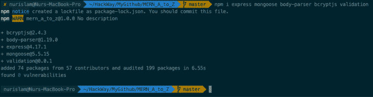

Here’s what we get in the code above:

*   `body-parser`:允许我们在整个请求过程中获取数据
*   是我们的主要框架
*   `mongoose`:用于连接和交互 MongoDB
*   `config`:这允许您定义应用程序的默认参数

现在，我们将添加 [nodemon](https://nodemon.io/) 作为`dev`依赖项。如果你不想添加它，你可以跳过它，它是可选的。用`$ npm i -D nodemon`安装。要使用 nodemon，将`"app": "nodemon app.js"`添加到`package.json`文件下的`scripts`标签中。

Nodemon 是一个实用程序，它将监视源代码中的任何变化，并自动重启服务器。`app.js`是应用程序的入口点。在这里用`"start": "node app.js"`定义一个`start`脚本也很重要。这将定义应用程序的启动脚本。

之后，你的`package.json`应该是这样的:

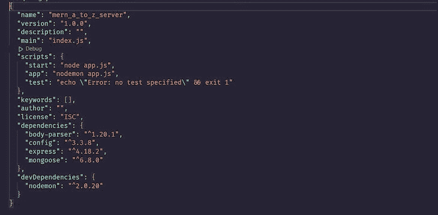

### 设置入口点

现在，为我们的入口点创建一个名为`app.js`的文件。您可以使用`$ touch app.js`命令从项目文件夹中创建它(在 macOS 上)。

然后，粘贴以下代码:

```
// app.js

const express = require('express');

const app = express();

app.get('/', (req, res) => res.send('Hello world!'));

const port = process.env.PORT || 8082;

app.listen(port, () => console.log(`Server running on port ${port}`));

```

之后，运行`$ node app`命令。你会看到`Server running on port 8082`。你也可以通过打开浏览器并输入`[http://localhost:8082](http://localhost:8082)`来查看。

在这一点上，如果我们改变了什么，我们将需要手动重启服务器。但是，如果我们设置了 nodemon，那么我们就不必每次都重新启动它。Nodemon 将观察是否有任何变化，并自动重启服务器。

因此，您需要做的是对我们的`package.json`文件中的脚本做一点修改。见下文:

```
// package.json

{
  "name": "mern_a_to_z",
  "version": "1.0.0",
  "description": "",
  "main": "app.js",
  "scripts": {
    "start": "node app.js",
    "app": "nodemon app.js",
    "test": "echo \"Error: no test specified\" && exit 1"
  },
  "repository": {
    "type": "git",
    "url": "git+https://github.com/nurislam03/MERN_A_to_Z.git"
  },
  "author": "Nur Islam",
  "license": "MIT",
  "bugs": {
    "url": "https://github.com/nurislam03/MERN_A_to_Z/issues"
  },
  "homepage": "https://github.com/nurislam03/MERN_A_to_Z#readme",
  "dependencies": {
    "body-parser": "^1.19.0",
    "express": "^4.17.1",
    "mongoose": "^5.5.15",
    "validation": "0.0.1"
  },
  "devDependencies": {
    "nodemon": "^1.19.1"
  }
}

```

现在，您可以使用`$ npm run app`命令运行您的项目。如果此时出现任何错误，请运行以下命令:

```
$ npm install
$ npm run app

```

如果一切正常，您将在终端中看到以下变化:

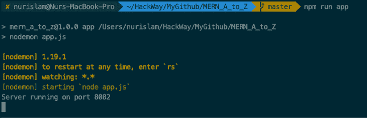

## 使用 MongoDB 进行数据库管理

现在，是时候用 MongoDB 建立我们的 [MERN 数据库了。为了简单起见，我们将使用 MongoDB Atlas。首先，在这里](https://www.mongodb.com/mern-stack)创建一个账户[。创建帐户后，您会看到如下内容:](https://www.mongodb.com/atlas/database)

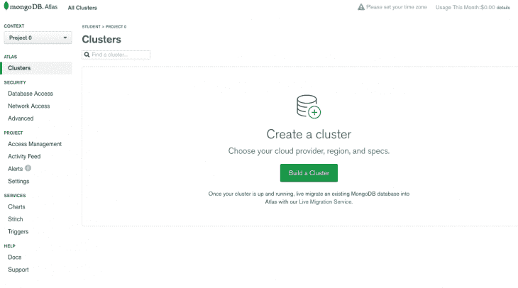

单击**项目 0** 部分(左上角)，您将看到一个用于创建新项目的按钮。创建一个项目并选择该项目。现在，从您创建的项目中点击**构建集群**按钮。它会显示所有的信息。

在底部，您将看到一个名为**集群名称**的部分，单击它并输入数据库的名称，然后点击**创建集群**按钮。两到三分钟后，如果一切顺利，你会发现这样的东西:

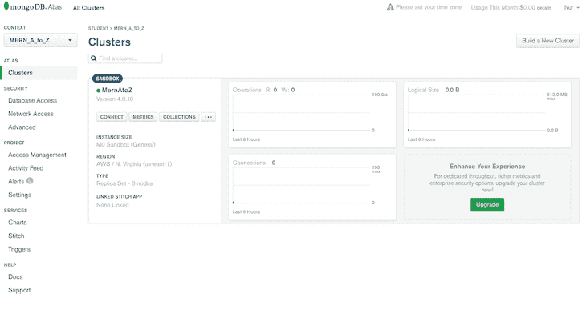

点击**连接**按钮，填写数据库的用户名和密码表单:

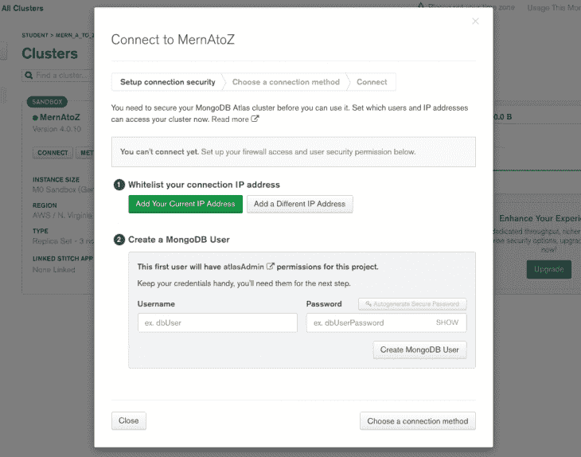

现在，选择**创建 MongoDB 用户**按钮。您也可以选择您当前的 IP 地址或不同的 IP 地址；这取决于你。现在，如果您按下**连接**按钮或**选择连接方法**按钮，您将看到一些不同的方法。相应地选择:

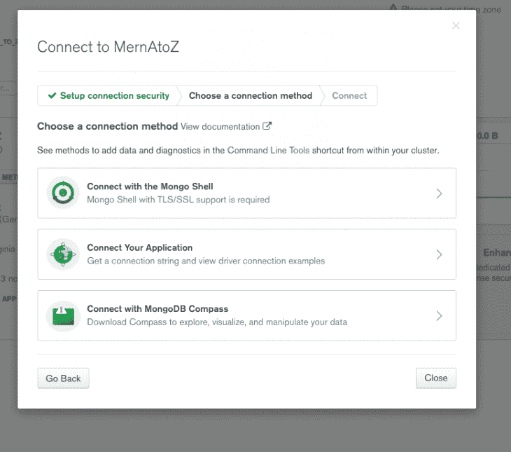

在这种情况下，选择**连接您的应用程序**部分。现在，您将获得数据库链接，我们将在下一步中使用它:

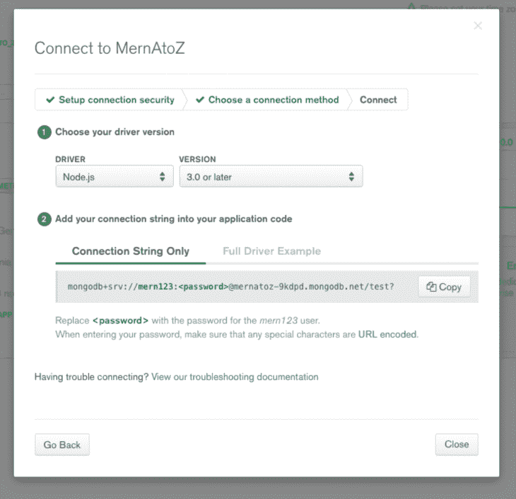

### 将数据库添加到我们的项目

我们的数据库已经准备好了，我们需要将它添加到我们的项目中。在`project`文件夹中，创建另一个名为`config`的文件夹，并创建两个名为`default.json`和`db.js`的文件。

添加以下代码:

```
// default.json

{
  "mongoURI":
    "mongodb+srv://mern123:<password>@mernatoz-9kdpd.mongodb.net/test?retryWrites=true&w=majority"
}
 /* Replace <password> with your database password */
// db.js

const mongoose = require('mongoose');
const config = require('config');
const db = config.get('mongoURI');

const connectDB = async () => {
  try {
    mongoose.set('strictQuery', true);
    await mongoose.connect(db, {
      useNewUrlParser: true,
    });

    console.log('MongoDB is Connected...');
  } catch (err) {
    console.error(err.message);
    process.exit(1);
  }
};

module.exports = connectDB;

```

我们需要对我们的`app.js`文件做一点修改来连接数据库。用这个更新您的`app.js`:

```
// app.js

const express = require('express');
const connectDB = require('./config/db');

const app = express();

// Connect Database
connectDB();

app.get('/', (req, res) => res.send('Hello world!'));

const port = process.env.PORT || 8082;

app.listen(port, () => console.log(`Server running on port ${port}`));

```

现在，您可以使用`$ npm run app`命令运行项目。您应该看到以下内容:

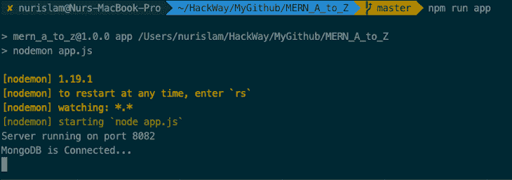

太好了！到目前为止，我们是在正确的轨道上，我们的数据库成功连接。现在，是时候完成路由设置了，之后，我们将看到如何创建 RESTful APIs。

## 用 MERN 堆栈构建 RESTful APIs

首先，创建一个名为`routes`的文件夹。在其中，创建另一个名为`api`的文件夹，它将保存我们所有的 API。在`api`文件夹中，创建一个名为`books.js`的文件。我们将在这里创建一些 API 来展示它是如何工作的。

现在，用下面的代码更新您的`books.js`:

```
// routes/api/books.js

const express = require('express');
const router = express.Router();

// Load Book model
const Book = require('../../models/Books');

// @route GET api/books/test
// @description tests books route
// @access Public
router.get('/test', (req, res) => res.send('book route testing!'));

// @route GET api/books
// @description Get all books
// @access Public
router.get('/', (req, res) => {
  Book.find()
    .then(books => res.json(books))
    .catch(err => res.status(404).json({ nobooksfound: 'No Books found' }));
});

// @route GET api/books/:id
// @description Get single book by id
// @access Public
router.get('/:id', (req, res) => {
  Book.findById(req.params.id)
    .then(book => res.json(book))
    .catch(err => res.status(404).json({ nobookfound: 'No Book found' }));
});

// @route GET api/books
// @description add/save book
// @access Public
router.post('/', (req, res) => {
  Book.create(req.body)
    .then(book => res.json({ msg: 'Book added successfully' }))
    .catch(err => res.status(400).json({ error: 'Unable to add this book' }));
});

// @route GET api/books/:id
// @description Update book
// @access Public
router.put('/:id', (req, res) => {
  Book.findByIdAndUpdate(req.params.id, req.body)
    .then(book => res.json({ msg: 'Updated successfully' }))
    .catch(err =>
      res.status(400).json({ error: 'Unable to update the Database' })
    );
});

// @route GET api/books/:id
// @description Delete book by id
// @access Public
router.delete('/:id', (req, res) => {
  Book.findByIdAndRemove(req.params.id, req.body)
    .then(book => res.json({ mgs: 'Book entry deleted successfully' }))
    .catch(err => res.status(404).json({ error: 'No such a book' }));
});

module.exports = router;

```

### 数据库模型

为了与我们的数据库进行交互，我们需要为我们的每个资源创建一个模型。因此，在根目录下的`models`文件夹中创建一个名为`models`的文件夹，创建一个名为`Book.js`的文件，并用下面的代码更新它:

```
// models/Book.js

const mongoose = require('mongoose');

const BookSchema = new mongoose.Schema({
  title: {
    type: String,
    required: true
  },
  isbn: {
    type: String,
    required: true
  },
  author: {
    type: String,
    required: true
  },
  description: {
    type: String
  },
  published_date: {
    type: Date
  },
  publisher: {
    type: String
  },
  updated_date: {
    type: Date,
    default: Date.now
  }
});

module.exports = Book = mongoose.model('book', BookSchema);

```

接下来运行项目，看看此时是否一切正常，可以通过 [Postman](https://blog.logrocket.com/how-automate-api-tests-postman/) 测试所有 API。需要注意的是，在使用 Postman 测试 API 之前，您需要首先运行项目。

### 认证和授权

[认证和授权](https://blog.logrocket.com/adding-login-authentication-secure-react-apps/)是 web 应用的重要组成部分。认证是验证自称是谁的人的过程。授权是检查用户访问级别的方法。

当使用 Node.js 后端和 React 前端时，大多数时候，开发人员倾向于使用 [JWT](https://blog.logrocket.com/jwt-authentication-best-practices/) 作为认证方法。JWT 代表 JSON Web 令牌。jwt 是编码的 URL 安全字符串，可以保存无限量的数据。

在大多数情况下，React 前端会向后端发送一个 JWT。后端验证令牌，如果令牌有效，后端执行所需的操作。请观看下面的视频，了解有关在您的应用中实现身份验证的更多信息:

 [https://www.youtube.com/embed/R7ZkUWe52-c?version=3&rel=1&showsearch=0&showinfo=1&iv_load_policy=1&fs=1&hl=en-US&autohide=2&wmode=transparent](https://www.youtube.com/embed/R7ZkUWe52-c?version=3&rel=1&showsearch=0&showinfo=1&iv_load_policy=1&fs=1&hl=en-US&autohide=2&wmode=transparent)

视频

## 构建前端

到目前为止，一切顺利！既然我们已经设置了我们的后端，是时候过渡到这个 MERN 堆栈教程的前端部分了。在这一节中，我们将使用 React 来构建我们的用户界面。我们将使用 [Create React App](https://blog.logrocket.com/getting-started-with-create-react-app-d93147444a27/) 生成我们的初始文件设置。

我们还将使用 [webpack](https://blog.logrocket.com/snowpack-vs-webpack-build-tool-comparison/) 和 [Babel](https://blog.logrocket.com/babel-vs-typescript/) 来分别捆绑我们的模块和编译我们的 JavaScript。如果你不太了解 webpack 或者 Babel，没问题；你不需要安装或配置像 webpack 或 Babel 这样的工具。它们是预先配置和隐藏的，因此您可以专注于代码。

只要创建一个项目，你就可以开始了。您还需要在本地开发机器上安装高于 8.10 版的 Node.js 和高于 5.6 版的 npm。

### 设置创建 React 应用程序

使用终端设置您想要保存该项目的所有文件的任何目录，并运行`$ npx create-react-app my-app`以获得初始设置文件。

您可以用您喜欢的项目名称来替换`my-app`。比如我的项目名是`mern_a_to_z_client`，我的命令是`$ npx create-react-app mern_a_to_z_client`。

> 注意:项目名称必须是小写字母。如果一切正常，您将会看到类似下图的内容，在这里您会找到一些指令和命令:

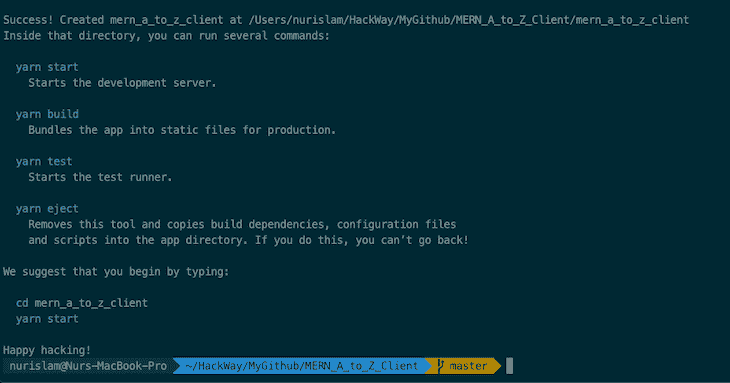

在使用任何内置命令之前，我们需要使用`$ cd mern_a_to_z_client`进入项目文件夹。

现在我们在项目目录中，我们可以使用这些可用的命令。如果你使用纱线，输入`$ yarn start`。如果您使用 npm，请使用`$ npm start`。

要在开发模式下运行应用程序，您可以使用上述任何命令，您将在终端中看到以下消息:

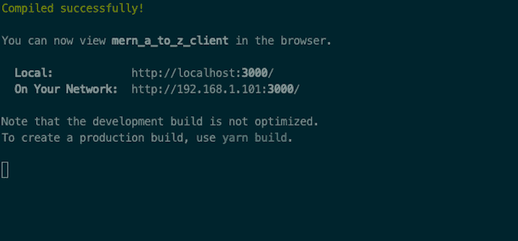

现在，打开`[http://localhost:3000](http://localhost:3000)`在浏览器中查看。如果您对代码进行了更改，此页面将自动重新加载:

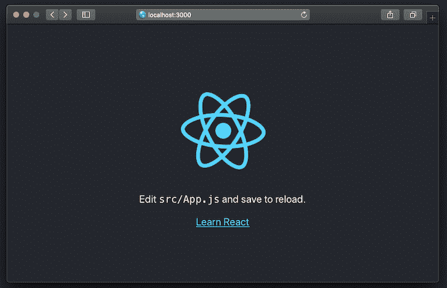

在项目目录中，我们的初始文件结构应该如下所示:

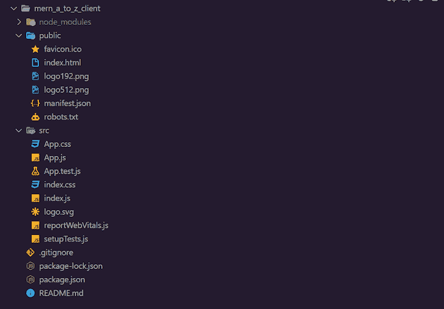

### 在 React 应用程序中添加引导程序和字体

我们已经得到了前端部分的初始设置文件。现在，我们可以开始集成我们的后端和前端。在此之前，我想在我们的项目中加入 [Bootstrap](https://blog.logrocket.com/comparing-tailwind-css-bootstrap-time-ditch-ui-kits/) 和 [Font Awesome 的 CDN](https://cdn.fontawesome.com/) 。

打开名为`index.html`的文件，该文件位于公共文件夹`mern_a_to_z_client/public/index.html`中，并用以下代码替换所有内容:

```
<!DOCTYPE html>
<html lang="en">
  <head>
    <meta charset="utf-8" />
    <link rel="shortcut icon" href="%PUBLIC_URL%/favicon.ico" />
    <meta name="viewport" content="width=device-width, initial-scale=1" />
    <meta name="theme-color" content="#000000" />
    <!--
      manifest.json provides metadata used when your web app is installed on a
      user's mobile device or desktop. See https://developers.google.com/web/fundamentals/web-app-manifest/
    -->
    <link rel="manifest" href="%PUBLIC_URL%/manifest.json" />
    <!--
      Notice the use of %PUBLIC_URL% in the tags above.
      It will be replaced with the URL of the `public` folder during the build.
      Only files inside the `public` folder can be referenced from the HTML.

      Unlike "/favicon.ico" or "favicon.ico", "%PUBLIC_URL%/favicon.ico" will
      work correctly both with client-side routing and a non-root public URL.
      Learn how to configure a non-root public URL by running `npm run build`.
    -->

    <!-- bootstrap css cdn -->
    <link rel="stylesheet" href="https://maxcdn.bootstrapcdn.com/bootstrap/4.0.0/css/bootstrap.min.css" integrity="sha384-Gn5384xqQ1aoWXA+058RXPxPg6fy4IWvTNh0E263XmFcJlSAwiGgFAW/dAiS6JXm" crossorigin="anonymous">

    <!-- fontawesome cdn -->
    <link rel="stylesheet" href="https://use.fontawesome.com/releases/v5.2.0/css/all.css" integrity="sha384-hWVjflwFxL6sNzntih27bfxkr27PmbbK/iSvJ+a4+0owXq79v+lsFkW54bOGbiDQ" crossorigin="anonymous">

    <title>MERN A to Z</title>
  </head>
  <body>
    <noscript>You need to enable JavaScript to run this app.</noscript>
    <div id="root"></div>
    <!--
      This HTML file is a template.
      If you open it directly in the browser, you will see an empty page.

      You can add webfonts, meta tags, or analytics to this file.
      The build step will place the bundled scripts into the <body> tag.

      To begin the development, run `npm start` or `yarn start`.
      To create a production bundle, use `npm run build` or `yarn build`.
    -->

    <!-- bootstrap JS cdn -->
    <script src="https://code.jquery.com/jquery-3.2.1.slim.min.js" integrity="sha384-KJ3o2DKtIkvYIK3UENzmM7KCkRr/rE9/Qpg6aAZGJwFDMVNA/GpGFF93hXpG5KkN" crossorigin="anonymous"></script>
    <script src="https://cdnjs.cloudflare.com/ajax/libs/popper.js/1.12.9/umd/popper.min.js" integrity="sha384-ApNbgh9B+Y1QKtv3Rn7W3mgPxhU9K/ScQsAP7hUibX39j7fakFPskvXusvfa0b4Q" crossorigin="anonymous"></script>
    <script src="https://maxcdn.bootstrapcdn.com/bootstrap/4.0.0/js/bootstrap.min.js" integrity="sha384-JZR6Spejh4U02d8jOt6vLEHfe/JQGiRRSQQxSfFWpi1MquVdAyjUar5+76PVCmYl" crossorigin="anonymous"></script>

  </body>
</html>

```

我们的前端将具有以下特点:

1.  添加、创建或保存新书
2.  显示我们存储在数据库中的所有书籍
3.  显示单本书
4.  更新书籍
5.  删除一本书

现在，使用以下命令添加一些必要的依赖项:

```
$ npm install --save react-router-dom
$ npm install --save axios

```

## 为什么选择 Axios？

[Axios](https://blog.logrocket.com/how-to-make-http-requests-like-a-pro-with-axios/) 是 Node.js 和浏览器的轻量级 HTTP 客户端，[类似于 Fetch API](https://blog.logrocket.com/axios-vs-fetch-best-http-requests/) 。Axios 是一个基于 promise 的异步/等待库，用于可读的异步代码。我们可以很容易地将它与 React 集成，并且在任何前端框架中使用它都毫不费力。我们将通过 Axios 调用我们的 API。

Axios 被广泛使用有多重原因。Axios 最大的好处之一就是向后兼容。IE11 之类的老浏览器也可以轻松运行 Axios，因为软件包在引擎盖下发布了`XMLHttpRequest`。

当[发送一个请求](https://blog.logrocket.com/understanding-axios-post-requests/)时，Axios 也会自动将有效负载字符串化。但是，当您使用 Fetch API 时，将有效负载转换为 JSON 是很重要的。

## `Package.json`文件

此时，我们的`package.json`文件应该与下面的代码类似(但可以不同):

```
// MERN_A_to_Z_Client - package.json

{
  "name": "mern_a_to_z_client",
  "version": "0.1.0",
  "private": true,
  "dependencies": {
    "@testing-library/jest-dom": "^5.16.5",
    "@testing-library/react": "^13.4.0",
    "@testing-library/user-event": "^13.5.0",
    "axios": "^1.2.1",
    "react": "^18.2.0",
    "react-dom": "^18.2.0",
    "react-router-dom": "^6.4.5",
    "react-scripts": "5.0.1",
    "web-vitals": "^2.1.4"
  },
  "scripts": {
    "start": "react-scripts start",
    "build": "react-scripts build",
    "test": "react-scripts test",
    "eject": "react-scripts eject"
  },
  "eslintConfig": {
    "extends": [
      "react-app",
      "react-app/jest"
    ]
  },
  "browserslist": {
    "production": [
      ">0.2%",
      "not dead",
      "not op_mini all"
    ],
    "development": [
      "last 1 chrome version",
      "last 1 firefox version",
      "last 1 safari version"
    ]
  }
}

```

### 创建组件文件

在`src`文件夹(`mern_a_to_z_client/src/`)中，创建另一个名为`components`的文件夹，并在其中创建五个不同的文件:

1.  `CreateBook.js`
2.  `ShowBookList.js`
3.  `BookCard.js`
4.  `ShowBookDetails.js`
5.  `UpdateBookInfo.js`

稍后我们将处理这五个文件。

## 功能组件和反应挂钩

React 功能组件是框架中相对较新的组件。以前，我们只有基于类的组件。React 中的一个功能组件本质上是一个 JavaScript 函数，它返回 React 元素或 JSX。可以使用传统的关键字或箭头函数来编写功能组件。道具是基于函数参数的。功能组件只有在导出后才能用于其他文件:

```
function Hello(props) {
  return <h1>Hello, {props.name}</h1>;
}

export default Welcome;

```

上面显示的函数是一个有效的 React 功能组件。在本教程中，我们将使用 React 功能组件。要更深入地了解 React 功能组件，请查看这篇文章以了解更多信息。

在 [React v16.8 之前，](https://blog.logrocket.com/migrating-react-router-v6-guide/)开发者只被允许管理状态，以及基于类的组件中的其他 React 特性。在 React v16.8 中，React 团队引入了[钩子](https://blog.logrocket.com/create-your-own-custom-react-hooks/)。钩子允许开发人员管理功能组件内部的代码和其他 React 特性。

查看我们的[备忘单](https://blog.logrocket.com/react-hooks-cheat-sheet-unlock-solutions-to-common-problems-af4caf699e70/)获取更多关于 React 钩子的信息。

## 设置路线

打开`src`文件夹(`mern_a_to_z_client/src/App.js`)内的`App.js`文件夹，替换为以下代码:

```
import { BrowserRouter as Router, Route, Routes } from 'react-router-dom';
import './App.css';

import CreateBook from './components/CreateBook';
import ShowBookList from './components/ShowBookList';
import ShowBookDetails from './components/ShowBookDetails';
import UpdateBookInfo from './components/UpdateBookInfo';

const App = () => {
  return (
    <Router>
      <div>
        <Routes>
          <Route exact path='/' element={<ShowBookList />} />
          <Route path='/create-book' element={<CreateBook />} />
          <Route path='/edit-book/:id' element={<UpdateBookInfo />} />
          <Route path='/show-book/:id' element={<ShowBookDetails />} />
        </Routes>
      </div>
    </Router>
  );
};

export default App;

```

在这里，我们定义所有的`routes`。对于特定的路径定义，将呈现其对应的组件。我们还没有实现这些文件和组件——我们刚刚完成路径设置。

### 更新 CSS 文件

接下来，用以下代码更新`src`文件夹中名为`App.css`的 CSS 文件:

```
.App {
  text-align: center;
}

.App-logo {
  animation: App-logo-spin infinite 20s linear;
  height: 40vmin;
  pointer-events: none;
}

.App-header {
  background-color: #282c34;
  min-height: 100vh;
  display: flex;
  flex-direction: column;
  align-items: center;
  justify-content: center;
  font-size: calc(10px + 2vmin);
  color: white;
}

.App-link {
  color: #61dafb;
}

@keyframes App-logo-spin {
  from {
    transform: rotate(0deg);
  }
  to {
    transform: rotate(360deg);
  }
}

.CreateBook {
  background-color: #2c3e50;
  min-height: 100vh;
  color: white;
}

.ShowBookDetails {
  background-color: #2c3e50;
  min-height: 100vh;
  color: white;
}

.UpdateBookInfo {
  background-color: #2c3e50;
  min-height: 100vh;
  color: white;
}

.ShowBookList {
  background-color: #2c3e50;
  height: 100%;
  width: 100%;
  min-height: 100vh;
  min-width: 100px;
  color: white;
}

/* BookList Styles */
.list {
  display: grid;
  margin: 20px 0 50px 0;
  grid-template-columns: repeat(4, 1fr);
  grid-auto-rows: 1fr;
  grid-gap: 2em;
}

.card-container {
  width: 250px;
  border: 1px solid rgba(0,0,.125);
  margin: 0 auto;
  border-radius: 5px;
  overflow: hidden;
}

.desc {
  height: 130px;
  padding: 10px;
}

.desc h2 {
  font-size: 1em;
  font-weight: 400;
}

.desc h3, p {
  font-weight: 300;
}

.desc h3 {
  color: #6c757d;
  font-size: 1em;
  padding: 10px 0 10px 0;
}

```

## 添加我们的功能组件

现在，是时候将特性组件添加到我们的 MERN 堆栈项目中了。我们的`CreateBook.js`文件负责添加、创建或保存一本新书或一本书的信息。

### `CreateBook.js`

因此，用下面的代码更新`CreateBook.js`:

```
import React, { useState } from 'react';
import { Link } from 'react-router-dom';
import axios from 'axios';

import { useNavigate } from 'react-router-dom';

const CreateBook = (props) => {
  // Define the state with useState hook
  const navigate = useNavigate();
  const [book, setBook] = useState({
    title: '',
    isbn: '',
    author: '',
    description: '',
    published_date: '',
    publisher: '',
  });

  const onChange = (e) => {
    setBook({ ...book, [e.target.name]: e.target.value });
  };

  const onSubmit = (e) => {
    e.preventDefault();

    axios
      .post('http://localhost:8082/api/books', book)
      .then((res) => {
        setBook({
          title: '',
          isbn: '',
          author: '',
          description: '',
          published_date: '',
          publisher: '',
        });

        // Push to /
        navigate('/');
      })
      .catch((err) => {
        console.log('Error in CreateBook!');
      });
  };

  return (
    <div className='CreateBook'>
      <div className='container'>
        <div className='row'>
          <div className='col-md-8 m-auto'>
            <br />
            <Link to='/' className='btn btn-outline-warning float-left'>
              Show BooK List
            </Link>
          </div>
          <div className='col-md-8 m-auto'>
            <h1 className='display-4 text-center'>Add Book</h1>
            <p className='lead text-center'>Create new book</p>

            <form noValidate onSubmit={onSubmit}>
              <div className='form-group'>
                <input
                  type='text'
                  placeholder='Title of the Book'
                  name='title'
                  className='form-control'
                  value={book.title}
                  onChange={onChange}
                />
              </div>
              <br />

              <div className='form-group'>
                <input
                  type='text'
                  placeholder='ISBN'
                  name='isbn'
                  className='form-control'
                  value={book.isbn}
                  onChange={onChange}
                />
              </div>

              <div className='form-group'>
                <input
                  type='text'
                  placeholder='Author'
                  name='author'
                  className='form-control'
                  value={book.author}
                  onChange={onChange}
                />
              </div>

              <div className='form-group'>
                <input
                  type='text'
                  placeholder='Describe this book'
                  name='description'
                  className='form-control'
                  value={book.description}
                  onChange={onChange}
                />
              </div>

              <div className='form-group'>
                <input
                  type='date'
                  placeholder='published_date'
                  name='published_date'
                  className='form-control'
                  value={book.published_date}
                  onChange={onChange}
                />
              </div>
              <div className='form-group'>
                <input
                  type='text'
                  placeholder='Publisher of this Book'
                  name='publisher'
                  className='form-control'
                  value={book.publisher}
                  onChange={onChange}
                />
              </div>

              <input
                type='submit'
                className='btn btn-outline-warning btn-block mt-4'
              />
            </form>
          </div>
        </div>
      </div>
    </div>
  );
};

export default CreateBook;

```

### `ShowBookList.js`

组件将负责显示我们已经存储在数据库中的所有书籍。用此代码更新`ShowBookList.js`:

```
import React, { useState, useEffect } from 'react';
import '../App.css';
import axios from 'axios';
import { Link } from 'react-router-dom';
import BookCard from './BookCard';

function ShowBookList() {
  const [books, setBooks] = useState([]);

  useEffect(() => {
    axios
      .get('http://localhost:8082/api/books')
      .then((res) => {
        setBooks(res.data);
      })
      .catch((err) => {
        console.log('Error from ShowBookList');
      });
  }, []);

  const bookList =
    books.length === 0
      ? 'there is no book record!'
      : books.map((book, k) => <BookCard book={book} key={k} />);

  return (
    <div className='ShowBookList'>
      <div className='container'>
        <div className='row'>
          <div className='col-md-12'>
            <br />
            <h2 className='display-4 text-center'>Books List</h2>
          </div>

          <div className='col-md-11'>
            <Link
              to='/create-book'
              className='btn btn-outline-warning float-right'
            >
              + Add New Book
            </Link>
            <br />
            <br />
            <hr />
          </div>
        </div>

        <div className='list'>{bookList}</div>
      </div>
    </div>
  );
}

export default ShowBookList;

```

### `BookCard.js`

这里，我们使用一个名为`BookCard.js`的功能组件，它从`ShowBookList.js`获取一本书的信息，并为每本书制作一张卡片。编写以下代码来更新您的`BookCard.js`文件:

```
import React from 'react';
import { Link } from 'react-router-dom';
import '../App.css';

const BookCard = (props) => {
  const book = props.book;

  return (
    <div className='card-container'>
      
      <div className='desc'>
        <h2>
          <Link to={`/show-book/${book._id}`}>{book.title}</Link>
        </h2>
        <h3>{book.author}</h3>
        <p>{book.description}</p>
      </div>
    </div>
  );
};

export default BookCard;

```

> 注意:在这里，我对每本书都使用了相同的`img src`，因为每本书各自的图像可能并不总是可用的。改变图像来源，你也可以为每本书使用不同的图像。

组件只有一个任务:显示我们拥有的任何一本书的所有信息。我们在这里有`delete`和`edit`按钮来访问:

```
import React, { useState, useEffect } from 'react';
import { Link, useParams, useNavigate } from 'react-router-dom';
import '../App.css';
import axios from 'axios';

function ShowBookDetails(props) {
  const [book, setBook] = useState({});

  const { id } = useParams();
  const navigate = useNavigate();

  useEffect(() => {
    axios
      .get(`http://localhost:8082/api/books/${id}`)
      .then((res) => {
        setBook(res.data);
      })
      .catch((err) => {
        console.log('Error from ShowBookDetails');
      });
  }, [id]);

  const onDeleteClick = (id) => {
    axios
      .delete(`http://localhost:8082/api/books/${id}`)
      .then((res) => {
        navigate('/');
      })
      .catch((err) => {
        console.log('Error form ShowBookDetails_deleteClick');
      });
  };

  const BookItem = (
    <div>
      <table className='table table-hover table-dark'>
        <tbody>
          <tr>
            <th scope='row'>1</th>
            <td>Title</td>
            <td>{book.title}</td>
          </tr>
          <tr>
            <th scope='row'>2</th>
            <td>Author</td>
            <td>{book.author}</td>
          </tr>
          <tr>
            <th scope='row'>3</th>
            <td>ISBN</td>
            <td>{book.isbn}</td>
          </tr>
          <tr>
            <th scope='row'>4</th>
            <td>Publisher</td>
            <td>{book.publisher}</td>
          </tr>
          <tr>
            <th scope='row'>5</th>
            <td>Published Date</td>
            <td>{book.published_date}</td>
          </tr>
          <tr>
            <th scope='row'>6</th>
            <td>Description</td>
            <td>{book.description}</td>
          </tr>
        </tbody>
      </table>
    </div>
  );

  return (
    <div className='ShowBookDetails'>
      <div className='container'>
        <div className='row'>
          <div className='col-md-10 m-auto'>
            <br /> <br />
            <Link to='/' className='btn btn-outline-warning float-left'>
              Show Book List
            </Link>
          </div>
          <br />
          <div className='col-md-8 m-auto'>
            <h1 className='display-4 text-center'>Book's Record</h1>
            <p className='lead text-center'>View Book's Info</p>
            <hr /> <br />
          </div>
          <div className='col-md-10 m-auto'>{BookItem}</div>
          <div className='col-md-6 m-auto'>
            <button
              type='button'
              className='btn btn-outline-danger btn-lg btn-block'
              onClick={() => {
                onDeleteClick(book._id);
              }}
            >
              Delete Book
            </button>
          </div>
          <div className='col-md-6 m-auto'>
            <Link
              to={`/edit-book/${book._id}`}
              className='btn btn-outline-info btn-lg btn-block'
            >
              Edit Book
            </Link>
          </div>
        </div>
      </div>
    </div>
  );
}

export default ShowBookDetails;

```

### `UpdateBookInfo.js`

`UpdateBookInfo.js`顾名思义，负责更新一本书的信息。一个**编辑书**按钮将触发这个组件执行。点击**编辑书籍**后，我们会看到一个包含旧信息的表单，我们可以编辑或替换它:

```
import React, { useState, useEffect } from 'react';
import { Link, useParams, useNavigate } from 'react-router-dom';
import axios from 'axios';
import '../App.css';

function UpdateBookInfo(props) {
  const [book, setBook] = useState({
    title: '',
    isbn: '',
    author: '',
    description: '',
    published_date: '',
    publisher: '',
  });

  const { id } = useParams();
  const navigate = useNavigate();

  useEffect(() => {
    axios
      .get(`http://localhost:8082/api/books/${id}`)
      .then((res) => {
        setBook({
          title: res.data.title,
          isbn: res.data.isbn,
          author: res.data.author,
          description: res.data.description,
          published_date: res.data.published_date,
          publisher: res.data.publisher,
        });
      })
      .catch((err) => {
        console.log('Error from UpdateBookInfo');
      });
  }, [id]);

  const onChange = (e) => {
    setBook({ ...book, [e.target.name]: e.target.value });
  };

  const onSubmit = (e) => {
    e.preventDefault();

    const data = {
      title: book.title,
      isbn: book.isbn,
      author: book.author,
      description: book.description,
      published_date: book.published_date,
      publisher: book.publisher,
    };

    axios
      .put(`http://localhost:8082/api/books/${id}`, data)
      .then((res) => {
        navigate(`/show-book/${id}`);
      })
      .catch((err) => {
        console.log('Error in UpdateBookInfo!');
      });
  };

  return (
    <div className='UpdateBookInfo'>
      <div className='container'>
        <div className='row'>
          <div className='col-md-8 m-auto'>
            <br />
            <Link to='/' className='btn btn-outline-warning float-left'>
              Show BooK List
            </Link>
          </div>
          <div className='col-md-8 m-auto'>
            <h1 className='display-4 text-center'>Edit Book</h1>
            <p className='lead text-center'>Update Book's Info</p>
          </div>
        </div>

        <div className='col-md-8 m-auto'>
          <form noValidate onSubmit={onSubmit}>
            <div className='form-group'>
              <label htmlFor='title'>Title</label>
              <input
                type='text'
                placeholder='Title of the Book'
                name='title'
                className='form-control'
                value={book.title}
                onChange={onChange}
              />
            </div>
            <br />

            <div className='form-group'>
              <label htmlFor='isbn'>ISBN</label>
              <input
                type='text'
                placeholder='ISBN'
                name='isbn'
                className='form-control'
                value={book.isbn}
                onChange={onChange}
              />
            </div>
            <br />

            <div className='form-group'>
              <label htmlFor='author'>Author</label>
              <input
                type='text'
                placeholder='Author'
                name='author'
                className='form-control'
                value={book.author}
                onChange={onChange}
              />
            </div>
            <br />

            <div className='form-group'>
              <label htmlFor='description'>Description</label>
              <textarea
                type='text'
                placeholder='Description of the Book'
                name='description'
                className='form-control'
                value={book.description}
                onChange={onChange}
              />
            </div>
            <br />

            <div className='form-group'>
              <label htmlFor='published_date'>Published Date</label>
              <input
                type='text'
                placeholder='Published Date'
                name='published_date'
                className='form-control'
                value={book.published_date}
                onChange={onChange}
              />
            </div>
            <br />

            <div className='form-group'>
              <label htmlFor='publisher'>Publisher</label>
              <input
                type='text'
                placeholder='Publisher of the Book'
                name='publisher'
                className='form-control'
                value={book.publisher}
                onChange={onChange}
              />
            </div>
            <br />

            <button
              type='submit'
              className='btn btn-outline-info btn-lg btn-block'
            >
              Update Book
            </button>
          </form>
        </div>
      </div>
    </div>
  );
}

export default UpdateBookInfo;

```

## 将前端连接并运行到后端

我们刚刚实现了所有的组件！现在，我们需要对我们的服务器端后端项目做一点改变。

如果我们试图从前端部分调用我们的后端 API，它会得到一个错误:

```
"Access to XMLHttpRequest at 'http://localhost:8082/api/books' from origin 'http://localhost:3000' has been blocked by CORS policy: Response to preflight request doesn't pass access control check: No 'Access-Control-Allow-Origin' header is present on the requested resource."

```

为了解决这个问题，我们需要在我们的后端服务器端项目中安装`cors`。转到项目文件夹并运行`$ npm install cors`。

现在，用下面的代码更新后端的入口点`app.js`:

```
// app.js

const express = require('express');
const connectDB = require('./config/db');
const cors = require('cors');

// routes
const books = require('./routes/api/books');

const app = express();

// Connect Database
connectDB();

// cors
app.use(cors({ origin: true, credentials: true }));

// Init Middleware
app.use(express.json({ extended: false }));

app.get('/', (req, res) => res.send('Hello world!'));

// use Routes
app.use('/api/books', books);

const port = process.env.PORT || 8082;

app.listen(port, () => console.log(`Server running on port ${port}`));

```

添加这一行也很重要，`app.use(express.json({ extended: false }));`。`express.json`方法允许 Express 读取使用`POST`或`PUT`请求发送的数据。它用于将传入的对象识别为 JSON 对象。

### 运行前端和后端

按照下面的步骤运行我们的 MERN 堆栈示例的前端和后端。

首先，运行服务器(在项目文件夹中):

```
$ npm run app

```

如果出现任何错误，请遵循以下命令(在项目文件夹中):

```
$ npm install
$ npm run app

```

要运行客户端，请从前端项目目录运行以下命令:

```
$ npm start

```

如果再次出现错误，请遵循以下相同的命令:

```
$ npm install
$ npm start

```

## 在浏览器中测试我们的 MERN 堆栈应用

让我们在浏览器中检查所有内容。在浏览器中打开 [http://localhost:3000](http://localhost:3000/) 。现在，您可以添加图书、删除图书、显示图书列表以及编辑图书。下列路线应相应执行:

**添加新书:**

[http://localhost:3000/create-book](http://localhost:3000/create-book)


**显示图书列表:**

[http://localhost:3000/](http://localhost:3000/)

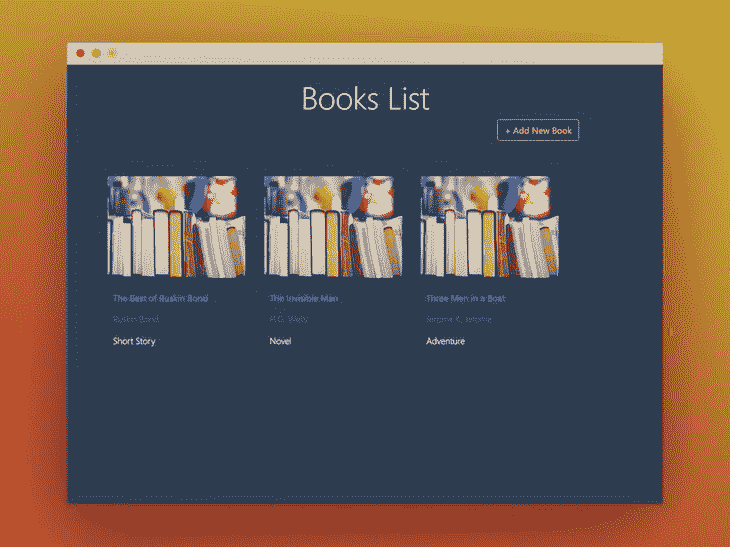

**显示任意一本书的信息:**

[http://localhost:3000/show-book/:id](http://localhost:3000/show-book/:id)

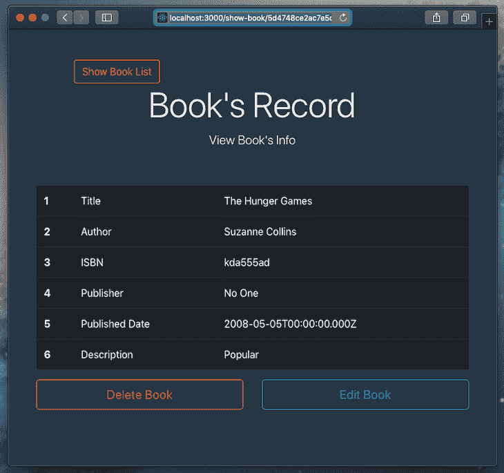

**更新图书信息:**

[http://localhost:3000/edit-book/:id](http://localhost:3000/edit-book/:id)

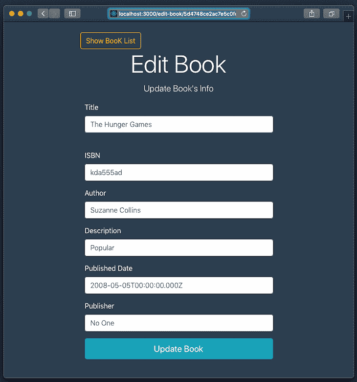

## 结论

恭喜你！您已经成功完成了本 MERN 堆栈教程。你可以访问我的 GitHub 来查看这个 MERN 堆栈教程的[服务器端](https://github.com/nemo0/mern_a_to_z/tree/main/mern_a_to_z_server)和[客户端](https://github.com/nemo0/mern_a_to_z/tree/main/mern_a_to_z_client)部分。你也可以在这里找到我们的 MERN 堆栈示例应用[的完整回购。](https://github.com/nemo0/mern_a_to_z)

## 使用 LogRocket 消除传统反应错误报告的噪音

[LogRocket](https://lp.logrocket.com/blg/react-signup-issue-free)

是一款 React analytics 解决方案，可保护您免受数百个误报错误警报的影响，只针对少数真正重要的项目。LogRocket 告诉您 React 应用程序中实际影响用户的最具影响力的 bug 和 UX 问题。

[ ](https://lp.logrocket.com/blg/react-signup-general) [  ](https://lp.logrocket.com/blg/react-signup-general) [LogRocket](https://lp.logrocket.com/blg/react-signup-issue-free)

自动聚合客户端错误、反应错误边界、还原状态、缓慢的组件加载时间、JS 异常、前端性能指标和用户交互。然后，LogRocket 使用机器学习来通知您影响大多数用户的最具影响力的问题，并提供您修复它所需的上下文。

关注重要的 React bug—[今天就试试 LogRocket】。](https://lp.logrocket.com/blg/react-signup-issue-free)